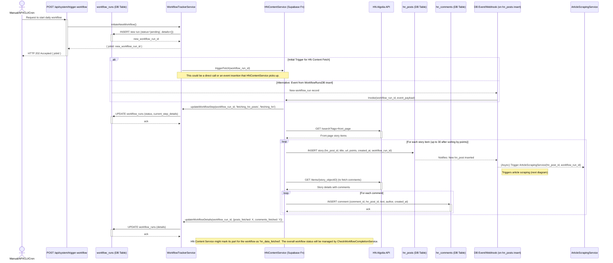

# Core Workflow / Sequence Diagrams

> This document is a granulated shard from the main "3-architecture.md" focusing on "Core Workflow / Sequence Diagrams".

These diagrams illustrate the key sequences of operations in the BMad DiCaster system.

### 1\. Daily Workflow Initiation & HN Content Acquisition

This diagram shows the manual/API trigger initiating a new workflow run, followed by the fetching of Hacker News posts and comments.



### 2\. Article Scraping & Summarization Flow

This diagram shows the flow starting from a new HN post being available, leading to article scraping, and then summarization of the article content and HN comments.

```mermaid
sequenceDiagram
    participant EventTrigger1 as DB Event/Webhook (on hn_posts insert)
    participant ArticleScrapingService as ArticleScrapingService (Supabase Fn)
    participant ScrapedArticlesDB as scraped_articles (DB Table)
    participant WorkflowTracker as WorkflowTrackerService
    participant WorkflowRunsDB as workflow_runs (DB Table)
    participant EventTrigger2 as DB Event/Webhook (on scraped_articles insert/update)
    participant SummarizationService as SummarizationService (Supabase Fn)
    participant LLMFacade as LLMFacade (shared function)
    participant LLMProvider as LLM Provider (Ollama/Remote)
    participant SummariesDB as article_summaries / comment_summaries (DB Tables)
    participant PromptsDB as summarization_prompts (DB Table)

    EventTrigger1->>+ArticleScrapingService: Invoke(hn_post_id, workflow_run_id, article_url)
    ArticleScrapingService->>+WorkflowTracker: updateWorkflowStep(workflow_run_id, 'scraping_article_for_post_' + hn_post_id, 'scraping_articles')
    WorkflowTracker->>WorkflowRunsDB: UPDATE workflow_runs (current_step_details)

    ArticleScrapingService->>ArticleScrapingService: Identify relevant URL from hn_post (if multiple)
    ArticleScrapingService->>+ScrapedArticlesDB: INSERT new article (hn_post_id, original_url, status='pending', workflow_run_id)
    ScrapedArticlesDB-->>-ArticleScrapingService: new_scraped_article_id

    opt Article URL is valid and scrapeable
        ArticleScrapingService->>ArticleScrapingService: Fetch HTML content from article_url (using Cheerio compatible fetch)
        ArticleScrapingService->>ArticleScrapingService: Parse HTML with Cheerio, extract title, author, date, main_text
        ArticleScrapingService->>+ScrapedArticlesDB: UPDATE scraped_articles SET main_text_content, title, author, status='success' WHERE id=new_scraped_article_id
    else Scraping fails or URL invalid
        ArticleScrapingService->>+ScrapedArticlesDB: UPDATE scraped_articles SET status='failed_parsing/unreachable', error_message='...' WHERE id=new_scraped_article_id
    end
    ScrapedArticlesDB-->>EventTrigger2: Notifies: New/Updated scraped_article (status='success')
    EventTrigger2-->>SummarizationService: (Async) Trigger SummarizationService(scraped_article_id, workflow_run_id, 'article')
    Note right of EventTrigger2: Triggers article summarization

    ArticleScrapingService->>+WorkflowTracker: updateWorkflowDetails(workflow_run_id, {articles_attempted_increment: 1, articles_scraped_successfully_increment: (success ? 1:0) })
    WorkflowTracker->>WorkflowRunsDB: UPDATE workflow_runs (details)

     HNPostsDB (not shown, but data is available) -- "Data for comments" --> SummarizationService
    Note right of SummarizationService: HN Comments are also summarized for the hn_post_id associated with this workflow_run_id. This might be a separate invocation or part of a broader summarization task for the post.
    SummarizationService->>+WorkflowTracker: updateWorkflowStep(workflow_run_id, 'summarizing_content_for_post_' + hn_post_id, 'summarizing_content')
    WorkflowTracker->>WorkflowRunsDB: UPDATE workflow_runs (current_step_details)

    alt Summarize Article
        SummarizationService->>SummarizationService: Get text_content from scraped_articles WHERE id=scraped_article_id
        SummarizationService->>+PromptsDB: SELECT prompt_text WHERE is_default_article_prompt=TRUE
        PromptsDB-->>-SummarizationService: article_prompt_text
        SummarizationService->>+LLMFacade: generateSummary(text_content, {prompt: article_prompt_text})
        LLMFacade->>+LLMProvider: Request summary (Ollama or Remote API call)
        LLMProvider-->>-LLMFacade: summary_response
        LLMFacade-->>-SummarizationService: article_summary_text
        SummarizationService->>+SummariesDB: INSERT into article_summaries (scraped_article_id, summary_text, workflow_run_id, llm_model_used)
        SummariesDB-->>-SummarizationService: ack
    end

    alt Summarize Comments (for each relevant hn_post_id in the workflow_run)
        SummarizationService->>SummarizationService: Get all comments for hn_post_id from hn_comments table
        SummarizationService->>SummarizationService: Concatenate/prepare comment text
        SummarizationService->>+PromptsDB: SELECT prompt_text WHERE is_default_comment_prompt=TRUE
        PromptsDB-->>-SummarizationService: comment_prompt_text
        SummarizationService->>+LLMFacade: generateSummary(all_comments_text, {prompt: comment_prompt_text})
        LLMFacade->>+LLMProvider: Request summary
        LLMProvider-->>-LLMFacade: summary_response
        LLMFacade-->>-SummarizationService: comment_summary_text
        SummarizationService->>+SummariesDB: INSERT into comment_summaries (hn_post_id, summary_text, workflow_run_id, llm_model_used)
        SummariesDB-->>-SummarizationService: ack
    end
    SummarizationService->>+WorkflowTracker: updateWorkflowDetails(workflow_run_id, {summaries_generated_increment: 1_or_2})
    WorkflowTracker->>WorkflowRunsDB: UPDATE workflow_runs (details)
    Note over SummarizationService: After all expected summaries for the workflow_run are done, the CheckWorkflowCompletionService will eventually pick this up.
```

### 3\. Newsletter, Podcast, and Delivery Flow

This diagram shows the steps from completed summarization to newsletter generation, podcast creation, webhook handling, and final email delivery. It assumes the `CheckWorkflowCompletionService` has determined that all summaries for a given `workflow_run_id` are ready.

```mermaid
sequenceDiagram
    participant CheckWorkflowService as CheckWorkflowCompletionService (Supabase Cron Fn)
    participant WorkflowRunsDB as workflow_runs (DB Table)
    participant WorkflowTracker as WorkflowTrackerService
    participant NewsletterGenService as NewsletterGenerationService (Supabase Fn)
    participant PodcastGenService as PodcastGenerationService (Supabase Fn)
    participant PlayHTAPI as Play.ht API
    participant NewsletterTemplatesDB as newsletter_templates (DB Table)
    participant SummariesDB as article_summaries / comment_summaries (DB Tables)
    participant NewslettersDB as newsletters (DB Table)
    participant PlayHTWebhook as POST /api/webhooks/playht (Next.js API Route)
    participant NodemailerService as NodemailerFacade (shared function)
    participant SubscribersDB as subscribers (DB Table)
    participant ExternalEmailService as Email Service (e.g., Gmail SMTP)

    CheckWorkflowService->>+WorkflowRunsDB: Query for runs with status 'summarizing_content' and all summaries complete
    WorkflowRunsDB-->>-CheckWorkflowService: workflow_run_id (ready for newsletter)

    CheckWorkflowService->>+WorkflowTracker: updateWorkflowStep(workflow_run_id, 'starting_newsletter_generation', 'generating_newsletter')
    WorkflowTracker->>+WorkflowRunsDB: UPDATE workflow_runs (status, current_step_details)
    WorkflowRunsDB-->>-WorkflowTracker: ack
    CheckWorkflowService->>+NewsletterGenService: Invoke(workflow_run_id)

    NewsletterGenService->>+NewsletterTemplatesDB: SELECT html_content, version WHERE is_default=TRUE
    NewsletterTemplatesDB-->>-NewsletterGenService: template_html, template_version
    NewsletterGenService->>+SummariesDB: SELECT article_summaries, comment_summaries WHERE workflow_run_id=...
    SummariesDB-->>-NewsletterGenService: summaries_data
    NewsletterGenService->>NewsletterGenService: Compile HTML newsletter using template and summaries_data
    NewsletterGenService->>+NewslettersDB: INSERT newsletter (workflow_run_id, title, html_content, podcast_status='pending', delivery_status='pending', target_date)
    NewslettersDB-->>-NewsletterGenService: new_newsletter_id

    NewsletterGenService->>+PodcastGenService: initiatePodcast(new_newsletter_id, html_content_for_podcast, workflow_run_id)
    WorkflowTracker->>+WorkflowRunsDB: updateWorkflowStep(workflow_run_id, 'podcast_generation_initiated', 'generating_podcast')
    WorkflowTracker->>WorkflowRunsDB: UPDATE workflow_runs
    PodcastGenService->>+PlayHTAPI: POST /playnotes (sourceFile=html_content, webHookUrl=...)
    PlayHTAPI-->>-PodcastGenService: { playht_job_id, status: 'generating' }
    PodcastGenService->>+NewslettersDB: UPDATE newsletters SET podcast_playht_job_id, podcast_status='generating' WHERE id=new_newsletter_id
    NewslettersDB-->>-PodcastGenService: ack
    Note over NewsletterGenService, PodcastGenService: Newsletter is now generated; podcast is being generated by Play.ht. Email delivery will wait for podcast completion or timeout.

    PlayHTAPI-->>+PlayHTWebhook: POST (status='completed', audioUrl='...', id=playht_job_id)
    PlayHTWebhook->>+NewslettersDB: UPDATE newsletters SET podcast_url, podcast_status='completed' WHERE podcast_playht_job_id=...
    NewslettersDB-->>-PlayHTWebhook: ack
    PlayHTWebhook->>+WorkflowTracker: updateWorkflowDetails(workflow_run_id_from_newsletter, {podcast_status: 'completed'})
    WorkflowTracker->>WorkflowRunsDB: UPDATE workflow_runs (details)
    PlayHTWebhook-->>-PlayHTAPI: HTTP 200 OK

    CheckWorkflowService->>+WorkflowRunsDB: Query for runs with status 'generating_podcast' AND newsletters.podcast_status IN ('completed', 'failed') OR timeout reached
    WorkflowRunsDB-->>-CheckWorkflowService: workflow_run_id (ready for delivery)

    CheckWorkflowService->>+WorkflowTracker: updateWorkflowStep(workflow_run_id, 'starting_newsletter_delivery', 'delivering_newsletter')
    WorkflowTracker->>+WorkflowRunsDB: UPDATE workflow_runs (status, current_step_details)
    WorkflowRunsDB-->>-WorkflowTracker: ack
    CheckWorkflowService->>+NewsletterGenService: triggerDelivery(newsletter_id_for_workflow_run)


    NewsletterGenService->>+NewslettersDB: SELECT html_content, podcast_url WHERE id=newsletter_id
    NewslettersDB-->>-NewsletterGenService: newsletter_data
    NewsletterGenService->>NewsletterGenService: (If podcast_url available, embed it in html_content)
    NewsletterGenService->>+SubscribersDB: SELECT email WHERE is_active=TRUE
    SubscribersDB-->>-NewsletterGenService: subscriber_emails[]

    loop For each subscriber_email
        NewsletterGenService->>+NodemailerService: sendEmail(to=subscriber_email, subject=newsletter_title, html=final_html_content)
        NodemailerService->>+ExternalEmailService: SMTP send
        ExternalEmailService-->>-NodemailerService: delivery_success/failure
        NodemailerService-->>-NewsletterGenService: status
    end
    NewsletterGenService->>+NewslettersDB: UPDATE newsletters SET delivery_status='sent' (or 'partially_failed'), sent_at=now()
    NewslettersDB-->>-NewsletterGenService: ack
    NewsletterGenService->>+WorkflowTracker: completeWorkflow(workflow_run_id, {delivery_status: 'sent', subscribers_notified: X})
    WorkflowTracker->>+WorkflowRunsDB: UPDATE workflow_runs (status='completed', details)
    WorkflowRunsDB-->>-WorkflowTracker: ack
```
