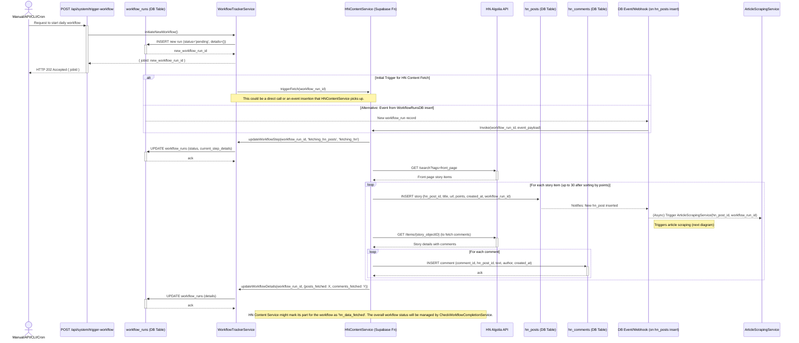

# BMad DiCaster Architecture Document

## Introduction / Preamble

This document outlines the overall project architecture for BMad DiCaster, including backend systems, shared services, and non-UI specific concerns. Its primary goal is to serve as the guiding architectural blueprint for AI-driven development, ensuring consistency and adherence to chosen patterns and technologies.

**Relationship to Frontend Architecture:**
This project includes a significant user interface. A separate Frontend Architecture Document (expected to be named `frontend-architecture.md` and linked in "Key Reference Documents" once created) will detail the frontend-specific design and MUST be used in conjunction with this document. Core technology stack choices documented herein (see "Definitive Tech Stack Selections") are definitive for the entire project, including any frontend components.

## Table of Contents

- [Introduction / Preamble](#introduction--preamble)
- [Technical Summary](#technical-summary)
- [High-Level Overview](#high-level-overview)
- [Component View](#component-view)
  - [Architectural / Design Patterns Adopted](#architectural--design-patterns-adopted)
- [Workflow Orchestration and Status Management](#workflow-orchestration-and-status-management)
- [Project Structure](#project-structure)
  - [Key Directory Descriptions](#key-directory-descriptions)
  - [Monorepo Management](#monorepo-management)
  - [Notes](#notes)
- [API Reference](#api-reference)
  - [External APIs Consumed](#external-apis-consumed)
    - [1. Hacker News (HN) Algolia API](#1-hacker-news-hn-algolia-api)
    - [2. Play.ht API](#2-playht-api)
    - [3. LLM Provider (Facade for Summarization)](#3-llm-provider-facade-for-summarization)
    - [4. Nodemailer (Email Delivery Service)](#4-nodemailer-email-delivery-service)
  - [Internal APIs Provided (by BMad DiCaster)](#internal-apis-provided-by-bmad-dicaster)
    - [1. Workflow Trigger API](#1-workflow-trigger-api)
    - [2. Workflow Status API](#2-workflow-status-api)
    - [3. Play.ht Webhook Receiver](#3-playht-webhook-receiver)
- [Data Models](#data-models)
  - [Core Application Entities / Domain Objects](#core-application-entities--domain-objects)
    - [1. `WorkflowRun`](#1-workflowrun)
    - [2. `HNPost`](#2-hnpost)
    - [3. `HNComment`](#3-hncomment)
    - [4. `ScrapedArticle`](#4-scrapedarticle)
    - [5. `ArticleSummary`](#5-articlesummary)
    - [6. `CommentSummary`](#6-commentsummary)
    - [7. `Newsletter`](#7-newsletter)
    - [8. `Subscriber`](#8-subscriber)
    - [9. `SummarizationPrompt`](#9-summarizationprompt)
    - [10. `NewsletterTemplate`](#10-newslettertemplate)
  - [Database Schemas (Supabase PostgreSQL)](#database-schemas-supabase-postgresql)
    - [1. `workflow_runs`](#1-workflow_runs)
    - [2. `hn_posts`](#2-hn_posts)
    - [3. `hn_comments`](#3-hn_comments)
    - [4. `scraped_articles`](#4-scraped_articles)
    - [5. `article_summaries`](#5-article_summaries)
    - [6. `comment_summaries`](#6-comment_summaries)
    - [7. `newsletters`](#7-newsletters)
    - [8. `subscribers`](#8-subscribers)
    - [9. `summarization_prompts`](#9-summarization_prompts)
    - [10. `newsletter_templates`](#10-newsletter_templates)
- [Core Workflow / Sequence Diagrams](#core-workflow--sequence-diagrams)
  - [1. Daily Workflow Initiation & HN Content Acquisition](#1-daily-workflow-initiation--hn-content-acquisition)
  - [2. Article Scraping & Summarization Flow](#2-article-scraping--summarization-flow)
  - [3. Newsletter, Podcast, and Delivery Flow](#3-newsletter-podcast-and-delivery-flow)
- [Definitive Tech Stack Selections](#definitive-tech-stack-selections)
- [Infrastructure and Deployment Overview](#infrastructure-and-deployment-overview)
- [Error Handling Strategy](#error-handling-strategy)
- [Coding Standards](#coding-standards)
  - [Detailed Language & Framework Conventions](#detailed-language--framework-conventions)
    - [TypeScript/Node.js (Next.js & Supabase Functions) Specifics](#typescriptnodejs-nextjs--supabase-functions-specifics)
- [Overall Testing Strategy](#overall-testing-strategy)
- [Security Best Practices](#security-best-practices)
- [Key Reference Documents](#key-reference-documents)
- [Change Log](#change-log)
- [Prompt for Design Architect: Frontend Architecture Definition](#prompt-for-design-architect-frontend-architecture-definition)

## Technical Summary

BMad DiCaster is a web application designed to provide daily, concise summaries of top Hacker News (HN) posts, delivered as an HTML newsletter and an optional AI-generated podcast, accessible via a Next.js web interface. The system employs a serverless, event-driven architecture hosted on Vercel, with Supabase providing PostgreSQL database services and function hosting. Key components include services for HN content retrieval, article scraping (using Cheerio), AI-powered summarization (via a configurable LLM facade for Ollama/remote APIs), podcast generation (Play.ht), newsletter generation (Nodemailer), and workflow orchestration. The architecture emphasizes modularity, clear separation of concerns (pragmatic hexagonal approach for complex functions), and robust error handling, aiming for efficient development, particularly by AI developer agents.

## High-Level Overview

The BMad DiCaster application will adopt a **serverless, event-driven architecture** hosted entirely on Vercel, with Supabase providing backend services (database and functions). The project will be structured as a **monorepo**, containing both the Next.js frontend application and the backend Supabase functions.

The core data processing flow is designed as an event-driven pipeline:

1.  A scheduled mechanism (Vercel Cron Job) or manual trigger (API/CLI) initiates the daily workflow, creating a `workflow_run` job.
2.  Hacker News posts and comments are retrieved (HN Algolia API) and stored in Supabase.
3.  This data insertion triggers a Supabase function (via database webhook) to scrape linked articles.
4.  Successful article scraping and storage trigger further Supabase functions for AI-powered summarization of articles and comments.
5.  The completion of summarization steps for a workflow run is tracked, and once all prerequisites are met, a newsletter generation service is triggered.
6.  The newsletter content is sent to the Play.ht API to generate a podcast.
7.  Play.ht calls a webhook to notify our system when the podcast is ready, providing the podcast URL.
8.  The newsletter data in Supabase is updated with the podcast URL.
9.  The newsletter is then delivered to subscribers via Nodemailer, after considering podcast availability (with delay/retry logic).
10. The Next.js frontend allows users to view current and past newsletters and listen to the podcasts.

This event-driven approach, using Supabase Database Webhooks (via `pg_net` or native functionality) to trigger Vercel-hosted Supabase Functions, aims to create a resilient and scalable system. It mitigates potential timeout issues by breaking down long-running processes into smaller, asynchronously triggered units.

Below is a system context diagram illustrating the primary services and user interactions:

```mermaid
graph TD
    User[Developer/Admin] -- "Triggers Daily Workflow (API/CLI/Cron)" --> BMadDiCasterBE[BMad DiCaster Backend Logic]
    UserWeb[End User] -- "Accesses Web Interface" --> BMadDiCasterFE[BMad DiCaster Frontend (Next.js on Vercel)]
    BMadDiCasterFE -- "Displays Data From" --> SupabaseDB[Supabase PostgreSQL]
    BMadDiCasterFE -- "Interacts With for Data/Triggers" --> SupabaseFunctions[Supabase Functions on Vercel]

    subgraph "BMad DiCaster Backend Logic (Supabase Functions & Vercel)"
        direction LR
        SupabaseFunctions
        HNAPI[Hacker News Algolia API]
        ArticleScraper[Article Scraper Service]
        Summarizer[Summarization Service (LLM Facade)]
        PlayHTAPI[Play.ht API]
        NewsletterService[Newsletter Generation & Delivery Service]
        Nodemailer[Nodemailer Service]
    end

    BMadDiCasterBE --> SupabaseDB
    SupabaseFunctions -- "Fetches HN Data" --> HNAPI
    SupabaseFunctions -- "Scrapes Articles" --> ArticleScraper
    ArticleScraper -- "Gets URLs from" --> SupabaseDB
    ArticleScraper -- "Stores Content" --> SupabaseDB
    SupabaseFunctions -- "Summarizes Content" --> Summarizer
    Summarizer -- "Uses Prompts from / Stores Summaries" --> SupabaseDB
    SupabaseFunctions -- "Generates Podcast" --> PlayHTAPI
    PlayHTAPI -- "Sends Webhook (Podcast URL)" --> SupabaseFunctions
    SupabaseFunctions -- "Updates Podcast URL" --> SupabaseDB
    SupabaseFunctions -- "Generates Newsletter" --> NewsletterService
    NewsletterService -- "Uses Template/Data from" --> SupabaseDB
    NewsletterService -- "Sends Emails Via" --> Nodemailer
    SupabaseDB -- "Stores Subscriber List" --> NewsletterService

    classDef user fill:#9cf,stroke:#333,stroke-width:2px;
    classDef fe fill:#f9f,stroke:#333,stroke-width:2px;
    classDef be fill:#ccf,stroke:#333,stroke-width:2px;
    classDef external fill:#ffc,stroke:#333,stroke-width:2px;
    classDef db fill:#cfc,stroke:#333,stroke-width:2px;

    class User,UserWeb user;
    class BMadDiCasterFE fe;
    class BMadDiCasterBE,SupabaseFunctions,ArticleScraper,Summarizer,NewsletterService be;
    class HNAPI,PlayHTAPI,Nodemailer external;
    class SupabaseDB db;
```

## Component View

The BMad DiCaster system is composed of several key logical components, primarily implemented as serverless functions (Supabase Functions deployed on Vercel) and a Next.js frontend application. These components work together in an event-driven manner.

```mermaid
graph TD
    subgraph FrontendApp [Frontend Application (Next.js)]
        direction LR
        WebAppUI["Web Application UI (React Components)"]
        APIServiceFE["API Service (Frontend - Next.js Route Handlers)"]
    end

    subgraph BackendServices [Backend Services (Supabase Functions & Core Logic)]
        direction TB
        WorkflowTriggerAPI["Workflow Trigger API (/api/system/trigger-workflow)"]
        HNContentService["HN Content Service (Supabase Fn)"]
        ArticleScrapingService["Article Scraping Service (Supabase Fn)"]
        SummarizationService["Summarization Service (LLM Facade - Supabase Fn)"]
        PodcastGenerationService["Podcast Generation Service (Supabase Fn)"]
        NewsletterGenerationService["Newsletter Generation Service (Supabase Fn)"]
        PlayHTWebhookHandlerAPI["Play.ht Webhook API (/api/webhooks/playht)"]
        CheckWorkflowCompletionService["CheckWorkflowCompletionService (Supabase Cron Fn)"]
    end

    subgraph ExternalIntegrations [External APIs & Services]
        direction TB
        HNAlgoliaAPI["Hacker News Algolia API"]
        PlayHTAPI["Play.ht API"]
        LLMProvider["LLM Provider (Ollama/Remote API)"]
        NodemailerService["Nodemailer (Email Delivery)"]
    end

    subgraph DataStorage [Data Storage (Supabase PostgreSQL)]
        direction TB
        DB_WorkflowRuns["workflow_runs Table"]
        DB_Posts["hn_posts Table"]
        DB_Comments["hn_comments Table"]
        DB_Articles["scraped_articles Table"]
        DB_Summaries["article_summaries / comment_summaries Tables"]
        DB_Newsletters["newsletters Table"]
        DB_Subscribers["subscribers Table"]
        DB_Prompts["summarization_prompts Table"]
        DB_NewsletterTemplates["newsletter_templates Table"]
    end

    UserWeb[End User] --> WebAppUI
    WebAppUI --> APIServiceFE
    APIServiceFE --> WorkflowTriggerAPI
    APIServiceFE --> DataStorage


    DevAdmin[Developer/Admin/Cron] --> WorkflowTriggerAPI

    WorkflowTriggerAPI --> DB_WorkflowRuns

    DB_WorkflowRuns -- "Triggers (via CheckWorkflowCompletion or direct)" --> HNContentService
    HNContentService --> HNAlgoliaAPI
    HNContentService --> DB_Posts
    HNContentService --> DB_Comments
    HNContentService --> DB_WorkflowRuns


    DB_Posts -- "Triggers (via DB Webhook)" --> ArticleScrapingService
    ArticleScrapingService --> DB_Articles
    ArticleScrapingService --> DB_WorkflowRuns

    DB_Articles -- "Triggers (via DB Webhook)" --> SummarizationService
    SummarizationService --> LLMProvider
    SummarizationService --> DB_Prompts
    SummarizationService --> DB_Summaries
    SummarizationService --> DB_WorkflowRuns

    CheckWorkflowCompletionService -- "Monitors & Triggers Next Steps Based On" --> DB_WorkflowRuns
    CheckWorkflowCompletionService -- "Monitors & Triggers Next Steps Based On" --> DB_Summaries
    CheckWorkflowCompletionService -- "Monitors & Triggers Next Steps Based On" --> DB_Newsletters


    CheckWorkflowCompletionService --> NewsletterGenerationService
    NewsletterGenerationService --> DB_NewsletterTemplates
    NewsletterGenerationService --> DB_Summaries
    NewsletterGenerationService --> DB_Newsletters
    NewsletterGenerationService --> DB_WorkflowRuns


    CheckWorkflowCompletionService --> PodcastGenerationService
    PodcastGenerationService --> PlayHTAPI
    PodcastGenerationService --> DB_Newsletters
    PodcastGenerationService --> DB_WorkflowRuns

    PlayHTAPI -- "Webhook" --> PlayHTWebhookHandlerAPI
    PlayHTWebhookHandlerAPI --> DB_Newsletters
    PlayHTWebhookHandlerAPI --> DB_WorkflowRuns


    CheckWorkflowCompletionService -- "Triggers Delivery" --> NewsletterGenerationService
    NewsletterGenerationService -- "(For Delivery)" --> NodemailerService
    NewsletterGenerationService -- "(For Delivery)" --> DB_Subscribers
    NewsletterGenerationService -- "(For Delivery)" --> DB_Newsletters
    NewsletterGenerationService -- "(For Delivery)" --> DB_WorkflowRuns


    classDef user fill:#9cf,stroke:#333,stroke-width:2px;
    classDef feapp fill:#f9d,stroke:#333,stroke-width:2px;
    classDef beapp fill:#cdf,stroke:#333,stroke-width:2px;
    classDef external fill:#ffc,stroke:#333,stroke-width:2px;
    classDef db fill:#cfc,stroke:#333,stroke-width:2px;

    class UserWeb,DevAdmin user;
    class FrontendApp,WebAppUI,APIServiceFE feapp;
    class BackendServices,WorkflowTriggerAPI,HNContentService,ArticleScrapingService,SummarizationService,PodcastGenerationService,NewsletterGenerationService,PlayHTWebhookHandlerAPI,CheckWorkflowCompletionService beapp;
    class ExternalIntegrations,HNAlgoliaAPI,PlayHTAPI,LLMProvider,NodemailerService external;
    class DataStorage,DB_WorkflowRuns,DB_Posts,DB_Comments,DB_Articles,DB_Summaries,DB_Newsletters,DB_Subscribers,DB_Prompts,DB_NewsletterTemplates db;
```

- **Frontend Application (Next.js on Vercel):**
  - **Web Application UI (React Components):** Renders UI, displays newsletters/podcasts, handles user interactions.
  - **API Service (Frontend - Next.js Route Handlers):** Handles frontend-initiated API calls (e.g., for future admin functions) and receives incoming webhooks (Play.ht).
- **Backend Services (Supabase Functions & Core Logic):**
  - **Workflow Trigger API (`/api/system/trigger-workflow`):** Secure Next.js API route to manually initiate the daily workflow.
  - **HN Content Service (Supabase Fn):** Retrieves posts/comments from HN Algolia API, stores them.
  - **Article Scraping Service (Supabase Fn):** Triggered by new HN posts, scrapes article content.
  - **Summarization Service (LLM Facade - Supabase Fn):** Triggered by new articles/comments, generates summaries using LLM.
  - **Podcast Generation Service (Supabase Fn):** Sends newsletter content to Play.ht API.
  - **Newsletter Generation Service (Supabase Fn):** Compiles newsletter, handles podcast link logic, triggers email delivery.
  - **Play.ht Webhook API (`/api/webhooks/playht`):** Next.js API route to receive podcast status from Play.ht.
  - **CheckWorkflowCompletionService (Supabase Cron Fn):** Periodically monitors `workflow_runs` and related tables to orchestrate the progression between pipeline stages (e.g., from summarization to newsletter generation, then to delivery).
- **Data Storage (Supabase PostgreSQL):** Stores all application data including workflow state, content, summaries, newsletters, subscribers, prompts, and templates.
- **External APIs & Services:** HN Algolia API, Play.ht API, LLM Provider (Ollama/Remote), Nodemailer.

### Architectural / Design Patterns Adopted

- **Event-Driven Architecture:** Core backend processing is a series of steps triggered by database events (Supabase Database Webhooks calling Supabase Functions hosted on Vercel) and orchestrated via the `workflow_runs` table and the `CheckWorkflowCompletionService`.
- **Serverless Functions:** Backend logic is encapsulated in Supabase Functions (running on Vercel).
- **Monorepo:** All code resides in a single repository.
- **Facade Pattern:** Encapsulates interactions with external services (HN API, Play.ht API, LLM, Nodemailer) within `supabase/functions/_shared/`.
- **Factory Pattern (for LLM Service):** The `LLMFacade` will use a factory to instantiate the appropriate LLM client based on environment configuration.
- **Hexagonal Architecture (Pragmatic Application):** For complex Supabase Functions, core business logic will be separated from framework-specific handlers and data interaction code (adapters) to improve testability and maintainability. Simpler functions may have a more direct implementation.
- **Repository Pattern (for Data Access - Conceptual):** Data access logic within services will be organized, conceptually resembling repositories, even if not strictly implemented with separate repository classes for all entities in MVP Supabase Functions.
- **Configuration via Environment Variables:** All sensitive and environment-specific configurations managed via environment variables.

## Workflow Orchestration and Status Management

The BMad DiCaster application employs an event-driven pipeline for its daily content processing. To manage, monitor, and ensure the robust execution of this multi-step workflow, the following orchestration strategy is implemented:

**1. Central Workflow Tracking (`workflow_runs` Table):**

- A dedicated table, `public.workflow_runs` (defined in Data Models), serves as the single source of truth for the state and progress of each initiated daily workflow.
- Each workflow execution is identified by a unique `id` (jobId) in this table.
- Key fields include `status`, `current_step_details`, `error_message`, and a `details` JSONB column to store metadata and progress counters (e.g., `posts_fetched`, `articles_scraped_successfully`, `summaries_generated`, `podcast_playht_job_id`, `podcast_status`).

**2. Workflow Initiation:**

- A workflow is initiated via the `POST /api/system/trigger-workflow` API endpoint (callable manually, by CLI, or by a cron job).
- Upon successful trigger, a new record is created in `workflow_runs` with an initial status (e.g., 'pending' or 'fetching_hn'), and the `jobId` is returned to the caller.
- This initial record creation triggers the first service in the pipeline (`HNContentService`) via a database webhook or an initial direct call from the trigger API logic.

**3. Service Function Responsibilities:**

- Each backend Supabase Function (`HNContentService`, `ArticleScrapingService`, `SummarizationService`, `PodcastGenerationService`, `NewsletterGenerationService`) participating in the workflow **must**:
  - Be aware of the `workflow_run_id` for the job it is processing. This ID should be passed along or retrievable based on the triggering event/data.
  - **Before starting its primary task:** Update the `workflow_runs` table for the current `workflow_run_id` to reflect its `current_step_details` (e.g., "Started scraping article X for workflow Y").
  - **Upon successful completion of its task:**
    - Update any relevant data tables (e.g., `scraped_articles`, `article_summaries`).
    - Update the `workflow_runs.details` JSONB field with relevant output or counters (e.g., increment `articles_scraped_successfully_count`).
  - **Upon failure:** Update the `workflow_runs` table for the `workflow_run_id` to set `status` to 'failed', and populate `error_message` and `current_step_details` with failure information.
  - Utilize the shared `WorkflowTrackerService` (see point 5) for consistent status updates.
- The `PlayHTWebhookHandlerAPI` (Next.js API route) updates the `newsletters` table and then the `workflow_runs.details` with podcast status.

**4. Orchestration and Progression (`CheckWorkflowCompletionService`):**

- A dedicated Supabase Function, `CheckWorkflowCompletionService`, will be scheduled to run periodically (e.g., every 5-10 minutes via Vercel Cron Jobs invoking a dedicated HTTP endpoint for this service, or Supabase's `pg_cron` if preferred for DB-centric scheduling).
- This service orchestrates progression between major stages by:
  - Querying `workflow_runs` for jobs in intermediate statuses.
  - Verifying if all prerequisite tasks for the next stage are complete by:
    - Querying related data tables (e.g., `scraped_articles`, `article_summaries`, `comment_summaries`) based on the `workflow_run_id`.
    - Checking expected counts against actual completed counts (e.g., all articles intended for summarization have an `article_summaries` entry for the current `workflow_run_id`).
    - Checking the status of the podcast generation in the `newsletters` table (linked to `workflow_run_id`) before proceeding to email delivery.
  - If conditions for the next stage are met, it updates the `workflow_runs.status` (e.g., to 'generating_newsletter') and then invokes the appropriate next service (e.g., `NewsletterGenerationService`), passing the `workflow_run_id`.

**5. Shared `WorkflowTrackerService`:**

- A utility service, `WorkflowTrackerService`, will be created in `supabase/functions/_shared/`.
- It will provide standardized methods for all backend functions to interact with the `workflow_runs` table (e.g., `updateWorkflowStep()`, `incrementWorkflowDetailCounter()`, `failWorkflow()`, `completeWorkflowStep()`).
- This promotes consistency in status updates and reduces redundant code.

**6. Podcast Link Before Email Delivery:**

- The `NewsletterGenerationService`, after generating the HTML and initiating podcast creation (via `PodcastGenerationService`), will set the `newsletters.podcast_status` to 'generating'.
- The `CheckWorkflowCompletionService` (or the `NewsletterGenerationService` itself if designed for polling/delay) will monitor the `newsletters.podcast_url` (populated by the `PlayHTWebhookHandlerAPI`) or `newsletters.podcast_status`.
- Email delivery is triggered by `CheckWorkflowCompletionService` once the podcast URL is available, a timeout is reached, or podcast generation fails (as per PRD's delay/retry logic). The final delivery status will be updated in `workflow_runs` and `newsletters`.

## Project Structure

The BMad DiCaster project is organized as a monorepo, leveraging the Vercel/Supabase Next.js App Router template as its foundation.

```plaintext
{project-root}/
├── app/                        # Next.js App Router
│   ├── (api)/                  # API route handlers
│   │   ├── system/
│   │   │   ├── trigger-workflow/route.ts
│   │   │   └── workflow-status/[jobId]/route.ts
│   │   └── webhooks/
│   │       └── playht/route.ts
│   ├── components/             # Application-specific UI react components
│   │   └── core/               # e.g., NewsletterCard, PodcastPlayer
│   ├── newsletters/
│   │   ├── [newsletterId]/page.tsx
│   │   └── page.tsx
│   ├── auth/                   # Auth-related pages and components (from template)
│   ├── login/page.tsx          # Login page (from template)
│   ├── layout.tsx
│   └── page.tsx                # Homepage
├── components/                 # Shadcn UI components root (as configured by components.json)
│   ├── tutorial/               # Example/template components (can be removed)
│   ├── typography/             # Example/template components (can be removed)
│   └── ui/                     # Base UI elements (button.tsx, card.tsx etc.)
├── docs/                       # Project documentation
│   ├── prd.md                  # Or prd-incremental-full-agile-mode.txt
│   ├── architecture.md         # This document
│   ├── ui-ux-spec.md           # Or ui-ux-spec.txt
│   ├── technical-preferences.md # Or technical-preferences copy.txt
│   ├── ADR/                    # Architecture Decision Records (to be created as needed)
│   └── environment-vars.md     # (To be created)
├── lib/                        # General utility functions for frontend (e.g., utils.ts from template)
│   └── utils.ts
├── supabase/                   # Supabase specific project files (backend logic)
│   ├── functions/              # Supabase Edge Functions (for event-driven pipeline)
│   │   ├── hn-content-service/index.ts
│   │   ├── article-scraper-service/index.ts
│   │   ├── summarization-service/index.ts
│   │   ├── podcast-generation-service/index.ts
│   │   ├── newsletter-generation-service/index.ts
│   │   ├── check-workflow-completion-service/index.ts # Cron-triggered orchestrator
│   │   └── _shared/            # Shared utilities/facades FOR Supabase backend functions
│   │       ├── supabase-admin-client.ts
│   │       ├── llm-facade.ts
│   │       ├── playht-facade.ts
│   │       ├── nodemailer-facade.ts
│   │       └── workflow-tracker-service.ts # For updating workflow_runs table
│   ├── migrations/             # Database schema migrations
│   │   └── YYYYMMDDHHMMSS_initial_schema.sql
│   └── config.toml             # Supabase project configuration (for CLI)
├── public/                     # Static assets (images, favicon, etc.)
├── shared/                     # Shared code/types between frontend and Supabase functions
│   └── types/
│       ├── api-schemas.ts      # Request/response types for app/(api) routes
│       ├── domain-models.ts    # Core entity types (HNPost, ArticleSummary etc.)
│       └── index.ts            # Barrel file for shared types
├── styles/                     # Global styles (e.g., globals.css for Tailwind base)
├── tests/                      # Automated tests
│   ├── e2e/                    # Playwright E2E tests
│   │   ├── newsletter-view.spec.ts
│   │   └── playwright.config.ts
│   └── integration/            # Integration tests
│       └── api-trigger-workflow.integration.test.ts
│   # Unit tests are co-located with source files, e.g., app/components/core/MyComponent.test.tsx
├── utils/                      # Root utilities (from template)
│   └── supabase/               # Supabase helper functions FOR FRONTEND (from template)
│       ├── client.ts           # Client-side Supabase client
│       ├── middleware.ts       # Logic for Next.js middleware
│       └── server.ts           # Server-side Supabase client
├── .env.example
├── .gitignore
├── components.json             # Shadcn UI configuration
├── middleware.ts               # Next.js middleware (root, uses utils/supabase/middleware.ts)
├── next-env.d.ts
├── next.config.mjs
├── package.json
├── postcss.config.js
├── README.md
├── tailwind.config.ts
└── tsconfig.json
```

### Key Directory Descriptions:

- **`app/`**: Next.js frontend (pages, UI components, Next.js API routes).
  - **`app/(api)/`**: Backend API routes hosted on Vercel, including webhook receivers and system triggers.
  - **`app/components/core/`**: Application-specific reusable React components.
- **`components/`**: Root for Shadcn UI components.
- **`docs/`**: All project documentation.
- **`lib/`**: Frontend-specific utility functions.
- **`supabase/functions/`**: Backend serverless functions (event-driven pipeline steps).
  - **`supabase/functions/_shared/`**: Utilities and facades for these backend functions, including `WorkflowTrackerService`.
- **`supabase/migrations/`**: Database migrations managed by Supabase CLI.
- **`shared/types/`**: TypeScript types/interfaces shared between frontend and `supabase/functions/`. Path alias `@shared/*` to be configured in `tsconfig.json`.
- **`tests/`**: Contains E2E and integration tests. Unit tests are co-located with source files.
- **`utils/supabase/`**: Frontend-focused Supabase client helpers provided by the starter template.

### Monorepo Management:

- Standard `npm` (or `pnpm`/`yarn` workspaces if adopted later) for managing dependencies.
- The root `tsconfig.json` includes path aliases (`@/*`, `@shared/*`).

### Notes:

- Supabase functions in `supabase/functions/` are deployed to Vercel via Supabase CLI and Vercel integration.
- The `CheckWorkflowCompletionService` might be invoked via a Vercel Cron Job calling a simple HTTP trigger endpoint for that function, or via `pg_cron` if direct database scheduling is preferred.

## API Reference

### External APIs Consumed

#### 1\. Hacker News (HN) Algolia API

- **Purpose:** To retrieve top Hacker News posts and their associated comments.
- **Base URL(s):** Production: `http://hn.algolia.com/api/v1/`
- **Authentication:** None required.
- **Key Endpoints Used:**
  - **`GET /search` (for top posts)**
    - Description: Retrieves stories currently on the Hacker News front page.
    - Request Parameters: `tags=front_page`
    - Example Request: `curl "http://hn.algolia.com/api/v1/search?tags=front_page"`
    - Post-processing: Application sorts fetched stories by `points` (descending), selects up to top 30.
    - Success Response Schema (Code: `200 OK`): Standard Algolia search response containing 'hits' array with story objects.
      ```json
      {
        "hits": [
          {
            "objectID": "string",
            "created_at": "string",
            "title": "string",
            "url": "string",
            "author": "string",
            "points": "number",
            "story_text": "string",
            "num_comments": "number",
            "_tags": ["string"]
          }
        ],
        "nbHits": "number",
        "page": "number",
        "nbPages": "number",
        "hitsPerPage": "number"
      }
      ```
  - **`GET /items/{objectID}` (for comments)**
    - Description: Retrieves a specific story item by its `objectID` to get its full comment tree from the `children` field. Called for each selected top story.
    - Success Response Schema (Code: `200 OK`): Standard Algolia item response.
      ```json
      {
        "id": "number",
        "created_at": "string",
        "author": "string",
        "text": "string",
        "parent_id": "number",
        "story_id": "number",
        "children": [
          {
            /* nested comment structure */
          }
        ]
      }
      ```
- **Rate Limits:** Generous for public use; daily calls are fine.
- **Link to Official Docs:** [https://hn.algolia.com/api](https://hn.algolia.com/api)

#### 2\. Play.ht API

- **Purpose:** To generate AI-powered podcast versions of the newsletter content.
- **Base URL(s):** Production: `https://api.play.ai/api/v1`
- **Authentication:** API Key (`X-USER-ID` header) and Bearer Token (`Authorization` header). Stored as `PLAYHT_USER_ID` and `PLAYHT_API_KEY`.
- **Key Endpoints Used:**
  - **`POST /playnotes`**
    - Description: Initiates the text-to-speech conversion.
    - Request Headers: `Authorization: Bearer {PLAYHT_API_KEY}`, `X-USER-ID: {PLAYHT_USER_ID}`, `Content-Type: multipart/form-data`, `Accept: application/json`.
    - Request Body Schema: `multipart/form-data`
      - `sourceFile`: `string (binary)` (Preferred: HTML newsletter content as file upload.)
      - `sourceFileUrl`: `string (uri)` (Alternative: URL to hosted newsletter content if `sourceFile` is problematic.)
      - `synthesisStyle`: `string` (Required, e.g., "podcast")
      - `voice1`: `string` (Required, Voice ID)
      - `voice1Name`: `string` (Required)
      - `voice1Gender`: `string` (Required)
      - `webHookUrl`: `string (uri)` (Required, e.g., `<YOUR_APP_DOMAIN>/api/webhooks/playht`)
    - **Note on Content Delivery:** MVP uses `sourceFile`. If issues arise, pivot to `sourceFileUrl` (e.g., content temporarily in Supabase Storage).
    - Success Response Schema (Code: `201 Created`):
      ```json
      {
        "id": "string",
        "ownerId": "string",
        "name": "string",
        "sourceFileUrl": "string",
        "audioUrl": "string",
        "synthesisStyle": "string",
        "voice1": "string",
        "voice1Name": "string",
        "voice1Gender": "string",
        "webHookUrl": "string",
        "status": "string",
        "duration": "number",
        "requestedAt": "string",
        "createdAt": "string"
      }
      ```
- **Webhook Handling:** Endpoint `/api/webhooks/playht` receives `POST` from Play.ht.
  - Request Body Schema (from Play.ht):
    ```json
    { "id": "string", "audioUrl": "string", "status": "string" }
    ```
- **Rate Limits:** Refer to official Play.ht documentation.
- **Link to Official Docs:** [https://docs.play.ai/api-reference/playnote/post](https://docs.play.ai/api-reference/playnote/post)

#### 3\. LLM Provider (Facade for Summarization)

- **Purpose:** To generate summaries for articles and comment threads.
- **Configuration:** Via environment variables (`LLM_PROVIDER_TYPE`, `OLLAMA_API_URL`, `REMOTE_LLM_API_KEY`, `REMOTE_LLM_API_URL`, `LLM_MODEL_NAME`).
- **Facade Interface (`LLMFacade` in `supabase/functions/_shared/llm-facade.ts`):**

  ```typescript
  // Located in supabase/functions/_shared/llm-facade.ts
  export interface LLMSummarizationOptions {
    prompt?: string;
    maxLength?: number;
  }

  export interface LLMFacade {
    generateSummary(
      textToSummarize: string,
      options?: LLMSummarizationOptions
    ): Promise<string>;
  }
  ```

- **Implementations:**
  - **Local Ollama Adapter:** HTTP requests to `OLLAMA_API_URL`.
    - Request Body (example for `/api/generate`): `{"model": "string", "prompt": "string", "stream": false}`
    - Response Body (example): `{"model": "string", "response": "string", ...}`
  - **Remote LLM API Adapter:** Authenticated HTTP requests to `REMOTE_LLM_API_URL`. Schemas depend on the provider.
- **Rate Limits:** Provider-dependent.
- **Link to Official Docs:** Ollama: [https://github.com/ollama/ollama/blob/main/docs/api.md](https://www.google.com/search?q=https://github.com/ollama/ollama/blob/main/docs/api.md)

#### 4\. Nodemailer (Email Delivery Service)

- **Purpose:** To send generated HTML newsletters.
- **Interaction Type:** Library integration within `NewsletterGenerationService` via `NodemailerFacade` in `supabase/functions/_shared/nodemailer-facade.ts`.
- **Configuration:** Via SMTP environment variables (`SMTP_HOST`, `SMTP_PORT`, `SMTP_USER`, `SMTP_PASS`).
- **Key Operations:** Create transporter, construct email message (From, To, Subject, HTML), send email.
- **Link to Official Docs:** [https://nodemailer.com/](https://nodemailer.com/)

### Internal APIs Provided (by BMad DiCaster)

#### 1\. Workflow Trigger API

- **Purpose:** To manually initiate the daily content processing pipeline.
- **Endpoint Path:** `/api/system/trigger-workflow` (Next.js API Route Handler)
- **Method:** `POST`
- **Authentication:** API Key in `X-API-KEY` header (matches `WORKFLOW_TRIGGER_API_KEY` env var).
- **Request Body:** MVP: Empty or `{}`.
- **Success Response (`202 Accepted`):** `{"message": "Daily workflow triggered successfully. Processing will occur asynchronously.", "jobId": "<UUID_of_the_workflow_run>"}`
- **Error Response:** `400 Bad Request`, `401 Unauthorized`, `500 Internal Server Error`.
- **Action:** Creates a record in `workflow_runs` table and initiates the pipeline.

#### 2\. Workflow Status API

- **Purpose:** Allow developers/admins to check the status of a specific workflow run.
- **Endpoint Path:** `/api/system/workflow-status/{jobId}` (Next.js API Route Handler)
- **Method:** `GET`
- **Authentication:** API Key in `X-API-KEY` header.
- **Request Parameters:** `jobId` (Path parameter).
- **Success Response (`200 OK`):**
  ```json
  {
    "jobId": "<UUID>",
    "createdAt": "timestamp",
    "lastUpdatedAt": "timestamp",
    "status": "string",
    "currentStep": "string",
    "errorMessage": "string?",
    "details": {
      /* JSONB object with step-specific progress */
    }
  }
  ```
- **Error Response:** `401 Unauthorized`, `404 Not Found`, `500 Internal Server Error`.
- **Action:** Retrieves record from `workflow_runs` for the given `jobId`.

#### 3\. Play.ht Webhook Receiver

- **Purpose:** To receive status updates and podcast audio URLs from Play.ht.
- **Endpoint Path:** `/api/webhooks/playht` (Next.js API Route Handler)
- **Method:** `POST`
- **Authentication:** Implement verification (e.g., shared secret token).
- **Request Body Schema (Expected from Play.ht):**
  ```json
  { "id": "string", "audioUrl": "string", "status": "string" }
  ```
- **Success Response (`200 OK`):** `{"message": "Webhook received successfully"}`
- **Action:** Updates `newsletters` and `workflow_runs` tables.

## Data Models

This section defines the core data structures used within the BMad DiCaster application, including conceptual domain entities and their corresponding database schemas in Supabase PostgreSQL.

### Core Application Entities / Domain Objects

(Conceptual types, typically defined in `shared/types/domain-models.ts`)

#### 1\. `WorkflowRun`

- **Description:** A single execution of the daily workflow.
- **Schema:** `id (string UUID)`, `createdAt (string ISO)`, `lastUpdatedAt (string ISO)`, `status (enum string: 'pending' | 'fetching_hn' | 'scraping_articles' | 'summarizing_content' | 'generating_podcast' | 'generating_newsletter' | 'delivering_newsletter' | 'completed' | 'failed')`, `currentStepDetails (string?)`, `errorMessage (string?)`, `details (object?: { postsFetched?: number, articlesAttempted?: number, articlesScrapedSuccessfully?: number, summariesGenerated?: number, podcastJobId?: string, podcastStatus?: string, newsletterGeneratedAt?: string, subscribersNotified?: number })`

#### 2\. `HNPost`

- **Description:** A post from Hacker News.
- **Schema:** `id (string HN_objectID)`, `hnNumericId (number?)`, `title (string)`, `url (string?)`, `author (string)`, `points (number)`, `createdAt (string ISO)`, `retrievedAt (string ISO)`, `hnStoryText (string?)`, `numComments (number?)`, `tags (string[]?)`, `workflowRunId (string UUID?)`

#### 3\. `HNComment`

- **Description:** A comment on an HN post.
- **Schema:** `id (string HN_commentID)`, `hnPostId (string)`, `parentId (string?)`, `author (string?)`, `text (string HTML)`, `createdAt (string ISO)`, `retrievedAt (string ISO)`, `children (HNComment[]?)`

#### 4\. `ScrapedArticle`

- **Description:** Content scraped from an article URL.
- **Schema:** `id (string UUID)`, `hnPostId (string)`, `originalUrl (string)`, `resolvedUrl (string?)`, `title (string?)`, `author (string?)`, `publicationDate (string ISO?)`, `mainTextContent (string?)`, `scrapedAt (string ISO)`, `scrapingStatus (enum string: 'pending' | 'success' | 'failed_unreachable' | 'failed_paywall' | 'failed_parsing')`, `errorMessage (string?)`, `workflowRunId (string UUID?)`

#### 5\. `ArticleSummary`

- **Description:** AI-generated summary of a `ScrapedArticle`.
- **Schema:** `id (string UUID)`, `scrapedArticleId (string UUID)`, `summaryText (string)`, `generatedAt (string ISO)`, `llmPromptVersion (string?)`, `llmModelUsed (string?)`, `workflowRunId (string UUID)`

#### 6\. `CommentSummary`

- **Description:** AI-generated summary of comments for an `HNPost`.
- **Schema:** `id (string UUID)`, `hnPostId (string)`, `summaryText (string)`, `generatedAt (string ISO)`, `llmPromptVersion (string?)`, `llmModelUsed (string?)`, `workflowRunId (string UUID)`

#### 7\. `Newsletter`

- **Description:** The daily generated newsletter.
- **Schema:** `id (string UUID)`, `workflowRunId (string UUID)`, `targetDate (string YYYY-MM-DD)`, `title (string)`, `generatedAt (string ISO)`, `htmlContent (string)`, `mjmlTemplateVersion (string?)`, `podcastPlayhtJobId (string?)`, `podcastUrl (string?)`, `podcastStatus (enum string?: 'pending' | 'generating' | 'completed' | 'failed')`, `deliveryStatus (enum string: 'pending' | 'sending' | 'sent' | 'partially_failed' | 'failed')`, `scheduledSendAt (string ISO?)`, `sentAt (string ISO?)`

#### 8\. `Subscriber`

- **Description:** An email subscriber.
- **Schema:** `id (string UUID)`, `email (string)`, `subscribedAt (string ISO)`, `isActive (boolean)`, `unsubscribedAt (string ISO?)`

#### 9\. `SummarizationPrompt`

- **Description:** Stores prompts for AI summarization.
- **Schema:** `id (string UUID)`, `promptName (string)`, `promptText (string)`, `version (string)`, `createdAt (string ISO)`, `updatedAt (string ISO)`, `isDefaultArticlePrompt (boolean)`, `isDefaultCommentPrompt (boolean)`

#### 10\. `NewsletterTemplate`

- **Description:** HTML/MJML templates for newsletters.
- **Schema:** `id (string UUID)`, `templateName (string)`, `mjmlContent (string?)`, `htmlContent (string)`, `version (string)`, `createdAt (string ISO)`, `updatedAt (string ISO)`, `isDefault (boolean)`

### Database Schemas (Supabase PostgreSQL)

#### 1\. `workflow_runs`

```sql
CREATE TABLE public.workflow_runs (
    id UUID PRIMARY KEY DEFAULT gen_random_uuid(),
    created_at TIMESTAMPTZ NOT NULL DEFAULT now(),
    last_updated_at TIMESTAMPTZ NOT NULL DEFAULT now(),
    status TEXT NOT NULL DEFAULT 'pending', -- pending, fetching_hn, scraping_articles, summarizing_content, generating_podcast, generating_newsletter, delivering_newsletter, completed, failed
    current_step_details TEXT NULL,
    error_message TEXT NULL,
    details JSONB NULL -- {postsFetched, articlesAttempted, articlesScrapedSuccessfully, summariesGenerated, podcastJobId, podcastStatus, newsletterGeneratedAt, subscribersNotified}
);
COMMENT ON COLUMN public.workflow_runs.status IS 'Possible values: pending, fetching_hn, scraping_articles, summarizing_content, generating_podcast, generating_newsletter, delivering_newsletter, completed, failed';
COMMENT ON COLUMN public.workflow_runs.details IS 'Stores step-specific progress or metadata like postsFetched, articlesScraped, podcastJobId, etc.';
```

#### 2\. `hn_posts`

```sql
CREATE TABLE public.hn_posts (
    id TEXT PRIMARY KEY, -- HN's objectID
    hn_numeric_id BIGINT NULL UNIQUE,
    title TEXT NOT NULL,
    url TEXT NULL,
    author TEXT NULL,
    points INTEGER NOT NULL DEFAULT 0,
    created_at TIMESTAMPTZ NOT NULL, -- HN post creation time
    retrieved_at TIMESTAMPTZ NOT NULL DEFAULT now(),
    hn_story_text TEXT NULL,
    num_comments INTEGER NULL DEFAULT 0,
    tags TEXT[] NULL,
    workflow_run_id UUID NULL REFERENCES public.workflow_runs(id) ON DELETE SET NULL -- The run that fetched this instance of the post
);
COMMENT ON COLUMN public.hn_posts.id IS 'Hacker News objectID for the story.';
```

#### 3\. `hn_comments`

```sql
CREATE TABLE public.hn_comments (
    id TEXT PRIMARY KEY, -- HN's comment ID
    hn_post_id TEXT NOT NULL REFERENCES public.hn_posts(id) ON DELETE CASCADE,
    parent_comment_id TEXT NULL REFERENCES public.hn_comments(id) ON DELETE CASCADE,
    author TEXT NULL,
    comment_text TEXT NOT NULL, -- HTML content of the comment
    created_at TIMESTAMPTZ NOT NULL, -- HN comment creation time
    retrieved_at TIMESTAMPTZ NOT NULL DEFAULT now()
);
CREATE INDEX idx_hn_comments_post_id ON public.hn_comments(hn_post_id);
```

#### 4\. `scraped_articles`

```sql
CREATE TABLE public.scraped_articles (
    id UUID PRIMARY KEY DEFAULT gen_random_uuid(),
    hn_post_id TEXT NOT NULL REFERENCES public.hn_posts(id) ON DELETE CASCADE,
    original_url TEXT NOT NULL,
    resolved_url TEXT NULL,
    title TEXT NULL,
    author TEXT NULL,
    publication_date TIMESTAMPTZ NULL,
    main_text_content TEXT NULL,
    scraped_at TIMESTAMPTZ NOT NULL DEFAULT now(),
    scraping_status TEXT NOT NULL DEFAULT 'pending', -- pending, success, failed_unreachable, failed_paywall, failed_parsing
    error_message TEXT NULL,
    workflow_run_id UUID NULL REFERENCES public.workflow_runs(id) ON DELETE SET NULL
);
CREATE UNIQUE INDEX idx_scraped_articles_hn_post_id_workflow_run_id ON public.scraped_articles(hn_post_id, workflow_run_id);
COMMENT ON COLUMN public.scraped_articles.scraping_status IS 'Possible values: pending, success, failed_unreachable, failed_paywall, failed_parsing, failed_generic';
```

#### 5\. `article_summaries`

```sql
CREATE TABLE public.article_summaries (
    id UUID PRIMARY KEY DEFAULT gen_random_uuid(),
    scraped_article_id UUID NOT NULL REFERENCES public.scraped_articles(id) ON DELETE CASCADE,
    summary_text TEXT NOT NULL,
    generated_at TIMESTAMPTZ NOT NULL DEFAULT now(),
    llm_prompt_version TEXT NULL,
    llm_model_used TEXT NULL,
    workflow_run_id UUID NOT NULL REFERENCES public.workflow_runs(id) ON DELETE CASCADE
);
CREATE UNIQUE INDEX idx_article_summaries_scraped_article_id_workflow_run_id ON public.article_summaries(scraped_article_id, workflow_run_id);
COMMENT ON COLUMN public.article_summaries.llm_prompt_version IS 'Version or identifier of the summarization prompt used.';
```

#### 6\. `comment_summaries`

```sql
CREATE TABLE public.comment_summaries (
    id UUID PRIMARY KEY DEFAULT gen_random_uuid(),
    hn_post_id TEXT NOT NULL REFERENCES public.hn_posts(id) ON DELETE CASCADE,
    summary_text TEXT NOT NULL,
    generated_at TIMESTAMPTZ NOT NULL DEFAULT now(),
    llm_prompt_version TEXT NULL,
    llm_model_used TEXT NULL,
    workflow_run_id UUID NOT NULL REFERENCES public.workflow_runs(id) ON DELETE CASCADE
);
CREATE UNIQUE INDEX idx_comment_summaries_hn_post_id_workflow_run_id ON public.comment_summaries(hn_post_id, workflow_run_id);
```

#### 7\. `newsletters`

```sql
CREATE TABLE public.newsletters (
    id UUID PRIMARY KEY DEFAULT gen_random_uuid(),
    workflow_run_id UUID NOT NULL UNIQUE REFERENCES public.workflow_runs(id) ON DELETE CASCADE,
    target_date DATE NOT NULL UNIQUE,
    title TEXT NOT NULL,
    generated_at TIMESTAMPTZ NOT NULL DEFAULT now(),
    html_content TEXT NOT NULL,
    mjml_template_version TEXT NULL,
    podcast_playht_job_id TEXT NULL,
    podcast_url TEXT NULL,
    podcast_status TEXT NULL DEFAULT 'pending', -- pending, generating, completed, failed
    delivery_status TEXT NOT NULL DEFAULT 'pending', -- pending, sending, sent, failed, partially_failed
    scheduled_send_at TIMESTAMPTZ NULL,
    sent_at TIMESTAMPTZ NULL
);
CREATE INDEX idx_newsletters_target_date ON public.newsletters(target_date);
COMMENT ON COLUMN public.newsletters.target_date IS 'The date this newsletter pertains to. Ensures uniqueness.';
```

#### 8\. `subscribers`

```sql
CREATE TABLE public.subscribers (
    id UUID PRIMARY KEY DEFAULT gen_random_uuid(),
    email TEXT NOT NULL UNIQUE,
    subscribed_at TIMESTAMPTZ NOT NULL DEFAULT now(),
    is_active BOOLEAN NOT NULL DEFAULT TRUE,
    unsubscribed_at TIMESTAMPTZ NULL
);
CREATE INDEX idx_subscribers_email_active ON public.subscribers(email, is_active);
```

#### 9\. `summarization_prompts`

```sql
CREATE TABLE public.summarization_prompts (
    id UUID PRIMARY KEY DEFAULT gen_random_uuid(),
    prompt_name TEXT NOT NULL UNIQUE,
    prompt_text TEXT NOT NULL,
    version TEXT NOT NULL DEFAULT '1.0',
    created_at TIMESTAMPTZ NOT NULL DEFAULT now(),
    updated_at TIMESTAMPTZ NOT NULL DEFAULT now(),
    is_default_article_prompt BOOLEAN NOT NULL DEFAULT FALSE,
    is_default_comment_prompt BOOLEAN NOT NULL DEFAULT FALSE
);
COMMENT ON COLUMN public.summarization_prompts.prompt_name IS 'Unique identifier for the prompt, e.g., article_summary_v2.1';
-- Application logic will enforce that only one prompt of each type is marked as default.
```

#### 10\. `newsletter_templates`

```sql
CREATE TABLE public.newsletter_templates (
    id UUID PRIMARY KEY DEFAULT gen_random_uuid(),
    template_name TEXT NOT NULL UNIQUE,
    mjml_content TEXT NULL,
    html_content TEXT NOT NULL,
    version TEXT NOT NULL DEFAULT '1.0',
    created_at TIMESTAMPTZ NOT NULL DEFAULT now(),
    updated_at TIMESTAMPTZ NOT NULL DEFAULT now(),
    is_default BOOLEAN NOT NULL DEFAULT FALSE
);
-- Application logic will enforce that only one template is marked as default.
```

## Core Workflow / Sequence Diagrams

These diagrams illustrate the key sequences of operations in the BMad DiCaster system.

### 1\. Daily Workflow Initiation & HN Content Acquisition

This diagram shows the manual/API trigger initiating a new workflow run, followed by the fetching of Hacker News posts and comments.



### 2\. Article Scraping & Summarization Flow

This diagram shows the flow starting from a new HN post being available, leading to article scraping, and then summarization of the article content and HN comments.

```mermaid
sequenceDiagram
    participant EventTrigger1 as DB Event/Webhook (on hn_posts insert)
    participant ArticleScrapingService as ArticleScrapingService (Supabase Fn)
    participant ScrapedArticlesDB as scraped_articles (DB Table)
    participant WorkflowTracker as WorkflowTrackerService
    participant WorkflowRunsDB as workflow_runs (DB Table)
    participant EventTrigger2 as DB Event/Webhook (on scraped_articles insert/update)
    participant SummarizationService as SummarizationService (Supabase Fn)
    participant LLMFacade as LLMFacade (shared function)
    participant LLMProvider as LLM Provider (Ollama/Remote)
    participant SummariesDB as article_summaries / comment_summaries (DB Tables)
    participant PromptsDB as summarization_prompts (DB Table)

    EventTrigger1->>+ArticleScrapingService: Invoke(hn_post_id, workflow_run_id, article_url)
    ArticleScrapingService->>+WorkflowTracker: updateWorkflowStep(workflow_run_id, 'scraping_article_for_post_' + hn_post_id, 'scraping_articles')
    WorkflowTracker->>WorkflowRunsDB: UPDATE workflow_runs (current_step_details)

    ArticleScrapingService->>ArticleScrapingService: Identify relevant URL from hn_post (if multiple)
    ArticleScrapingService->>+ScrapedArticlesDB: INSERT new article (hn_post_id, original_url, status='pending', workflow_run_id)
    ScrapedArticlesDB-->>-ArticleScrapingService: new_scraped_article_id

    opt Article URL is valid and scrapeable
        ArticleScrapingService->>ArticleScrapingService: Fetch HTML content from article_url (using Cheerio compatible fetch)
        ArticleScrapingService->>ArticleScrapingService: Parse HTML with Cheerio, extract title, author, date, main_text
        ArticleScrapingService->>+ScrapedArticlesDB: UPDATE scraped_articles SET main_text_content, title, author, status='success' WHERE id=new_scraped_article_id
    else Scraping fails or URL invalid
        ArticleScrapingService->>+ScrapedArticlesDB: UPDATE scraped_articles SET status='failed_parsing/unreachable', error_message='...' WHERE id=new_scraped_article_id
    end
    ScrapedArticlesDB-->>EventTrigger2: Notifies: New/Updated scraped_article (status='success')
    EventTrigger2-->>SummarizationService: (Async) Trigger SummarizationService(scraped_article_id, workflow_run_id, 'article')
    Note right of EventTrigger2: Triggers article summarization

    ArticleScrapingService->>+WorkflowTracker: updateWorkflowDetails(workflow_run_id, {articles_attempted_increment: 1, articles_scraped_successfully_increment: (success ? 1:0) })
    WorkflowTracker->>WorkflowRunsDB: UPDATE workflow_runs (details)

     HNPostsDB (not shown, but data is available) -- "Data for comments" --> SummarizationService
    Note right of SummarizationService: HN Comments are also summarized for the hn_post_id associated with this workflow_run_id. This might be a separate invocation or part of a broader summarization task for the post.
    SummarizationService->>+WorkflowTracker: updateWorkflowStep(workflow_run_id, 'summarizing_content_for_post_' + hn_post_id, 'summarizing_content')
    WorkflowTracker->>WorkflowRunsDB: UPDATE workflow_runs (current_step_details)

    alt Summarize Article
        SummarizationService->>SummarizationService: Get text_content from scraped_articles WHERE id=scraped_article_id
        SummarizationService->>+PromptsDB: SELECT prompt_text WHERE is_default_article_prompt=TRUE
        PromptsDB-->>-SummarizationService: article_prompt_text
        SummarizationService->>+LLMFacade: generateSummary(text_content, {prompt: article_prompt_text})
        LLMFacade->>+LLMProvider: Request summary (Ollama or Remote API call)
        LLMProvider-->>-LLMFacade: summary_response
        LLMFacade-->>-SummarizationService: article_summary_text
        SummarizationService->>+SummariesDB: INSERT into article_summaries (scraped_article_id, summary_text, workflow_run_id, llm_model_used)
        SummariesDB-->>-SummarizationService: ack
    end

    alt Summarize Comments (for each relevant hn_post_id in the workflow_run)
        SummarizationService->>SummarizationService: Get all comments for hn_post_id from hn_comments table
        SummarizationService->>SummarizationService: Concatenate/prepare comment text
        SummarizationService->>+PromptsDB: SELECT prompt_text WHERE is_default_comment_prompt=TRUE
        PromptsDB-->>-SummarizationService: comment_prompt_text
        SummarizationService->>+LLMFacade: generateSummary(all_comments_text, {prompt: comment_prompt_text})
        LLMFacade->>+LLMProvider: Request summary
        LLMProvider-->>-LLMFacade: summary_response
        LLMFacade-->>-SummarizationService: comment_summary_text
        SummarizationService->>+SummariesDB: INSERT into comment_summaries (hn_post_id, summary_text, workflow_run_id, llm_model_used)
        SummariesDB-->>-SummarizationService: ack
    end
    SummarizationService->>+WorkflowTracker: updateWorkflowDetails(workflow_run_id, {summaries_generated_increment: 1_or_2})
    WorkflowTracker->>WorkflowRunsDB: UPDATE workflow_runs (details)
    Note over SummarizationService: After all expected summaries for the workflow_run are done, the CheckWorkflowCompletionService will eventually pick this up.
```

### 3\. Newsletter, Podcast, and Delivery Flow

This diagram shows the steps from completed summarization to newsletter generation, podcast creation, webhook handling, and final email delivery. It assumes the `CheckWorkflowCompletionService` has determined that all summaries for a given `workflow_run_id` are ready.

```mermaid
sequenceDiagram
    participant CheckWorkflowService as CheckWorkflowCompletionService (Supabase Cron Fn)
    participant WorkflowRunsDB as workflow_runs (DB Table)
    participant WorkflowTracker as WorkflowTrackerService
    participant NewsletterGenService as NewsletterGenerationService (Supabase Fn)
    participant PodcastGenService as PodcastGenerationService (Supabase Fn)
    participant PlayHTAPI as Play.ht API
    participant NewsletterTemplatesDB as newsletter_templates (DB Table)
    participant SummariesDB as article_summaries / comment_summaries (DB Tables)
    participant NewslettersDB as newsletters (DB Table)
    participant PlayHTWebhook as POST /api/webhooks/playht (Next.js API Route)
    participant NodemailerService as NodemailerFacade (shared function)
    participant SubscribersDB as subscribers (DB Table)
    participant ExternalEmailService as Email Service (e.g., Gmail SMTP)

    CheckWorkflowService->>+WorkflowRunsDB: Query for runs with status 'summarizing_content' and all summaries complete
    WorkflowRunsDB-->>-CheckWorkflowService: workflow_run_id (ready for newsletter)

    CheckWorkflowService->>+WorkflowTracker: updateWorkflowStep(workflow_run_id, 'starting_newsletter_generation', 'generating_newsletter')
    WorkflowTracker->>+WorkflowRunsDB: UPDATE workflow_runs (status, current_step_details)
    WorkflowRunsDB-->>-WorkflowTracker: ack
    CheckWorkflowService->>+NewsletterGenService: Invoke(workflow_run_id)

    NewsletterGenService->>+NewsletterTemplatesDB: SELECT html_content, version WHERE is_default=TRUE
    NewsletterTemplatesDB-->>-NewsletterGenService: template_html, template_version
    NewsletterGenService->>+SummariesDB: SELECT article_summaries, comment_summaries WHERE workflow_run_id=...
    SummariesDB-->>-NewsletterGenService: summaries_data
    NewsletterGenService->>NewsletterGenService: Compile HTML newsletter using template and summaries_data
    NewsletterGenService->>+NewslettersDB: INSERT newsletter (workflow_run_id, title, html_content, podcast_status='pending', delivery_status='pending', target_date)
    NewslettersDB-->>-NewsletterGenService: new_newsletter_id

    NewsletterGenService->>+PodcastGenService: initiatePodcast(new_newsletter_id, html_content_for_podcast, workflow_run_id)
    WorkflowTracker->>+WorkflowRunsDB: updateWorkflowStep(workflow_run_id, 'podcast_generation_initiated', 'generating_podcast')
    WorkflowTracker->>WorkflowRunsDB: UPDATE workflow_runs
    PodcastGenService->>+PlayHTAPI: POST /playnotes (sourceFile=html_content, webHookUrl=...)
    PlayHTAPI-->>-PodcastGenService: { playht_job_id, status: 'generating' }
    PodcastGenService->>+NewslettersDB: UPDATE newsletters SET podcast_playht_job_id, podcast_status='generating' WHERE id=new_newsletter_id
    NewslettersDB-->>-PodcastGenService: ack
    Note over NewsletterGenService, PodcastGenService: Newsletter is now generated; podcast is being generated by Play.ht. Email delivery will wait for podcast completion or timeout.

    PlayHTAPI-->>+PlayHTWebhook: POST (status='completed', audioUrl='...', id=playht_job_id)
    PlayHTWebhook->>+NewslettersDB: UPDATE newsletters SET podcast_url, podcast_status='completed' WHERE podcast_playht_job_id=...
    NewslettersDB-->>-PlayHTWebhook: ack
    PlayHTWebhook->>+WorkflowTracker: updateWorkflowDetails(workflow_run_id_from_newsletter, {podcast_status: 'completed'})
    WorkflowTracker->>WorkflowRunsDB: UPDATE workflow_runs (details)
    PlayHTWebhook-->>-PlayHTAPI: HTTP 200 OK

    CheckWorkflowService->>+WorkflowRunsDB: Query for runs with status 'generating_podcast' AND newsletters.podcast_status IN ('completed', 'failed') OR timeout reached
    WorkflowRunsDB-->>-CheckWorkflowService: workflow_run_id (ready for delivery)

    CheckWorkflowService->>+WorkflowTracker: updateWorkflowStep(workflow_run_id, 'starting_newsletter_delivery', 'delivering_newsletter')
    WorkflowTracker->>+WorkflowRunsDB: UPDATE workflow_runs (status, current_step_details)
    WorkflowRunsDB-->>-WorkflowTracker: ack
    CheckWorkflowService->>+NewsletterGenService: triggerDelivery(newsletter_id_for_workflow_run)


    NewsletterGenService->>+NewslettersDB: SELECT html_content, podcast_url WHERE id=newsletter_id
    NewslettersDB-->>-NewsletterGenService: newsletter_data
    NewsletterGenService->>NewsletterGenService: (If podcast_url available, embed it in html_content)
    NewsletterGenService->>+SubscribersDB: SELECT email WHERE is_active=TRUE
    SubscribersDB-->>-NewsletterGenService: subscriber_emails[]

    loop For each subscriber_email
        NewsletterGenService->>+NodemailerService: sendEmail(to=subscriber_email, subject=newsletter_title, html=final_html_content)
        NodemailerService->>+ExternalEmailService: SMTP send
        ExternalEmailService-->>-NodemailerService: delivery_success/failure
        NodemailerService-->>-NewsletterGenService: status
    end
    NewsletterGenService->>+NewslettersDB: UPDATE newsletters SET delivery_status='sent' (or 'partially_failed'), sent_at=now()
    NewslettersDB-->>-NewsletterGenService: ack
    NewsletterGenService->>+WorkflowTracker: completeWorkflow(workflow_run_id, {delivery_status: 'sent', subscribers_notified: X})
    WorkflowTracker->>+WorkflowRunsDB: UPDATE workflow_runs (status='completed', details)
    WorkflowRunsDB-->>-WorkflowTracker: ack
```

## Definitive Tech Stack Selections

This section outlines the definitive technology choices for the BMad DiCaster project. These selections are the single source of truth for all technology choices. "Latest" implies the latest stable version available at the time of project setup (2025-05-13); the specific version chosen should be pinned in `package.json` and this document updated accordingly.

- **Preferred Starter Template Frontend & Backend:** Vercel/Supabase Next.js App Router Template ([https://vercel.com/templates/next.js/supabase](https://vercel.com/templates/next.js/supabase))

| Category             | Technology                  | Version / Details                          | Description / Purpose                                                     | Justification (Optional, from PRD/User)                      |
| :------------------- | :-------------------------- | :----------------------------------------- | :------------------------------------------------------------------------ | :----------------------------------------------------------- |
| **Languages**        | TypeScript                  | `5.7.2`                                    | Primary language for backend/frontend                                     | Strong typing, community support, aligns with Next.js/React  |
| **Runtime**          | Node.js                     | `22.10.2`                                  | Server-side execution environment for Next.js & Supabase Functions        | Compatible with Next.js, Vercel environment                  |
| **Frameworks**       | Next.js                     | `latest` (e.g., 14.2.3 at time of writing) | Full-stack React framework                                                | App Router, SSR, API routes, Vercel synergy                  |
|                      | React                       | `19.0.0`                                   | Frontend UI library                                                       | Component-based, declarative                                 |
| **UI Libraries**     | Tailwind CSS                | `3.4.17`                                   | Utility-first CSS framework                                               | Rapid UI development, consistent styling                     |
|                      | Shadcn UI                   | `latest` (CLI based)                       | React component library (via CLI)                                         | Pre-styled, accessible components, built on Radix & Tailwind |
| **Databases**        | PostgreSQL                  | (via Supabase)                             | Primary relational data store                                             | Provided by Supabase, robust, scalable                       |
| **Cloud Platform**   | Vercel                      | N/A                                        | Hosting platform for Next.js app & Supabase Functions                     | Seamless Next.js/Supabase deployment, Edge Network           |
| **Cloud Services**   | Supabase Functions          | N/A (via Vercel deploy)                    | Serverless compute for backend pipeline & APIs                            | Integrated with Supabase DB, event-driven capabilities       |
|                      | Supabase Auth               | N/A                                        | User authentication and management                                        | Integrated with Supabase, RLS                                |
|                      | Supabase Storage            | N/A                                        | File storage (e.g., for temporary newsletter files if needed for Play.ht) | Integrated with Supabase                                     |
| **Infrastructure**   | Supabase CLI                | `latest`                                   | Local development, migrations, function deployment                        | Official tool for Supabase development                       |
|                      | Docker                      | `latest` (via Supabase CLI)                | Containerization for local Supabase services                              | Local development consistency                                |
| **State Management** | Zustand                     | `latest`                                   | Frontend state management                                                 | Simple, unopinionated, performant for React                  |
| **Testing**          | React Testing Library (RTL) | `latest`                                   | Testing React components                                                  | User-centric testing, works well with Jest                   |
|                      | Jest                        | `latest`                                   | Unit/Integration testing framework for JS/TS                              | Widely used, good support for Next.js/React                  |
|                      | Playwright                  | `latest`                                   | End-to-end testing framework                                              | Modern, reliable, cross-browser                              |
| **CI/CD**            | GitHub Actions              | N/A                                        | Continuous Integration/Deployment                                         | Integration with GitHub, automation of build/deploy/test     |
| **Other Tools**      | Cheerio                     | `latest`                                   | HTML parsing/scraping for articles                                        | Server-side HTML manipulation                                |
|                      | Nodemailer                  | `latest`                                   | Email sending library for newsletters                                     | Robust email sending from Node.js                            |
|                      | Zod                         | `latest`                                   | TypeScript-first schema declaration and validation                        | Data validation for API inputs, environment variables etc.   |
|                      | `tsx` / `ts-node`           | `latest` (for scripts)                     | TypeScript execution for Node.js scripts (e.g. `scripts/`)                | Running TS scripts directly                                  |
|                      | Prettier                    | `3.3.3`                                    | Code formatter                                                            | Consistent code style                                        |
|                      | ESLint                      | `latest`                                   | Linter for TypeScript/JavaScript                                          | Code quality and error prevention                            |
|                      | Pino                        | `latest`                                   | High-performance JSON logger for Node.js                                  | Structured and efficient logging                             |

## Infrastructure and Deployment Overview

- **Cloud Provider(s):**
  - **Vercel:** For hosting the Next.js frontend application, Next.js API routes (including the Play.ht webhook receiver and the workflow trigger API), and Supabase Functions (Edge/Serverless Functions deployed via Supabase CLI and Vercel integration).
  - **Supabase:** Provides the managed PostgreSQL database, authentication, storage, and the an environment for deploying backend functions. Supabase itself runs on underlying cloud infrastructure (e.g., AWS).
- **Core Services Used:**
  - **Vercel:** Next.js Hosting (SSR, SSG, ISR, Edge runtime), Serverless Functions (for Next.js API routes), Edge Functions (for Next.js middleware and potentially some API routes), Global CDN, CI/CD (via GitHub integration), Environment Variables Management, Vercel Cron Jobs (for scheduled triggering of the `/api/system/trigger-workflow` endpoint).
  - **Supabase:** PostgreSQL Database, Supabase Auth, Supabase Storage (for temporary file hosting if needed for Play.ht, or other static assets), Supabase Functions (backend logic for the event-driven pipeline, deployed via Supabase CLI, runs on Vercel infrastructure), Database Webhooks (using `pg_net` or built-in functionality to trigger Supabase/Vercel functions), Supabase CLI (for local development, migrations, function deployment).
- **Infrastructure as Code (IaC):**
  - **Supabase Migrations:** SQL migration files in `supabase/migrations/` define the database schema and are managed by the Supabase CLI. This is the primary IaC for the database.
  - **Vercel Configuration:** `vercel.json` (if needed for custom configurations beyond what the Vercel dashboard and Next.js provide) and project settings via the Vercel dashboard.
  - No explicit IaC for Vercel services beyond its declarative nature and Next.js conventions is anticipated for MVP.
- **Deployment Strategy:**
  - **Source Control:** GitHub will be used for version control.
  - **CI/CD Tool:** GitHub Actions (as defined in `/.github/workflows/main.yml`).
  - **Frontend (Next.js app on Vercel):** Continuous deployment triggered by pushes/merges to the main branch. Preview deployments automatically created for pull requests.
  - **Backend (Supabase Functions):** Deployed via Supabase CLI commands (e.g., `supabase functions deploy <function_name> --project-ref <your-project-ref>`), run as part of the GitHub Actions workflow.
  - **Database Migrations (Supabase):** Applied via CI/CD step using `supabase migration up --linked` or Supabase CLI against remote DB.
- **Environments:**
  - **Local Development:** Next.js local dev server (`next dev`), local Supabase stack (`supabase start`), local `.env.local`.
  - **Development/Preview (on Vercel):** Auto-deployed per PR/dev branch push, connected to a **Development Supabase instance**.
  - **Production (on Vercel):** Deployed from the main branch, connected to a **Production Supabase instance**.
- **Environment Promotion:** Local -\> Dev/Preview (PR) -\> Production (merge to main).
- **Rollback Strategy:** Vercel dashboard/CLI for app/function rollbacks; Supabase migrations (revert migration) or Point-in-Time Recovery for database.

## Error Handling Strategy

A robust error handling strategy is essential for the reliability of the BMad DiCaster pipeline. This involves consistent error logging, appropriate retry mechanisms, and clear error propagation. The `workflow_runs` table will be a central piece in tracking errors for entire workflow executions.

- **General Approach:**
  - Standard JavaScript `Error` objects (or custom extensions of `Error`) will be used for exceptions within TypeScript code.
  - Each Supabase Function in the pipeline will catch its own errors, log them using Pino, update the `workflow_runs` table with an error status/message (via `WorkflowTrackerService`), and prevent unhandled promise rejections.
  - Next.js API routes will catch errors, log them, and return appropriate HTTP error responses (e.g., 4xx, 500) with a JSON error payload.
- **Logging (Pino):**
  - **Library/Method:** Pino (`pino`) is the standard logging library for Supabase Functions and Next.js API routes.
  - **Configuration:** A shared Pino logger instance (e.g., `supabase/functions/_shared/logger.ts`) will be configured for JSON output, ISO timestamps, and environment-aware pretty-printing for development.
    ```typescript
    // Example: supabase/functions/_shared/logger.ts
    import pino from "pino";
    export const logger = pino({
      level: process.env.LOG_LEVEL || "info",
      formatters: { level: (label) => ({ level: label }) },
      timestamp: pino.stdTimeFunctions.isoTime,
      ...(process.env.NODE_ENV === "development" && {
        transport: {
          target: "pino-pretty",
          options: {
            colorize: true,
            translateTime: "SYS:standard",
            ignore: "pid,hostname",
          },
        },
      }),
    });
    ```
  - **Format:** Structured JSON.
  - **Levels:** `trace`, `debug`, `info`, `warn`, `error`, `fatal`.
  - **Context:** Logs must include `timestamp`, `severity`, `workflowRunId` (where applicable), `service` or `functionName`, a clear `message`, and relevant `details` (sanitized). **Sensitive data must NEVER be logged.** Pass error objects directly to Pino: `logger.error({ err: errorInstance, workflowRunId }, "Operation failed");`.
- **Specific Handling Patterns:**
  - **External API Calls (HN Algolia, Play.ht, LLM Provider):**
    - **Facades:** Calls made through dedicated facades in `supabase/functions/_shared/`.
    - **Timeouts:** Implement reasonable connect and read timeouts.
    - **Retries:** Facades implement limited retries (2-3) with exponential backoff for transient errors (network issues, 5xx errors).
    - **Error Propagation:** Facades catch, log, and throw standardized custom errors (e.g., `ExternalApiError`) containing contextual information.
  - **Internal Errors / Business Logic Exceptions (Supabase Functions):**
    - Use `try...catch`. Critical errors preventing task completion for a `workflow_run_id` must: 1. Log detailed error (Pino). 2. Call `WorkflowTrackerService.failWorkflow(...)`.
    - Next.js API routes return generic JSON errors (e.g., `{"error": "Internal server error"}`) and appropriate HTTP status codes.
  - **Database Operations (Supabase):** Critical errors treated as internal errors (log, update `workflow_runs` to 'failed').
  - **Scraping/Summarization/Podcast/Delivery Failures:** Individual item failures are logged and status updated (e.g., `scraped_articles.scraping_status`). The overall workflow may continue with available data, with partial success noted in `workflow_runs.details`. Systemic failures lead to `workflow_runs.status = 'failed'`.
  - **`CheckWorkflowCompletionService`:** Must be resilient. Errors processing one `workflow_run_id` should be logged but not prevent processing of other runs or subsequent scheduled invocations.

## Coding Standards

These standards are mandatory for all code generation by AI agents and human developers.

- **Primary Language & Runtime:** TypeScript `5.7.2`, Node.js `22.10.2`.
- **Style Guide & Linter:** ESLint (configured with Next.js defaults, TypeScript support) and Prettier (`3.3.3`). Configurations in root. Linting/formatting are mandatory.
- **Naming Conventions:**
  - Variables & Functions/Methods: `camelCase`
  - Classes/Types/Interfaces: `PascalCase`
  - Constants: `UPPER_SNAKE_CASE`
  - Files (.ts, .tsx): `kebab-case` (e.g., `newsletter-card.tsx`)
  - Supabase function directories: `kebab-case` (e.g., `hn-content-service`)
- **File Structure:** Adhere to "Project Structure." Unit tests (`*.test.ts(x)`/`*.spec.ts(x)`) co-located with source files.
- **Asynchronous Operations:** Always use `async`/`await` for Promises; ensure proper handling.
- **Type Safety (TypeScript):** Adhere to `tsconfig.json` (`"strict": true`). Avoid `any`; use `unknown` with type narrowing. Shared types in `shared/types/`.
- **Comments & Documentation:** Explain _why_, not _what_. Use TSDoc for exported members. READMEs for modules/services.
- **Dependency Management:** Use `npm`. Vet new dependencies. Pin versions or use `^` for non-breaking updates. Resolve `latest` tags to specific versions upon setup.
- **Environment Variables:** Manage via environment variables (`.env.example` provided). Use Zod for runtime parsing/validation.
- **Modularity & Reusability:** Break down complexity. Use shared utilities/facades.

### Detailed Language & Framework Conventions

#### TypeScript/Node.js (Next.js & Supabase Functions) Specifics:

- **Immutability:** Prefer immutable data structures (e.g., `Readonly<T>`, `as const`). Follow Zustand patterns for immutable state updates in React.
- **Functional vs. OOP:** Favor functional constructs for data transformation/utilities. Use classes for services/facades managing state or as per framework (e.g., React functional components with Hooks preferred).
- **Error Handling Specifics:** `throw new Error('...')` or custom error classes. Ensure `Promise` rejections are `Error` objects.
- **Null/Undefined Handling:** With `strictNullChecks`, handle explicitly. Avoid `!` non-null assertion; prefer explicit checks, `?.`, `??`.
- **Module System:** Use ES Modules (`import`/`export`) exclusively.
- **Logging Specifics (Pino):** Use shared Pino logger. Include context object (`logger.info({ context }, "message")`), especially `workflowRunId`.
- **Next.js Conventions:** Follow App Router conventions. Use Server Components for data fetching where appropriate. Route Handlers for API endpoints.
- **Supabase Function Conventions:** `index.ts` as entry. Self-contained or use `_shared/` utilities. Secure client initialization (admin vs. user).
- **Code Generation Anti-Patterns to Avoid:** Overly nested logic, single-letter variables (except trivial loops), disabling linter/TS errors without cause, bypassing framework security, monolithic functions.

## Overall Testing Strategy

- **Tools:** Jest (unit/integration), React Testing Library (RTL) (React components), Playwright (E2E). Supabase CLI for local DB/function testing.
- **Unit Tests:**
  - **Scope:** Isolate individual functions, methods, classes, React components. Focus on logic, transformations, component rendering.
  - **Location & Naming:** Co-located with source files (`*.test.ts`, `*.spec.ts`, `*.test.tsx`, `*.spec.tsx`).
  - **Mocking/Stubbing:** Jest mocks for dependencies. External API Facades are mocked when testing services that use them. Facades themselves are tested by mocking the underlying HTTP client or library's network calls.
  - **AI Agent Responsibility:** Generate unit tests covering logic paths, props, events, edge cases, error conditions for new/modified code.
- **Integration Tests:**
  - **Scope:** Interactions between components/services (e.g., API route -\> service -\> DB).
  - **Location:** `tests/integration/`.
  - **Environment:** Local Supabase dev environment. Consider `msw` for mocking HTTP services called by frontend/backend.
  - **AI Agent Responsibility:** Generate tests for key service interactions or API contracts.
- **End-to-End (E2E) Tests:**
  - **Scope:** Validate complete user flows via UI.
  - **Tool:** Playwright. Location: `tests/e2e/`.
  - **Key Scenarios (MVP):** View newsletter list, view detail, play podcast, download newsletter.
  - **AI Agent Responsibility:** Generate E2E test stubs/scripts for critical paths.
- **Test Coverage:**
  - **Target:** Aim for **80% unit test coverage** for new business logic and critical components. Quality over quantity.
  - **Measurement:** Jest coverage reports.
- **Mocking/Stubbing Strategy (General):** Test one unit at a time. Mock external dependencies for unit tests. For facade unit tests: use the real library but mock its external calls at the library's boundary.
- **Test Data Management:** Inline mock data for unit tests. Factories/fixtures or `seed.sql` for integration/E2E tests.

## Security Best Practices

- **Input Sanitization/Validation:** Zod for all external inputs (API requests, function payloads, external API responses). Validate at component boundaries.
- **Output Encoding:** Rely on React JSX auto-escaping for frontend. Ensure HTML for newsletters is sanitized if dynamic data is injected outside of a secure templating engine.
- **Secrets Management:** Via environment variables (Vercel UI, `.env.local`). Never hardcode or log secrets. Access via `process.env`. Use Supabase service role key only in backend functions.
- **Dependency Security:** Regular `npm audit`. Vet new dependencies.
- **Authentication/Authorization:**
  - Workflow Trigger/Status APIs: API Key (`X-API-KEY`).
  - Play.ht Webhook: Shared secret or signature verification.
  - Supabase RLS: Enable on tables, define policies (especially for `subscribers` and any data directly queried by frontend).
- **Principle of Least Privilege:** Scope API keys and database roles narrowly.
- **API Security (General):** HTTPS (Vercel default). Consider rate limiting for public APIs. Standard HTTP security headers.
- **Error Handling & Information Disclosure:** Log detailed errors server-side; return generic messages/error IDs to clients.
- **Regular Security Audits/Testing (Post-MVP):** Consider for future enhancements.

## Key Reference Documents

1.  **Product Requirements Document (PRD):** `docs/prd-incremental-full-agile-mode.txt`
2.  **UI/UX Specification:** `docs/ui-ux-spec.txt`
3.  **Technical Preferences:** `docs/technical-preferences copy.txt`
4.  **Environment Variables Documentation:** `docs/environment-vars.md` (To be created)
5.  **(Optional) Frontend Architecture Document:** `docs/frontend-architecture.md` (To be created by Design Architect)
6.  **Play.ht API Documentation:** [https://docs.play.ai/api-reference/playnote/post](https://docs.play.ai/api-reference/playnote/post)
7.  **Hacker News Algolia API:** [https://hn.algolia.com/api](https://hn.algolia.com/api)
8.  **Ollama API Documentation:** [https://github.com/ollama/ollama/blob/main/docs/api.md](https://www.google.com/search?q=https://github.com/ollama/ollama/blob/main/docs/api.md)
9.  **Supabase Documentation:** [https://supabase.com/docs](https://supabase.com/docs)
10. **Next.js Documentation:** [https://nextjs.org/docs](https://nextjs.org/docs)
11. **Vercel Documentation:** [https://vercel.com/docs](https://vercel.com/docs)
12. **Pino Logging Documentation:** [https://getpino.io/](https://getpino.io/)
13. **Zod Documentation:** [https://zod.dev/](https://zod.dev/)

## Change Log

| Change                                     | Date       | Version | Description                                                                                                                                                                                | Author         |
| :----------------------------------------- | :--------- | :------ | :----------------------------------------------------------------------------------------------------------------------------------------------------------------------------------------- | :------------- |
| Initial Draft based on PRD and discussions | 2025-05-13 | 0.1     | First complete draft covering project overview, components, data models, tech stack, deployment, error handling, coding standards, testing strategy, security, and workflow orchestration. | 3-arch (Agent) |

---

## Prompt for Design Architect: Frontend Architecture Definition

**To the Design Architect (Agent Specializing in Frontend Architecture):**

You are now tasked with defining the detailed **Frontend Architecture** for the BMad DiCaster project. This main Architecture Document and the `docs/ui-ux-spec.txt` are your primary input artifacts. Your goal is to produce a dedicated `frontend-architecture.md` document.

**Key Inputs & Constraints (from this Main Architecture Document & UI/UX Spec):**

1.  **Overall Project Architecture:** Familiarize yourself with the "High-Level Overview," "Component View," "Data Models" (especially any shared types in `shared/types/`), and "API Reference" (particularly internal APIs like `/api/system/trigger-workflow` and `/api/webhooks/playht` that the frontend might indirectly be aware of or need to interact with for admin purposes in the future, though MVP frontend primarily reads newsletter data).
2.  **UI/UX Specification (`docs/ui-ux-spec.txt`):** This document contains user flows, wireframes, core screens (Newsletter List, Newsletter Detail), component inventory (NewsletterCard, PodcastPlayer, DownloadButton, BackButton), branding considerations (synthwave, minimalist), and accessibility aspirations.
3.  **Definitive Technology Stack (Frontend Relevant):**
    - Framework: Next.js (`latest`, App Router)
    - Language: React (`19.0.0`) with TypeScript (`5.7.2`)
    - UI Libraries: Tailwind CSS (`3.4.17`), Shadcn UI (`latest`)
    - State Management: Zustand (`latest`)
    - Testing: React Testing Library (RTL) (`latest`), Jest (`latest`)
    - Starter Template: Vercel/Supabase Next.js App Router template ([https://vercel.com/templates/next.js/supabase](https://vercel.com/templates/next.js/supabase)). Leverage its existing structure for `app/`, `components/ui/` (from Shadcn), `lib/utils.ts`, and `utils/supabase/` (client, server, middleware helpers for Supabase).
4.  **Project Structure (Frontend Relevant):** Refer to the "Project Structure" section in this document, particularly the `app/` directory, `components/` (for Shadcn `ui` and your `core` application components), `lib/`, and `utils/supabase/`.
5.  **Existing Frontend Files (from template):** Be aware of `middleware.ts` (for Supabase auth) and any existing components or utility functions provided by the starter template.

**Tasks for Frontend Architecture Document (`frontend-architecture.md`):**

1.  **Refine Frontend Project Structure:**
    - Detail the specific folder structure within `app/`. Propose organization for pages (routes), layouts, application-specific components (`app/components/core/`), data fetching logic, context providers, and Zustand stores.
    - How will Shadcn UI components (`components/ui/`) be used and potentially customized?
2.  **Component Architecture:**
    - For each core screen identified in the UI/UX spec (Newsletter List, Newsletter Detail), define the primary React component hierarchy.
    - Specify responsibilities and key props for major reusable application components (e.g., `NewsletterCard`, `NewsletterDetailView`, `PodcastPlayerControls`).
    - How will components fetch and display data from Supabase? (e.g., Server Components, Client Components using Supabase client from `utils/supabase/client.ts` or `utils/supabase/server.ts`).
3.  **State Management (Zustand):**
    - Identify global and local state needs.
    - Define specific Zustand store(s): what data they will hold (e.g., current newsletter list, selected newsletter details, podcast player state), and what actions they will expose.
    - How will components interact with these stores?
4.  **Data Fetching & Caching (Frontend):**
    - Specify patterns for fetching newsletter data (lists and individual items) and podcast information.
    - How will Next.js data fetching capabilities (Server Components, Route Handlers, `Workspace` with caching options) be utilized with the Supabase client?
    - Address loading and error states for data fetching in the UI.
5.  **Routing:**
    - Confirm Next.js App Router usage and define URL structure for the newsletter list and detail pages.
6.  **Styling Approach:**
    - Reiterate use of Tailwind CSS and Shadcn UI.
    - Define any project-specific conventions for applying Tailwind classes or extending the theme (beyond what's in `tailwind.config.ts`).
    - How will the "synthwave technical glowing purple vibes" be implemented using Tailwind?
7.  **Error Handling (Frontend):**
    - How will errors from API calls (to Supabase or internal Next.js API routes if any) be handled and displayed to the user?
    - Strategy for UI error boundaries.
8.  **Accessibility (AX):**
    - Elaborate on how the WCAG 2.1 Level A requirements (keyboard navigation, semantic HTML, alt text, color contrast) will be met in component design and implementation, leveraging Next.js and Shadcn UI capabilities.
9.  **Testing (Frontend):**
    - Reiterate the use of Jest and RTL for unit/integration testing of React components.
    - Provide examples or guidelines for writing effective frontend tests.
10. **Key Frontend Libraries & Versioning:** Confirm versions from the main tech stack and list any additional frontend-only libraries required.

Your output should be a clean, well-formatted `frontend-architecture.md` document ready for AI developer agents to use for frontend implementation. Adhere to the output formatting guidelines. You are now operating in **Frontend Architecture Mode**.

---

This concludes the BMad DiCaster Architecture Document.
