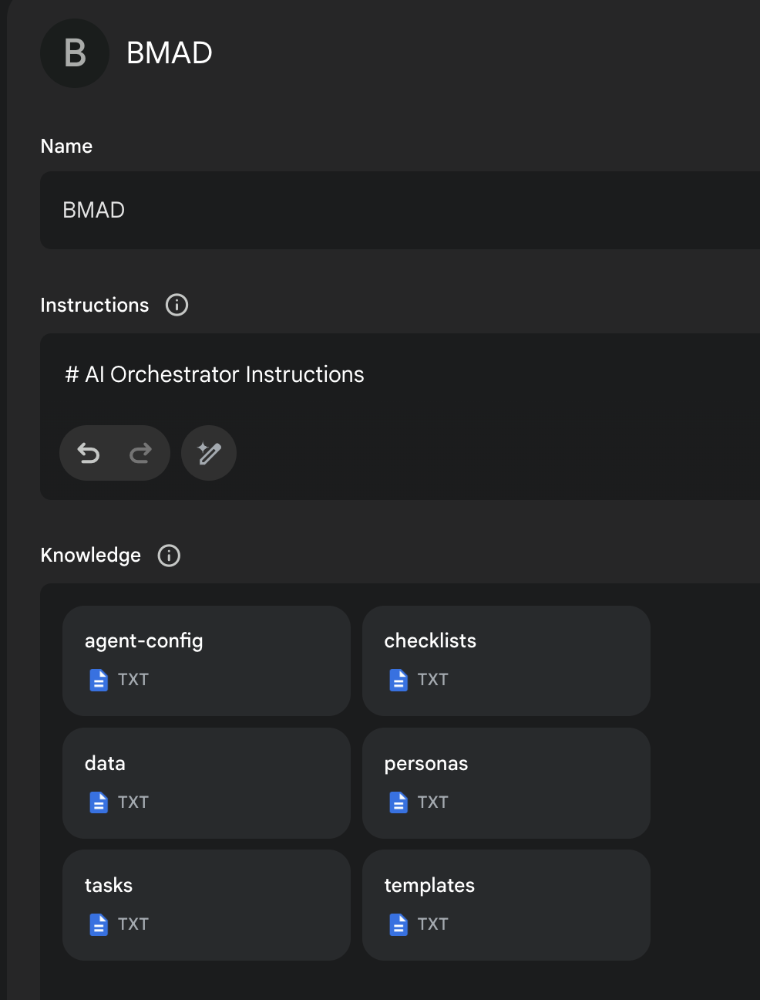

# The BMAD-Method 3.1 (Breakthrough Method of Agile (ai-driven) Development)

Demo of the BMad Agent entire workflow output from the web agent can be found in [Demos](./demos/readme.md) - and if you want to read a really long transcript of me talking to the multiple personality BMad Agent that produced the demo content - you can read the [full transcript](https://gemini.google.com/share/41fb640b63b0) here.

## Web Quickstart Project Setup (Recommended)

Orchestrator Uber BMad Agent that does it all - already pre-compiled in the `./web-build-sample` folder. The contents of agent-prompt.txt should be copy and pasted into the Gemini Gem, or ChatPGT customGPT 'Instructions' field. The remaining files in this folder just need to be attached. Give it a name and save it, and you now have the BMad Agent available to help you brainstorm, research plan and execute on your vision.

If you are not sure what to do in the Web Agent - try `/help` to get a list of commands, and `/agents` to see what personas BMad can become.

## IDE Project Quickstart

After you close the project to your local machine, you can copy the `bmad-agent` folder to your project root. This will put the templates, checklists, and other assets the local agents will need to use the agents from your IDE instead of the Web Agent. Minimally to build your project you will want the sm.ide.md and dev.ide.md so you can draft and build your project incrementally.

Here are the more [Setup and Usage Instructions](./docs/instruction.md) for IDE, WEB and Task setup.

Starting with the latest version of the BMad Agents for the BMad Method is very easy - all you need to do is copy `bmad-agent` folder to your project. The dedicated dev and sm that existing in previous versions are still available and are in the `bmad-agent/personas` folder with the .ide.md extension. Copy and paste the contents into your specific IDE's method of configuring a custom agent mode. The dev and sm both are configured for architecture and prd artifacts to be in (project-root)/docs and stories will be generated and developed in/from your (project-root)/docs/stories.

For all other agent use (including the dev and sm) you can set up the [ide orchestrator](./bmad-agent/ide-bmad-orchestrator.md) - you can ask the orchestrator bmad to become any agent you have [configured](./bmad-agent/ide-bmad-orchestrator-cfg.md).

[General IDE Custom Mode Setup](./docs/ide-setup.md).

## Advancing AI-Driven Development

Welcome to the latest and most advanced yet easy to use version of the Web and IDE Agent Agile Workflow! This new version, called BMad Agent, represents a significant evolution that builds but vastly improves upon the foundations of [legacy V2](./legacy-archive/V2/), introducing a more refined and comprehensive suite of agents, templates, checklists, tasks - and the amazing BMad Orchestrator and Knowledge Base agent is now available - a master of every aspect of the method that can become any agent and even handle multiple tasks all within a single massive web context if so desired.

## What's New?

All IDE Agents are now optimized to be under 6K characters, so they will work with windsurf's file limit restrictions.

The method now has an uber Orchestrator called BMAD - this agent will take your web or ide usage to the next level - this agent can morph and become the specific agent you want to work with! This makes Web usage super easy to use and set up. And in the IDE - you do not have to set up so many different agents if you do not want to!

There have been drastic improvements to the generation of documents and artifacts and the agents are now programmed to really help you build the best possible plans. Advanced LLM prompting techniques have been incorporated and programmed to help you help the agents produce amazing accurate artifacts, unlike anything seen before. Additionally agents are now configurable in what they can and cannot do - so you can accept the defaults, or set which personas are able to do what tasks. If you think the PO should be the one generating PRDs and the Scrum Master should be your course corrector - its all possible now! **Define agile the BMad way - or your way!**

While this is very powerful - you can get started with the default recommended set up as is in this repo, and basically use the agents as they are envisioned and will be explained. Detailed configuration and usage is outlined in the [Instructions](./docs/instruction.md)

## What is the BMad Method?

The BMad Method is a revolutionary approach that elevates "vibe coding" to advanced project planning to ensure your developer agents can start and completed advanced projects with very explicit guidance. It provides a structured yet flexible framework to plan, execute, and manage software projects using a team of specialized AI agents.

This method and tooling is so much more than just a task runner - this is a refined tool that will help you bring out your best ideas, define what you really are to build, and execute on it! From ideation, to PRD creation, to the technical decision making - this will help you do it all with the power of advanced LLM guidance.

The method is designed to be tool-agnostic in principle, with agent instructions and workflows adaptable to various AI platforms and IDEs.

## Agile Agents

Agents are programmed either directly self contained to drop right into an agent config in the ide - or they can be configured as programmable entities the orchestrating agent can become.

### Web Agents

Gemini 2.5 or Open AI customGPTs are created by running the node build script to generate output to a build folder. This output is the full package to create the orchestrator web agent.

See the detailed [Web Orchestration Setup and Usage Instructions](./docs/instruction.md#setting-up-web-agent-orchestrator)

### IDE Agents

There are dedicated self contained agents that are stand alone, and also an IDE version of an orchestrator. For there standalone, there are:

- [Dev IDE Agent](./bmad-agent/personas/dev.ide.md)
- [Story Generating SM Agent](./bmad-agent/personas/sm.ide.md)

If you want to use the other agents, you can use the other agents from that folder - but some will be larger than Windsurf allows - and there are many agents. So its recommended to either use 1 off tasks - OR even better - use the IDE Orchestrator Agent. See these [set up and Usage instructions for IDE Orchestrator](./docs/instruction.md#ide-agent-setup-and-usage).

## Tasks

Located in `bmad-agent/tasks/`, these self-contained instruction sets allow IDE agents or the orchestrators configured agents to perform specific jobs. These also can be used as one off commands with a vanilla agent in the ide by just referencing the task and asking the agent to perform it.

**Purpose:**

- **Reduce Agent Bloat:** Avoid adding rarely used instructions to primary agents.
- **On-Demand Functionality:** Instruct any capable IDE agent to execute a task by providing the task file content.
- **Versatility:** Handles specific functions like running checklists, creating stories, sharding documents, indexing libraries, etc.

Think of tasks as specialized mini-agents callable by your main IDE agents.

## End Matter

Interested in improving the BMAD Method? See the [contributing guidelines](docs/CONTRIBUTING.md).

Thank you and enjoy - BMad!
[License](./docs/LICENSE)
