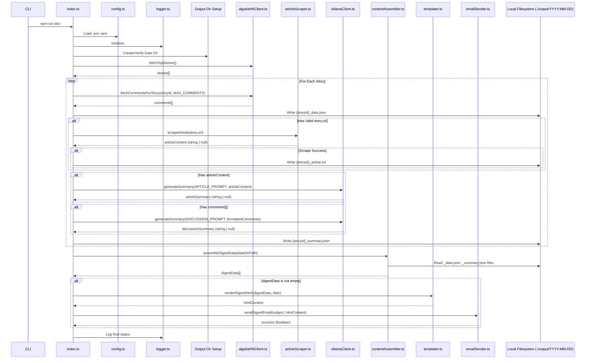

# BMad Hacker Daily Digest Architecture Document

## Technical Summary

This document outlines the technical architecture for the BMad Hacker Daily Digest, a command-line tool built with TypeScript and Node.js v22. It adheres to the structure provided by the "bmad-boilerplate". The system fetches the top 10 Hacker News stories and their comments daily via the Algolia HN API, attempts to scrape linked articles, generates summaries for both articles (if scraped) and discussions using a local Ollama instance, persists intermediate data locally, and sends an HTML digest email via Nodemailer upon manual CLI execution. The architecture emphasizes modularity through distinct clients and processing stages, facilitating independent stage testing as required by the PRD. Execution is strictly local for the MVP.

## High-Level Overview

The application follows a sequential pipeline architecture triggered by a single CLI command (`npm run dev` or `npm start`). Data flows through distinct stages: HN Data Acquisition, Article Scraping, LLM Summarization, and Digest Assembly/Email Dispatch. Each stage persists its output to a date-stamped local directory, allowing subsequent stages to operate on this data and enabling stage-specific testing utilities.

**(Diagram Suggestion for Canvas: Create a flowchart showing the stages below)**

```mermaid
graph TD
    A[CLI Trigger (npm run dev/start)] --> B(Initialize: Load Config, Setup Logger, Create Output Dir);
    B --> C{Fetch HN Data (Top 10 Stories + Comments)};
    C -- Story/Comment Data --> D(Persist HN Data: ./output/YYYY-MM-DD/{storyId}_data.json);
    D --> E{Attempt Article Scraping (per story)};
    E -- Scraped Text (if successful) --> F(Persist Article Text: ./output/YYYY-MM-DD/{storyId}_article.txt);
    F --> G{Generate Summaries (Article + Discussion via Ollama)};
    G -- Summaries --> H(Persist Summaries: ./output/YYYY-MM-DD/{storyId}_summary.json);
    H --> I{Assemble Digest (Read persisted data)};
    I -- HTML Content --> J{Send Email via Nodemailer};
    J --> K(Log Final Status & Exit);

    subgraph Stage Testing Utilities
        direction LR
        T1[npm run stage:fetch] --> D;
        T2[npm run stage:scrape] --> F;
        T3[npm run stage:summarize] --> H;
        T4[npm run stage:email] --> J;
    end

    C --> |Error/Skip| G;  // If no comments
    E --> |Skip/Fail| G;  // If no URL or scrape fails
    G --> |Summarization Fail| H; // Persist null summaries
    I --> |Assembly Fail| K; // Skip email if assembly fails
```

## Component View

The application logic resides primarily within the `src/` directory, organized into modules responsible for specific pipeline stages or cross-cutting concerns.

**(Diagram Suggestion for Canvas: Create a component diagram showing modules and dependencies)**

```mermaid
graph TD
    subgraph src ["Source Code (src/)"]
        direction LR
        Entry["index.ts (Main Orchestrator)"]

        subgraph Config ["Configuration"]
            ConfMod["config.ts"]
            EnvFile[".env File"]
        end

        subgraph Utils ["Utilities"]
            Logger["logger.ts"]
        end

        subgraph Clients ["External Service Clients"]
            Algolia["clients/algoliaHNClient.ts"]
            Ollama["clients/ollamaClient.ts"]
        end

        Scraper["scraper/articleScraper.ts"]

        subgraph Email ["Email Handling"]
            Assembler["email/contentAssembler.ts"]
            Templater["email/templater.ts (or within Assembler)"]
            Sender["email/emailSender.ts"]
            Nodemailer["(nodemailer library)"]
        end

        subgraph Stages ["Stage Testing Scripts (src/stages/)"]
             FetchStage["fetch_hn_data.ts"]
             ScrapeStage["scrape_articles.ts"]
             SummarizeStage["summarize_content.ts"]
             SendStage["send_digest.ts"]
        end

        Entry --> ConfMod;
        Entry --> Logger;
        Entry --> Algolia;
        Entry --> Scraper;
        Entry --> Ollama;
        Entry --> Assembler;
        Entry --> Templater;
        Entry --> Sender;

        Algolia -- uses --> NativeFetch["Node.js v22 Native Workspace"];
        Ollama -- uses --> NativeFetch;
        Scraper -- uses --> NativeFetch;
        Scraper -- uses --> ArticleExtractor["(@extractus/article-extractor)"];
        Sender -- uses --> Nodemailer;
        ConfMod -- reads --> EnvFile;

        Assembler -- reads --> LocalFS["Local Filesystem (./output)"];
        Entry -- writes --> LocalFS;

        FetchStage --> Algolia;
        FetchStage --> LocalFS;
        ScrapeStage --> Scraper;
        ScrapeStage --> LocalFS;
        SummarizeStage --> Ollama;
        SummarizeStage --> LocalFS;
        SendStage --> Assembler;
        SendStage --> Templater;
        SendStage --> Sender;
        SendStage --> LocalFS;
    end

    CLI["CLI (npm run ...)"] --> Entry;
    CLI -- runs --> FetchStage;
    CLI -- runs --> ScrapeStage;
    CLI -- runs --> SummarizeStage;
    CLI -- runs --> SendStage;

```



_Module Descriptions:_

- **`src/index.ts`**: The main entry point, orchestrating the entire pipeline flow from initialization to final email dispatch. Imports and calls functions from other modules.
- **`src/config.ts`**: Responsible for loading and validating environment variables from the `.env` file using the `dotenv` library.
- **`src/logger.ts`**: Provides a simple console logging utility used throughout the application.
- **`src/clients/algoliaHNClient.ts`**: Encapsulates interaction with the Algolia Hacker News Search API using the native `Workspace` API for fetching stories and comments.
- **`src/clients/ollamaClient.ts`**: Encapsulates interaction with the local Ollama API endpoint using the native `Workspace` API for generating summaries.
- **`src/scraper/articleScraper.ts`**: Handles fetching article HTML using native `Workspace` and extracting text content using `@extractus/article-extractor`. Includes robust error handling for fetch and extraction failures.
- **`src/email/contentAssembler.ts`**: Reads persisted story data and summaries from the local output directory.
- **`src/email/templater.ts` (or integrated)**: Renders the HTML email content using the assembled data.
- **`src/email/emailSender.ts`**: Configures and uses Nodemailer to send the generated HTML email.
- **`src/stages/*.ts`**: Individual scripts designed to run specific pipeline stages independently for testing, using persisted data from previous stages as input where applicable.

## Key Architectural Decisions & Patterns

- **Pipeline Architecture:** A sequential flow where each stage processes data and passes artifacts to the next via the local filesystem. Chosen for simplicity and to easily support independent stage testing.
- **Local Execution & File Persistence:** All execution is local, and intermediate artifacts (`_data.json`, `_article.txt`, `_summary.json`) are stored in a date-stamped `./output` directory. This avoids database setup for MVP and facilitates debugging/stage testing.
- **Native `Workspace` API:** Mandated by constraints for all HTTP requests (Algolia, Ollama, Article Scraping). Ensures usage of the latest Node.js features.
- **Modular Clients:** External interactions (Algolia, Ollama) are encapsulated in dedicated client modules (`src/clients/`). This promotes separation of concerns and makes swapping implementations (e.g., different LLM API) easier.
- **Configuration via `.env`:** Standard approach using `dotenv` for managing API keys, endpoints, and behavioral parameters (as per boilerplate).
- **Stage Testing Utilities:** Dedicated scripts (`src/stages/*.ts`) allow isolated testing of fetching, scraping, summarization, and emailing, fulfilling a key PRD requirement.
- **Graceful Error Handling (Scraping):** Article scraping failures are logged but do not halt the main pipeline, allowing the process to continue with discussion summaries only, as required. Other errors (API, LLM) are logged.

## Core Workflow / Sequence Diagrams (Simplified)

**(Diagram Suggestion for Canvas: Create a Sequence Diagram showing interactions)**



## Infrastructure and Deployment Overview

- **Cloud Provider(s):** N/A (Local Machine Execution Only for MVP)
- **Core Services Used:** N/A
- **Infrastructure as Code (IaC):** N/A
- **Deployment Strategy:** Manual CLI execution (`npm run dev` for development with `ts-node`, `npm run build && npm start` for running compiled JS). No automated deployment pipeline for MVP.
- **Environments:** Single: Local development machine.

## Key Reference Documents

- docs/prd.md
- docs/epic1-draft.txt, docs/epic2-draft.txt, ... docs/epic5-draft.txt
- docs/tech-stack.md
- docs/project-structure.md
- docs/coding-standards.md
- docs/api-reference.md
- docs/data-models.md
- docs/environment-vars.md
- docs/testing-strategy.md

## Change Log

| Change        | Date       | Version | Description                        | Author      |
| ------------- | ---------- | ------- | ---------------------------------- | ----------- |
| Initial draft | 2025-05-04 | 0.1     | Initial draft based on PRD & Epics | 3-Architect |
