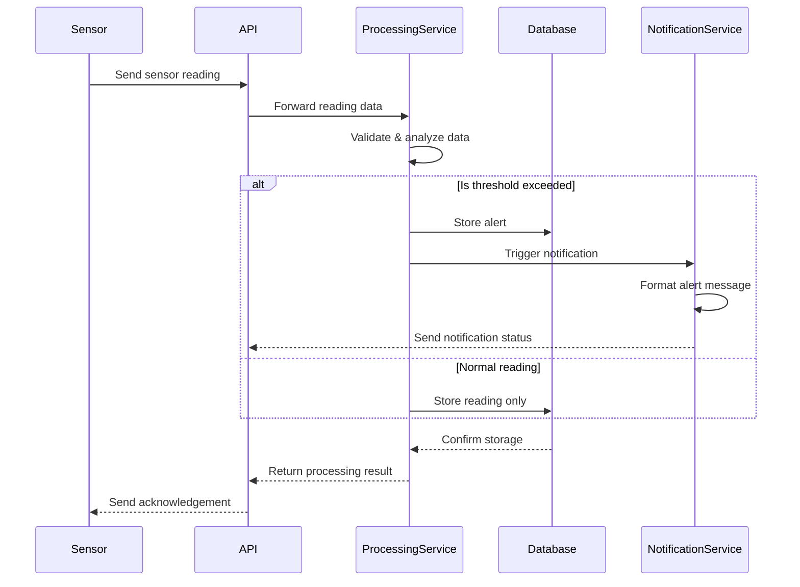

# Architecture for {PRD Title}

Status: { Draft | Approved }

## Technical Summary

{ Short 1-2 paragraph }

## Technology Table

Table listing choices for languages, libraries, infra, cloud resources, etc... may add more detail or refinement that what was in the PRD

<example>
  | Technology | Version | Description |
  | ---------- | ------- | ----------- |
  | Kubernetes | x.y.z | Container orchestration platform for microservices deployment |
  | Apache Kafka | x.y.z | Event streaming platform for real-time data ingestion |
  | TimescaleDB | x.y.z | Time-series database for sensor data storage |
  | Go | x.y.z | Primary language for data processing services |
  | GoRilla Mux | x.y.z | REST API Framework |
  | Python | x.y.z | Used for data analysis and ML services |
  | DeepSeek LLM | R3 | Ollama local hosted and remote hosted API use for customer chat engagement |

</example>

## **High-Level Overview**

Define the architectural style (e.g., Monolith, Microservices, Serverless) and justify the choice based on the PRD. Include a high-level diagram (e.g., C4 Context or Container level using Mermaid syntax).

### **Component View**

Identify major logical components/modules/services, outline their responsibilities, and describe key interactions/APIs between them. Include diagrams if helpful (e.g., C4 Container/Component or class diagrams using Mermaid syntax).

## Architectural Diagrams, Data Models, Schemas

{ Mermaid Diagrams for architecture }
{ Data Models, API Specs, Schemas }

<example>

### Dynamo One Table Design for App Table

```json
{
  "TableName": "AppTable",
  "KeySchema": [
    { "AttributeName": "PK", "KeyType": "HASH" },
    { "AttributeName": "SK", "KeyType": "RANGE" }
  ],
  "AttributeDefinitions": [
    { "AttributeName": "PK", "AttributeType": "S" },
    { "AttributeName": "SK", "AttributeType": "S" },
    { "AttributeName": "GSI1PK", "AttributeType": "S" },
    { "AttributeName": "GSI1SK", "AttributeType": "S" }
  ],
  "GlobalSecondaryIndexes": [
    {
      "IndexName": "GSI1",
      "KeySchema": [
        { "AttributeName": "GSI1PK", "KeyType": "HASH" },
        { "AttributeName": "GSI1SK", "KeyType": "RANGE" }
      ],
      "Projection": { "ProjectionType": "ALL" }
    }
  ],
  "EntityExamples": [
    {
      "PK": "USER#123",
      "SK": "PROFILE",
      "GSI1PK": "USER",
      "GSI1SK": "John Doe",
      "email": "john@example.com",
      "createdAt": "2023-05-01T12:00:00Z"
    },
    {
      "PK": "USER#123",
      "SK": "ORDER#456",
      "GSI1PK": "ORDER",
      "GSI1SK": "2023-05-15T09:30:00Z",
      "total": 129.99,
      "status": "shipped"
    },
    {
      "PK": "PRODUCT#789",
      "SK": "DETAILS",
      "GSI1PK": "PRODUCT",
      "GSI1SK": "Wireless Headphones",
      "price": 79.99,
      "inventory": 42
    }
  ]
}
```

### Sequence Diagram for Recording Alerts



### Sensor Reading Schema

```json
{
  "sensor_id": "string",
  "timestamp": "datetime",
  "readings": {
    "temperature": "float",
    "pressure": "float",
    "humidity": "float"
  },
  "metadata": {
    "location": "string",
    "calibration_date": "datetime"
  }
}
```

</example>

## Project Structure

{ Diagram the folder and file organization structure along with descriptions }

```
├ /src
├── /services
│   ├── /gateway        # Sensor data ingestion
│   ├── /processor      # Data processing and validation
│   ├── /analytics      # Data analysis and ML
│   └── /notifier       # Alert and notification system
├── /deploy
│   ├── /kubernetes     # K8s manifests
│   └── /terraform      # Infrastructure as Code
└── /docs
    ├── /api           # API documentation
    └── /schemas       # Data schemas
```

## Testing Requirements and Framework

### Patterns and Standards (Opinionated & Specific)

    - **Architectural/Design Patterns:** Mandate specific patterns to be used (e.g., Repository Pattern for data access, MVC/MVVM for structure, CQRS if applicable). .

    - **API Design Standards:** Define the API style (e.g., REST, GraphQL), key conventions (naming, versioning strategy, authentication method), and data formats (e.g., JSON).

    - **Coding Standards:** Specify the mandatory style guide (e.g., Airbnb JavaScript Style Guide, PEP 8), code formatter (e.g., Prettier), and linter (e.g., ESLint with specific config). Define mandatory naming conventions (files, variables, classes). Define test file location conventions.

    - **Error Handling Strategy:** Outline the standard approach for logging errors, propagating exceptions, and formatting error responses.

### Initial Project Setup (Manual Steps)

Define Story 0: Explicitly state initial setup tasks for the user. Expand on what was in the PRD if it was present already if not sufficient, or else just repeat it. Examples:

- Framework CLI Generation: Specify exact command (e.g., `npx create-next-app@latest...`, `ng new...`). Justify why manual is preferred.
- Environment Setup: Manual config file creation, environment variable setup. Register for Cloud DB Account.
- LLM: Let up Local LLM or API key registration if using remote

## Infrastructure and Deployment

{ cloud accounts and resources we will need to provision and for what purpose }
{ Specify the target deployment environment (e.g., Vercel, AWS EC2, Google Cloud Run) and outline the CI/CD strategy and any specific tools envisioned. }

## Change Log

{ table of changes }
