# Test Architect (TEA) Agent Guide

## Overview

- **Persona:** Murat, Master Test Architect and Quality Advisor focused on risk-based testing, fixture architecture, ATDD, and CI/CD governance.
- **Mission:** Deliver actionable quality strategies, automation coverage, and gate decisions that scale with project level and compliance demands.
- **Use When:** Project level ≥2, integration risk is non-trivial, brownfield regression risk exists, or compliance/NFR evidence is required.

## TEA Workflow Lifecycle

TEA integrates across the entire BMad development lifecycle, providing quality assurance at every phase:

```mermaid
%%{init: {'theme':'base', 'themeVariables': { 'primaryColor':'#fff','primaryTextColor':'#000','primaryBorderColor':'#000','lineColor':'#000','secondaryColor':'#fff','tertiaryColor':'#fff','fontSize':'16px','fontFamily':'arial'}}}%%
graph TB
    subgraph Phase2["<b>Phase 2: PLANNING</b>"]
        PM["<b>PM: *prd</b>"]
        Framework["<b>TEA: *framework</b>"]
        CI["<b>TEA: *ci</b>"]
        TestDesign["<b>TEA: *test-design</b>"]
        PM --> Framework
        Framework --> CI
        CI --> TestDesign
        SetupNote["<b>Setup once per project</b>"]
        TestDesign -.-> SetupNote
    end

    subgraph Phase4["<b>Phase 4: IMPLEMENTATION - Per Story Cycle</b>"]
        CreateStory["<b>SM: *create-story</b>"]
        ATDD["<b>TEA: *atdd (optional, before dev)</b>"]
        DevImpl["<b>DEV: implements story</b>"]
        Automate["<b>TEA: *automate</b>"]
        TestReview1["<b>TEA: *test-review (optional)</b>"]
        Trace1["<b>TEA: *trace (refresh coverage)</b>"]

        CreateStory --> ATDD
        ATDD --> DevImpl
        DevImpl --> Automate
        Automate --> TestReview1
        TestReview1 --> Trace1
        Trace1 -.->|next story| CreateStory
    end

    subgraph Gate["<b>EPIC/RELEASE GATE</b>"]
        NFR["<b>TEA: *nfr-assess (if not done earlier)</b>"]
        TestReview2["<b>TEA: *test-review (final audit, optional)</b>"]
        TraceGate["<b>TEA: *trace - Phase 2: Gate</b>"]
        GateDecision{"<b>Gate Decision</b>"}

        NFR --> TestReview2
        TestReview2 --> TraceGate
        TraceGate --> GateDecision
        GateDecision -->|PASS| Pass["<b>PASS ✅</b>"]
        GateDecision -->|CONCERNS| Concerns["<b>CONCERNS ⚠️</b>"]
        GateDecision -->|FAIL| Fail["<b>FAIL ❌</b>"]
        GateDecision -->|WAIVED| Waived["<b>WAIVED ⏭️</b>"]
    end

    Phase2 --> Phase4
    Phase4 --> Gate

    style Phase2 fill:#bbdefb,stroke:#0d47a1,stroke-width:3px,color:#000
    style Phase4 fill:#e1bee7,stroke:#4a148c,stroke-width:3px,color:#000
    style Gate fill:#ffe082,stroke:#f57c00,stroke-width:3px,color:#000
    style Pass fill:#4caf50,stroke:#1b5e20,stroke-width:3px,color:#000
    style Concerns fill:#ffc107,stroke:#f57f17,stroke-width:3px,color:#000
    style Fail fill:#f44336,stroke:#b71c1c,stroke-width:3px,color:#000
    style Waived fill:#9c27b0,stroke:#4a148c,stroke-width:3px,color:#000
```



### TEA Integration with BMad v6 Workflow

TEA operates **across all four BMad phases**, unlike other agents that are phase-specific:

<details>
<summary><strong>Cross-Phase Integration & Workflow Complexity</strong></summary>

### Phase-Specific Agents (Standard Pattern)

- **Phase 1 (Analysis)**: Analyst agent
- **Phase 2 (Planning)**: PM agent
- **Phase 3 (Solutioning)**: Architect agent
- **Phase 4 (Implementation)**: SM, DEV agents

### TEA: Cross-Phase Quality Agent (Unique Pattern)

TEA is **the only agent that spans all phases**:

```
Phase 1 (Analysis) → [TEA not typically used]
    ↓
Phase 2 (Planning) → TEA: *framework, *ci, *test-design (setup)
    ↓
Phase 3 (Solutioning) → [TEA validates architecture testability]
    ↓
Phase 4 (Implementation) → TEA: *atdd, *automate, *test-review, *trace (per story)
    ↓
Epic/Release Gate → TEA: *nfr-assess, *trace Phase 2 (release decision)
```

### Why TEA Needs 8 Workflows

**Standard agents**: 1-3 workflows per phase
**TEA**: 8 workflows across 3+ phases

| Phase       | TEA Workflows                          | Frequency        | Purpose                          |
| ----------- | -------------------------------------- | ---------------- | -------------------------------- |
| **Phase 2** | *framework, *ci, \*test-design         | Once per project | Establish quality infrastructure |
| **Phase 4** | *atdd, *automate, *test-review, *trace | Per story/sprint | Continuous quality validation    |
| **Release** | *nfr-assess, *trace (Phase 2: gate)    | Per epic/release | Go/no-go decision                |

**Note**: `*trace` is a two-phase workflow: Phase 1 (traceability) + Phase 2 (gate decision). This reduces cognitive load while maintaining natural workflow.

This complexity **requires specialized documentation** (this guide), **extensive knowledge base** (19+ fragments), and **unique architecture** (`testarch/` directory).

</details>

## Prerequisites and Setup

1. Run the core planning workflows first:
   - Analyst `*product-brief`
   - Product Manager `*prd`
   - Architect `*create-architecture`
2. Confirm `bmad/bmm/config.yaml` defines `project_name`, `output_folder`, `dev_story_location`, and language settings.
3. Ensure a test test framework setup exists; if not, use `*framework` command to create a test framework setup, prior to development.
4. Skim supporting references (knowledge under `testarch/`, command workflows under `workflows/testarch/`).
   - `tea-index.csv` + `knowledge/*.md`

## High-Level Cheat Sheets

### Greenfield Feature Launch (Level 2)

| Phase              | Test Architect                                                            | Dev / Team                                                            | Outputs                                                                      |
| ------------------ | ------------------------------------------------------------------------- | --------------------------------------------------------------------- | ---------------------------------------------------------------------------- |
| Setup              | -                                                                         | Analyst `*product-brief`, PM `*prd`, Architect `*create-architecture` | `{output_folder}/product-brief*.md`, `PRD.md`, `epics.md`, `architecture.md` |
| Pre-Implementation | Run `*framework` (if harness missing), `*ci`, and `*test-design`          | Review risk/design/CI guidance, align backlog                         | Test scaffold, CI pipeline, risk and coverage strategy                       |
| Story Prep         | -                                                                         | Scrum Master `*create-story`, `*story-context`                        | Story markdown + context XML                                                 |
| Implementation     | (Optional) Trigger `*atdd` before dev to supply failing tests + checklist | Implement story guided by ATDD checklist                              | Failing acceptance tests + implementation checklist                          |
| Post-Dev           | Execute `*automate`, (Optional) `*test-review`, re-run `*trace`           | Address recommendations, update code/tests                            | Regression specs, quality report, refreshed coverage matrix                  |
| Release            | (Optional) `*test-review` for final audit, Run `*trace` (Phase 2)         | Confirm Definition of Done, share release notes                       | Quality audit, Gate YAML + release summary (owners, waivers)                 |

<details>
<summary>Execution Notes</summary>

- Run `*framework` only once per repo or when modern harness support is missing.
- `*framework` followed by `*ci` establishes install + pipeline; `*test-design` then handles risk scoring, mitigations, and scenario planning in one pass.
- Use `*atdd` before coding when the team can adopt ATDD; share its checklist with the dev agent.
- Post-implementation, keep `*trace` current, expand coverage with `*automate`, optionally review test quality with `*test-review`. For release gate, run `*trace` with Phase 2 enabled to get deployment decision.
- Use `*test-review` after `*atdd` to validate generated tests, after `*automate` to ensure regression quality, or before gate for final audit.

</details>

<details>
<summary>Worked Example – “Nova CRM” Greenfield Feature</summary>

1. **Planning:** Analyst runs `*product-brief`; PM executes `*prd` to produce PRD and epics; Architect completes `*create-architecture` for the new module.
2. **Setup:** TEA checks harness via `*framework`, configures `*ci`, and runs `*test-design` to capture risk/coverage plans.
3. **Story Prep:** Scrum Master generates the story via `*create-story`; PO validates using `*solutioning-gate-check`.
4. **Implementation:** TEA optionally runs `*atdd`; Dev implements with guidance from failing tests and the plan.
5. **Post-Dev and Release:** TEA runs `*automate`, optionally `*test-review` to audit test quality, re-runs `*trace` with Phase 2 enabled to generate both traceability and gate decision.

</details>

### Brownfield Feature Enhancement (Level 3–4)

| Phase             | Test Architect                                                                         | Dev / Team                                                   | Outputs                                                                 |
| ----------------- | -------------------------------------------------------------------------------------- | ------------------------------------------------------------ | ----------------------------------------------------------------------- |
| Refresh Context   | -                                                                                      | Analyst/PM/Architect rerun planning workflows                | Updated planning artifacts in `{output_folder}`                         |
| Baseline Coverage | Run `*trace` to inventory existing tests                                               | Review matrix, flag hotspots                                 | Coverage matrix + initial gate snippet                                  |
| Risk Targeting    | Run `*test-design`                                                                     | Align remediation/backlog priorities                         | Brownfield risk memo + scenario matrix                                  |
| Story Prep        | -                                                                                      | Scrum Master `*create-story`                                 | Updated story markdown                                                  |
| Implementation    | (Optional) Run `*atdd` before dev                                                      | Implement story, referencing checklist/tests                 | Failing acceptance tests + implementation checklist                     |
| Post-Dev          | Apply `*automate`, (Optional) `*test-review`, re-run `*trace`, `*nfr-assess` if needed | Resolve gaps, update docs/tests                              | Regression specs, quality report, refreshed coverage matrix, NFR report |
| Release           | (Optional) `*test-review` for final audit, Run `*trace` (Phase 2)                      | Product Owner `*solutioning-gate-check`, share release notes | Quality audit, Gate YAML + release summary                              |

<details>
<summary>Execution Notes</summary>

- Lead with `*trace` so remediation plans target true coverage gaps. Ensure `*framework` and `*ci` are in place early in the engagement; if the brownfield lacks them, run those setup steps immediately after refreshing context.
- `*test-design` should highlight regression hotspots, mitigations, and P0 scenarios.
- Use `*atdd` when stories benefit from ATDD; otherwise proceed to implementation and rely on post-dev automation.
- After development, expand coverage with `*automate`, optionally review test quality with `*test-review`, re-run `*trace` (Phase 2 for gate decision). Run `*nfr-assess` now if non-functional risks weren't addressed earlier.
- Use `*test-review` to validate existing brownfield tests or audit new tests before gate.
- Product Owner `*solutioning-gate-check` confirms the team has artifacts before handoff or release.

</details>

<details>
<summary>Worked Example – “Atlas Payments” Brownfield Story</summary>

1. **Context Refresh:** Analyst reruns `*product-brief`; PM executes `*prd` to update PRD, analysis, and `epics.md`; Architect triggers `*create-architecture` capturing legacy payment flows.
2. **Baseline Coverage:** TEA executes `*trace` to record current coverage in `docs/qa/assessments/atlas-payment-trace.md`.
3. **Risk and Design:** `*test-design` flags settlement edge cases, plans mitigations, and allocates new API/E2E scenarios with P0 priorities.
4. **Story Prep:** Scrum Master generates `stories/story-1.1.md` via `*create-story`, automatically pulling updated context.
5. **ATDD First:** TEA runs `*atdd`, producing failing Playwright specs under `tests/e2e/payments/` plus an implementation checklist.
6. **Implementation:** Dev pairs with the checklist/tests to deliver the story.
7. **Post-Implementation:** TEA applies `*automate`, optionally `*test-review` to audit test quality, re-runs `*trace` with Phase 2 enabled, performs `*nfr-assess` to validate SLAs. The `*trace` Phase 2 output marks PASS with follow-ups.

</details>

### Enterprise / Compliance Program (Level 4)

| Phase               | Test Architect                                                    | Dev / Team                                     | Outputs                                                    |
| ------------------- | ----------------------------------------------------------------- | ---------------------------------------------- | ---------------------------------------------------------- |
| Strategic Planning  | -                                                                 | Analyst/PM/Architect standard workflows        | Enterprise-grade PRD, epics, architecture                  |
| Quality Planning    | Run `*framework`, `*test-design`, `*nfr-assess`                   | Review guidance, align compliance requirements | Harness scaffold, risk + coverage plan, NFR documentation  |
| Pipeline Enablement | Configure `*ci`                                                   | Coordinate secrets, pipeline approvals         | `.github/workflows/test.yml`, helper scripts               |
| Execution           | Enforce `*atdd`, `*automate`, `*test-review`, `*trace` per story  | Implement stories, resolve TEA findings        | Tests, fixtures, quality reports, coverage matrices        |
| Release             | (Optional) `*test-review` for final audit, Run `*trace` (Phase 2) | Capture sign-offs, archive artifacts           | Quality audit, updated assessments, gate YAML, audit trail |

<details>
<summary>Execution Notes</summary>

- Use `*atdd` for every story when feasible so acceptance tests lead implementation in regulated environments.
- `*ci` scaffolds selective testing scripts, burn-in jobs, caching, and notifications for long-running suites.
- Enforce `*test-review` per story or sprint to maintain quality standards and ensure compliance with testing best practices.
- Prior to release, rerun coverage (`*trace`, `*automate`), perform final quality audit with `*test-review`, and formalize the decision with `*trace` Phase 2 (gate decision); store everything for audits. Call `*nfr-assess` here if compliance/performance requirements weren't captured during planning.

</details>

<details>
<summary>Worked Example – “Helios Ledger” Enterprise Release</summary>

1. **Strategic Planning:** Analyst/PM/Architect complete PRD, epics, and architecture using the standard workflows.
2. **Quality Planning:** TEA runs `*framework`, `*test-design`, and `*nfr-assess` to establish mitigations, coverage, and NFR targets.
3. **Pipeline Setup:** TEA configures CI via `*ci` with selective execution scripts.
4. **Execution:** For each story, TEA enforces `*atdd`, `*automate`, `*test-review`, and `*trace`; Dev teams iterate on the findings.
5. **Release:** TEA re-checks coverage, performs final quality audit with `*test-review`, and logs the final gate decision via `*trace` Phase 2, archiving artifacts for compliance.

</details>

## Command Catalog

<details>
<summary><strong>Optional Playwright MCP Enhancements</strong></summary>

**Two Playwright MCP servers** (actively maintained, continuously updated):

- `playwright` - Browser automation (`npx @playwright/mcp@latest`)
- `playwright-test` - Test runner with failure analysis (`npx playwright run-test-mcp-server`)

**How MCP Enhances TEA Workflows**:

MCP provides additional capabilities on top of TEA's default AI-based approach:

1. `*test-design`:
   - Default: Analysis + documentation
   - **+ MCP**: Interactive UI discovery with `browser_navigate`, `browser_click`, `browser_snapshot`, behavior observation

   Benefit:Discover actual functionality, edge cases, undocumented features

2. `*atdd`, `*automate`:
   - Default: Infers selectors and interactions from requirements and knowledge fragments
   - **+ MCP**: Generates tests **then** verifies with `generator_setup_page`, `browser_*` tools, validates against live app

   Benefit: Accurate selectors from real DOM, verified behavior, refined test code

3. `*automate`:
   - Default: Pattern-based fixes from error messages + knowledge fragments
   - **+ MCP**: Pattern fixes **enhanced with** `browser_snapshot`, `browser_console_messages`, `browser_network_requests`, `browser_generate_locator`

   Benefit: Visual failure context, live DOM inspection, root cause discovery

**Config example**:

```json
{
  "mcpServers": {
    "playwright": {
      "command": "npx",
      "args": ["@playwright/mcp@latest"]
    },
    "playwright-test": {
      "command": "npx",
      "args": ["playwright", "run-test-mcp-server"]
    }
  }
}
```

**To disable**: Set `tea_use_mcp_enhancements: false` in `bmad/bmm/config.yaml` OR remove MCPs from IDE config.

</details>

<br></br>

| Command        | Workflow README                                   | Primary Outputs                                                                               | Notes                                                | With Playwright MCP Enhancements                                                                             |
| -------------- | ------------------------------------------------- | --------------------------------------------------------------------------------------------- | ---------------------------------------------------- | ------------------------------------------------------------------------------------------------------------ |
| `*framework`   | [📖](../workflows/testarch/framework/README.md)   | Playwright/Cypress scaffold, `.env.example`, `.nvmrc`, sample specs                           | Use when no production-ready harness exists          | -                                                                                                            |
| `*ci`          | [📖](../workflows/testarch/ci/README.md)          | CI workflow, selective test scripts, secrets checklist                                        | Platform-aware (GitHub Actions default)              | -                                                                                                            |
| `*test-design` | [📖](../workflows/testarch/test-design/README.md) | Combined risk assessment, mitigation plan, and coverage strategy                              | Risk scoring + optional exploratory mode             | **+ Exploratory**: Interactive UI discovery with browser automation (uncover actual functionality)           |
| `*atdd`        | [📖](../workflows/testarch/atdd/README.md)        | Failing acceptance tests + implementation checklist                                           | TDD red phase + optional recording mode              | **+ Recording**: AI generation verified with live browser (accurate selectors from real DOM)                 |
| `*automate`    | [📖](../workflows/testarch/automate/README.md)    | Prioritized specs, fixtures, README/script updates, DoD summary                               | Optional healing/recording, avoid duplicate coverage | **+ Healing**: Pattern fixes enhanced with visual debugging + **+ Recording**: AI verified with live browser |
| `*test-review` | [📖](../workflows/testarch/test-review/README.md) | Test quality review report with 0-100 score, violations, fixes                                | Reviews tests against knowledge base patterns        | -                                                                                                            |
| `*nfr-assess`  | [📖](../workflows/testarch/nfr-assess/README.md)  | NFR assessment report with actions                                                            | Focus on security/performance/reliability            | -                                                                                                            |
| `*trace`       | [📖](../workflows/testarch/trace/README.md)       | Phase 1: Coverage matrix, recommendations. Phase 2: Gate decision (PASS/CONCERNS/FAIL/WAIVED) | Two-phase workflow: traceability + gate decision     | -                                                                                                            |

**📖** = Click to view detailed workflow documentation

## Why TEA is Architecturally Different

TEA is the only BMM agent with its own top-level module directory (`bmm/testarch/`). This intentional design pattern reflects TEA's unique requirements:

<details>
<summary><strong>Unique Architecture Pattern & Rationale</strong></summary>

### Directory Structure

```
src/modules/bmm/
├── agents/
│   └── tea.agent.yaml          # Agent definition (standard location)
├── workflows/
│   └── testarch/               # TEA workflows (standard location)
└── testarch/                   # Knowledge base (UNIQUE!)
    ├── knowledge/              # 21 production-ready test pattern fragments
    ├── tea-index.csv           # Centralized knowledge lookup (21 fragments indexed)
    └── README.md               # This guide
```

### Why TEA Gets Special Treatment

TEA uniquely requires **extensive domain knowledge** (21 fragments, 12,821 lines: test patterns, CI/CD, fixtures, quality practices, healing strategies), a **centralized reference system** (`tea-index.csv` for on-demand fragment loading), **cross-cutting concerns** (domain-specific patterns vs project-specific artifacts like PRDs/stories), and **optional MCP integration** (healing, exploratory, verification modes). Other BMM agents don't require this architecture.

</details>
