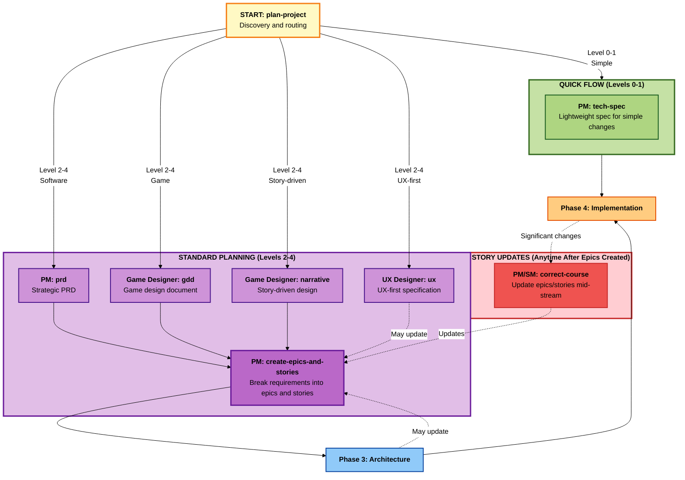

# BMM Planning Workflows (Phase 2)

## Overview

Phase 2 (Planning) workflows are **required** for all projects. They transform strategic vision into actionable requirements that guide implementation. BMM uses a **scale-adaptive planning system** where the workflow automatically selects the right level of detail based on project complexity.

**Key principle:** One workflow to rule them all - `plan-project` intelligently routes to the appropriate planning flow based on project characteristics.

---

## Phase 2 Planning Flow



---

## Quick Reference

| Workflow                     | Agent         | Project Levels | Purpose                                              |
| ---------------------------- | ------------- | -------------- | ---------------------------------------------------- |
| **prd**                      | PM            | 2-4            | Strategic PRD                                        |
| **create-epics-and-stories** | PM            | 2-4            | Break PRD/GDD into epics and stories (standalone OK) |
| **tech-spec**                | PM            | 0-1            | Lightweight technical specification                  |
| **gdd**                      | Game Designer | 2-4 (games)    | Complete game design document                        |
| **narrative**                | Game Designer | 2-4 (story)    | Story-driven game/experience design                  |
| **ux**                       | UX Designer   | 2-4 (UX-heavy) | UX-first design specification                        |

**Note:** The `plan-project` workflow is your single entry point. It automatically routes to the right planning workflow based on your answers to discovery questions.

**Critical:** After PRD/GDD/Narrative complete, you must run `create-epics-and-stories` to generate user stories (can be done in same chat or separate chat later). These stories can be updated anytime via UX-Design, Architecture decisions, or `correct-course` during implementation.

---

## Understanding Scale-Adaptive Planning

### Project Complexity Levels

BMM categorizes projects into 5 levels (0-4) to determine the appropriate planning detail:

| Level       | Scope                   | Planning Workflow          | Examples                                                     |
| ----------- | ----------------------- | -------------------------- | ------------------------------------------------------------ |
| **Level 0** | Single atomic change    | **tech-spec** (Quick Spec) | Bug fix, single endpoint, config change                      |
| **Level 1** | Simple isolated feature | **tech-spec** (Quick Spec) | Add validation rule, new API field, small UI component       |
| **Level 2** | Medium feature          | **prd** (Lightweight)      | User profile page, search feature, data export               |
| **Level 3** | Large feature set       | **prd** (Standard)         | Complete authentication system, admin dashboard              |
| **Level 4** | Multi-phase initiative  | **prd** (Comprehensive)    | Platform migration, new product line, enterprise integration |

### How Scale-Adaptive Planning Works

**Step 1: Intent Discovery**
The `plan-project` workflow asks you questions to understand:

- What are you building?
- How complex is it?
- Is this greenfield or brownfield?
- What are the primary concerns? (features, UX, story, technical architecture)

**Step 2: Intelligent Routing**
Based on your answers, the workflow routes to:

- **tech-spec** (Levels 0-1): Quick Spec Flow for simple changes
- **prd** (Levels 2-4): Strategic PRD with epic breakdown
- **gdd** (Levels 2-4, games): Game Design Document
- **narrative** (Levels 2-4, story-heavy): Narrative-first design
- **ux** (Levels 2-4, UX-first): UX specification with prototypes

**Step 3: Adaptive Detail**
Each workflow adjusts its depth based on level:

- Level 2: Lightweight documentation
- Level 3: Standard documentation with multiple epics
- Level 4: Comprehensive documentation with phased delivery

---

## plan-project (Entry Point)

### Purpose

Single unified entry point for all planning workflows. Uses conversational discovery to understand your project and intelligently route to the appropriate planning flow.

**Agent:** PM (orchestrates other agents as needed)
**Phase:** 2 (Planning)
**Required:** Yes (for all projects)

### When to Use

**Always use this as your planning starting point.** Do not call prd, gdd, narrative, ux, or tech-spec directly unless you explicitly want to skip discovery.

### Process Overview

**Phase 1: Discovery (Steps 1-3)**

- Understand project context
- Assess complexity level (0-4)
- Identify primary concerns (features, UX, story, technical)

**Phase 2: Routing Decision (Step 4)**

- Determine target workflow
- Explain routing rationale
- Confirm with user

**Phase 3: Execute Target Workflow (Steps 5-6)**

- Invoke appropriate planning workflow
- Pass context and decisions
- Return to plan-project for completion

**Phase 4: Handoff (Step 7)**

- Document planning decisions
- Recommend next phase workflows
- Update workflow status

### Discovery Questions

**Project Type:**

- What are you building? (software product, game, internal tool, etc.)
- Is this greenfield (new) or brownfield (existing)?

**Complexity Assessment:**

- How would you describe the scope? (single change, simple feature, medium feature, large feature set, multi-phase initiative)
- How many user-facing features are involved?
- How many systems or integrations are affected?

**Primary Concerns:**

- What's most important for this project? (feature functionality, user experience, narrative/story, technical architecture, performance)

**Special Characteristics:**

- Is this a game project?
- Is storytelling central to the experience?
- Is UX innovation the primary differentiator?
- Are there unique technical constraints?

### Routing Logic

```
IF game_project AND level >= 2:
  → Route to gdd

ELSE IF story_central AND level >= 2:
  → Route to narrative

ELSE IF ux_innovation AND level >= 2:
  → Route to ux

ELSE IF level <= 1:
  → Route to tech-spec (Quick Spec Flow)

ELSE:
  → Route to prd (with level-appropriate depth)
```

### Outputs

- Planning decision document (routing rationale)
- Output from target workflow (PRD, GDD, Tech Spec, etc.)
- Handoff recommendations for Phase 3

### Example Scenarios

**Scenario 1: Bug Fix**

- **Input**: "Fix null pointer exception in user service"
- **Discovery**: Level 0 (single atomic change)
- **Route**: tech-spec (Quick Spec Flow)

**Scenario 2: E-commerce Checkout**

- **Input**: "Build complete checkout flow with payment processing"
- **Discovery**: Level 3 (large feature set), feature-focused
- **Route**: prd (Standard depth)

**Scenario 3: Roguelike Card Game**

- **Input**: "Roguelike card battler with emotional narrative"
- **Discovery**: Level 3 (large feature set), game project
- **Route**: gdd

**Scenario 4: Story-Driven Adventure**

- **Input**: "Narrative adventure game with branching story"
- **Discovery**: Level 3, story-central
- **Route**: narrative (then gdd for mechanics)

---

## tech-spec (Quick Spec Flow)

### Purpose

Lightweight technical specification for Levels 0-1 projects (single changes, simple features). Focuses on implementation details without heavy strategic planning.

**Agent:** Architect
**Phase:** 2 (Planning)
**Project Levels:** 0-1

### When to Use

- Bug fixes
- Single API endpoint additions
- Configuration changes
- Small UI component additions
- Isolated validation rules
- Single-file modifications

**When NOT to use:**

- Multiple interconnected changes → Use **prd**
- User-facing feature with multiple screens → Use **prd**
- Requires epic breakdown → Use **prd**

### Process Overview

**Step 1: Problem Definition**

- What's broken or missing?
- What's the desired behavior?
- What are the constraints?

**Step 2: Technical Analysis**

- Current state assessment
- Root cause (if bug)
- Dependencies identified

**Step 3: Solution Design**

- Implementation approach
- Code changes required
- Test strategy
- Rollback plan

**Step 4: Documentation**

- Quick Spec document generated
- Handoff to implementation

### Inputs

- Problem description or feature request
- Current codebase context (if brownfield)
- Technical constraints
- Acceptance criteria (simple)

### Outputs

**Primary Output:** `tech-spec-{feature-name}-{date}.md`

**Document Structure:**

1. Problem Statement
2. Current State Analysis
3. Proposed Solution
4. Implementation Details
   - Files to modify
   - API changes
   - Database changes (if any)
   - Configuration changes
5. Test Strategy
6. Rollback Plan
7. Acceptance Criteria
8. Risk Assessment (lightweight)

### Example Output

**Problem:** Null pointer exception when user has no profile image

**Solution:**

```markdown
# Quick Spec: Fix Profile Image Null Pointer

## Problem

Users without profile images cause NPE in UserProfileService.java:line 42

## Root Cause

Method assumes profileImageUrl is never null, but DB allows NULL

## Solution

1. Add null check in UserProfileService
2. Return default placeholder image URL
3. Add unit test for null case

## Implementation

- File: `UserProfileService.java`
- Change: Add null guard: `if (user.profileImageUrl == null) return DEFAULT_AVATAR_URL;`
- Test: `UserProfileServiceTest.java` - new test case
- No DB migration needed

## Acceptance Criteria

- AC-1: Users with null profile image see default avatar
- AC-2: No NPE in logs
- AC-3: Unit test passes

## Risk: LOW

- Isolated change, single method
- Backward compatible
```

### Related Workflows

- **dev-story** (Phase 4) - Implement the spec
- **prd** - Use for more complex features

---

## prd (Product Requirements Document)

### Purpose

Strategic PRD with tactical epic breakdown for Levels 2-4 projects. Unified workflow that adapts depth based on project complexity.

**Agent:** PM (with Architect and Analyst support)
**Phase:** 2 (Planning)
**Project Levels:** 2-4

### When to Use

- Medium to large feature sets
- Multi-screen user experiences
- Complex business logic
- Multiple system integrations
- Phased delivery required

### Scale-Adaptive Structure

**Level 2 (Lightweight PRD):**

- Single epic with 5-10 stories
- Simplified competitive analysis
- Basic technical considerations
- 10-15 pages

**Level 3 (Standard PRD):**

- 2-4 epics with 15-30 stories
- Comprehensive competitive analysis
- Detailed technical requirements
- Risk assessment
- 20-30 pages

**Level 4 (Comprehensive PRD):**

- 5+ epics with 30-50+ stories
- Multi-phase delivery plan
- Enterprise architecture considerations
- Extensive stakeholder analysis
- Success metrics framework
- 30-50+ pages

### Process Overview

**Phase 1: Strategic Foundation (Steps 1-4)**

- Problem and opportunity definition
- User research and personas
- Competitive analysis
- Success criteria and metrics

**Phase 2: Solution Definition (Steps 5-8)**

- Core capabilities and features
- User experience principles
- Technical requirements
- Integration points

**Phase 3: Epic Breakdown (Steps 9-12)**

- Identify epics (level-appropriate count)
- Define user stories per epic
- Prioritize stories (P0/P1/P2/P3)
- Sequence for delivery

**Phase 4: Planning and Risks (Steps 13-15)**

- Resource estimation
- Risk assessment
- Assumptions and dependencies
- Success metrics finalized

**Phase 5: Documentation (Step 16)**

- Generate final PRD
- Create epic files
- Handoff preparation

### Inputs

Optional:

- product-brief.md (from Phase 1)
- market-research.md (from Phase 1)
- competitive-analysis.md (from Phase 1)
- User input through conversational process

### Outputs

**Primary Outputs:**

1. **PRD.md**: Complete product requirements document
2. **epics.md**: All epics with story breakdown
3. **Epic Files**: Individual files per epic (e.g., `epic-1-authentication.md`)

**PRD Structure:**

1. Executive Summary
2. Problem Statement (with evidence)
3. Goals and Success Metrics
4. User Personas and Scenarios
5. Competitive Landscape
6. Feature Requirements
   - Core capabilities
   - User stories (organized by epic)
   - Acceptance criteria
7. User Experience Requirements
8. Technical Requirements
9. Integration Requirements
10. Non-Functional Requirements (NFRs)
11. Assumptions and Constraints
12. Risks and Mitigation
13. Success Metrics
14. Glossary

**Epic File Structure:**

- Epic overview and objectives
- User stories with acceptance criteria
- Story priorities (P0/P1/P2/P3)
- Dependencies and sequencing
- Technical notes
- Success criteria

### Example: Level 3 PRD for E-commerce Checkout

**Strategic Section:**

- **Problem**: 68% cart abandonment rate vs 45% industry average
- **Goal**: Reduce abandonment to 50% in 6 months
- **Users**: Primary (buyers), Secondary (guest checkout)
- **Competitors**: Shopify (1-click), Amazon (save payment)

**Epic Breakdown:**

1. **Epic 1: Guest Checkout** (7 stories)
   - P0: Guest can checkout without account
   - P1: Email receipt sent
   - P2: Optional account creation
2. **Epic 2: Payment Processing** (8 stories)
   - P0: Credit card integration (Stripe)
   - P1: Saved payment methods
   - P2: Alternative payments (PayPal, Apple Pay)
3. **Epic 3: Order Management** (6 stories)
   - P0: Order confirmation
   - P1: Order history
   - P2: Order tracking

**Total:** 3 epics, 21 stories, 4-6 week delivery

### Related Workflows

- **product-brief** (Phase 1) - Strategic input
- **architecture** (Phase 3) - Technical design
- **tech-spec** (Phase 3) - Detailed specifications
- **create-epics-and-stories** (Phase 4) - If manual epic creation needed

---

## gdd (Game Design Document)

### Purpose

Complete game design document for Levels 2-4 game projects, adapted from industry-standard GDD formats with practical scoping.

**Agent:** PM (Game Designer persona)
**Phase:** 2 (Planning)
**Project Levels:** 2-4 (games)

### When to Use

- Designing a game (any genre)
- Need comprehensive design documentation
- Team needs shared vision
- Publisher/stakeholder communication

### Comparison to Traditional GDD

**Traditional GDD Weaknesses:**

- Too detailed too early
- Assumes waterfall delivery
- No connection to implementation tracking
- No epic/story breakdown

**BMM GDD Improvements:**

- Scale-adaptive detail
- Agile epic structure
- Direct handoff to implementation (Phase 4)
- Integrated with testing workflows

### Process Overview

**Phase 1: Core Concept (Steps 1-4)**

- High concept and elevator pitch
- Core gameplay loop
- Design pillars
- Player experience goals

**Phase 2: Game Systems (Steps 5-10)**

- Mechanics definition
- Progression systems
- Economy and balance
- Combat/interaction systems
- Level/world design
- Art and audio direction

**Phase 3: Content Scope (Steps 11-13)**

- Content volume (levels, characters, items)
- Narrative overview (if applicable)
- Monetization strategy (if F2P/premium)

**Phase 4: Technical and Production (Steps 14-16)**

- Platform and technical requirements
- Team and timeline
- Risks and challenges
- Success metrics

**Phase 5: Epic Breakdown (Step 17)**

- Convert design into epics
- Create user stories per epic
- Prioritize features (MVP vs post-launch)
- Sequence delivery

### Inputs

Optional:

- game-brief.md (from Phase 1)
- brainstorm-game results (from Phase 1)
- market-research.md (from Phase 1)
- Reference game analysis

### Outputs

**Primary Output:** `GDD-{game-name}-{date}.md`

**GDD Structure:**

1. Executive Summary
2. Core Concept
   - High concept
   - Elevator pitch
   - Design pillars
3. Gameplay
   - Core loop
   - Mechanics
   - Player actions
   - Progression
4. Game Systems
   - Combat/interaction
   - Economy
   - Progression
   - Customization
5. World and Narrative
   - Setting
   - Story (if applicable)
   - Characters
6. Content Scope
   - Levels/missions
   - Characters/enemies
   - Items/abilities
   - Estimated play time
7. Art Direction
8. Audio Direction
9. User Interface/UX
10. Technical Requirements
11. Platforms and Performance
12. Monetization (if applicable)
13. Epic Breakdown
14. Success Metrics
15. Risks and Mitigations

**Epic Breakdown** (unique to BMM GDD):

- **Epic 1: Core Loop** (foundational mechanics)
- **Epic 2: Content** (levels, enemies, items)
- **Epic 3: Progression** (unlocks, upgrades)
- **Epic 4: Polish** (VFX, audio, UI)

### Example: Level 3 GDD for Roguelike Card Game

**Core Concept:**

- **High Concept**: Slay the Spire meets Hades with emotional narrative
- **Elevator Pitch**: Roguelike card battler where you play as emotions fighting inner demons
- **Design Pillars**: Strategic depth, emotional resonance, replayability

**Gameplay:**

- **Core Loop**: Draw cards → Play cards → Resolve combat → Choose path → Repeat
- **Progression**: Unlock new cards, characters, and story branches
- **Run Length**: 45-60 minutes per run

**Content Scope:**

- 3 playable characters (Anger, Fear, Joy)
- 120 cards total (40 per character)
- 50 enemy types
- 10 bosses
- 4 zones (acts)

**Epic Breakdown:**

1. **Epic 1: Core Combat** (8 stories)
   - P0: Card playing and resolution
   - P0: Enemy AI
   - P1: Card effects and combos
2. **Epic 2: Meta Progression** (6 stories)
   - P0: Unlock system
   - P1: Character progression
3. **Epic 3: Content** (12 stories)
   - P1: Character 1 (Anger) complete
   - P1: Character 2 (Fear) complete
   - P2: Character 3 (Joy) complete

**Estimated Timeline:** 12 months with 3-person team

### Related Workflows

- **game-brief** (Phase 1) - Strategic input
- **narrative** (Phase 2) - If story-heavy game
- **architecture** (Phase 3) - Technical design

---

## narrative (Narrative Design)

### Purpose

Story-driven design workflow for games and experiences where narrative is central. Creates comprehensive narrative documentation including story structure, character arcs, dialogue systems, and narrative implementation guidance.

**Agent:** PM (Narrative Designer persona) + Creative Problem Solver (CIS)
**Phase:** 2 (Planning)
**Project Levels:** 2-4 (story-driven projects)

### When to Use

- Story is central to the experience
- Branching narrative with player choices
- Character-driven games
- Visual novels, adventure games, RPGs
- Interactive fiction

**When to combine with GDD:**

1. Run **narrative** workflow first (get story structure)
2. Then run **gdd** workflow (integrate story with gameplay)

### Process Overview

**Phase 1: Story Foundation (Steps 1-4)**

- Story premise and themes
- Setting and world-building
- Narrative structure (linear, branching, open)
- Tone and emotional beats

**Phase 2: Character Development (Steps 5-7)**

- Protagonist and supporting cast
- Character arcs and motivations
- Relationships and dynamics

**Phase 3: Story Structure (Steps 8-11)**

- Act breakdown (3-act, 5-act, hero's journey)
- Key narrative beats
- Choice points and consequences
- Branching paths (if applicable)

**Phase 4: Dialogue and Implementation (Steps 12-15)**

- Dialogue system design
- Voice and writing style
- Narrative implementation approach
- Asset requirements (VO, cutscenes, etc.)

**Phase 5: Integration Planning (Step 16)**

- How narrative integrates with gameplay
- Pacing and player agency
- Narrative-gameplay harmony

### Inputs

Optional:

- Story outlines or treatments
- Character sketches
- World-building documents
- Reference stories

### Outputs

**Primary Output:** `narrative-design-{project-name}-{date}.md`

**Document Structure:**

1. Narrative Overview
   - Premise
   - Themes
   - Tone
2. Story Structure
   - Act breakdown
   - Key beats
   - Branching diagram (if applicable)
3. Characters
   - Character profiles
   - Arcs
   - Relationships
4. World-Building
   - Setting
   - Lore
   - History
5. Dialogue System
   - Dialogue structure
   - Choice mechanics
   - Consequence tracking
6. Implementation Guide
   - Narrative assets needed
   - Integration with gameplay
   - Technical requirements
7. Narrative Content Scope
   - Total word count
   - Number of scenes/beats
   - Number of endings (if branching)
   - VO line count (if voiced)

### Example: Level 3 Narrative for Choice-Driven RPG

**Story Premise:**
You play as a wandering medic in a post-apocalyptic world where healing is outlawed. Each patient you treat changes the world.

**Structure:**

- 3 acts, 12 chapters
- 5 major choice points with persistent consequences
- 3 possible endings (altruistic, pragmatic, corrupted)

**Characters:**

- **Protagonist**: Dr. Elara Chen (complex moral compass)
- **Antagonist**: The Overseer (believes healing prolongs suffering)
- **Supporting**: 8 recurring characters

**Branching:**

```
Chapter 1 → Choice: Save child or save supplies
  ├─ Save child → Village trusts you (Path A)
  └─ Save supplies → Village fears you (Path B)

Chapter 5 → Paths converge, new choice: Reveal or hide ability
  ├─ Reveal → Public hero route
  └─ Hide → Underground resistance route
```

**Implementation:**

- Total word count: ~60,000 words
- 40 narrative scenes
- 15 hours of gameplay
- 200+ dialogue nodes
- Optional VO (2,000 lines)

**Epic Breakdown:**

1. **Epic 1: Act 1 Narrative** (6 stories)
2. **Epic 2: Act 2 Narrative** (8 stories)
3. **Epic 3: Act 3 Narrative** (7 stories)
4. **Epic 4: Branching Implementation** (5 stories)

### Related Workflows

- **gdd** (Phase 2) - Combine narrative with gameplay
- **ux** (Phase 2) - Narrative UI/UX design

---

## ux (UX-First Design)

### Purpose

UX specification workflow for projects where user experience is the primary differentiator or innovation area. Facilitates visual exploration and informed decision-making rather than template-driven design.

**Agent:** UX Designer
**Phase:** 2 (Planning)
**Project Levels:** 2-4 (UX-heavy projects)

### When to Use

- UX is the primary competitive advantage
- Complex user workflows needing design thinking
- Innovative interaction patterns
- Design system creation
- Accessibility-critical experiences

**When NOT to use:**

- Standard CRUD interfaces → Use **prd**
- Gameplay-first games → Use **gdd**
- Backend-focused APIs → Use **tech-spec**

### Collaborative UX Design Approach

**This is NOT a template filler.** The UX workflow facilitates:

1. **Visual Exploration**: Generate multiple design options
2. **Informed Decisions**: Evaluate options with user needs
3. **Collaborative Design**: Work with AI to refine iteratively
4. **Living Documentation**: UX spec evolves with project

### Process Overview

**Phase 1: UX Foundation (Steps 1-4)**

- User research and personas
- User journeys and workflows
- Pain points and opportunities
- UX principles and goals

**Phase 2: Design Exploration (Steps 5-8)**

- Generate multiple design directions
- Wireframes and mockups
- Interaction patterns
- Visual design options

**Phase 3: Design Refinement (Steps 9-12)**

- Collaborative iteration
- Accessibility validation
- Responsive design considerations
- Component library definition

**Phase 4: Specification (Steps 13-15)**

- Detailed interaction specs
- Design system documentation
- Handoff to development
- Epic breakdown with UX stories

### Inputs

Optional:

- User research data
- Analytics and heatmaps
- Competitor UX analysis
- Brand guidelines
- Accessibility requirements

### Outputs

**Primary Output:** `ux-spec-{project-name}-{date}.md`

**Document Structure:**

1. UX Vision and Principles
2. User Research Summary
3. User Journeys
4. Information Architecture
5. Wireframes and Mockups
6. Interaction Specifications
   - Screen-by-screen flows
   - Micro-interactions
   - Error states
   - Loading states
7. Design System
   - Components
   - Patterns
   - Tokens (colors, typography, spacing)
8. Accessibility Requirements
9. Responsive Behavior
10. Epic Breakdown (UX Stories)

### Example: Level 3 UX Spec for Dashboard Redesign

**UX Vision:**
"Information at a glance with progressive disclosure"

**User Journey:**

1. User lands on dashboard
2. Scans key metrics (glanceable)
3. Drills into details (progressive disclosure)
4. Takes action (in-context controls)

**Wireframes Generated:**

- Option A: Card-based layout (familiar, modular)
- Option B: Single-column feed (mobile-first)
- Option C: Split-pane (power user)

**Decision:** Option A (card-based) with Option C (split-pane) for power users via toggle

**Design System:**

- 5 card components (metric, chart, table, activity, action)
- 12 color tokens (accessible contrast ratios)
- Responsive grid (12-column)

**Epic Breakdown:**

1. **Epic 1: Core Layout** (4 stories)
   - P0: Responsive grid system
   - P0: Card component library
2. **Epic 2: Data Visualization** (6 stories)
   - P1: Chart components
   - P1: Real-time updates
3. **Epic 3: Accessibility** (3 stories)
   - P0: Keyboard navigation
   - P1: Screen reader support

### Related Workflows

- **prd** (Phase 2) - UX spec feeds feature requirements
- **architecture** (Phase 3) - Frontend architecture decisions

---

## Decision Guide: Which Planning Workflow?

### Use `plan-project` (Recommended)

Let the workflow discover your needs and route appropriately.

### Direct Workflow Selection (Advanced)

**For bug fixes or single changes:**
→ **tech-spec** (Quick Spec Flow)

**For software products (Levels 2-4):**
→ **prd**

**For games (Levels 2-4):**
→ **gdd** (if gameplay-first)
→ **narrative** + **gdd** (if story-first)

**For story-driven experiences (non-games):**
→ **narrative** + **prd**

**For UX-first projects:**
→ **ux** + **prd**

---

## Integration with Phase 3 (Solutioning)

Planning workflows produce requirements that feed into Solutioning:

| Planning Output      | Solutioning Input                     |
| -------------------- | ------------------------------------- |
| PRD.md               | **architecture** workflow (Level 3-4) |
| epics.md             | **tech-spec** workflow (Level 3-4)    |
| GDD.md               | **architecture** workflow (game tech) |
| narrative-design.md  | **architecture** (narrative systems)  |
| ux-spec.md           | **architecture** (frontend design)    |
| tech-spec.md (Quick) | **dev-story** (Level 0-1)             |

**Key Decision Point:**

- **Levels 0-1**: Skip Solutioning, go directly to Phase 4 (Implementation)
- **Levels 2**: Optional Solutioning (simple architecture)
- **Levels 3-4**: **Required** Solutioning (architecture + tech-spec)

See: [workflows-solutioning.md](./workflows-solutioning.md)

---

## Best Practices for Phase 2

### 1. Always Start with `plan-project`

Unless you're absolutely certain which workflow you need, use the entry point. It will save time and ensure you get the right level of detail.

### 2. Level Honestly

Don't over-plan simple features or under-plan complex initiatives. Be honest about project complexity.

### 3. Iterate on Requirements

Planning documents are living. You can refine PRDs/GDDs as you learn more during Solutioning and Implementation.

### 4. Involve Stakeholders Early

Review PRDs/GDDs with stakeholders before proceeding to Solutioning. Catch misalignment early.

### 5. Focus on "What" Not "How"

Planning defines **what** to build and **why**. Leave **how** (technical design) to Phase 3 (Solutioning).

---

## Common Anti-Patterns

### ❌ Skipping Planning

"We'll just start coding and figure it out."
→ **Result**: Scope creep, rework, missed requirements

### ❌ Over-Planning Simple Changes

"Let me write a 20-page PRD for this button color change."
→ **Result**: Wasted time, analysis paralysis

### ❌ Planning Without Discovery

"I already know what I want, skip the questions."
→ **Result**: Solving wrong problem, missing opportunities

### ❌ Treating PRD as Immutable

"The PRD is locked, no changes allowed."
→ **Result**: Ignoring new information, rigid planning

### ✅ Correct Approach

- Use scale-adaptive planning (right level for complexity)
- Involve stakeholders in review
- Iterate as you learn
- Keep planning docs living and updated

---

## Summary

Phase 2 Planning workflows transform vision into actionable requirements:

| Input             | Planning Workflow | Output           |
| ----------------- | ----------------- | ---------------- |
| Product idea      | **prd**           | PRD + Epics      |
| Game concept      | **gdd**           | GDD + Epics      |
| Story idea        | **narrative**     | Narrative Design |
| UX innovation     | **ux**            | UX Specification |
| Bug/simple change | **tech-spec**     | Quick Spec       |

**Key Takeaway:** Planning is **required** for all projects, but the **depth adapts** to project complexity. Trust the scale-adaptive system to guide the right level of detail.

**Next Phase:** Solutioning (Phase 3) - Technical architecture and detailed specifications

See: [workflows-solutioning.md](./workflows-solutioning.md)
