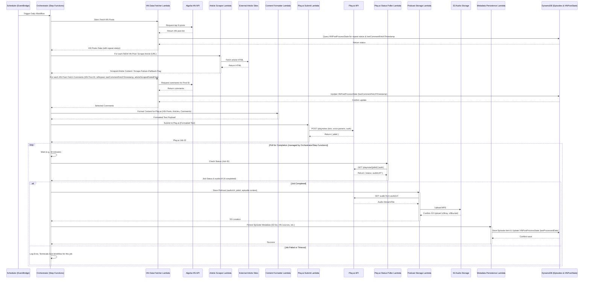
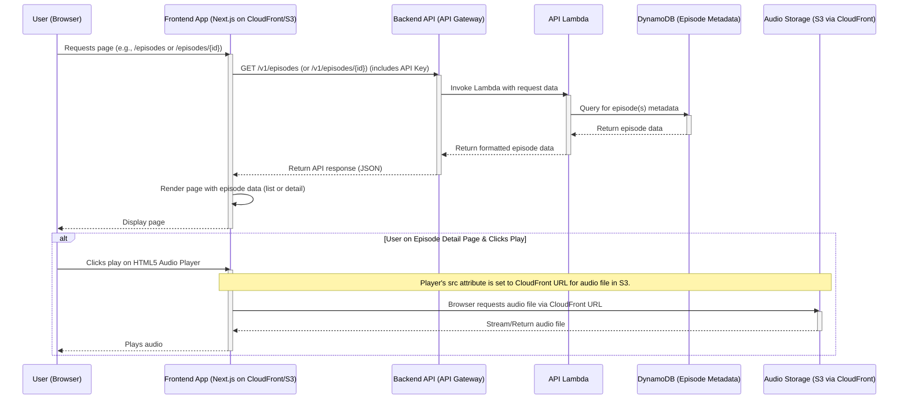

# BMad Daily Digest Architecture Document

**Version:** 0.1
**Date:** May 20, 2025
**Author:** Fred (Architect) & User

## Table of Contents

1.  Introduction / Preamble
2.  Technical Summary
3.  High-Level Overview
      * Backend Architectural Style
      * Frontend Architectural Style
      * Repository Structure
      * Primary Data Flow & User Interaction (Conceptual)
      * System Context Diagram (Conceptual)
4.  Architectural / Design Patterns Adopted
5.  Component View
      * Backend Components
      * Frontend Components
      * External Services
      * Component Interaction Diagram (Conceptual Backend Focus)
6.  Project Structure
      * Backend Repository (`bmad-daily-digest-backend`)
      * Frontend Repository (`bmad-daily-digest-frontend`)
      * Notes
7.  API Reference
      * External APIs Consumed
      * Internal APIs Provided
8.  Data Models
      * Core Application Entities / Domain Objects
      * API Payload Schemas (Internal API)
      * Database Schemas (AWS DynamoDB)
9.  Core Workflow / Sequence Diagrams
      * Daily Automated Podcast Generation Pipeline (Backend)
      * Frontend User Requesting and Playing an Episode
10. Definitive Tech Stack Selections
11. Infrastructure and Deployment Overview
12. Error Handling Strategy
13. Coding Standards (Backend: `bmad-daily-digest-backend`)
      * Detailed Language & Framework Conventions (TypeScript/Node.js - Backend Focus)
14. Overall Testing Strategy
15. Security Best Practices
16. Key Reference Documents
17. Change Log
18. Prompt for Design Architect (Jane) - To Produce Frontend Architecture Document

-----

## 1\. Introduction / Preamble

This document outlines the overall project architecture for "BMad Daily Digest," including backend systems, frontend deployment infrastructure, shared services considerations, and non-UI specific concerns. Its primary goal is to serve as the guiding architectural blueprint for AI-driven development and human developers, ensuring consistency and adherence to chosen patterns and technologies as defined in the Product Requirements Document (PRD v0.1) and UI/UX Specification (v0.1).

**Relationship to Frontend Architecture:**
The frontend application (Next.js) will have its own detailed frontend architecture considerations (component structure, state management, etc.) which will be detailed in a separate Frontend Architecture Document (to be created by the Design Architect, Jane, based on a prompt at the end of this document). This overall Architecture Document will define the backend services the frontend consumes, the infrastructure for hosting the frontend (S3/CloudFront), and ensure alignment on shared technology choices (like TypeScript) and API contracts. The "Definitive Tech Stack Selections" section herein is the single source of truth for all major technology choices across the project.

## 2\. Technical Summary

"BMad Daily Digest" is a serverless application designed to automatically produce a daily audio podcast summarizing top Hacker News posts. The backend, built with TypeScript on Node.js 22 and deployed as AWS Lambda functions, will fetch data from the Algolia HN API, scrape linked articles, process content, and use the Play.ai API for audio generation (with job status managed by AWS Step Functions polling). Podcast metadata will be stored in DynamoDB, and audio files in S3. All backend infrastructure will be managed via AWS CDK within its own repository.

The frontend will be a Next.js (React, TypeScript) application, styled with Tailwind CSS and shadcn/ui to an "80s retro CRT terminal" aesthetic, kickstarted by an AI UI generation tool. It will be a statically exported site hosted on AWS S3 and delivered globally via AWS CloudFront, with its infrastructure also managed by a separate AWS CDK application within its own repository. The frontend will consume data from the backend via an AWS API Gateway secured with API Keys. The entire system aims for cost-efficiency, leveraging AWS free-tier services where possible.

## 3\. High-Level Overview

The "BMad Daily Digest" system is architected as a decoupled, serverless application designed for automated daily content aggregation and audio generation, with a statically generated frontend for content consumption.

  * **Backend Architectural Style:** The backend employs a **serverless, event-driven architecture** leveraging AWS Lambda functions for discrete processing tasks. These tasks are orchestrated by AWS Step Functions to manage the daily content pipeline, including interactions with external services. An API layer is provided via AWS API Gateway for frontend consumption.
  * **Frontend Architectural Style:** The frontend is a **statically generated site (SSG)** built with Next.js. This approach maximizes performance, security, and cost-effectiveness by serving pre-built files from AWS S3 via CloudFront.
  * **Repository Structure:** The project utilizes a **polyrepo structure** with two primary repositories:
      * `bmad-daily-digest-backend`: Housing all backend TypeScript code, AWS CDK for backend infrastructure, Lambda functions, Step Function definitions, etc.
      * `bmad-daily-digest-frontend`: Housing the Next.js TypeScript application, UI components, styling, and its dedicated AWS CDK application for S3/CloudFront infrastructure.
  * **Primary Data Flow & User Interaction (Conceptual):**
    1.  **Daily Automated Pipeline (Backend):**
          * An Amazon EventBridge Scheduler rule triggers an AWS Step Function state machine daily.
          * The Step Function orchestrates a sequence of AWS Lambda functions to:
              * Fetch top posts and comments from the Algolia HN API (identifying repeats).
              * Scrape and extract content from linked external article URLs (for new posts or if scraping previously failed).
              * Aggregate and format the text content (handling new posts, updates, scrape failures, truncation).
              * Submit the formatted text to the Play.ai PlayNote API, receiving a `jobId`.
              * Poll the Play.ai API (using the `jobId`) for podcast generation status until completion or failure.
              * Upon completion, download the generated MP3 audio from Play.ai.
              * Store the MP3 file in a designated S3 bucket.
              * Store episode metadata (including the S3 audio link, source HN post details, etc.) in a DynamoDB table and update HN post processing states.
    2.  **User Consumption (Frontend):**
          * The user accesses the "BMad Daily Digest" Next.js web application served via AWS CloudFront from an S3 bucket.
          * The frontend application makes API calls (via `axios`) to an AWS API Gateway endpoint (secured with an API Key).
          * API Gateway routes these requests to specific AWS Lambda functions that query the DynamoDB table to retrieve episode lists and details.
          * The frontend renders the information and provides an HTML5 audio player to stream/play the MP3 from its S3/CloudFront URL.

**System Context Diagram (Conceptual):**

```mermaid
graph TD
    A[User] -->|Views & Interacts via Browser| B(Frontend Application\nNext.js on S3/CloudFront);
    B -->|Fetches Episode Data (HTTPS, API Key)| C(Backend API\nAPI Gateway + Lambda);
    C -->|Reads/Writes| D(Episode Metadata\nDynamoDB);
    B -->|Streams Audio| E(Podcast Audio Files\nS3 via CloudFront);

    F[Daily Scheduler\nEventBridge] -->|Triggers| G(Orchestration Service\nAWS Step Functions);
    G -->|Invokes| H(Data Collection Lambdas\n- Fetch HN via Algolia\n- Scrape Articles);
    H -->|Calls| I[Algolia HN API];
    H -->|Scrapes| J[External Article Websites];
    G -->|Invokes| K(Content Processing Lambda);
    G -->|Invokes| L(Play.ai Interaction Lambdas\n- Submit Job\n- Poll Status);
    L -->|Calls / Gets Status| M[Play.ai PlayNote API];
    G -->|Invokes| N(Storage Lambdas\n- Store Audio to S3\n- Store Metadata to DynamoDB);
    N -->|Writes| E;
    N -->|Writes| D;
    M -->|Returns Audio URL| L;
```

## 4\. Architectural / Design Patterns Adopted

The following key architectural and design patterns have been chosen for this project:

  * **Serverless Architecture:** Entire backend on AWS Lambda, API Gateway, S3, DynamoDB, Step Functions. Rationale: Minimized operations, auto-scaling, pay-per-use, cost-efficiency.
  * **Event-Driven Architecture:** Daily pipeline initiated by EventBridge Scheduler; Step Functions orchestrate based on state changes. Rationale: Decoupled components, reactive system for automation.
  * **Microservices-like Approach (Backend Lambda Functions):** Each Lambda handles a specific, well-defined task. Rationale: Modularity, independent scalability, easier testing/maintenance.
  * **Static Site Generation (SSG) for Frontend:** Next.js frontend exported as static files, hosted on S3/CloudFront. Rationale: Optimal performance, security, scalability, lower hosting costs.
  * **Infrastructure as Code (IaC):** AWS CDK in TypeScript for all AWS infrastructure in both repositories. Rationale: Repeatable, version-controlled, automated provisioning.
  * **Polling Pattern (External Job Status):** AWS Step Functions implement a polling loop for Play.ai job status. Rationale: Reliable tracking of asynchronous third-party jobs, based on Play.ai docs.
  * **Orchestration Pattern (AWS Step Functions):** End-to-end daily backend pipeline managed by a Step Functions state machine. Rationale: Robust workflow automation, state management, error handling for multi-step processes.

## 5\. Component View

The system is divided into distinct backend and frontend components.

**Backend Components (`bmad-daily-digest-backend` repository):**

1.  **Daily Workflow Orchestrator (AWS Step Functions state machine):** Manages the end-to-end daily pipeline.
2.  **HN Data Fetcher Service (AWS Lambda):** Fetches HN posts/comments (Algolia), identifies repeats (via DynamoDB).
3.  **Article Scraping Service (AWS Lambda):** Scrapes/extracts content from external article URLs, handles fallbacks.
4.  **Content Formatting Service (AWS Lambda):** Aggregates and formats text payload for Play.ai.
5.  **Play.ai Interaction Service (AWS Lambda functions, orchestrated by Polling Step Function):** Submits job to Play.ai, polls for status.
6.  **Podcast Storage Service (AWS Lambda):** Downloads audio from Play.ai, stores to S3.
7.  **Metadata Persistence Service (AWS Lambda & DynamoDB Tables):** Manages episode and HN post processing state metadata in DynamoDB.
8.  **Backend API Service (AWS API Gateway + AWS Lambda functions):** Exposes endpoints for frontend (episode lists/details).

**Frontend Components (`bmad-daily-digest-frontend` repository):**

1.  **Next.js Web Application (Static Site on S3/CloudFront):** Renders UI, handles navigation.
2.  **Frontend API Client Service (TypeScript module):** Encapsulates communication with the Backend API Service.

**External Services:** Algolia HN Search API, Play.ai PlayNote API, Various External Article Websites.

**Component Interaction Diagram (Conceptual Backend Focus):**

```mermaid
graph LR
    subgraph Frontend Application Space
        F_App[Next.js App on S3/CloudFront]
        F_APIClient[Frontend API Client]
        F_App --> F_APIClient
    end

    subgraph Backend API Space
        APIGW[API Gateway]
        API_L[Backend API Lambdas]
        APIGW --> API_L
    end

    subgraph Backend Daily Pipeline Space
        Scheduler[EventBridge Scheduler] --> Orchestrator[Step Functions Orchestrator]

        Orchestrator --> HNFetcher[HN Data Fetcher Lambda]
        HNFetcher -->|Reads/Writes Post Status| DDB
        HNFetcher --> Algolia[Algolia HN API]

        Orchestrator --> ArticleScraper[Article Scraper Lambda]
        ArticleScraper --> ExtWebsites[External Article Websites]

        Orchestrator --> ContentFormatter[Content Formatter Lambda]

        Orchestrator --> PlayAISubmit[Play.ai Submit Lambda]
        PlayAISubmit --> PlayAI_API[Play.ai PlayNote API]

        subgraph Polling_SF[Play.ai Polling (Step Functions)]
            direction LR
            PollTask[Poll Status Lambda] --> PlayAI_API
        end
        Orchestrator --> Polling_SF


        Orchestrator --> PodcastStorage[Podcast Storage Lambda]
        PodcastStorage --> PlayAI_API
        PodcastStorage --> S3Store[S3 Audio Storage]

        Orchestrator --> MetadataService[Metadata Persistence Lambda]
        MetadataService --> DDB[DynamoDB Episode/Post Metadata]
    end

    F_APIClient --> APIGW
    API_L --> DDB

    classDef external fill:#ddd,stroke:#333,stroke-width:2px;
    class Algolia,ExtWebsites,PlayAI_API external;
```

## 6\. Project Structure

The project utilizes a polyrepo structure with separate backend and frontend repositories, each with its own CDK application.

**1. Backend Repository (`bmad-daily-digest-backend`)**
Organized by features within `src/`, using `dash-case` for folders and files (e.g., `src/features/content-ingestion/hn-fetcher-service.ts`).

```plaintext
bmad-daily-digest-backend/
├── .github/
├── cdk/
│   ├── bin/
│   ├── lib/ # Backend Stack, Step Function definitions
│   └── test/
├── src/
│   ├── features/
│   │   ├── dailyJobOrchestrator/ # Main Step Function trigger/definition support
│   │   ├── hnContentPipeline/    # Services for Algolia, scraping, formatting
│   │   ├── playAiIntegration/    # Services for Play.ai submit & polling Lambda logic
│   │   ├── podcastPersistence/   # Services for S3 & DynamoDB storage
│   │   └── publicApi/            # Handlers for API Gateway (status, episodes)
│   ├── shared/
│   │   ├── utils/
│   │   ├── types/
│   │   └── services/ # Optional shared low-level AWS SDK wrappers
├── tests/ # Unit/Integration tests, mirroring src/features/
│   └── features/
... (root config files: .env.example, .eslintrc.js, .gitignore, .prettierrc.js, jest.config.js, package.json, README.md, tsconfig.json)
```

*Key Directories: `cdk/` for IaC, `src/features/` for modular backend logic, `src/shared/` for reusable code, `tests/` for Jest tests.*

**2. Frontend Repository (`bmad-daily-digest-frontend`)**
Aligns with V0.dev generated Next.js App Router structure, using `dash-case` for custom files/folders where applicable.

```plaintext
bmad-daily-digest-frontend/
├── .github/
├── app/
│   ├── (pages)/
│   │   ├── episodes/
│   │   │   ├── page.tsx          # List page
│   │   │   └── [episode-id]/
│   │   │       └── page.tsx      # Detail page
│   │   └── about/
│   │       └── page.tsx
│   ├── layout.tsx
│   └── globals.css
├── components/
│   ├── ui/                     # shadcn/ui based components
│   └── domain/                 # Custom composite components (e.g., episode-card)
├── cdk/                        # AWS CDK application for frontend infra (S3, CloudFront)
│   ├── bin/
│   └── lib/
├── hooks/
├── lib/
│   ├── types.ts
│   ├── utils.ts
│   └── api-client.ts           # Backend API communication
├── public/
├── tests/ # Jest & RTL tests
... (root config files: .env.local.example, .eslintrc.js, components.json, next.config.mjs, package.json, tailwind.config.ts, tsconfig.json)
```

*Key Directories: `app/` for Next.js routes, `components/` for UI, `cdk/` for frontend IaC, `lib/` for utilities and `api-client.ts`.*

## 7\. API Reference

### External APIs Consumed

**1. Algolia Hacker News Search API**

  * **Base URL:** `http://hn.algolia.com/api/v1/`
  * **Authentication:** None.
  * **Endpoints Used:**
      * `GET /search_by_date?tags=story&hitsPerPage={N}` (For top posts)
      * `GET /items/{POST_ID}` (For comments/post details)
  * **Key Data Extracted:** Post title, article URL, HN link, HN Post ID, author, points, creation timestamp; Comment text, author, creation timestamp.

**2. Play.ai PlayNote API**

  * **Base URL:** `https://api.play.ai/api/v1/`
  * **Authentication:** Headers: `Authorization: Bearer <PLAY_AI_BEARER_TOKEN>`, `X-USER-ID: <PLAY_AI_USER_ID>`.
  * **Endpoints Used:**
      * `POST /playnotes` (Submit job)
          * Request: `application/json` with `sourceText`, `title`, voice params (from env vars: `PLAY_AI_VOICE1_ID`, `PLAY_AI_VOICE1_NAME`, `PLAY_AI_VOICE2_ID`, `PLAY_AI_VOICE2_NAME`), style (`PLAY_AI_STYLE`).
          * Response: JSON with `jobId`.
      * `GET /playnote/{jobId}` (Poll status)
          * Response: JSON with `status`, `audioUrl` (if completed).

### Internal APIs Provided (by backend for frontend)

  * **Base URL Path Prefix:** `/v1` (Full URL from `NEXT_PUBLIC_BACKEND_API_URL`).
  * **Authentication:** Requires "Frontend Read API Key" via `x-api-key` header for GET endpoints. A separate "Admin Action API Key" for trigger endpoint.
  * **Endpoints:**
      * **`GET /status`**: Health/status check. Response: `{"message": "BMad Daily Digest Backend is operational.", "timestamp": "..."}`.
      * **`GET /episodes`**: Lists episodes. Response: `{ "episodes": [EpisodeListItem, ...] }`.
      * **`GET /episodes/{episodeId}`**: Episode details. Response: `EpisodeDetail` object.
      * **`POST /jobs/daily-digest/trigger`**: (Admin Key) Triggers daily pipeline. Response: `{"message": "...", "executionArn": "..."}`.
  * **Common Errors:** 401 Unauthorized, 404 Not Found, 500 Internal Server Error.

## 8\. Data Models

### Core Application Entities

**a. Episode**

  * Attributes: `episodeId` (PK, UUID), `publicationDate` (YYYY-MM-DD), `episodeNumber` (Number), `podcastGeneratedTitle` (String), `audioS3Bucket` (String), `audioS3Key` (String), `audioUrl` (String, derived for API), `playAiJobId` (String), `playAiSourceAudioUrl` (String), `sourceHNPosts` (List of `SourceHNPost`), `status` (String: "PROCESSING", "PUBLISHED", "FAILED"), `createdAt` (ISO Timestamp), `updatedAt` (ISO Timestamp).

**b. SourceHNPost (object within `Episode.sourceHNPosts`)**

  * Attributes: `hnPostId` (String), `title` (String), `originalArticleUrl` (String), `hnLink` (String), `isUpdateStatus` (Boolean), `oldRank` (Number, Optional), `lastCommentFetchTimestamp` (Number, Unix Timestamp), `articleScrapingFailed` (Boolean), `articleTitleFromScrape` (String, Optional).

**c. HackerNewsPostProcessState (DynamoDB Table)**

  * Attributes: `hnPostId` (PK, String), `originalArticleUrl` (String), `articleTitleFromScrape` (String, Optional), `lastSuccessfullyScrapedTimestamp` (Number, Optional), `lastCommentFetchTimestamp` (Number, Optional), `firstProcessedDate` (YYYY-MM-DD), `lastProcessedDate` (YYYY-MM-DD), `lastKnownRank` (Number, Optional).

### API Payload Schemas (Internal API)

**a. `EpisodeListItem` (for `GET /episodes`)**

  * `episodeId`, `publicationDate`, `episodeNumber`, `podcastGeneratedTitle`.

**b. `EpisodeDetail` (for `GET /episodes/{episodeId}`)**

  * `episodeId`, `publicationDate`, `episodeNumber`, `podcastGeneratedTitle`, `audioUrl`, `sourceHNPosts` (list of `SourceHNPostDetail` containing `hnPostId`, `title`, `originalArticleUrl`, `hnLink`, `isUpdateStatus`, `oldRank`), `playAiJobId` (optional), `playAiSourceAudioUrl` (optional), `createdAt`.

### Database Schemas (AWS DynamoDB)

**a. `BmadDailyDigestEpisodes` Table**

  * PK: `episodeId` (String).
  * Attributes: As per `Episode` entity.
  * GSI Example (`PublicationDateIndex`): PK: `status`, SK: `publicationDate`.
  * Billing: PAY\_PER\_REQUEST.

**b. `HackerNewsPostProcessState` Table**

  * PK: `hnPostId` (String).
  * Attributes: As per `HackerNewsPostProcessState` entity.
  * Billing: PAY\_PER\_REQUEST.

## 9\. Core Workflow / Sequence Diagrams

### 1\. Daily Automated Podcast Generation Pipeline (Backend)

*(Mermaid diagram as previously shown, detailing EventBridge -\> Step Functions -\> Lambdas -\> Algolia/External Sites/Play.ai -\> S3/DynamoDB).*



### 2\. Frontend User Requesting and Playing an Episode

*(Mermaid diagram as previously shown, detailing User -\> Next.js App -\> API Gateway/Lambda -\> DynamoDB, and User -\> Next.js App -\> S3/CloudFront for audio).*



## 10\. Definitive Tech Stack Selections

| Category             | Technology                     | Version / Details                      | Description / Purpose                                                                 | Justification (Optional)                                                                 |
| :------------------- | :----------------------------- | :------------------------------------- | :------------------------------------------------------------------------------------ | :--------------------------------------------------------------------------------------- |
| **Languages** | TypeScript                     | Latest stable (e.g., 5.x)              | Primary language for backend and frontend.                                            | Consistency, strong typing.                                                              |
| **Runtime** | Node.js                        | 22.x                                   | Server-side environment for backend & Next.js.                                        | User preference, performance.                                                            |
| **Frameworks (Frontend)** | Next.js (with React)           | Latest stable (e.g., 14.x)             | Frontend web application framework.                                                   | User preference, SSG, DX.                                                                |
| **Frameworks (Backend)** | AWS Lambda (Node.js runtime)   | N/A                                    | Execution environment for serverless functions.                                       | Serverless architecture.                                                                 |
|                      | AWS Step Functions             | N/A                                    | Orchestration of backend workflows.                                                   | Robust state management, retries.                                                        |
| **Databases** | AWS DynamoDB                   | N/A                                    | NoSQL database for metadata.                                                          | Scalability, serverless, free-tier.                                                      |
| **Cloud Platform** | AWS                            | N/A                                    | Primary cloud provider.                                                               | Comprehensive services, serverless.                                                      |
| **Cloud Services** | AWS Lambda, API Gateway, S3, CloudFront, EventBridge Scheduler, CloudWatch, IAM, ACM | N/A                                    | Core services for application hosting and operation.                                  | Standard AWS serverless stack.                                                           |
| **Infrastructure as Code (IaC)** | AWS CDK (TypeScript)           | v2.x Latest stable                   | Defining cloud infrastructure.                                                        | User preference, TypeScript, repeatability.                                              |
| **UI Libraries (Frontend)** | Tailwind CSS                 | Latest stable (e.g., 3.x)              | Utility-first CSS framework.                                                          | User preference, customization.                                                          |
|                      | shadcn/ui                      | Latest stable                          | Accessible UI components.                                                             | User preference, base for themed components.                                             |
| **HTTP Client (Backend)** | axios                          | Latest stable                          | Making HTTP requests from backend.                                                    | User preference, feature-rich.                                                           |
| **SDKs / Core Libraries (Backend)** | AWS SDK for JavaScript/TypeScript | v3.x (Latest stable)                 | Programmatic interaction with AWS services.                                           | Official AWS SDK, modular.                                                               |
| **Scraping / Content Extraction** | Cheerio                        | Latest stable                          | Server-side HTML parsing.                                                             | Efficient for static HTML.                                                               |
|                      | @mozilla/readability (JS port) | Latest stable                          | Extracting primary readable article content.                                          | Key for isolating main content.                                                          |
|                      | Playwright (or Puppeteer)      | Latest stable                          | Browser automation (if required for dynamic content).                                 | Handles dynamic sites; use judiciously.                                                  |
| **Bundling (Backend)**| esbuild                        | Latest stable                          | Bundling TypeScript Lambda functions.                                                 | User preference, speed.                                                                  |
| **Logging (Backend)** | Pino                           | Latest stable                          | Structured, low-overhead logging.                                                     | Better observability, JSON logs for CloudWatch.                                          |
| **Testing (Backend)**| Jest, ESLint, Prettier         | Latest stable                          | Unit/integration testing, linting, formatting.                                        | Code quality, consistency.                                                               |
| **Testing (Frontend)**| Jest, React Testing Library, ESLint, Prettier | Latest stable                          | Unit/component testing, linting, formatting.                                          | Code quality, consistency.                                                               |
| **CI/CD** | GitHub Actions                 | N/A                                    | Automation of build, test, quality checks.                                            | Integration with GitHub.                                                                 |
| **External APIs** | Algolia HN Search API, Play.ai PlayNote API | v1 (for both)                        | Data sources and audio generation.                                                    | Core to product functionality.                                                           |
*Note: "Latest stable" versions should be pinned to specific versions in `package.json` files during development.*

## 11\. Infrastructure and Deployment Overview

  * **Cloud Provider:** AWS.
  * **Core Services Used:** Lambda, API Gateway (HTTP API), S3, DynamoDB (On-Demand), Step Functions, EventBridge Scheduler, CloudFront, CloudWatch, IAM, ACM (if custom domain).
  * **IaC:** AWS CDK (TypeScript), with separate CDK apps in backend and frontend polyrepos.
  * **Deployment Strategy (MVP):** CI (GitHub Actions) for build/test/lint. CDK deployment (initially manual or CI-scripted) to a single AWS environment.
  * **Environments (MVP):** Local Development; Single Deployed MVP Environment (e.g., "dev" acting as initial production).
  * **Rollback Strategy (MVP):** CDK stack rollback, Lambda/S3 versioning, DynamoDB PITR.

## 12\. Error Handling Strategy

  * **General Approach:** Custom `Error` classes hierarchy. Promises reject with `Error` objects.
  * **Logging:** Pino for structured JSON logs to CloudWatch. Standard levels (DEBUG, INFO, WARN, ERROR, CRITICAL). Contextual info (AWS Request ID, business IDs). No sensitive data in logs.
  * **Specific Patterns:**
      * **External API Calls (`axios`):** Timeouts, retries (e.g., `axios-retry`), wrap errors in custom types.
      * **Internal Errors:** Custom error types, detailed server-side logging.
      * **API Gateway Responses:** Translate internal errors to appropriate HTTP errors (4xx, 500) with generic client messages.
      * **Workflow (Step Functions):** Error handling, retries, catch blocks for states. Failed executions logged.
      * **Data Consistency:** Lambdas handle partial failures gracefully. Step Functions manage overall workflow state.

## 13\. Coding Standards (Backend: `bmad-daily-digest-backend`)

**Scope:** Applies to `bmad-daily-digest-backend`. Frontend standards are separate.

  * **Primary Language:** TypeScript (Node.js 22).
  * **Style:** ESLint, Prettier.
  * **Naming:** Variables/Functions: `camelCase`. Constants: `UPPER_SNAKE_CASE`. Classes/Interfaces/Types/Enums: `PascalCase`. Files/Folders: `dash-case` (e.g., `episode-service.ts`, `content-ingestion/`).
  * **Structure:** Feature-based (`src/features/feature-name/`).
  * **Tests:** Unit/integration tests co-located (`*.test.ts`). E2E tests (if any for backend API) in root `tests/e2e/`.
  * **Async:** `async`/`await` for Promises.
  * **Types:** `strict: true`. No `any` without justification. JSDoc for exported items. Inline comments for clarity.
  * **Dependencies:** `npm` with `package-lock.json`. Pin versions or use tilde (`~`).
  * **Detailed Conventions:** Immutability preferred. Functional constructs for stateless logic, classes for stateful services/entities. Custom errors. Strict null checks. ESModules. Pino for logging (structured JSON, levels, context, no secrets). Lambda best practices (lean handlers, env vars, optimize size). `axios` with timeouts. AWS SDK v3 modular imports. Avoid common anti-patterns (deep nesting, large functions, `@ts-ignore`, hardcoded secrets, unhandled promises).

## 14\. Overall Testing Strategy

  * **Tools:** Jest, React Testing Library (frontend), ESLint, Prettier, GitHub Actions.
  * **Unit Tests:** Isolate functions/methods/components. Mock dependencies. Co-located. Developer responsibility.
  * **Integration Tests (Backend/Frontend):** Test interactions between internal components with external systems mocked (AWS SDK clients, third-party APIs).
  * **End-to-End (E2E) Tests (MVP):**
      * Backend API: Automated test for "Hello World"/status. Test daily job trigger verifies DDB/S3 output.
      * Frontend UI: Key user flows tested manually for MVP. (Playwright deferred to post-MVP).
  * **Coverage:** Guideline \>80% unit test coverage for critical logic. Quality over quantity. Measured by Jest.
  * **Mocking:** Jest's built-in system. `axios-mock-adapter` if needed.
  * **Test Data:** Inline mocks or small fixtures for unit/integration.

## 15\. Security Best Practices

  * **Input Validation:** API Gateway basic validation; Zod for detailed payload validation in Lambdas.
  * **Output Encoding:** Next.js/React handles XSS for frontend rendering. Backend API is JSON.
  * **Secrets Management:** Lambda environment variables via CDK (from local gitignored `.env` for MVP setup). No hardcoding. Pino redaction for logs if needed.
  * **Dependency Security:** `npm audit` in CI. Promptly address high/critical vulnerabilities.
  * **Authentication/Authorization:** API Gateway API Keys (Frontend Read Key, Admin Action Key). IAM roles with least privilege for service-to-service.
  * **Principle of Least Privilege (IAM):** Minimal permissions for all IAM roles (Lambdas, Step Functions, CDK).
  * **API Security:** HTTPS enforced by API Gateway/CloudFront. Basic rate limiting on API Gateway. Frontend uses HTTP security headers (via CloudFront/Next.js).
  * **Error Disclosure:** Generic errors to client, detailed logs server-side.
  * **Infrastructure Security:** S3 bucket access restricted (CloudFront OAC/OAI).
  * **Post-MVP:** Consider SAST/DAST, penetration testing.
  * **Adherence:** AWS Well-Architected Framework - Security Pillar.

## 16\. Key Reference Documents

1.  **Product Requirements Document (PRD) - BMad Daily Digest** (Version: 0.1)
2.  **UI/UX Specification - BMad Daily Digest** (Version: 0.1)
3.  **Algolia Hacker News Search API Documentation** (`https://hn.algolia.com/api`)
4.  **Play.ai PlayNote API Documentation** (`https://docs.play.ai/api-reference/playnote/post`)

## 17\. Change Log

| Version | Date         | Author                   | Summary of Changes                                                                                                |
| :------ | :----------- | :----------------------- | :---------------------------------------------------------------------------------------------------------------- |
| 0.1     | May 20, 2025 | Fred (Architect) & User  | Initial draft of the Architecture Document based on PRD v0.1 and UI/UX Spec v0.1.                                  |
