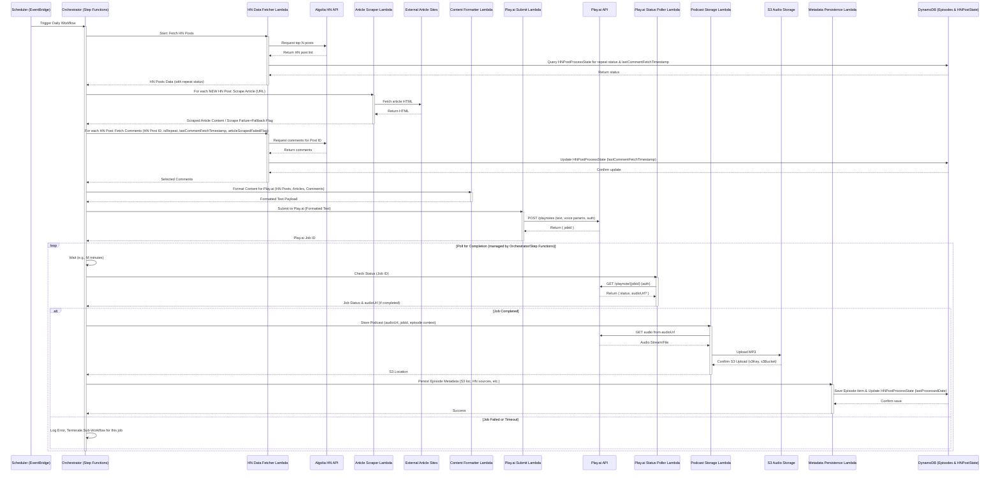
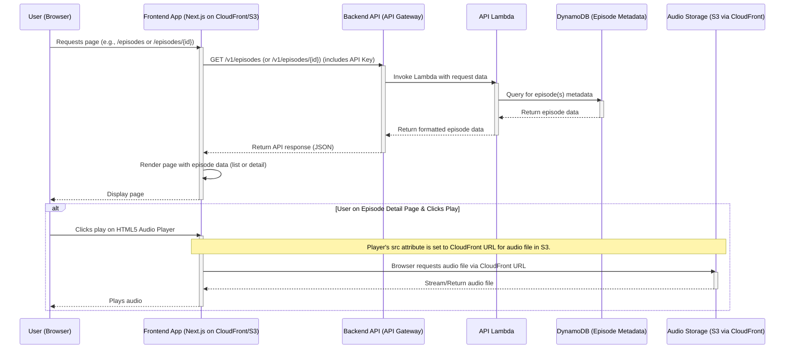

# Core Workflow / Sequence Diagrams

## 1. Daily Automated Podcast Generation Pipeline (Backend)

```mermaid
sequenceDiagram
    participant Sched as Scheduler (EventBridge)
    participant Orch as Orchestrator (Step Functions)
    participant HNF as HN Data Fetcher Lambda
    participant Algolia as Algolia HN API
    participant ASL as Article Scraper Lambda
    participant EAS as External Article Sites
    participant CFL as Content Formatter Lambda
    participant PSubL as Play.ai Submit Lambda
    participant PlayAI as Play.ai API
    participant PStatL as Play.ai Status Poller Lambda
    participant PSL as Podcast Storage Lambda
    participant S3 as S3 Audio Storage
    participant MPL as Metadata Persistence Lambda
    participant DDB as DynamoDB (Episodes & HNPostState)

    Sched->>Orch: Trigger Daily Workflow
    activate Orch
    Orch->>HNF: Start: Fetch HN Posts
    activate HNF
    HNF->>Algolia: Request top N posts
    Algolia-->>HNF: Return HN post list
    HNF->>DDB: Query HNPostProcessState for repeat status & lastCommentFetchTimestamp
    DDB-->>HNF: Return status
    HNF-->>Orch: HN Posts Data (with repeat status)
    deactivate HNF
    Orch->>ASL: For each NEW HN Post: Scrape Article (URL)
    activate ASL
    ASL->>EAS: Fetch article HTML
    EAS-->>ASL: Return HTML
    ASL-->>Orch: Scraped Article Content / Scrape Failure+Fallback Flag
    deactivate ASL
    Orch->>HNF: For each HN Post: Fetch Comments (HN Post ID, isRepeat, lastCommentFetchTimestamp, articleScrapedFailedFlag)
    activate HNF
    HNF->>Algolia: Request comments for Post ID
    Algolia-->>HNF: Return comments
    HNF->>DDB: Update HNPostProcessState (lastCommentFetchTimestamp)
    DDB-->>HNF: Confirm update
    HNF-->>Orch: Selected Comments
    deactivate HNF
    Orch->>CFL: Format Content for Play.ai (HN Posts, Articles, Comments)
    activate CFL
    CFL-->>Orch: Formatted Text Payload
    deactivate CFL
    Orch->>PSubL: Submit to Play.ai (Formatted Text)
    activate PSubL
    PSubL->>PlayAI: POST /playnotes (text, voice params, auth)
    PlayAI-->>PSubL: Return { jobId }
    PSubL-->>Orch: Play.ai Job ID
    deactivate PSubL
    loop Poll for Completion (managed by Orchestrator/Step Functions)
        Orch->>Orch: Wait (e.g., M minutes)
        Orch->>PStatL: Check Status (Job ID)
        activate PStatL
        PStatL->>PlayAI: GET /playnote/{jobId} (auth)
        PlayAI-->>PStatL: Return { status, audioUrl? }
        PStatL-->>Orch: Job Status & audioUrl (if completed)
        deactivate PStatL
        alt Job Completed
            Orch->>PSL: Store Podcast (audioUrl, jobId, episode context)
            activate PSL
            PSL->>PlayAI: GET audio from audioUrl
            PlayAI-->>PSL: Audio Stream/File
            PSL->>S3: Upload MP3
            S3-->>PSL: Confirm S3 Upload (s3Key, s3Bucket)
            PSL-->>Orch: S3 Location
            deactivate PSL
            Orch->>MPL: Persist Episode Metadata (S3 loc, HN sources, etc.)
            activate MPL
            MPL->>DDB: Save Episode Item & Update HNPostProcessState (lastProcessedDate)
            DDB-->>MPL: Confirm save
            MPL-->>Orch: Success
            deactivate MPL
        else Job Failed or Timeout
            Orch->>Orch: Log Error, Terminate Sub-Workflow for this job
        end
    end
    deactivate Orch
```

## 2. Frontend User Requesting and Playing an Episode

```mermaid
sequenceDiagram
    participant User as User (Browser)
    participant FE_App as Frontend App (Next.js on CloudFront/S3)
    participant BE_API as Backend API (API Gateway)
    participant API_L as API Lambda
    participant DDB as DynamoDB (Episode Metadata)
    participant Audio_S3 as Audio Storage (S3 via CloudFront)

    User->>FE_App: Requests page (e.g., /episodes or /episodes/{id})
    activate FE_App
    FE_App->>BE_API: GET /v1/episodes (or /v1/episodes/{id}) (includes API Key)
    activate BE_API
    BE_API->>API_L: Invoke Lambda with request data
    activate API_L
    API_L->>DDB: Query for episode(s) metadata
    activate DDB
    DDB-->>API_L: Return episode data
    deactivate DDB
    API_L-->>BE_API: Return formatted episode data
    deactivate API_L
    BE_API-->>FE_App: Return API response (JSON)
    deactivate BE_API
    FE_App->>FE_App: Render page with episode data (list or detail)
    FE_App-->>User: Display page
    deactivate FE_App

    alt User on Episode Detail Page & Clicks Play
        User->>FE_App: Clicks play on HTML5 Audio Player
        activate FE_App
        Note over FE_App, Audio_S3: Player's src attribute is set to CloudFront URL for audio file in S3.
        FE_App->>Audio_S3: Browser requests audio file via CloudFront URL
        activate Audio_S3
        Audio_S3-->>FE_App: Stream/Return audio file
        deactivate Audio_S3
        FE_App-->>User: Plays audio
        deactivate FE_App
    end
``` 