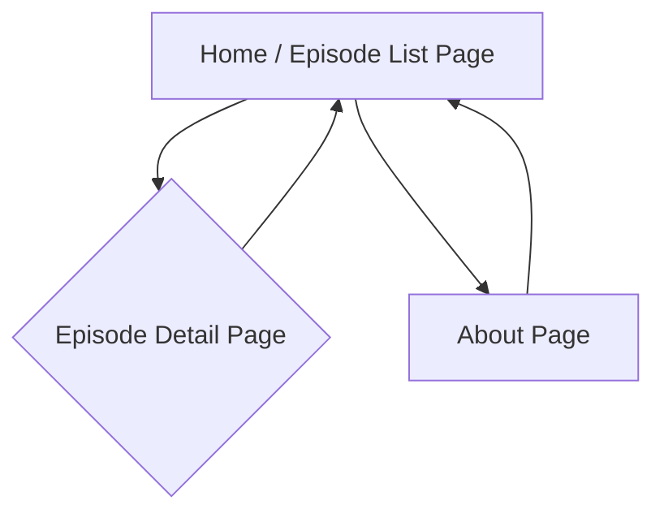

# BMad Daily Digest UI/UX Specification

**Version:** 0.1
**Date:** May 20, 2025
**Author:** JaneAI

## 1\. Introduction

This document defines the user experience (UX) goals, information architecture (IA), user flows, and key visual/interaction specifications for the "BMad Daily Digest" web application's MVP. It builds upon the product vision and requirements outlined in the main PRD and will serve as a direct guide for frontend development. Our core aesthetic is an "80s retro CRT terminal" look and feel.

  * **Primary Design Files:** For the MVP, detailed visual mockups in separate design files (e.g., Figma) are not planned. The UI design will be directly derived from the specifications within this document, the "User Interaction and Design Goals" section of the PRD, and the established "80s retro CRT terminal" theme using Tailwind CSS and shadcn/ui.
  * **Deployed Storybook / Design System:** A Storybook or formal design system is not an initial deliverable for the MVP. Components will be built and styled directly within the Next.js application using shadcn/ui and Tailwind CSS according to the defined aesthetic. This may evolve post-MVP.

## 2\. Overall UX Goals & Principles

This section draws from the "Target Audience / Users" and "User Interaction and Design Goals" defined in the PRD.

**a. Target User Personas:**

  * **Primary Persona:** The "Busy Tech Executive."
      * **Description (from PRD):** Extremely time-poor individuals (e.g., VPs, Directors, C-suite in technology companies) with demanding schedules.
      * **Needs & Motivations:**
          * Need to stay informed about technology trends, competitor moves, and industry sentiment for strategic decision-making.
          * Value high-signal, concise, and curated information.
          * Familiar with Hacker News but lack the time for in-depth daily reading.
          * Likely consume content during commutes, short breaks, or while multitasking, making audio a good fit.
      * **Key UX Considerations for this Persona:** The interface must be extremely efficient, quick to scan, with no learning curve and immediate access to content.

**b. Usability Goals (for MVP):**

  * **Efficiency:** Users must be able to find and start listening to the latest digest with minimal clicks and time.
  * **Clarity:** Information (episode lists, story links, player controls) must be presented clearly and unambiguously, especially given the stylized "CRT terminal" theme which requires careful attention to readability.
  * **Discoverability:** Users should easily understand how to navigate between the episode list and detail pages, and how to access source articles/HN discussions.
  * **Learnability:** The interface should be immediately intuitive, requiring no explanation for these tech-savvy users.

**c. Design Principles:**

1.  **Content First, Efficiency Always:** Prioritize quick access to the audio digest and associated information. Every UI element should serve a clear purpose towards this goal, minimizing clutter.
2.  **Authentic Retro Tech Aesthetic:** Consistently apply the "80s retro CRT terminal" theme (dark mode, glowing green ASCII-style visuals) to create a unique and engaging experience, without sacrificing usability.
3.  **Simplicity & Focus:** Keep the UI for the MVP focused on core tasks: finding an episode, playing it, and accessing source links. Avoid non-essential features or complex interactions.
4.  **Readability within Theme:** While maintaining the retro aesthetic, ensure text is highly readable with sufficient contrast and appropriate "ASCII/bitmap-style" font choices (if used).
5.  **Responsive & Accessible Foundation:** Design for responsiveness across desktop and mobile from the start, and ensure basic accessibility principles are met within the chosen theme.

## 3\. Information Architecture (IA)

This section outlines the overall organization and structure of the web application's content and features for the MVP.

**a. Site Map / Screen Inventory (MVP):**
For the MVP, we have identified the following core screens:



  * **Home / Episode List Page (`/` or `/episodes`):** The main landing page, displaying a reverse chronological list of daily podcast episodes.
  * **Episode Detail Page (`/episodes/{episodeId}`):** Displays the selected podcast episode, including the audio player, and links to source articles and Hacker News discussions.
  * **About Page (`/about`):** Provides information about the "BMad Daily Digest" service.

**b. Navigation Structure (MVP):**

  * **Primary Navigation:**
      * A simple, persistent header or footer navigation element should be present across all pages.
      * This navigation **must** include clear links to:
          * "Home" (or "Episodes" leading to the Episode List Page).
          * "About" (leading to the About Page).
      * The site title/logo (e.g., "BMad Daily Digest") in the header **should** also link to the Home/Episode List Page.
  * **Content-Specific Navigation:**
      * On the **Episode List Page**, each listed episode **must** function as a direct link to its respective **Episode Detail Page**.
      * The **Episode Detail Page** will contain external links to source articles and Hacker News discussions, which **must** open in new browser tabs.
  * **Theme Considerations:** All navigation elements (links, buttons if any) must conform to the "80s retro CRT terminal" aesthetic (e.g., styled as glowing text links).

## 4\. User Flows

This section details the primary paths users will take to interact with the "BMad Daily Digest" MVP.

### a. User Flow 1: Consuming the Latest Digest

  * **Goal:** The user wants to quickly find and listen to the most recent daily digest.

  * **Steps / Diagram:**

    ```mermaid
    graph TD
        A[User lands on Home/Episode List Page] --> B[Sees list of episodes, newest first];
        B --> C[Clicks on the latest/topmost episode];
        C --> D[Navigates to Episode Detail Page for that episode];
        D --> E[Presses play on embedded audio player];
        E --> F[Listens to podcast];
        D --> G{Chooses to explore?};
        G -- Yes --> H[Clicks a source article or HN discussion link];
        H --> I[Link opens in new tab];
        G -- No --> F;
    ```

### b. User Flow 2: Accessing an Older Digest

  * **Goal:** The user wants to find and listen to a specific past episode.

  * **Steps / Diagram:**

    ```mermaid
    graph TD
        A[User lands on Home/Episode List Page] --> B[Scrolls/browses the list of episodes];
        B --> C[Identifies and clicks on a desired older episode];
        C --> D[Navigates to Episode Detail Page for that episode];
        D --> E[Presses play on embedded audio player];
        E --> F[Listens to podcast];
    ```

### c. User Flow 3: Learning About the Service

  * **Goal:** The user wants to understand what "BMad Daily Digest" is.

  * **Steps / Diagram:**

    ```mermaid
    graph TD
        A[User is on any page of the application] --> B[Locates and clicks the "About" link in site navigation/footer];
        B --> C[Navigates to the About Page];
        C --> D[Reads information about the service];
    ```

## 5\. Wireframes & Mockups

As established in the Introduction, for this streamlined MVP, detailed visual mockup files (e.g., in Figma) are not planned. The UI design and layout will be directly derived from the specifications within this document, the agreed-upon "80s retro CRT terminal" aesthetic, and will be kickstarted using an AI UI generation tool with Tailwind CSS and shadcn/ui.

This section provides high-level conceptual descriptions of the key screen layouts to guide that process.

**a. General Layout Principles:**

  * **Theme:** All screens must consistently implement the "80s retro CRT terminal" aesthetic (dark mode, glowing green ASCII-style text/elements, potentially a subtle scanline effect or CRT curvature if achievable without sacrificing readability).
  * **Typography:** Font choices should align with retro computing/ASCII art styles while ensuring high readability (specific fonts TBD, but likely monospaced or pixel-style for key elements).
  * **Navigation:** A persistent, simple navigation area (e.g., a header or footer) will provide access to "Home/Episodes" and "About."

**b. Screen Layout Descriptions (Conceptual):**

**1. Home / Episode List Page (`/` or `/episodes`)**
\* **Header:**
\* Site Title/Logo (e.g., "BMad Daily Digest" styled in the retro theme). Clicking this navigates to this page.
\* Navigation Links: "Episodes" (if not the home page itself), "About."
\* **Main Content Area:**
\* A clear heading like "Latest Digests" or "Episodes."
\* A vertically stacked list of episodes, presented in reverse chronological order.
\* Each list item will display: "Episode [EpisodeNumber]: [PublicationDate] - [PodcastTitle]" as a clickable link/element.
\* If no episodes are available, a clear message like "No digests available yet. Tune in tomorrow\!" styled to fit the theme.
\* Loading/error states will be displayed in this area as needed.
\* **Footer (Optional):**
\* Could repeat navigation links or contain a simple copyright/year.

**2. Episode Detail Page (`/episodes/{episodeId}`)**
\* **Header:** Consistent with the List Page.
\* **Main Content Area:**
\* Episode Identification: Display `PodcastGeneratedTitle`, `EpisodeNumber`, and `PublicationDate` prominently.
\* **Audio Player:** An embedded HTML5 `<audio controls>` element, styled to fit the retro theme as much as possible. The `src` will be the podcast audio file.
\* **Hacker News Stories Section:**
\* A clear sub-heading like "Stories Covered in this Digest" or "Sources."
\* A list of the individual Hacker News stories included in the podcast.
\* For each story:
\* Its title.
\* A link to the "Original Article" (opens in new tab).
\* A link to the "HN Discussion" (opens in new tab).
\* These links should be clearly styled and distinguishable.
\* Loading/error states for episode data will be displayed here.
\* **Footer (Optional):** Consistent with the List Page.

**3. About Page (`/about`)**
\* **Header:** Consistent with other pages.
\* **Main Content Area:**
\* A clear heading like "About BMad Daily Digest."
\* Static text content (Placeholder: "BMad Daily Digest provides a daily audio summary of top Hacker News discussions for busy tech professionals, generated using AI.") explaining the service, its purpose, and a high-level overview of how it's generated. The text itself should be styled in the retro theme.
\* **Footer (Optional):** Consistent with other pages.

## 6\. Component Library / Design System Reference

For the "BMad Daily Digest" MVP, we will proceed as follows:

  * **Foundation:** We will **not** be using a pre-existing external, comprehensive design system. Instead, we will be creating a unique, project-specific set of themed UI components.
  * **Core Technologies:**
      * **shadcn/ui:** This will be used as a base library of accessible and unstyled components. We will heavily customize these components.
      * **Tailwind CSS:** This will be the primary utility-first CSS framework used for styling all components and achieving the "80s retro CRT terminal" aesthetic.
  * **AI-Assisted Kickstart:** As per Story 3.1 in the PRD, an AI UI generation tool will be leveraged to kickstart the initial UI structure and some of the core presentational components. These AI-generated components will then be refined and extended.
  * **No Formal Storybook for MVP:** A deployed Storybook or formal, isolated design system documentation is not a deliverable for the initial MVP. Components will be developed and documented within the Next.js application structure.

**Foundational Components to Thematically Style for MVP:**

The following foundational elements will need careful thematic styling to establish the "80s retro CRT terminal" look and feel:

1.  **Text Rendering Components:** Headings, Body Text/Paragraphs, Links (all styled with glowing green ASCII/pixelated look).
2.  **Layout Components:** Main Page Wrapper/Container, Header/Navigation Bar, Footer (if any).
3.  **List Components:** Episode List Item, Source Story List Item.
4.  **Interactive Elements:** Clickable Links/Navigation Items, Audio Player Container (styling around the native player).
5.  **Messaging/Feedback Components:** Loading State Indicator, Error Message Display (themed).

## 7\. Branding & Style Guide Reference

This section outlines the core visual elements for the "80s retro CRT terminal" and "80s retro everything" themes.

**a. Color Palette:**

  * **Primary Background:** Very dark (e.g., near-black `#0A0A0A` or very dark charcoal/green `#051005`).
  * **Primary Text/Foreground ("Glowing Green"):** Vibrant "phosphor" green (e.g., `#39FF14`, `#00FF00`). Must be tested for readability.
  * **Accent/Secondary Text:** Dimmer or alternative shade of green (e.g., `#2A8D2A`).
  * **Highlight/Interactive Hover/Focus:** Brighter green or primary green with a "glow" effect.
  * **Feedback Colors (Error, Success, Warning - if needed for MVP):** Retro-styled amber/orange for errors (e.g., `#FF8C00`), primary green for success.

**b. Typography:**

  * **Primary Font Family:** Monospaced, pixelated, or classic computer-terminal style font (e.g., "VT323", "Press Start 2P", "Perfect DOS VGA", or a clean system monospaced font). High readability is paramount.
  * **Font Sizes:** Simple typographic scale via Tailwind, suitable for the retro theme.
  * **Font Weights:** Likely limited (normal, bold) depending on chosen retro font.
  * **Letter Spacing/Line Height:** Adjusted to enhance CRT feel and readability.

**c. Iconography (MVP):**

  * **Style:** Minimalist, pixel-art style, or simple ASCII/text-based symbols.
  * **Usage:** Sparse for MVP. Navigation might use ASCII arrows (e.g., `-> About`).

**d. Spacing & Grid:**

  * **Approach:** Managed via Tailwind CSS utility classes, adhering to a consistent spacing scale aiming for a slightly "blocky" or "grid-aligned" feel.

## 8\. Accessibility (AX) Requirements

The application must be usable by people with a wide range of abilities, striving to meet key principles of WCAG 2.1 Level AA for essential functionalities in the MVP.

**a. Target Compliance (MVP):** Strive for WCAG 2.1 Level AA for key aspects.

**b. Specific Requirements (MVP):**

1.  **Contrast Ratios:** All text **must** meet WCAG AA contrast minimums (4.5:1 for normal, 3:1 for large), especially critical for the "glowing green on dark" theme.
2.  **Keyboard Navigation:** All interactive elements **must** be focusable and operable via keyboard, with a logical focus order and clear, themed focus indicators.
3.  **Screen Reader Compatibility:** Use semantic HTML. Core content **must** be understandable and operable with screen readers. ARIA attributes used judiciously for custom components (shadcn/ui helps).
4.  **Resizable Text:** Users **should** be able to resize text up to 200% via browser zoom without loss of functionality or horizontal scrolling.
5.  **Images (if any):** Meaningful images **must** have appropriate `alt` text.
6.  **Understandable Link Text:** Link text **should** clearly describe its destination or purpose.

## 9\. Responsiveness

The web application must provide a seamless experience across devices, maintaining the "80s retro CRT terminal" aesthetic.

**a. Breakpoints (Leveraging Tailwind CSS Defaults as a Start):**

  * `sm`: 640px, `md`: 768px, `lg`: 1024px, `xl`: 1280px, `2xl`: 1536px. (Defaults expected to be sufficient for MVP).

**b. Adaptation Strategy:**

1.  **Layout:** Single-column on smaller screens (`sm` and below). Potential for multi-column on wider screens if appropriate, but simplicity prioritized.
2.  **Navigation:** Must remain accessible. May collapse to a themed "hamburger" menu or simplified icons on smaller screens if header becomes crowded.
3.  **Typography & Spacing:** Adapt via Tailwind responsive utilities to ensure readability.
4.  **Interactive Elements:** Adequate touch target sizes on mobile.
5.  **Content Prioritization:** Core content always prioritized and accessible.

## 10\. Change Log

| Version | Date         | Author                          | Summary of Changes                                       |
| :------ | :----------- | :------------------------------ | :------------------------------------------------------- |
| 0.1     | May 20, 2025 | Jane (Design Architect) & User  | Initial draft of the UI/UX Specification document. |
