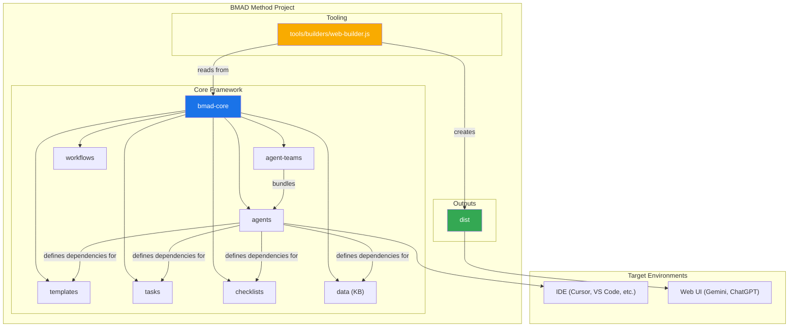
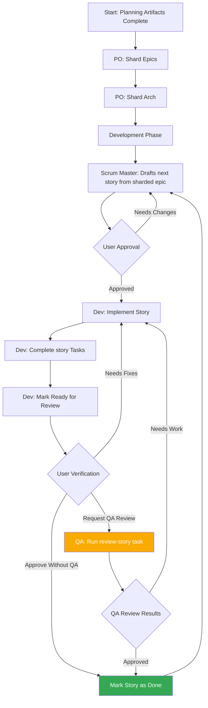

# BMAD Method: Core Architecture

This document serves as the definitive source of truth for the BMAD-Method's architecture. It is designed to be understood by both human developers and the AI agents that operate within the framework.

## 1. Overview

The BMAD-Method is an AI-Powered Agile Development Framework designed to transform software development by providing specialized AI agents for every role in a complete Agile team. The core purpose of the project is to provide a structured yet flexible set of prompts, templates, and workflows that users can employ to guide AI agents (like Gemini, Claude, or ChatGPT) to perform complex software development tasks in a predictable, high-quality manner.

The system facilitates a full development lifecycle:

1. **Ideation & Planning**: Brainstorming, market research, and creating project briefs.
2. **Architecture & Design**: Defining system architecture and UI/UX specifications.
3. **Development Execution**: A cyclical workflow where a Scrum Master (SM) agent drafts stories and a Developer (Dev) agent implements them one at a time. This process works for both new (Greenfield) and existing (Brownfield) projects.

## 2. System Architecture Diagram

The entire BMAD-Method ecosystem is designed around the `.bmad-core` directory, which acts as the brain of the operation. The `tools` directory provides the means to process and package this brain for different environments.



## 3. Core Components

The `.bmad-core` directory contains all the definitions and resources that give the agents their capabilities.

### 3.1. Agents (`.bmad-core/agents/`)

- **Purpose**: These are the foundational building blocks of the system. Each markdown file (e.g., `bmad-master.md`, `pm.md`, `dev.md`) defines the persona, capabilities, and dependencies of a single AI agent.
- **Structure**: An agent file contains a YAML header that specifies its role, persona, dependencies, and startup instructions. These dependencies are lists of tasks, templates, checklists, and data files that the agent is allowed to use.
- **Startup Instructions**: Agents can include startup sequences that load project-specific documentation from the `docs/` folder, such as coding standards, API specifications, or project structure documents. This provides immediate project context upon activation.
- **Document Integration**: Agents can reference and load documents from the project's `docs/` folder as part of tasks, workflows, or startup sequences. Users can also drag documents directly into chat interfaces to provide additional context.
- **Example**: The `bmad-master` agent lists its dependencies, which tells the build tool which files to include in a web bundle and informs the agent of its own capabilities.

### 3.2. Agent Teams (`.bmad-core/agent-teams/`)

- **Purpose**: Team files (e.g., `team-all.yml`) define collections of agents and workflows that are bundled together for a specific purpose, like "full-stack development" or "backend-only". This creates a larger, pre-packaged context for web UI environments.
- **Structure**: A team file lists the agents to include. It can use wildcards, such as `"*"` to include all agents. This allows for the creation of comprehensive bundles like `team-all`.

### 3.3. Workflows (`.bmad-core/workflows/`)

- **Purpose**: Workflows are YAML files (e.g., `greenfield-fullstack.yml`) that define a prescribed sequence of steps and agent interactions for a specific project type. They act as a strategic guide for the user and the `bmad-orchestrator` agent.
- **Structure**: A workflow defines sequences for both complex and simple projects, lists the agents involved at each step, the artifacts they create, and the conditions for moving from one step to the next. It often includes a Mermaid diagram for visualization.

### 3.4. Reusable Resources (`templates`, `tasks`, `checklists`, `data`)

- **Purpose**: These folders house the modular components that are dynamically loaded by agents based on their dependencies.
  - **`templates/`**: Contains markdown templates for common documents like PRDs, architecture specifications, and user stories.
  - **`tasks/`**: Defines the instructions for carrying out specific, repeatable actions like "shard-doc" or "create-next-story".
  - **`checklists/`**: Provides quality assurance checklists for agents like the Product Owner (`po`) or Architect.
  - **`data/`**: Contains the core knowledge base (`bmad-kb.md`), technical preferences (`technical-preferences.md`), and other key data files.

#### 3.4.1. Template Processing System

A key architectural principle of BMAD is that templates are self-contained and interactive - they embed both the desired document output and the LLM instructions needed to work with users. This means that in many cases, no separate task is needed for document creation, as the template itself contains all the processing logic.

The BMAD framework employs a sophisticated template processing system orchestrated by three key components:

- **`template-format.md`** (`.bmad-core/utils/`): Defines the foundational markup language used throughout all BMAD templates. This specification establishes syntax rules for variable substitution (`{{placeholders}}`), AI-only processing directives (`[[LLM: instructions]]`), and conditional logic blocks. Templates follow this format to ensure consistent processing across the system.

- **`create-doc.md`** (`.bmad-core/tasks/`): Acts as the orchestration engine that manages the entire document generation workflow. This task coordinates template selection, manages user interaction modes (incremental vs. rapid generation), enforces template-format processing rules, and handles validation. It serves as the primary interface between users and the template system.

- **`advanced-elicitation.md`** (`.bmad-core/tasks/`): Provides an interactive refinement layer that can be embedded within templates through `[[LLM: instructions]]` blocks. This component offers 10 structured brainstorming actions, section-by-section review capabilities, and iterative improvement workflows to enhance content quality.

The system maintains a clean separation of concerns: template markup is processed internally by AI agents but never exposed to users, while providing sophisticated AI processing capabilities through embedded intelligence within the templates themselves.

#### 3.4.2. Technical Preferences System

BMAD includes a personalization layer through the `technical-preferences.md` file in `.bmad-core/data/`. This file serves as a persistent technical profile that influences agent behavior across all projects.

**Purpose and Benefits:**

- **Consistency**: Ensures all agents reference the same technical preferences
- **Efficiency**: Eliminates the need to repeatedly specify preferred technologies
- **Personalization**: Agents provide recommendations aligned with user preferences
- **Learning**: Captures lessons learned and preferences that evolve over time

**Content Structure:**
The file typically includes preferred technology stacks, design patterns, external services, coding standards, and anti-patterns to avoid. Agents automatically reference this file during planning and development to provide contextually appropriate suggestions.

**Integration Points:**

- Templates can reference technical preferences during document generation
- Agents suggest preferred technologies when appropriate for project requirements
- When preferences don't fit project needs, agents explain alternatives
- Web bundles can include preferences content for consistent behavior across platforms

**Evolution Over Time:**
Users are encouraged to continuously update this file with discoveries from projects, adding both positive preferences and technologies to avoid, creating a personalized knowledge base that improves agent recommendations over time.

## 4. The Build & Delivery Process

The framework is designed for two primary environments: local IDEs and web-based AI chat interfaces. The `web-builder.js` script is the key to supporting the latter.

### 4.1. Web Builder (`tools/builders/web-builder.js`)

- **Purpose**: This Node.js script is responsible for creating the `.txt` bundles found in `dist`.
- **Process**:
  1. **Resolves Dependencies**: For a given agent or team, the script reads its definition file.
  2. It recursively finds all dependent resources (tasks, templates, etc.) that the agent/team needs.
  3. **Bundles Content**: It reads the content of all these files and concatenates them into a single, large text file, with clear separators indicating the original file path of each section.
  4. **Outputs Bundle**: The final `.txt` file is saved in the `dist` directory, ready to be uploaded to a web UI.

### 4.2. Environment-Specific Usage

- **For IDEs**: Users interact with the agents directly via their markdown files in `.bmad-core/agents/`. The IDE integration (for Cursor, Claude Code, etc.) knows how to call these agents.
- **For Web UIs**: Users upload a pre-built bundle from `dist`. This single file provides the AI with the context of the entire team and all their required tools and knowledge.

## 5. BMAD Workflows

### 5.1. The Planning Workflow

Before development begins, BMAD follows a structured planning workflow that establishes the foundation for successful project execution:

```mermaid
graph TD
    A["Start: Project Idea"] --> B{"Optional: Analyst Brainstorming"}
    B -->|Yes| C["Analyst: Market Research & Analysis"]
    B -->|No| D["Create Project Brief"]
    C --> D["Analyst: Create Project Brief"]
    D --> E["PM: Create PRD from Brief"]
    E --> F["Architect: Create Architecture from PRD"]
    F --> G["PO: Run Master Checklist"]
    G --> H{"Documents Aligned?"}
    H -->|Yes| I["Planning Complete"]
    H -->|No| J["PO: Update Epics & Stories"]
    J --> K["Update PRD/Architecture as needed"]
    K --> G
    I --> L["📁 Switch to IDE"]
    L --> M["PO: Shard Documents"]
    M --> N["Ready for SM/Dev Cycle"]

    style I fill:#34a853,color:#fff
    style G fill:#f9ab00,color:#fff
    style L fill:#1a73e8,color:#fff
    style N fill:#34a853,color:#fff
```



**Key Planning Phases:**

1. **Optional Analysis**: Analyst conducts market research and competitive analysis
2. **Project Brief**: Foundation document created by Analyst or user
3. **PRD Creation**: PM transforms brief into comprehensive product requirements
4. **Architecture Design**: Architect creates technical foundation based on PRD
5. **Validation & Alignment**: PO ensures all documents are consistent and complete
6. **Refinement**: Updates to epics, stories, and documents as needed
7. **Environment Transition**: Critical switch from web UI to IDE for development workflow
8. **Document Preparation**: PO shards large documents for development consumption

**Workflow Orchestration**: The `bmad-orchestrator` agent uses these workflow definitions to guide users through the complete process, ensuring proper transitions between planning (web UI) and development (IDE) phases.

### 5.2. The Core Development Cycle

Once the initial planning and architecture phases are complete, the project moves into a cyclical development workflow, as detailed in the `bmad-kb.md`. This ensures a steady, sequential, and quality-controlled implementation process.



This cycle continues, with the Scrum Master, Developer, and optionally QA agents working together. The QA agent provides senior developer review capabilities through the `review-story` task, offering code refactoring, quality improvements, and knowledge transfer. This ensures high code quality while maintaining development velocity.

## 8. Complete Source Tree

The BMAD-METHOD project structure is designed for clarity, modularity, and extensibility. Here's the complete source tree with explanations:

```plaintext
bmad-method/
├── .bmad-core/                    # Core framework (installed in user projects)
│   ├── agents/                    # Individual agent definitions
│   │   ├── analyst.md            # Business analyst agent
│   │   ├── architect.md          # Solution architect agent
│   │   ├── bmad-master.md        # Universal expert agent
│   │   ├── bmad-orchestrator.md  # Multi-agent coordinator
│   │   ├── dev.md                # Full-stack developer agent
│   │   ├── pm.md                 # Product manager agent
│   │   ├── po.md                 # Product owner agent
│   │   ├── qa.md                 # QA specialist agent
│   │   ├── sm.md                 # Scrum master agent
│   │   └── ux-expert.md          # UX designer agent
│   ├── agent-teams/              # Pre-configured agent teams
│   │   ├── team-all.yml          # All agents bundle
│   │   ├── team-fullstack.yml    # Full-stack development team
│   │   ├── team-ide-minimal.yml  # Minimal IDE-focused team
│   │   └── team-no-ui.yml        # Backend-only team
│   ├── checklists/               # Quality assurance checklists
│   │   ├── architect-checklist.md
│   │   ├── po-master-checklist.md
│   │   └── story-dod-checklist.md
│   ├── data/                     # Knowledge base and preferences
│   │   ├── bmad-kb.md            # Core knowledge base
│   │   └── technical-preferences.md  # User tech preferences
│   ├── tasks/                    # Reusable task definitions
│   │   ├── advanced-elicitation.md   # Deep diving techniques
│   │   ├── create-doc.md         # Document creation task
│   │   ├── create-next-story.md  # Story generation task
│   │   ├── doc-migration-task.md # V3 to V4 migration
│   │   ├── execute-checklist.md  # Checklist runner
│   │   └── shard-doc.md          # Document sharding task
│   ├── templates/                # Document templates
│   │   ├── full-stack-architecture-tmpl.md
│   │   ├── prd-tmpl.md
│   │   ├── project-brief-tmpl.md
│   │   ├── story-tmpl.md
│   │   └── [other templates...]
│   ├── utils/                    # Utility components
│   │   ├── agent-switcher.web    # Web UI agent switching
│   │   ├── template-format.md    # Template markup spec
│   │   └── workflow-management.md # Workflow helpers
│   ├── workflows/                # Development workflows
│   │   ├── brownfield-enhancement.yml
│   │   ├── greenfield-fullstack.yml
│   │   ├── greenfield-service.yml
│   │   └── greenfield-simple.yml
│   └── core-config.yml           # V4 configuration system
│
├── dist/                         # Pre-built bundles (generated)
│   ├── agents/                   # Individual agent bundles
│   │   ├── analyst.txt
│   │   ├── architect.txt
│   │   └── [other agents...]
│   ├── teams/                    # Team bundles for web UI
│   │   ├── team-all.txt
│   │   ├── team-fullstack.txt
│   │   └── [other teams...]
│   └── expansion-packs/          # Expansion pack bundles
│
├── docs/                         # Documentation
│   ├── agentic-tools/           # IDE-specific guides
│   │   ├── claude-code-guide.md
│   │   ├── cursor-guide.md
│   │   ├── cline-guide.md
│   │   ├── gemini-cli-guide.md
│   │   ├── roo-code-guide.md
│   │   └── windsurf-guide.md
│   ├── bmad-workflow-guide.md    # Universal workflow guide
│   ├── core-architecture.md      # This document
│   ├── expansion-packs.md        # Expansion pack guide
│   ├── user-guide.md            # Comprehensive user guide
│   └── [other docs...]
│
├── expansion-packs/              # Domain-specific extensions
│   ├── bmad-2d-phaser-game-dev/ # Game development pack
│   ├── bmad-creator-tools/      # Agent creation tools
│   ├── bmad-infrastructure-devops/ # DevOps pack
│   └── README.md
│
├── tools/                        # Build and installation tools
│   ├── builders/                 # Build system
│   │   └── web-builder.js       # Bundle generator
│   ├── cli.js                   # Main CLI tool
│   ├── installer/               # NPX installer
│   │   ├── index.js             # Installer entry point
│   │   ├── config/              # Installation configs
│   │   ├── lib/                 # Installer utilities
│   │   └── templates/           # IDE template files
│   └── lib/                     # Shared libraries
│       ├── bundle-utils.js
│       ├── dependency-resolver.js
│       └── file-processor.js
│
├── .github/                     # GitHub configuration
│   ├── workflows/               # GitHub Actions
│   └── ISSUE_TEMPLATE/         # Issue templates
│
├── common/                      # Shared resources
│   ├── tasks/                   # Common tasks
│   └── utils/                   # Common utilities
│
├── bmad-core/                   # Source for .bmad-core
│   └── [mirrors .bmad-core structure]
│
├── package.json                 # Node.js configuration
├── README.md                    # Project readme
├── CONTRIBUTING.md              # Contribution guidelines
├── GUIDING-PRINCIPLES.md        # Core principles
└── LICENSE                      # MIT license
```

### Directory Purposes

#### Core Framework (.bmad-core/)

- **agents/**: Individual AI agent personalities and capabilities
- **agent-teams/**: Bundles of agents for specific workflows
- **checklists/**: Quality assurance and validation steps
- **data/**: Knowledge base and user preferences
- **tasks/**: Reusable procedures agents can execute
- **templates/**: Document templates with embedded AI instructions
- **utils/**: Helper components for agents
- **workflows/**: Structured development processes

#### Generated Bundles (dist/)

- Pre-built text files ready for web UI upload
- Automatically generated by the build system
- Includes resolved dependencies for each agent/team

#### Tools (tools/)

- **cli.js**: Main build tool for creating bundles
- **installer/**: NPX-based installer for projects
- **builders/**: Bundle generation logic
- **lib/**: Shared utilities for build system

#### Expansion Packs (expansion-packs/)

- Domain-specific agent collections
- Extend BMAD beyond software development
- Each pack is self-contained with its own agents, tasks, and templates

#### Documentation (docs/)

- Comprehensive guides for users
- Technical architecture documentation
- IDE-specific setup instructions

### Key Files

- **core-config.yml**: V4's flexible configuration system
- **bmad-kb.md**: Central knowledge base loaded by most agents
- **template-format.md**: Specification for BMAD's template markup
- **dependency-resolver.js**: Manages agent resource loading
