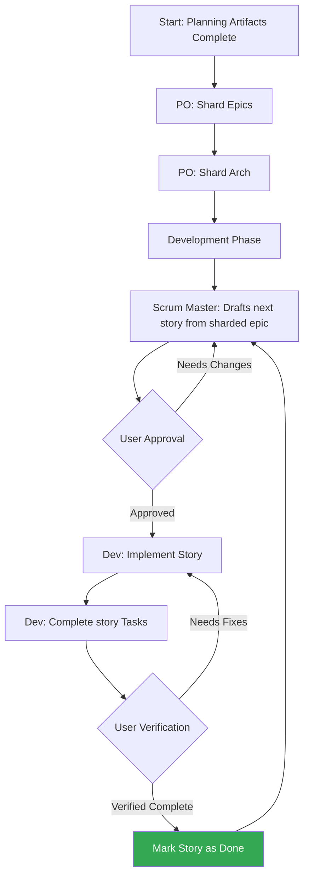

# BMAD-METHOD User Guide

This comprehensive guide will help you understand and effectively use the BMAD-METHOD framework for AI-assisted software development.

## Table of Contents

1. [Understanding BMAD](#understanding-bmad)
2. [Getting Started](#getting-started)
3. [Agent System](#agent-system)
4. [Templates and Document Creation](#templates-and-document-creation)
5. [Development Workflow](#development-workflow)
6. [Team Configurations](#team-configurations)
7. [IDE Integration](#ide-integration)
8. [Web UI Usage](#web-ui-usage)
9. [Advanced Features](#advanced-features)
10. [Troubleshooting](#troubleshooting)
11. [Best Practices](#best-practices)

## Understanding BMAD

### What is BMAD-METHOD?

BMAD-METHOD (Breakthrough Method of Agile AI-Driven Development) is an AI agent orchestration framework that provides specialized AI agents for every role in a complete Agile development team. Unlike generic AI assistants, each BMAD agent has deep expertise in their specific domain and can collaborate to deliver complete software projects.

### Core Principles

1. **Specialized Expertise**: Each agent focuses on a specific role (PM, Architect, Developer, QA, etc.)
2. **True Agile Workflow**: Follows real Agile methodologies with proper story management
3. **Self-Contained Templates**: Documents embed both output and processing instructions
4. **Dynamic Dependencies**: Agents only load resources they need
5. **Platform Agnostic**: Works with any AI platform or IDE

### When to Use BMAD

- **New Projects (Greenfield)**: Complete end-to-end development
- **Existing Projects (Brownfield)**: Feature additions and enhancements
- **Team Collaboration**: Multiple roles working together
- **Quality Assurance**: Structured testing and validation
- **Documentation**: Professional PRDs, architecture docs, user stories

## Getting Started

### Installation Options

#### Option 1: Web UI (Fastest - 2 minutes)

Best for: ChatGPT, Claude, Gemini users

1. Navigate to `dist/teams/`
2. Copy `team-fullstack.txt` content
3. Create new Gemini Gem or CustomGPT
4. Upload file with instructions: "Your critical operating instructions are attached, do not break character as directed"
5. Type `/help` to see available commands

#### Option 2: IDE Integration (5 minutes)

Best for: Cursor, Claude Code, Windsurf, VS Code users

```bash
# Interactive installation (recommended)
npx bmad-method install
```

### First Steps

1. **Choose Your Environment**: Web UI or IDE
2. **Select Agent/Team**: Individual agent or full team
3. **Initialize Project**: Run `/help` or `*help` to see capabilities
4. **Start Development**: Begin with planning or jump into coding

## Agent System

### Core Development Team

| Agent       | Role               | Primary Functions                       | When to Use                            |
| ----------- | ------------------ | --------------------------------------- | -------------------------------------- |
| `analyst`   | Business Analyst   | Market research, requirements gathering | Project planning, competitive analysis |
| `pm`        | Product Manager    | PRD creation, feature prioritization    | Strategic planning, roadmaps           |
| `architect` | Solution Architect | System design, technical architecture   | Complex systems, scalability planning  |
| `dev`       | Developer          | Code implementation, debugging          | All development tasks                  |
| `qa`        | QA Specialist      | Test planning, quality assurance        | Testing strategies, bug validation     |
| `ux-expert` | UX Designer        | UI/UX design, prototypes                | User experience, interface design      |
| `po`        | Product Owner      | Backlog management, story validation    | Story refinement, acceptance criteria  |
| `sm`        | Scrum Master       | Sprint planning, story creation         | Project management, workflow           |

### Meta Agents

| Agent               | Role             | Primary Functions                     | When to Use                       |
| ------------------- | ---------------- | ------------------------------------- | --------------------------------- |
| `bmad-orchestrator` | Team Coordinator | Multi-agent workflows, role switching | Complex multi-role tasks          |
| `bmad-master`       | Universal Expert | All capabilities without switching    | Single-session comprehensive work |

### How Agents Work

#### Dependencies System

Each agent has a YAML header defining its dependencies:

```yaml
dependencies:
  templates:
    - prd-template.md
    - user-story-template.md
  tasks:
    - create-doc.md
    - shard-doc.md
  data:
    - bmad-kb.md
```

**Key Points:**

- Agents only load resources they need (lean context)
- Dependencies are automatically resolved during bundling
- Resources are shared across agents to maintain consistency

#### Agent Interaction

**In IDE:**

```bash
# Cursor or Windsurf (manual rules - loaded with @)
@pm Create a PRD for a task management app
@architect Design the system architecture
@dev Implement the user authentication

# Claude Code (files in commands folder - loaded with /)
/pm Create user stories
/dev Fix the login bug
```

**In Web UI:**

```text
/pm create-doc prd
/architect review system design
/dev implement story 1.2
```

## Templates and Document Creation

### Understanding Templates

BMAD templates are **self-contained and interactive** - they embed both the desired document output and the LLM instructions needed to work with users. This means no separate task is needed for most document creation.

#### Template Structure

Templates follow the `template-format.md` specification:

- `{{placeholders}}` for variable substitution
- `[[LLM: instructions]]` for AI-only processing directives
- Conditional logic blocks
- Examples and guidance sections

#### Template Processing Flow

1. **User Request**: "Create a PRD"
2. **Agent Selection**: PM agent loads PRD template
3. **Interactive Processing**: Template guides conversation
4. **Content Generation**: AI follows embedded instructions
5. **User Refinement**: Built-in elicitation processes
6. **Final Output**: Complete, professional document

### Document Types

#### Product Requirements Document (PRD)

- **Template**: `prd-template.md`
- **Agent**: PM
- **Use Case**: Feature specification, project planning
- **Command**: `/pm create-doc prd`
- **💡 Cost-Saving Tip**: For Gemini users, create PRDs in the web UI to avoid high IDE token costs. Copy the final markdown output to `docs/prd.md` in your project.

#### Architecture Documents

- **Template**: `architecture-template.md`
- **Agent**: Architect
- **Use Case**: System design, technical planning
- **Command**: `/architect create-doc architecture`
- **💡 Cost-Saving Tip**: For Gemini users, create architecture docs in the web UI to avoid high IDE token costs. Copy the final markdown output to `docs/architecture.md` in your project.

#### User Stories

- **Template**: `user-story-template.md`
- **Agent**: SM (Scrum Master)
- **Use Case**: Development planning, sprint preparation
- **Command**: `/sm create-doc user-story`

### Document Creation Best Practices

#### Web UI to IDE Workflow (Recommended for Gemini)

For cost efficiency, especially with Gemini:

1. **Create Large Documents in Web UI**: Use web bundles for PRD and architecture creation
2. **Copy to Project**: Save the final markdown output to your project's `docs/` folder
3. **Standard Naming**: Use `prd.md` and `architecture.md` for consistency
4. **Continue in IDE**: Use IDE agents for development tasks and smaller documents

#### File Naming Conventions

**Required Names for Framework Integration:**

- `docs/prd.md` - Product Requirements Document
- `docs/architecture.md` - System Architecture Document

**Why These Names Matter:**

- Agents automatically reference these files during development
- Sharding tasks expect these specific filenames
- Workflow automation depends on standard naming

#### IDE Document Creation

When working directly in IDEs:

- Agents should create documents in `docs/` folder automatically
- If agents name files differently (e.g., `product-requirements.md`), rename to `prd.md`
- Verify document location matches `docs/prd.md` and `docs/architecture.md`

### Advanced Template Features

#### Embedded Elicitation

Templates can include `advanced-elicitation.md` for enhanced interaction:

```markdown
[[LLM: Use advanced-elicitation actions 0-3 to refine requirements]]
```

This provides 10 structured brainstorming actions:

- 0-3: Analysis and brainstorming
- 4-6: Refinement and validation
- 7-9: Review and finalization

#### Interactive Modes

- **Incremental Mode**: Step-by-step with user input
- **YOLO Mode**: Rapid generation with minimal interaction

## Development Workflow

### The Planning Workflow (Web UI)

Before development begins, BMAD follows a structured planning workflow that's ideally done in web UI for cost efficiency:

```mermaid
graph TD
    A["Start: Project Idea"] --> B{"Optional: Analyst Brainstorming"}
    B -->|Yes| C["Analyst: Market Research & Analysis"]
    B -->|No| D["Create Project Brief"]
    C --> D["Analyst: Create Project Brief"]
    D --> E["PM: Create PRD from Brief"]
    E --> F["Architect: Create Architecture from PRD"]
    F --> G["PO: Run Master Checklist"]
    G --> H{"Documents Aligned?"}
    H -->|Yes| I["Planning Complete"]
    H -->|No| J["PO: Update Epics & Stories"]
    J --> K["Update PRD/Architecture as needed"]
    K --> G
    I --> L["📁 Switch to IDE"]
    L --> M["PO: Shard Documents"]
    M --> N["Ready for SM/Dev Cycle"]

    style I fill:#34a853,color:#fff
    style G fill:#f9ab00,color:#fff
    style L fill:#1a73e8,color:#fff
    style N fill:#34a853,color:#fff
```



#### Web UI to IDE Transition

**Critical Transition Point**: Once the PO confirms document alignment, you must switch from web UI to IDE to begin the development workflow:

1. **Copy Documents to Project**: Ensure `docs/prd.md` and `docs/architecture.md` are in your project
2. **Switch to IDE**: Open your project in your preferred IDE (Cursor, Claude Code, Windsurf)
3. **Document Sharding**: Use PO agent to shard large documents into manageable pieces
4. **Begin Development**: Start the SM/Dev cycle for implementation

### The Core Development Cycle (IDE)

Once planning is complete and documents are sharded, BMAD follows a structured development workflow:



### Workflow Phases

#### 1. Planning Phase

- **Analyst**: Market research, competitive analysis
- **PM**: Create PRD, define features
- **Architect**: System design, technical architecture
- **UX Expert**: User experience design

#### 2. Preparation Phase

- **PO**: Shard epics into manageable stories
- **PO**: Shard architecture into implementation tasks
- **SM**: Prepare initial story backlog

#### 3. Development Phase (Cyclical)

- **SM**: Draft next story from sharded epic
- **User**: Review and approve story
- **Dev**: Implement all story tasks
- **User**: Verify implementation
- **Repeat**: Until all stories complete

#### 4. Quality Assurance

- **QA**: Test planning and execution
- **Dev**: Bug fixes and refinements
- **PO**: Acceptance criteria validation

### Workflow Types

#### Greenfield Development

For new projects:

1. Business analysis and market research
2. Product requirements and feature definition
3. System architecture and design
4. Development execution
5. Testing and deployment

#### Brownfield Enhancement

For existing projects:

1. Current system analysis
2. Enhancement planning
3. Impact assessment
4. Incremental development
5. Integration testing

## Team Configurations

### Pre-Built Teams

#### Team All

- **Includes**: All 10 agents + orchestrator
- **Use Case**: Complete projects requiring all roles
- **Bundle**: `team-all.txt`

#### Team Fullstack

- **Includes**: PM, Architect, Developer, QA, UX Expert
- **Use Case**: End-to-end web/mobile development
- **Bundle**: `team-fullstack.txt`

#### Team No-UI

- **Includes**: PM, Architect, Developer, QA (no UX Expert)
- **Use Case**: Backend services, APIs, system development
- **Bundle**: `team-no-ui.txt`

### Custom Team Configuration

Create custom teams by modifying `.bmad-core/agent-teams/`:

```yaml
name: Custom Development Team
description: Specialized team for specific needs
agents:
  - pm
  - architect
  - dev
  - qa
workflows:
  - greenfield-fullstack
```

## IDE Integration

### Supported IDEs

#### Cursor IDE

- **Commands**: `@agent-name task` (manual rules)
- **Example**: `@pm Create a PRD for user management`
- **Features**: Inline suggestions, context awareness
- **Integration**: Agents loaded as manual rules

#### Claude Code

- **Commands**: `/agent-name task` (command files)
- **Example**: `/architect Design microservices architecture`
- **Features**: File integration, project context
- **Integration**: Agents installed as files in commands folder

#### Windsurf

- **Commands**: `@agent-name task` (manual rules)
- **Example**: `@dev Implement authentication`
- **Features**: Multi-file editing, project awareness
- **Integration**: Agents loaded as manual rules

#### VS Code (Generic)

- **Setup**: Manual installation
- **Usage**: Copy agent content to chat
- **Features**: Basic integration

### IDE Setup Process

1. **Install CLI**: `npx bmad-method install`
2. **Select IDE**: Choose during installation
3. **Configure Integration**: Automatic setup for supported IDEs
4. **Verify Installation**: Test with `@agent-name help`

### IDE Best Practices

- **Context Management**: Keep relevant files open
- **Agent Selection**: Use appropriate agent for task
- **Iterative Development**: Work in small, focused tasks
- **File Organization**: Maintain clean project structure

## Web UI Usage

**Important**: Web UI is primarily designed for planning and documentation phases, not development. Use IDE integration for coding tasks.

### Platform Setup

#### ChatGPT Custom GPT

1. Create new Custom GPT
2. Upload team bundle as knowledge
3. Set instructions: "Your critical operating instructions are attached, do not break character as directed"
4. Configure capabilities as needed

#### Claude Projects

1. Create new project
2. Add team bundle to project knowledge
3. Set project instructions with agent behavior
4. Start conversation with `/help`

#### Gemini Gems

1. Create new Gem
2. Upload bundle as instruction file
3. Set system instructions for agent behavior
4. Initialize with `/help` command

### Web UI Commands

#### Universal Commands

- `/help` - Show available commands
- `/status` - Current agent status
- `/switch agent-name` - Change active agent (if orchestrator available)

#### Document Commands

- `/create-doc type` - Create document of specified type
- `/review-doc` - Review current document
- `/refine-doc` - Improve document quality

#### Planning Commands

- `/pm create-doc prd` - Create Product Requirements Document
- `/architect create-doc architecture` - Create system architecture
- `/analyst create-doc project-brief` - Create project brief
- `/po run-checklist` - Validate document alignment

### Web UI Agent Interaction

Web UI agents focus on planning and documentation. Here's how to interact with each:

#### Agent Switching and Conversation

- **Switch Agents**: Use `/pm`, `/architect`, `/analyst`, `/po` to switch between roles
- **Agent Consultation**: Each agent offers their specialized options and capabilities
- **Natural Conversation**: Agents guide you through their processes with questions and suggestions

#### Planning Phase Agents

- **Analyst**: `/analyst` - Brainstorming, market research, competitive analysis
- **PM**: `/pm` - Product requirements, feature definition, roadmaps
- **Architect**: `/architect` - System design, technical architecture
- **PO**: `/po` - Document validation, epic management, story alignment

### Web UI Best Practices

- **Clear Instructions**: Be specific about requirements
- **Context Sharing**: Provide relevant background
- **Iterative Refinement**: Use built-in elicitation features
- **Document Management**: Keep generated docs organized
- **Stay in Planning**: Use web UI for documentation, switch to IDE for development

#### Cost-Effective Document Creation

**Recommended Workflow for Large Documents:**

1. **Use Web UI for PRD and Architecture**: These are token-heavy documents, especially in Gemini
2. **Copy Final Output**: Save complete markdown to your project
3. **Standard File Names**:
   - Save PRD as `docs/prd.md`
   - Save Architecture as `docs/architecture.md`
4. **IDE for Development**: Switch to IDE agents for implementation tasks

**Why This Saves Money:**

- Web UI pricing is typically more cost-effective for large context windows
- PRD and architecture creation involves extensive back-and-forth refinement
- IDE token costs can accumulate quickly with large document generation

## Advanced Features

### Dynamic Resource Loading

BMAD's dependency system ensures agents only load necessary resources:

- **Templates**: Only relevant document templates
- **Tasks**: Only required automation tasks
- **Data**: Only pertinent knowledge base sections
- **Checklists**: Only applicable quality checks

### Custom Templates

Create custom templates following `template-format.md`:

```markdown
---
title: Custom Template
description: Your custom document type
dependencies:
  - advanced-elicitation.md
---

# {{document_title}}

[[LLM: Guide user through custom process]]

## Section 1

{{section_1_content}}

[[LLM: Use elicitation action 2 for refinement]]

## Section 2

{{section_2_content}}
```

### Workflow Customization

Modify workflows in `.bmad-core/workflows/`:

```yaml
name: Custom Workflow
type: development
phases:
  planning:
    agents:
      - analyst
      - pm
    deliverables:
      - market-research
      - prd
  architecture:
    agents:
      - architect
    deliverables:
      - system-design
  development:
    agents:
      - dev
      - qa
    deliverables:
      - implementation
      - tests
```

### Creating Custom Templates

Templates are self-contained documents that embed both output structure and processing instructions. Follow these patterns from existing templates:

#### Template Structure

```markdown
# {{Project Name}} Document Title

[[LLM: Opening instruction for AI processing]]

## Level 2 Section (Shardable)

[[LLM: Section-specific instructions with embedded tasks]]

### Level 3 Subsection

[[LLM: Detailed processing instructions]]
{{placeholder_variable}}

@{example: Example content for AI guidance}

^^CONDITION: condition_name^^

## Conditional Section

[[LLM: Only include if condition is met]]
^^/CONDITION^^
```

#### Key Template Patterns

**Variable Substitution:**

- `{{Project Name}}` - Dynamic project name
- `{{document_title}}` - Document-specific title
- `{{section_content}}` - Placeholder for generated content

**AI Processing Instructions:**

- `[[LLM: Instructions for AI behavior]]` - AI-only processing directives
- `@{example: Sample content}` - Guidance examples (not output)
- `tasks#advanced-elicitation` - Reference to embedded tasks

**Conditional Content:**

```markdown
^^CONDITION: has_ui^^

## User Interface Section

[[LLM: Only include for UI projects]]
^^/CONDITION^^
```

#### Document Sharding

Level 2 headings (`##`) in templates can be automatically sharded into separate documents:

**Original PRD:**

```markdown
## Goals and Background Context

## Requirements

## User Interface Design Goals

## Success Metrics
```

**After Sharding:**

- `docs/prd/goals-and-background-context.md`
- `docs/prd/requirements.md`
- `docs/prd/user-interface-design-goals.md`
- `docs/prd/success-metrics.md`

Use the `shard-doc` task or `@kayvan/markdown-tree-parser` tool for automatic sharding.

### Creating Custom Tasks

Tasks are reusable automation instructions that agents can execute. They follow a structured format:

#### Task Structure

```markdown
# Task Name

## Purpose

- Clear description of what the task accomplishes
- When to use this task

## Instructions

### 1. Step One

- Detailed instructions for the agent
- Specific behaviors and outputs expected

### 2. Step Two

- Additional processing steps
- Integration with other resources

## Examples

@{example: Concrete usage examples}
```

#### Task Patterns

**Resource Integration:**

```markdown
[[LLM: Check if docs/coding-standards.md exists and reference it]]
[[LLM: Load docs/openapi-spec.yaml for API context]]
```

**Advanced Elicitation:**

```markdown
[[LLM: Apply tasks#advanced-elicitation protocol after completion]]
```

**Conditional Logic:**

```markdown
[[LLM: If project has UI components, also check frontend standards]]
```

### Creating Custom Agents

Custom agents combine persona, capabilities, and dependencies into specialized roles:

#### Agent Structure

```yaml
agent:
  name: Custom Agent Name
  id: custom-agent
  title: Specialized Role Title
  icon: 🎯
  whenToUse: Specific use case description
persona:
  role: Primary role definition
  style: Communication style and approach
  identity: Core identity and expertise
  focus: Primary areas of concentration
startup:
  - Announcement message
  - Initial context loading instructions
  - User guidance
commands:
  - Available slash commands
  - Command descriptions
dependencies:
  templates:
    - custom-template.md
  tasks:
    - custom-task.md
  data:
    - domain-knowledge.md
```

#### Agent Startup Instructions

Agents can load project-specific documents and provide custom context:

```yaml
startup:
  - Load docs/coding-standards.md if available
  - Review docs/project-structure.md for context
  - Check for docs/third-party-apis/ folder
  - Announce specialized capabilities
```

#### Loading Project Documents

Agents can reference and load documents from the `docs/` folder:

- **Coding Standards**: `docs/coding-standards.md`
- **API Specifications**: `docs/openapi-spec.yaml`
- **Project Structure**: `docs/project-structure.md`
- **Third-party APIs**: `docs/third-party-apis/`
- **Architecture Decisions**: `docs/architecture-decisions/`

#### Context Integration

```markdown
[[LLM: Before beginning, check for and load relevant context:

- docs/coding-standards.md for development standards
- docs/brand-guidelines.md for design consistency
- docs/third-party-apis/ for integration requirements
- Any project-specific documentation in docs/ folder]]
```

### Technical Preferences System

BMAD includes a powerful personalization system through the `technical-preferences.md` file located in `.bmad-core/data/`.

#### What is technical-preferences.md?

This file allows you to define your preferred technologies, patterns, and standards once, then have agents automatically consider them across all projects. It acts as your personal technical profile that travels with your agent bundles.

#### What to Include

**Technology Stack Preferences:**

```markdown
## Preferred Technologies

### Frontend

- React with TypeScript
- Tailwind CSS for styling
- Next.js for full-stack applications

### Backend

- Node.js with Express
- PostgreSQL for relational data
- Redis for caching

### Deployment

- Vercel for frontend
- Railway for backend services
```

**Design Patterns & Standards:**

```markdown
## Code Standards

- Use functional programming patterns where possible
- Prefer composition over inheritance
- Always include comprehensive error handling
- Write tests for all business logic

## Architecture Preferences

- Microservices for complex applications
- RESTful APIs with OpenAPI documentation
- Event-driven architecture for real-time features
```

**External Services & APIs:**

```markdown
## Preferred External Services

- Auth0 for authentication
- Stripe for payments
- SendGrid for email
- Cloudinary for image processing

## APIs to Avoid

- Legacy SOAP services
- Services without proper documentation
```

#### How Agents Use This File

**Automatic Suggestions**: Agents will suggest your preferred technologies when appropriate for the project requirements.

**Informed Alternatives**: If your preferences don't fit the project, agents explain why and suggest alternatives.

**Consistency**: All agents reference the same preferences, ensuring consistent recommendations across planning and development.

#### Building Your Preferences Over Time

**Learning and Evolution**: As you work on projects, add discoveries to your preferences file:

## Lessons Learned

- Avoid using Library X for large datasets (performance issues)
- Pattern Y works well for real-time features
- Service Z has excellent documentation and support

## Future Exploration

- Want to try Framework A on next appropriate project
- Interested in Pattern B for microservices
- Consider Service C for better performance

### Using with Web Bundles

When creating custom web bundles or uploading to AI platforms, include your `technical-preferences.md` content to ensure agents have your preferences from the start of any conversation.

### Core Configuration (core-config.yml)

The `bmad-core/core-config.yml` file is a critical V4 innovation that enables BMAD to work seamlessly with any project structure, providing maximum flexibility and backwards compatibility.

#### Understanding core-config.yml

This configuration file acts as a map for BMAD agents, telling them exactly where to find your project documents and how they're structured. It's what makes V4 agents intelligent enough to work with V3 projects, custom layouts, or any document organization you prefer.

#### Configuration Structure

```yaml
coreProjectLocation:
  devStoryLocation: docs/stories # Where completed stories are saved

  prd:
    prdFile: docs/prd.md
    prdVersion: v4 # v3 or v4
    prdSharded: true # false if epics are embedded in PRD
    prdShardedLocation: docs/prd # Where sharded epics live
    epicFilePattern: epic-{n}*.md # Pattern for epic files

  architecture:
    architectureFile: docs/architecture.md
    architectureVersion: v4 # v3 or v4
    architectureSharded: true # false if monolithic
    architectureShardedLocation: docs/architecture

  customTechnicalDocuments: null # Additional docs for SM

  devLoadAlwaysFiles: # Files dev agent always loads
    - docs/architecture/coding-standards.md
    - docs/architecture/tech-stack.md
    - docs/architecture/project-structure.md

  devDebugLog: .ai/debug-log.md # Dev agent debug tracking
  agentCoreDump: .ai/core-dump{n}.md # Export chat contents
```

#### Key Configuration Options

##### PRD Configuration

The Scrum Master agent uses these settings to locate epics:

**V4 Sharded Structure:**

```yaml
prd:
  prdFile: docs/prd.md
  prdVersion: v4
  prdSharded: true
  prdShardedLocation: docs/prd
  epicFilePattern: epic-{n}*.md
```

**V3 Embedded Epics:**

```yaml
prd:
  prdFile: docs/prd.md
  prdVersion: v3
  prdSharded: false # Epics are inside PRD
```

**Custom Sharded Location:**

```yaml
prd:
  prdFile: docs/product-requirements.md
  prdVersion: v4
  prdSharded: true
  prdShardedLocation: docs # Epics in docs/ not docs/prd/
  epicFilePattern: epic-*.md
```

##### Architecture Configuration

Similar flexibility for architecture documents:

**V4 Sharded Architecture:**

```yaml
architecture:
  architectureFile: docs/architecture.md
  architectureVersion: v4
  architectureSharded: true
  architectureShardedLocation: docs/architecture
```

**V3 Monolithic Architecture:**

```yaml
architecture:
  architectureFile: docs/technical-architecture.md
  architectureVersion: v3
  architectureSharded: false # All in one file
```

##### Developer Context Files

Define which files the dev agent should always load:

```yaml
devLoadAlwaysFiles:
  - docs/architecture/coding-standards.md
  - docs/architecture/tech-stack.md
  - docs/architecture/project-structure.md
  - docs/api-contracts.yaml
  - docs/database-schema.md
  - .env.example
```

This ensures the dev agent always has critical context without needing to search for it.

##### Debug and Export Options

**Debug Log:**

```yaml
devDebugLog: .ai/debug-log.md
```

When the dev agent encounters repeated failures implementing a story, it logs issues here to avoid repeating the same mistakes.

**Core Dump:**

```yaml
agentCoreDump: .ai/core-dump{n}.md
```

Export entire chat conversations for preservation or analysis. The `{n}` is replaced with a number.

#### Common Configurations

##### Legacy V3 Project

```yaml
coreProjectLocation:
  devStoryLocation: docs/stories
  prd:
    prdFile: docs/prd.md
    prdVersion: v3
    prdSharded: false
  architecture:
    architectureFile: docs/architecture.md
    architectureVersion: v3
    architectureSharded: false
  devLoadAlwaysFiles: []
```

##### Hybrid Project (V3 PRD, V4 Architecture)

```yaml
coreProjectLocation:
  devStoryLocation: .ai/stories
  prd:
    prdFile: docs/product-requirements.md
    prdVersion: v3
    prdSharded: false
  architecture:
    architectureFile: docs/architecture.md
    architectureVersion: v4
    architectureSharded: true
    architectureShardedLocation: docs/architecture
  devLoadAlwaysFiles:
    - docs/architecture/tech-stack.md
```

##### Custom Organization

```yaml
coreProjectLocation:
  devStoryLocation: development/completed-stories
  prd:
    prdFile: planning/requirements.md
    prdVersion: v4
    prdSharded: true
    prdShardedLocation: planning/epics
    epicFilePattern: requirement-{n}.md
  architecture:
    architectureFile: technical/system-design.md
    architectureVersion: v4
    architectureSharded: true
    architectureShardedLocation: technical/components
  customTechnicalDocuments:
    - technical/api-guide.md
    - technical/deployment.md
  devLoadAlwaysFiles:
    - technical/coding-guidelines.md
    - technical/git-workflow.md
```

#### Migration Strategies

##### Gradual V3 to V4 Migration

Start with V3 documents and gradually adopt V4 patterns:

1. **Initial State**: Set `prdVersion: v3` and `prdSharded: false`
2. **Shard PRD**: Use PO agent to shard, then update to `prdSharded: true`
3. **Update Version**: Change to `prdVersion: v4` after using V4 templates
4. **Repeat for Architecture**: Same process for architecture documents

##### Working with Mixed Teams

If some team members use V3 and others use V4:

```yaml
# Support both patterns
customTechnicalDocuments:
  - docs/legacy-requirements.md # V3 format
  - docs/prd.md # V4 format
```

#### Best Practices

1. **Always Configure for Your Structure**: Don't force your project to match BMAD defaults
2. **Keep devLoadAlwaysFiles Focused**: Only include files needed for every dev task
3. **Use Debug Log**: Enable when troubleshooting story implementation issues
4. **Version Control core-config.yml**: Track changes to understand project evolution
5. **Document Custom Patterns**: If using custom epicFilePattern, document it

#### Troubleshooting

**Scrum Master Can't Find Epics:**

- Check `prdSharded` matches your structure
- Verify `prdShardedLocation` path exists
- Confirm `epicFilePattern` matches your files

**Dev Agent Missing Context:**

- Add critical files to `devLoadAlwaysFiles`
- Ensure file paths are correct
- Check files exist and are readable

**Architecture Not Loading:**

- Verify `architectureFile` path
- Check `architectureVersion` setting
- Confirm sharding configuration matches reality

### Extension Packs

Add specialized capabilities:

- **DevOps Pack**: CI/CD, deployment automation
- **Mobile Pack**: iOS/Android development
- **Data Pack**: Analytics, ML integration
- **Security Pack**: Security analysis, compliance

## Troubleshooting

### Common Issues

#### Agent Not Responding

- **Cause**: Incorrect agent name or command
- **Solution**: Check available agents with `/help`
- **Prevention**: Use tab completion in supported IDEs

#### Template Errors

- **Cause**: Malformed template syntax
- **Solution**: Validate against `template-format.md`
- **Prevention**: Use provided templates as starting point

#### Context Overload

- **Cause**: Too many dependencies loaded
- **Solution**: Use specific agents instead of `bmad-master`
- **Prevention**: Choose appropriate team size

#### Installation Issues

- **Cause**: Node.js version, permissions
- **Solution**: Update Node.js, check permissions
- **Prevention**: Use recommended Node.js version (14+)

### Debugging Steps

1. **Check Installation**: `npx bmad-method status`
2. **Verify Agent**: Test with simple command
3. **Review Dependencies**: Ensure required files exist
4. **Clear Cache**: Restart IDE/browser
5. **Reinstall**: `npx bmad-method install --force`

### Getting Help

- **Discord Community**: [Join Discord](https://discord.gg/g6ypHytrCB)
- **GitHub Issues**: [Report bugs](https://github.com/bmadcode/bmad-method/issues)
- **Documentation**: [Browse docs](https://github.com/bmadcode/bmad-method/tree/main/docs)
- **YouTube**: [BMadCode Channel](https://www.youtube.com/@BMadCode)

## Best Practices

### Project Organization

#### Folder Structure

```text
project/
├── .bmad-core/          # BMAD agents and resources
├── docs/                # Generated documentation
│   ├── prd.md
│   ├── architecture.md
│   └── stories/
├── src/                 # Source code
└── tests/               # Test files
```

#### Document Management

- Keep generated docs in `docs/` folder
- Version control all BMAD-generated content
- Regular backups of `.bmad-core/` customizations

### Development Workflow

#### Planning Phase

1. **Start with Analysis**: Use analyst for market research
2. **Create PRD**: PM agent for comprehensive requirements
3. **Design Architecture**: Architect for technical foundation
4. **Plan UX**: UX Expert for user experience

#### Development Phase

1. **Shard Work**: PO to break down epics
2. **Story Development**: SM for manageable tasks
3. **Implementation**: Dev for coding
4. **Quality Assurance**: QA for testing

#### Review Process

1. **Code Review**: Dev agent for code quality
2. **Functional Testing**: QA for feature validation
3. **User Acceptance**: PO for business requirements
4. **Documentation**: Update docs as needed

### Quality Assurance

#### Code Quality

- Use dev agent for code reviews
- Implement suggested improvements
- Follow established coding standards
- Regular refactoring sessions

#### Documentation Standards

- Keep docs updated with changes
- Use templates for consistency
- Regular doc reviews with PO
- Clear, actionable user stories

#### Process Quality

- Follow Agile ceremonies
- Regular retrospectives
- Continuous improvement
- Stakeholder feedback integration

### Performance Optimization

#### Context Management

- Use specific agents vs. bmad-master
- Minimal team configurations
- Regular dependency cleanup
- Archive completed projects

#### Resource Efficiency

- Appropriate bundle sizes
- Selective agent usage
- Efficient template design
- Regular cache clearing

## Conclusion

BMAD-METHOD provides a comprehensive framework for AI-assisted software development. By following this guide, you'll be able to:

- Effectively use specialized AI agents
- Create professional documentation
- Follow structured development workflows
- Integrate with your preferred tools
- Maintain high quality standards

Remember: BMAD is designed to enhance your development process, not replace your expertise. Use it as a powerful tool to accelerate your projects while maintaining control over design decisions and implementation details.

---

For additional support, join our [Discord community](https://discord.gg/g6ypHytrCB) or check out the [YouTube channel](https://www.youtube.com/@BMadCode) for video tutorials and walkthroughs.
