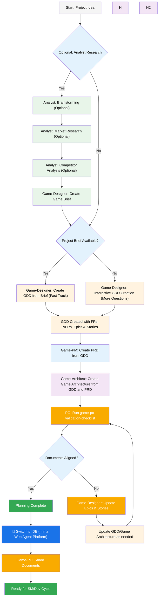
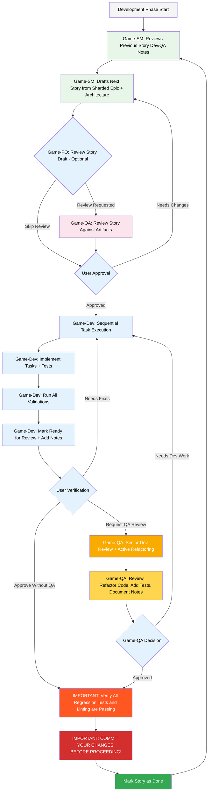

# BMAD-Method BMAD Godot Expansion User Guide

This guide will help you understand and effectively use the BMad Method Godot Expansion Pack for agile ai driven planning and development.

## The BMad Plan and Execute Workflow

**We will be following the user-guide in most cases, and modifications will be made for expansion pack specific usage**
First, here is the full standard Greenfield Planning + Execution Workflow.

### The Planning Workflow (Web UI or Powerful IDE Agents)

Before development begins, BMad follows a structured planning workflow that's ideally done in web UI for cost efficiency:



#### Web UI to IDE Transition

**Critical Transition Point**: Once the PO confirms document alignment, you must switch from web UI to IDE to begin the development workflow:

1. **Copy Documents to Project**: Ensure `docs/gdd.md` and `docs/gamearchitecture.md` are in your project's docs folder (or a custom location you can specify during installation)
2. **Switch to IDE**: Open your project in your preferred Agentic IDE
3. **Document Sharding**: Use the Game-Designer to shard the GDD and then the game-architecht to shard the gamearchitecture
4. **Begin Development**: Start the Core Development Cycle that follows

### The Core Development Cycle (IDE)

Once planning is complete and documents are sharded, BMad follows a structured development workflow:



## Installation

### Optional

If you want to do the planning in the Web with Claude (Sonnet 4 or Opus), Gemini Gem (2.5 Pro), or Custom GPT's:

1. Navigate to `dist/expansion-packs/bmad-godot-game-dev/teams`
2. Copy `godot-game-dev.txt` content
3. Create new Gemini Gem or CustomGPT
4. Upload file with instructions: "Your critical operating instructions are attached, do not break character as directed"
5. Type `/help` to see available commands

### IDE Project Setup

```bash
# Interactive installation (recommended)
npx bmad-method install
```

## Special Agents

There are two bmad agents - in the future they will be consolidated into the single bmad-master.

### BMad-Master

This agent can do any task or command that all other agents can do, aside from actual story implementation. Additionally, this agent can help explain the BMad Method when in the web by accessing the knowledge base and explaining anything to you about the process.

If you dont want to bother switching between different agents aside from the dev, this is the agent for you.

### BMad-Orchestrator

This agent should NOT be used within the IDE, it is a heavy weight special purpose agent that utilizes a lot of context and can morph into any other agent. This exists solely to facilitate the team's within the web bundles. If you use a web bundle you will be greeted by the BMad Orchestrator.

### How Agents Work

#### Dependencies System

Each agent has a YAML section that defines its dependencies:

```yaml
dependencies:
  templates:
    - prd-template.md
    - user-story-template.md
  tasks:
    - create-doc.md
    - shard-doc.md
  data:
    - bmad-kb.md
```

**Key Points:**

- Agents only load resources they need (lean context)
- Dependencies are automatically resolved during bundling
- Resources are shared across agents to maintain consistency

#### Agent Interaction

**In IDE:**

```bash
# Some Ide's, like Cursor or Windsurf for example, utilize manual rules so interaction is done with the '@' symbol
@game-designer Create a GDD for a task management app
@game-architect Design the game architecture
@game-developer Implement the user authentication

# Some, like Claude Code use slash commands instead
/game-sm Create user stories
/game-developer Fix the login bug
```

#### Interactive Modes

- **Incremental Mode**: Step-by-step with user input
- **YOLO Mode**: Rapid generation with minimal interaction

## IDE Integration

### IDE Best Practices

- **Context Management**: Keep relevant files only in context, keep files as lean and focused as necessary
- **Agent Selection**: Use appropriate agent for task
- **Iterative Development**: Work in small, focused tasks
- **File Organization**: Maintain clean project structure

## Technical Preferences System

BMad includes a personalization system through the `technical-preferences.md` file located in `.bmad-godot-game-dev/data/` - this can help bias the PM and Architect to recommend your preferences for design patterns, technology selection, or anything else you would like to put in here.

### Using with Web Bundles

When creating custom web bundles or uploading to AI platforms, include your `technical-preferences.md` content to ensure agents have your preferences from the start of any conversation.

## Core Configuration

The `.bmad-core/core-config.yaml` and for this expansion-pack the `.bmad-godot-game-dev/config.yaml` files are a critical config that enables BMad to work seamlessly with differing project structures, more options will be made available in the future. Currently the most important is the devLoadAlwaysFiles list section in the yaml.

For the expansion pack ensure you either copy the core-config.yaml.example from the expansion pack directory to replace your .bmad-core/core-config.yaml and copy it to the .bmad-unit-game-dev/ expansion pack as core-config.yaml and at the very least update the gameDimension variable to the dimension your game will be in.

### Developer Context Files

Define which files the dev agent should always load:

```yaml
devLoadAlwaysFiles:
  - docs/architecture/##-coding-standards.md
  - docs/architecture/##-tech-stack.md
  - docs/architecture/##-godot-project-structure.md
```

You will want to verify from sharding your architecture that these documents exist (replace ## with the prefix generated in sharding), that they are as lean as possible, and contain exactly the information you want your dev agent to ALWAYS load into it's context. These are the rules the agent will follow.

As your project grows and the code starts to build consistent patterns, coding standards should be reduced to just the items that the agent makes mistakes at still - must with the better models, they will look at surrounding code in files and not need a rule from that file to guide them.

## Getting Help

- **Discord Community**: [Join Discord](https://discord.gg/gk8jAdXWmj)
- **GitHub Issues**: [Report bugs](https://github.com/bmadcode/bmad-method/issues)
- **Documentation**: [Browse docs](https://github.com/bmadcode/bmad-method/docs)
- **YouTube**: [BMadCode Channel](https://www.youtube.com/@BMadCode)

## Conclusion

Remember: BMad is designed to enhance your development process, not replace your expertise. Use it as a powerful tool to accelerate your projects while maintaining control over design decisions and implementation details.
