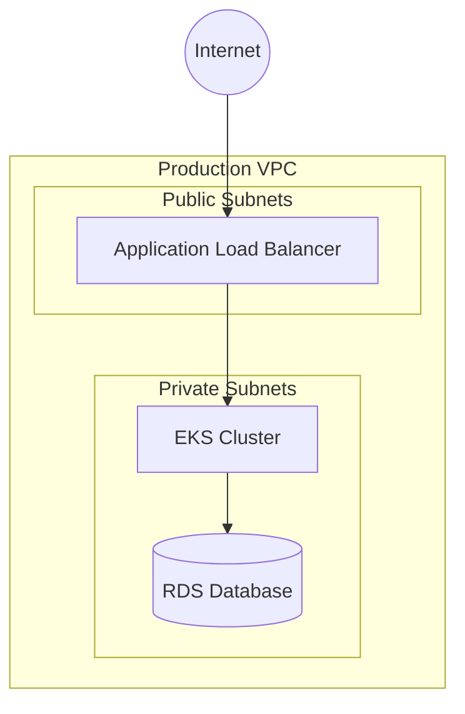

# {{Project Name}} Infrastructure Architecture

[[LLM: Initial Setup

1. Replace {{Project Name}} with the actual project name throughout the document
2. Gather and review required inputs:
   - Product Requirements Document (PRD) - Required for business needs and scale requirements
   - Main System Architecture - Required for infrastructure dependencies
   - Technical Preferences/Tech Stack Document - Required for technology choices
   - PRD Technical Assumptions - Required for cross-referencing repository and service architecture

If any required documents are missing, ask user: "I need the following documents to create a comprehensive infrastructure architecture: [list missing]. Would you like to proceed with available information or provide the missing documents first?"

3. <critical_rule>Cross-reference with PRD Technical Assumptions to ensure infrastructure decisions align with repository and service architecture decisions made in the system architecture.</critical_rule>

Output file location: `docs/infrastructure-architecture.md`]]

## Infrastructure Overview

[[LLM: Review the product requirements document to understand business needs and scale requirements. Analyze the main system architecture to identify infrastructure dependencies. Document non-functional requirements (performance, scalability, reliability, security). Cross-reference with PRD Technical Assumptions to ensure alignment with repository and service architecture decisions.]]

- Cloud Provider(s)
- Core Services & Resources
- Regional Architecture
- Multi-environment Strategy

@{example: cloud_strategy}

- **Cloud Provider:** AWS (primary), with multi-cloud capability for critical services
- **Core Services:** EKS for container orchestration, RDS for databases, S3 for storage, CloudFront for CDN
- **Regional Architecture:** Multi-region active-passive with primary in us-east-1, DR in us-west-2
- **Multi-environment Strategy:** Development, Staging, UAT, Production with identical infrastructure patterns

@{/example}

[[LLM: Infrastructure Elicitation Options
Present user with domain-specific elicitation options:
"For the Infrastructure Overview section, I can explore:

1. **Multi-Cloud Strategy Analysis** - Evaluate cloud provider options and vendor lock-in considerations
2. **Regional Distribution Planning** - Analyze latency requirements and data residency needs
3. **Environment Isolation Strategy** - Design security boundaries and resource segregation
4. **Scalability Patterns Review** - Assess auto-scaling needs and traffic patterns
5. **Compliance Requirements Analysis** - Review regulatory and security compliance needs
6. **Cost-Benefit Analysis** - Compare infrastructure options and TCO
7. **Proceed to next section**

Select an option (1-7):"]]

## Infrastructure as Code (IaC)

[[LLM: Define IaC approach based on technical preferences and existing patterns. Consider team expertise, tooling ecosystem, and maintenance requirements.]]

- Tools & Frameworks
- Repository Structure
- State Management
- Dependency Management

<critical_rule>All infrastructure must be defined as code. No manual resource creation in production environments.</critical_rule>

## Environment Configuration

[[LLM: Design environment strategy that supports the development workflow while maintaining security and cost efficiency. Reference the Environment Transition Strategy section for promotion details.]]

- Environment Promotion Strategy
- Configuration Management
- Secret Management
- Feature Flag Integration

<<REPEAT: environment>>

### {{environment_name}} Environment

- **Purpose:** {{environment_purpose}}
- **Resources:** {{environment_resources}}
- **Access Control:** {{environment_access}}
- **Data Classification:** {{environment_data_class}}

<</REPEAT>>

## Environment Transition Strategy

[[LLM: Detail the complete lifecycle of code and configuration changes from development to production. Include governance, testing gates, and rollback procedures.]]

- Development to Production Pipeline
- Deployment Stages and Gates
- Approval Workflows and Authorities
- Rollback Procedures
- Change Cadence and Release Windows
- Environment-Specific Configuration Management

## Network Architecture

[[LLM: Design network topology considering security zones, traffic patterns, and compliance requirements. Reference main architecture for service communication patterns.

Create Mermaid diagram showing:

- VPC/Network structure
- Security zones and boundaries
- Traffic flow patterns
- Load balancer placement
- Service mesh topology (if applicable)]]

- VPC/VNET Design
- Subnet Strategy
- Security Groups & NACLs
- Load Balancers & API Gateways
- Service Mesh (if applicable)

^^CONDITION: uses_service_mesh^^

### Service Mesh Architecture

- **Mesh Technology:** {{service_mesh_tech}}
- **Traffic Management:** {{traffic_policies}}
- **Security Policies:** {{mesh_security}}
- **Observability Integration:** {{mesh_observability}}

^^/CONDITION: uses_service_mesh^^

## Compute Resources

[[LLM: Select compute strategy based on application architecture (microservices, serverless, monolithic). Consider cost, scalability, and operational complexity.]]

- Container Strategy
- Serverless Architecture
- VM/Instance Configuration
- Auto-scaling Approach

^^CONDITION: uses_kubernetes^^

### Kubernetes Architecture

- **Cluster Configuration:** {{k8s_cluster_config}}
- **Node Groups:** {{k8s_node_groups}}
- **Networking:** {{k8s_networking}}
- **Storage Classes:** {{k8s_storage}}
- **Security Policies:** {{k8s_security}}

^^/CONDITION: uses_kubernetes^^

## Data Resources

[[LLM: Design data infrastructure based on data architecture from main system design. Consider data volumes, access patterns, compliance, and recovery requirements.

Create data flow diagram showing:

- Database topology
- Replication patterns
- Backup flows
- Data migration paths]]

- Database Deployment Strategy
- Backup & Recovery
- Replication & Failover
- Data Migration Strategy

## Security Architecture

[[LLM: Implement defense-in-depth strategy. Reference security requirements from PRD and compliance needs. Consider zero-trust principles where applicable.]]

- IAM & Authentication
- Network Security
- Data Encryption
- Compliance Controls
- Security Scanning & Monitoring

<critical_rule>Apply principle of least privilege for all access controls. Document all security exceptions with business justification.</critical_rule>

## Shared Responsibility Model

[[LLM: Clearly define boundaries between cloud provider, platform team, development team, and security team responsibilities. This is critical for operational success.]]

- Cloud Provider Responsibilities
- Platform Team Responsibilities
- Development Team Responsibilities
- Security Team Responsibilities
- Operational Monitoring Ownership
- Incident Response Accountability Matrix

@{example: responsibility_matrix}

| Component            | Cloud Provider | Platform Team | Dev Team       | Security Team |
| -------------------- | -------------- | ------------- | -------------- | ------------- |
| Physical Security    | ✓              | -             | -              | Audit         |
| Network Security     | Partial        | ✓             | Config         | Audit         |
| Application Security | -              | Tools         | ✓              | Review        |
| Data Encryption      | Engine         | Config        | Implementation | Standards     |

@{/example}

## Monitoring & Observability

[[LLM: Design comprehensive observability strategy covering metrics, logs, traces, and business KPIs. Ensure alignment with SLA/SLO requirements.]]

- Metrics Collection
- Logging Strategy
- Tracing Implementation
- Alerting & Incident Response
- Dashboards & Visualization

## CI/CD Pipeline

[[LLM: Design deployment pipeline that balances speed with safety. Include progressive deployment strategies and automated quality gates.

Create pipeline diagram showing:

- Build stages
- Test gates
- Deployment stages
- Approval points
- Rollback triggers]]

- Pipeline Architecture
- Build Process
- Deployment Strategy
- Rollback Procedures
- Approval Gates

^^CONDITION: uses_progressive_deployment^^

### Progressive Deployment Strategy

- **Canary Deployment:** {{canary_config}}
- **Blue-Green Deployment:** {{blue_green_config}}
- **Feature Flags:** {{feature_flag_integration}}
- **Traffic Splitting:** {{traffic_split_rules}}

^^/CONDITION: uses_progressive_deployment^^

## Disaster Recovery

[[LLM: Design DR strategy based on business continuity requirements. Define clear RTO/RPO targets and ensure they align with business needs.]]

- Backup Strategy
- Recovery Procedures
- RTO & RPO Targets
- DR Testing Approach

<critical_rule>DR procedures must be tested at least quarterly. Document test results and improvement actions.</critical_rule>

## Cost Optimization

[[LLM: Balance cost efficiency with performance and reliability requirements. Include both immediate optimizations and long-term strategies.]]

- Resource Sizing Strategy
- Reserved Instances/Commitments
- Cost Monitoring & Reporting
- Optimization Recommendations

## BMAD Integration Architecture

[[LLM: Design infrastructure to specifically support other BMAD agents and their workflows. This ensures the infrastructure enables the entire BMAD methodology.]]

### Development Agent Support

- Container platform for development environments
- GitOps workflows for application deployment
- Service mesh integration for development testing
- Developer self-service platform capabilities

### Product & Architecture Alignment

- Infrastructure implementing PRD scalability requirements
- Deployment automation supporting product iteration speed
- Service reliability meeting product SLAs
- Architecture patterns properly implemented in infrastructure

### Cross-Agent Integration Points

- CI/CD pipelines supporting Frontend, Backend, and Full Stack development workflows
- Monitoring and observability data accessible to QA and DevOps agents
- Infrastructure enabling Design Architect's UI/UX performance requirements
- Platform supporting Analyst's data collection and analysis needs

## DevOps/Platform Feasibility Review

[[LLM: CRITICAL STEP - Present architectural blueprint summary to DevOps/Platform Engineering Agent for feasibility review. Request specific feedback on:

- **Operational Complexity:** Are the proposed patterns implementable with current tooling and expertise?
- **Resource Constraints:** Do infrastructure requirements align with available resources and budgets?
- **Security Implementation:** Are security patterns achievable with current security toolchain?
- **Operational Overhead:** Will the proposed architecture create excessive operational burden?
- **Technology Constraints:** Are selected technologies compatible with existing infrastructure?

Document all feasibility feedback and concerns raised. Iterate on architectural decisions based on operational constraints and feedback.

<critical_rule>Address all critical feasibility concerns before proceeding to final architecture documentation. If critical blockers identified, revise architecture before continuing.</critical_rule>]]

### Feasibility Assessment Results

- **Green Light Items:** {{feasible_items}}
- **Yellow Light Items:** {{items_needing_adjustment}}
- **Red Light Items:** {{items_requiring_redesign}}
- **Mitigation Strategies:** {{mitigation_plans}}

## Infrastructure Verification

### Validation Framework

This infrastructure architecture will be validated using the comprehensive `infrastructure-checklist.md`, with particular focus on Section 12: Architecture Documentation Validation. The checklist ensures:

- Completeness of architecture documentation
- Consistency with broader system architecture
- Appropriate level of detail for different stakeholders
- Clear implementation guidance
- Future evolution considerations

### Validation Process

The architecture documentation validation should be performed:

- After initial architecture development
- After significant architecture changes
- Before major implementation phases
- During periodic architecture reviews

The Platform Engineer should use the infrastructure checklist to systematically validate all aspects of this architecture document.

## Implementation Handoff

[[LLM: Create structured handoff documentation for implementation team. This ensures architecture decisions are properly communicated and implemented.]]

### Architecture Decision Records (ADRs)

Create ADRs for key infrastructure decisions:

- Cloud provider selection rationale
- Container orchestration platform choice
- Networking architecture decisions
- Security implementation choices
- Cost optimization trade-offs

### Implementation Validation Criteria

Define specific criteria for validating correct implementation:

- Infrastructure as Code quality gates
- Security compliance checkpoints
- Performance benchmarks
- Cost targets
- Operational readiness criteria

### Knowledge Transfer Requirements

- Technical documentation for operations team
- Runbook creation requirements
- Training needs for platform team
- Handoff meeting agenda items

## Infrastructure Evolution

[[LLM: Document the long-term vision and evolution path for the infrastructure. Consider technology trends, anticipated growth, and technical debt management.]]

- Technical Debt Inventory
- Planned Upgrades and Migrations
- Deprecation Schedule
- Technology Roadmap
- Capacity Planning
- Scalability Considerations

## Integration with Application Architecture

[[LLM: Map infrastructure components to application services. Ensure infrastructure design supports application requirements and patterns defined in main architecture.]]

- Service-to-Infrastructure Mapping
- Application Dependency Matrix
- Performance Requirements Implementation
- Security Requirements Implementation
- Data Flow to Infrastructure Correlation
- API Gateway and Service Mesh Integration

## Cross-Team Collaboration

[[LLM: Define clear interfaces and communication patterns between teams. This section is critical for operational success and should include specific touchpoints and escalation paths.]]

- Platform Engineer and Developer Touchpoints
- Frontend/Backend Integration Requirements
- Product Requirements to Infrastructure Mapping
- Architecture Decision Impact Analysis
- Design Architect UI/UX Infrastructure Requirements
- Analyst Research Integration

## Infrastructure Change Management

[[LLM: Define structured process for infrastructure changes. Include risk assessment, testing requirements, and rollback procedures.]]

- Change Request Process
- Risk Assessment
- Testing Strategy
- Validation Procedures

[[LLM: Final Review - Ensure all sections are complete and consistent. Verify feasibility review was conducted and all concerns addressed. Apply final validation against infrastructure checklist.]]

---

_Document Version: 1.0_
_Last Updated: {{current_date}}_
_Next Review: {{review_date}}_
