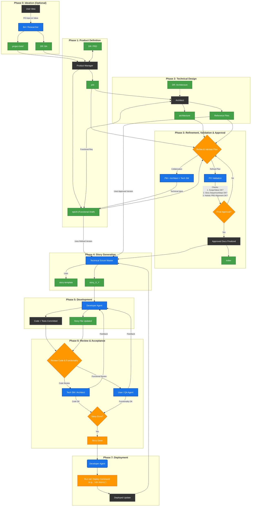

```mermaid
flowchart TD
subgraph subGraph0["Phase 0: Ideation (Optional)"]
A1["BA / Researcher"]
A0["User Idea"]
A2["project-brief"]
A3["DR: BA"]
end
subgraph subGraph1["Phase 1: Product Definition"]
B1["Product Manager"]
B2["prd"]
B3["epicN (Functional Draft)"]
B4["DR: PRD"]
end
subgraph subGraph2["Phase 2: Technical Design"]
C1["Architect"]
C2["architecture"]
C3["Reference Files"]
C4["DR: Architecture"]
end
subgraph subGraph3["Phase 3: Refinement, Validation & Approval"]
R1{"Refine & Validate Plan"}
R2["PM + Architect + Tech SM"]
R3["PO Validation"]
R4{"Final Approval?"}
R5["Approved Docs Finalized"]
R6["index"]
end
subgraph subGraph4["Phase 4: Story Generation"]
E1["Technical Scrum Master"]
E2["story-template"]
E3["story_X_Y"]
end
subgraph subGraph5["Phase 5: Development"]
F1["Developer Agent"]
F2["Code + Tests Committed"]
F3["Story File Updated"]
end
subgraph subGraph6["Phase 6: Review & Acceptance"]
G1{"Review Code & Functionality"}
G1_1["Tech SM / Architect"]
G1_2["User / QA Agent"]
G2{"Story Done?"}
G3["Story Done"]
end
subgraph subGraph7["Phase 7: Deployment"]
H1("Developer Agent")
H2@{ label: "Run IaC Deploy Command (e.g., `cdk deploy`)" }
H3["Deployed Update"]
end
A0 -- PO Input on Value --> A1
A1 --> A2 & A3
A2 --> B1
A3 --> B1
B4 <--> B1
B1 --> B2 & B3
B2 --> C1 & R1
B3 <-- Functional Req --> C1
C4 -.-> C1
C1 --> C2 & C3
B3 --> R1
C2 --> R1
C3 --> R1
R1 -- Collaboration --> R2
R2 -- Technical Input --> B3
R1 -- Refined Plan --> R3
R3 -- "Checks: <br>1. Scope/Value OK?<br>2. Story Sequence/Deps OK?<br>3. Holistic PRD Alignment OK?" --> R4
R4 -- Yes --> R5
R4 -- No --> R1
R5 --> R6 & E1
B3 -- Uses Refined Version --> E1
C3 -- Uses Approved Version --> E1
E1 -- Uses --> E2
E1 --> E3
E3 --> F1
F1 --> F2 & F3
F2 --> G1
F3 --> G1
G1 -- Code Review --> G1_1
G1 -- Functional Review --> G1_2
G1_1 -- Feedback --> F1
G1_2 -- Feedback --> F1
G1_1 -- Code OK --> G2
G1_2 -- Functionality OK --> G2
G2 -- Yes --> G3
G3 --> H1
H1 --> H2
H2 --> H3
H3 --> E1

    H2@{ shape: rect}
     A0:::default
     A1:::agent
     A2:::doc
     A3:::doc
     B1:::default
     B2:::doc
     B3:::doc
     B4:::doc
     C1:::default
     C2:::doc
     C3:::doc
     C4:::doc
     F2:::default
     F3:::doc
     H3:::default
     R1:::process
     R2:::agent
     R3:::agent
     R4:::process
     R5:::default
     R6:::doc
     E1:::agent
     E2:::doc
     E3:::doc
     F1:::agent
     G1:::process
     G1_1:::agent
     G1_2:::agent
     G2:::process
     G3:::process
     H1:::agent
     H2:::process
    classDef agent fill:#1a73e8,stroke:#0d47a1,stroke-width:2px,color:white,font-size:14px
    classDef doc fill:#43a047,stroke:#1b5e20,stroke-width:1px,color:white,font-size:14px
    classDef process fill:#ff9800,stroke:#e65100,stroke-width:1px,color:white,font-size:14px
    classDef default fill:#333333,color:white,stroke:#999999,stroke-width:1px,font-size:14px

    %% Styling for subgraphs
    classDef subGraphStyle font-size:16px,font-weight:bold
    class subGraph0,subGraph1,subGraph2,subGraph3,subGraph4,subGraph5,subGraph6,subGraph7 subGraphStyle

    %% Styling for edge labels
    linkStyle default font-size:12px
```
