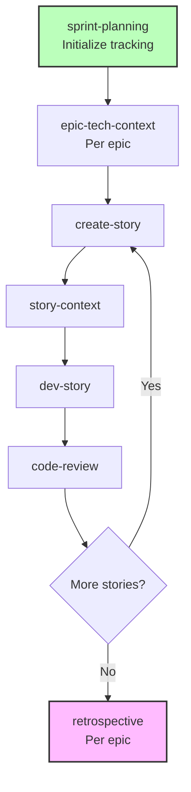
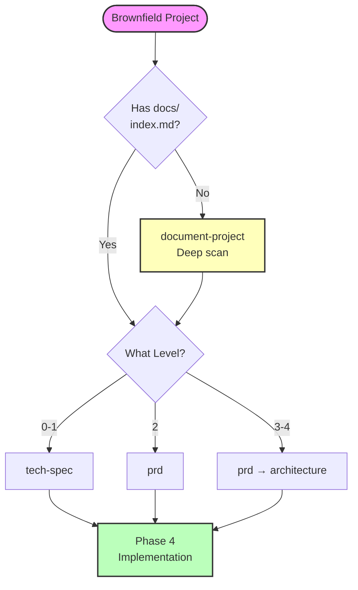

# BMad Method Brownfield Development Guide

**Complete guide for working with existing codebases**

**Reading Time:** ~35 minutes

---

## Quick Navigation

**Jump to:**

- [Quick Reference](#quick-reference) - Commands and files
- [Common Scenarios](#common-scenarios) - Real-world examples
- [Troubleshooting](#troubleshooting) - Problem solutions
- [Best Practices](#best-practices) - Success tips

---

## What is Brownfield Development?

Brownfield projects involve working within existing codebases rather than starting fresh:

- **Bug fixes** - Single file changes
- **Small features** - Adding to existing modules
- **Feature sets** - Multiple related features
- **Major integrations** - Complex architectural additions
- **System expansions** - Enterprise-scale enhancements

**Key Difference from Greenfield:** You must understand and respect existing patterns, architecture, and constraints.

**Core Principle:** AI agents need comprehensive documentation to understand existing code before they can effectively plan or implement changes.

---

## Getting Started

### Understanding Project Levels

For complete level details, see [Scale Adaptive System](./scale-adaptive-system.md).

**Brownfield levels at a glance:**

| Level | Scope                | Stories | Key Difference                     |
| ----- | -------------------- | ------- | ---------------------------------- |
| **0** | Bug fix              | 1       | Must understand affected code      |
| **1** | Small feature        | 1-10    | Respect existing patterns          |
| **2** | Feature set          | 5-15    | Integrate with architecture        |
| **3** | Complex integration  | 12-40   | Review existing architecture first |
| **4** | Enterprise expansion | 40+     | Full system documentation required |

### Level Detection for Brownfield

When you run `workflow-init`, it handles brownfield intelligently:

**Step 1: Shows what it found**

- Old planning docs (PRD, epics, stories)
- Existing codebase

**Step 2: Asks about YOUR work**

> "Are these works in progress, previous effort, or proposed work?"

- **(a) Works in progress** → Uses artifacts to determine level
- **(b) Previous effort** → Asks you to describe NEW work
- **(c) Proposed work** → Uses artifacts as guidance
- **(d) None of these** → You explain your work

**Step 3: Analyzes your description**

- Keywords: "fix" → Level 0, "add feature" → Level 1, "dashboard" → Level 2
- Story count estimation
- Confirms suggested level with you

**Key Principle:** System asks about YOUR current work first, uses old artifacts as context only.

**Example: Old Level 3 PRD, New Level 0 Work**

```
System: "Found PRD.md (Level 3, 30 stories, 6 months old)"
System: "Is this work in progress or previous effort?"
You: "Previous effort - I'm just fixing a bug now"
System: "Tell me about your current work"
You: "Update payment method enums"
System: "Level 0 brownfield. Correct?"
You: "Yes"
✅ Creates Level 0 workflow
```

---

## Phase 0: Documentation (Critical First Step)

🚨 **For brownfield projects: Always ensure adequate documentation before planning**

### Three Scenarios

| Scenario | You Have                    | Action               | Tool     | Time   |
| -------- | --------------------------- | -------------------- | -------- | ------ |
| **A**    | No documentation            | Run document-project | Workflow | 10-30m |
| **B**    | Docs exist, no index.md     | Run index-docs       | Task     | 2-5m   |
| **C**    | Complete docs with index.md | Skip Phase 0         | -        | 0m     |

### Scenario A: No Documentation

**Run document-project workflow:**

1. Load Analyst agent
2. Run "document-project"
3. Choose scan level:
   - **Quick** (2-5min): Pattern analysis, no source reading
   - **Deep** (10-30min): Reads critical paths - **Recommended**
   - **Exhaustive** (30-120min): Reads all files

**Outputs:**

- `docs/index.md` - Master AI entry point
- `docs/project-overview.md` - Executive summary
- `docs/architecture.md` - Architecture analysis
- `docs/source-tree-analysis.md` - Directory structure
- Additional files based on project type

### Scenario B: Docs Exist, No Index

**Run index-docs task:**

1. Load BMad Master agent (or any agent with task access)
2. Load task: `bmad/core/tasks/index-docs.xml`
3. Specify docs directory (e.g., `./docs`)
4. Task generates `index.md` from existing docs

**Why index.md matters:** Primary entry point for AI agents. Provides structured navigation even when good docs exist.

### Scenario C: Complete Documentation

If `docs/index.md` exists with comprehensive content, skip to Phase 1 or 2.

### Why document-project is Critical

Without it, workflows lack context:

- **tech-spec** (Level 0-1) can't auto-detect stack/patterns
- **PRD** (Level 2-4) can't reference existing code
- **architecture** (Level 3-4) can't build on existing structure
- **story-context** can't inject pattern-specific guidance

---

## Workflow Phases by Level

### Phase 1: Analysis (Optional)

**Workflows:**

- `brainstorm-project` - Solution exploration
- `research` - Technical/market research
- `product-brief` - Strategic planning

**When to use:** Complex features, technical decisions, strategic additions

**When to skip:** Bug fixes, well-understood features, time-sensitive changes

See [Workflows Guide](../workflows/README.md) for details.

### Phase 2: Planning (Required)

**Planning approach adapts by level:**

**Level 0-1:** Use `tech-spec` workflow

- Creates tech-spec.md
- Auto-detects existing stack (brownfield)
- Confirms conventions with you
- Generates implementation-ready stories

**Level 2-4:** Use `prd` workflow

- Creates PRD.md + epics.md
- References existing architecture
- Plans integration points

**Brownfield-specific:** See [Scale Adaptive System](./scale-adaptive-system.md) for complete workflow paths by level.

### Phase 3: Solutioning (Level 2-4 Only)

**Critical for brownfield:**

- Review existing architecture FIRST
- Document integration points explicitly
- Plan backward compatibility
- Consider migration strategy

**Workflows:**

- `architecture-review` - Understand existing (Level 3-4)
- `integration-planning` - Plan integration approach (Level 3-4)
- `create-architecture` - Extend architecture docs (Level 2-4)
- `solutioning-gate-check` - Validate before implementation (Level 3-4)

### Phase 4: Implementation (All Levels)

**Sprint-based development through story iteration:**



**Status Progression:**

- Epic: `backlog → contexted`
- Story: `backlog → drafted → ready-for-dev → in-progress → review → done`

**Brownfield-Specific Implementation Tips:**

1. **Respect existing patterns** - Follow established conventions
2. **Test integration thoroughly** - Validate interactions with existing code
3. **Use feature flags** - Enable gradual rollout
4. **Context injection matters** - epic-tech-context and story-context reference existing patterns

---

## Best Practices

### 1. Always Document First

Even if you know the code, AI agents need `document-project` output for context. Run it before planning.

### 2. Be Specific About Current Work

When workflow-init asks about your work:

- ✅ "Update payment method enums to include Apple Pay"
- ❌ "Fix stuff"

### 3. Choose Right Documentation Approach

- **Has good docs, no index?** → Run `index-docs` task (fast)
- **No docs or need codebase analysis?** → Run `document-project` (Deep scan)

### 4. Respect Existing Patterns

Tech-spec and story-context will detect conventions. Follow them unless explicitly modernizing.

### 5. Plan Integration Points Explicitly

Document in tech-spec/architecture:

- Which existing modules you'll modify
- What APIs/services you'll integrate with
- How data flows between new and existing code

### 6. Design for Gradual Rollout

- Use feature flags for new functionality
- Plan rollback strategies
- Maintain backward compatibility
- Create migration scripts if needed

### 7. Test Integration Thoroughly

- Regression testing of existing features
- Integration point validation
- Performance impact assessment
- API contract verification

### 8. Use Sprint Planning Effectively

- Run `sprint-planning` at Phase 4 start
- Context epics before drafting stories
- Update `sprint-status.yaml` as work progresses

### 9. Leverage Context Injection

- Run `epic-tech-context` before story drafting
- Always create `story-context` before implementation
- These reference existing patterns for consistency

### 10. Learn Continuously

- Run `retrospective` after each epic
- Incorporate learnings into next stories
- Update discovered patterns
- Share insights across team

---

## Common Scenarios

### Scenario 1: Bug Fix (Level 0)

**Situation:** Authentication token expiration causing logout issues

**Workflow:**

1. **Document:** Skip if auth system documented, else run `document-project` (Quick scan)
2. **Plan:** Load PM → run `tech-spec`
   - Analyzes bug
   - Detects stack (Express, Jest)
   - Confirms conventions
   - Creates tech-spec.md + story
3. **Implement:** Load DEV → run `dev-story`
4. **Review:** Load DEV → run `code-review`

**Time:** 2-4 hours

---

### Scenario 2: Small Feature (Level 1)

**Situation:** Add "forgot password" to existing auth system

**Workflow:**

1. **Document:** Run `document-project` (Deep scan of auth module if not documented)
2. **Plan:** Load PM → run `tech-spec`
   - Detects Next.js 13.4, NextAuth.js
   - Analyzes existing auth patterns
   - Confirms conventions
   - Creates tech-spec.md + epic + 3-5 stories
3. **Implement:** Load SM → `sprint-planning` → `create-story` → `story-context`
   Load DEV → `dev-story` for each story
4. **Review:** Load DEV → `code-review`

**Time:** 1-3 days

---

### Scenario 3: Feature Set (Level 2)

**Situation:** Add user dashboard with analytics, preferences, activity

**Workflow:**

1. **Document:** Run `document-project` (Deep scan) - Critical for understanding existing UI patterns
2. **Analyze:** Load Analyst → `research` (if evaluating analytics libraries)
3. **Plan:** Load PM → `prd`
4. **Implement:** Sprint-based (10-15 stories)
   - Load SM → `sprint-planning`
   - Per epic: `epic-tech-context` → stories
   - Load DEV → `dev-story` per story
5. **Review:** Per story completion

**Time:** 1-2 weeks

---

### Scenario 4: Complex Integration (Level 3)

**Situation:** Add real-time collaboration to document editor

**Workflow:**

1. **Document:** Run `document-project` (Exhaustive if not documented) - **Mandatory**
2. **Analyze:** Load Analyst → `research` (WebSocket vs WebRTC vs CRDT)
3. **Plan:** Load PM → `prd`
4. **Solution:**
   - Load Architect → `architecture-review` (understand existing editor)
   - Load Architect → `integration-planning` (WebSocket integration strategy)
   - Load Architect → `create-architecture` (extend for real-time layer)
   - Load Architect → `solutioning-gate-check`
5. **Implement:** Sprint-based (20-30 stories)

**Time:** 3-6 weeks

---

### Scenario 5: Enterprise Expansion (Level 4)

**Situation:** Add multi-tenancy to single-tenant SaaS platform

**Workflow:**

1. **Document:** Run `document-project` (Exhaustive) - **Mandatory**
2. **Analyze:** **Required**
   - `brainstorm-project` - Explore multi-tenancy approaches
   - `research` - Database sharding, tenant isolation, pricing
   - `product-brief` - Strategic document
3. **Plan:** Load PM → `prd` (comprehensive)
4. **Solution:**
   - `architecture-review` - Full system review
   - `integration-planning` - Phased migration strategy
   - `create-architecture` - Multi-tenancy architecture
   - `validate-architecture` - External review
   - `solutioning-gate-check` - Executive approval
5. **Implement:** Phased sprint-based (50+ stories)

**Time:** 3-6 months

---

## Troubleshooting

For complete troubleshooting, see [Troubleshooting Guide](./troubleshooting.md).

### AI Agents Lack Codebase Understanding

**Symptoms:**

- Suggestions don't align with existing patterns
- Ignores available components
- Doesn't reference existing code

**Solution:**

1. Run `document-project` with Deep scan
2. Verify `docs/index.md` exists
3. Check documentation completeness
4. Run deep-dive on specific areas if needed

### Have Documentation But Agents Can't Find It

**Symptoms:**

- README.md, ARCHITECTURE.md exist
- AI agents ask questions already answered
- No `docs/index.md` file

**Solution:**

- **Quick fix:** Run `index-docs` task (2-5min)
- **Comprehensive:** Run `document-project` workflow (10-30min)

### Integration Points Unclear

**Symptoms:**

- Not sure how to connect new code to existing
- Unsure which files to modify

**Solution:**

1. Ensure `document-project` captured existing architecture
2. Check `story-context` - should document integration points
3. In tech-spec/architecture - explicitly document:
   - Which existing modules to modify
   - What APIs/services to integrate with
   - Data flow between new and existing code
4. Run `integration-planning` workflow (Level 3-4)

### Existing Tests Breaking

**Symptoms:**

- Regression test failures
- Previously working functionality broken

**Solution:**

1. Review changes against existing patterns
2. Verify API contracts unchanged (unless intentionally versioned)
3. Run `test-review` workflow (TEA agent)
4. Add regression testing to DoD
5. Consider feature flags for gradual rollout

### Inconsistent Patterns Being Introduced

**Symptoms:**

- New code style doesn't match existing
- Different architectural approach

**Solution:**

1. Check convention detection (Quick Spec Flow should detect patterns)
2. Review documentation - ensure `document-project` captured patterns
3. Use `story-context` - injects pattern guidance
4. Add to code-review checklist: pattern adherence, convention consistency
5. Run retrospective to identify deviations early

---

## Quick Reference

### Commands by Phase

```bash
# Phase 0: Documentation (If Needed)
# Analyst agent:
document-project        # Create comprehensive docs (10-30min)
# OR load index-docs task for existing docs (2-5min)

# Phase 1: Analysis (Optional)
# Analyst agent:
brainstorm-project      # Explore solutions
research                # Gather data
product-brief           # Strategic planning

# Phase 2: Planning (Required)
# PM agent:
tech-spec               # Level 0-1
prd                     # Level 2-4

# Phase 3: Solutioning (Level 2-4)
# Architect agent:
architecture-review          # Review existing (L3-4)
integration-planning         # Plan integration (L3-4)
create-architecture          # Extend architecture (L2-4)
solutioning-gate-check       # Final approval (L3-4)

# Phase 4: Implementation (All Levels)
# SM agent:
sprint-planning              # Initialize tracking
epic-tech-context            # Epic context
create-story                 # Draft story
story-context                # Story context

# DEV agent:
dev-story                    # Implement
code-review                  # Review

# SM agent:
retrospective                # After epic
correct-course               # If issues
```

### Key Files

**Phase 0 Output:**

- `docs/index.md` - **Master AI entry point (REQUIRED)**
- `docs/project-overview.md`
- `docs/architecture.md`
- `docs/source-tree-analysis.md`

**Phase 1-3 Tracking:**

- `docs/bmm-workflow-status.md` - Progress tracker

**Phase 2 Planning:**

- `docs/tech-spec.md` (Level 0-1)
- `docs/PRD.md` (Level 2-4)
- `docs/epics.md` (Level 2-4)

**Phase 3 Architecture:**

- `docs/architecture.md` (Level 2-4)

**Phase 4 Implementation:**

- `docs/sprint-status.yaml` - **Single source of truth**
- `docs/epic-{n}-context.md`
- `docs/stories/{epic}-{story}-{title}.md`
- `docs/stories/{epic}-{story}-{title}-context.md`

### Decision Flowchart



---

## Prevention Tips

**Avoid issues before they happen:**

1. ✅ **Always run document-project for brownfield** - Saves context issues later
2. ✅ **Use fresh chats for complex workflows** - Prevents hallucinations
3. ✅ **Verify files exist before workflows** - Check PRD, epics, stories present
4. ✅ **Read agent menu first** - Confirm agent has the workflow
5. ✅ **Start with smaller level if unsure** - Easy to upgrade (L1 → L2)
6. ✅ **Keep status files updated** - Manual updates when needed
7. ✅ **Run retrospectives after epics** - Catch issues early
8. ✅ **Follow phase sequence** - Don't skip required phases

---

## Related Documentation

- **[Scale Adaptive System](./scale-adaptive-system.md)** - Understanding levels and complexity
- **[Quick Spec Flow](./quick-spec-flow.md)** - Fast-track for Level 0-1
- **[Quick Start Guide](./quick-start.md)** - Getting started with BMM
- **[Glossary](./glossary.md)** - Key terminology
- **[FAQ](./faq.md)** - Common questions
- **[Troubleshooting](./troubleshooting.md)** - Problem resolution
- **[Workflows Guide](../workflows/README.md)** - Complete workflow reference

---

## Support & Resources

**Community:**

- [Discord](https://discord.gg/gk8jAdXWmj) - #general-dev, #bugs-issues
- [GitHub Issues](https://github.com/bmad-code-org/BMAD-METHOD/issues)
- [YouTube Channel](https://www.youtube.com/@BMadCode)

**Documentation:**

- [BMM Workflows Guide](../workflows/README.md)
- [Test Architect Guide](../testarch/README.md)
- [BMM Module README](../README.md)

---

_Brownfield development is about understanding and respecting what exists while thoughtfully extending it._
