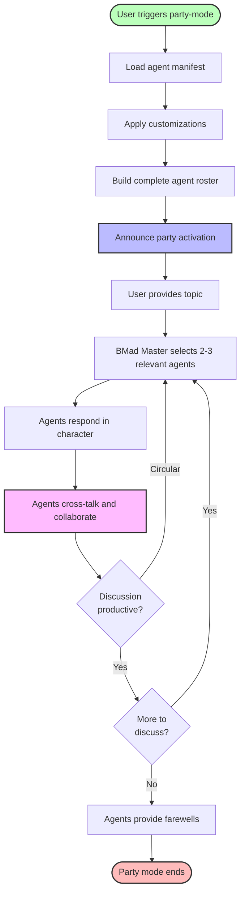

# Party Mode: Multi-Agent Collaboration

**Orchestrate group discussions with all your AI agents**

**Reading Time:** ~20 minutes

---

## Table of Contents

- [What is Party Mode?](#what-is-party-mode)
- [How It Works](#how-it-works)
- [When to Use Party Mode](#when-to-use-party-mode)
- [Getting Started](#getting-started)
- [Agent Selection & Dynamics](#agent-selection--dynamics)
- [Multi-Module Integration](#multi-module-integration)
- [Example Party Compositions](#example-party-compositions)
- [Agent Customization in Party Mode](#agent-customization-in-party-mode)
- [Best Practices](#best-practices)
- [Troubleshooting](#troubleshooting)

---

## What is Party Mode?

Party mode is a unique workflow that brings **all your installed agents together** for group discussions. Instead of working with one agent at a time, you engage with a dynamic team that collaborates in real-time.

**Key Concept:** Multiple AI agents with different expertise discuss your challenges together, providing diverse perspectives, healthy debate, and emergent insights.

### Quick Facts

- **Trigger:** Load BMad Master and run `*party-mode`
- **Agents Included:** ALL installed agents from ALL modules (BMM, CIS, BMB, custom)
- **Selection:** 2-3 most relevant agents respond per message
- **Customization:** Respects all agent customizations
- **Moderator:** BMad Master orchestrates and moderates

---

## How It Works

### The Party Mode Process



### Step-by-Step Breakdown

#### 1. Agent Loading

**Process:**

- Reads `{project-root}/bmad/_cfg/agent-manifest.csv`
- Loads ALL installed agents with their complete personalities:
  - name (identifier: "pm", "analyst", "storyteller")
  - displayName (persona name: "John", "Mary")
  - title (formal position)
  - icon (emoji representation)
  - role (one-line capability summary)
  - identity (background paragraph)
  - communicationStyle (how they speak)
  - principles (decision-making philosophy)
  - module (bmm, cis, bmb, core, custom)
  - path (file location)

**Result:** Complete roster of all available agents with their default personalities.

#### 2. Customization Application

**Process:**

- For each agent, checks for customization file:
  - Path: `{project-root}/bmad/_cfg/agents/{module}-{agent-name}.customize.yaml`
  - Example: `bmm-pm.customize.yaml`, `cis-storyteller.customize.yaml`
- Merges customization with manifest data
- **Override precedence:** Customization > Manifest

**Examples:**

```yaml
# bmad/_cfg/agents/bmm-pm.customize.yaml
agent:
  persona:
    communicationStyle: 'Formal and corporate-focused'
    principles:
      - 'HIPAA compliance is non-negotiable'
```

**Result:** All agents loaded with their final, customized personalities.

#### 3. Party Activation

**Process:**

- BMad Master announces party mode activation
- Lists all participating agents by name and role
- Welcomes user to the conversation
- Waits for user to introduce topic

**Example Announcement:**

```
🧙 BMad Master has activated Party Mode!

Participating Agents:
📋 PM (John) - Product Strategy
📊 Analyst (Mary) - Research & Requirements
🏗️ Architect (Winston) - System Design
🎨 UX Designer (Sally) - User Experience
🎲 Game Designer (Samus Shepard) - Creative Vision
💡 Innovation Strategist - Disruption & Strategy
📖 Storyteller - Narrative & Communication

What would you like to discuss?
```

#### 4. Dynamic Agent Selection

**For each user message, BMad Master:**

1. Analyzes the message topic and context
2. Reviews all agent roles and expertise
3. Selects 2-3 most relevant agents
4. Considers conversation history (which agents spoke recently)
5. Ensures diverse perspectives

**Selection Criteria:**

- **Expertise Match:** Agent's role aligns with topic
- **Principle Alignment:** Agent's principles are relevant
- **Context Awareness:** Previous discussion flow
- **Diversity:** Mix of perspectives (technical + creative, strategic + tactical)

**Example Selection:**

```
User: "How should we handle user authentication for our healthcare app?"

BMad Master selects:
- Architect (technical security expertise)
- PM (compliance and requirements)
- UX Designer (user experience balance)
```

#### 5. Agent Responses

**Each selected agent:**

- Responds **in character** using their merged personality
- Applies their communication style
- References their expertise and principles
- Can ask clarifying questions
- Can reference other agents' points

**Example Exchange:**

```
Architect (Winston): "Healthcare authentication requires HIPAA compliance.
I recommend OAuth 2.0 with MFA and audit logging. We should also consider..."

PM (John): "Building on Winston's point, we need to document compliance
in the PRD. Mary, have we researched HIPAA requirements yet?"

UX Designer (Sally): "From a user perspective, MFA can't add friction
for clinicians in emergency scenarios. We need conditional requirements..."
```

#### 6. Natural Cross-Talk

**Agents can:**

- **Build on each other's points:** "Expanding on what Architect said..."
- **Respectfully disagree:** "I see Sally's concern, but I think..."
- **Ask each other questions:** "Winston, how would that affect performance?"
- **Reference user input:** "As you mentioned earlier..."
- **Synthesize perspectives:** "Both approaches have merit. The trade-off is..."

**Key Feature:** Agents debate naturally, creating **emergent insights** from their interaction.

#### 7. Active Moderation

**BMad Master monitors:**

- Discussion productivity
- Circular arguments
- Completion signals

**Moderator Actions:**

- **If circular:** Summarizes discussion, redirects to new aspect
- **If stuck:** Suggests specific angles to explore
- **If questions:** Ensures user input is sought
- **If complete:** Recognizes natural conclusion

**Example Moderation:**

```
BMad Master: "The discussion has circled back to authentication methods.
Let me summarize the three approaches proposed:
1. OAuth 2.0 + MFA (Architect)
2. SSO with conditional MFA (UX Designer)
3. Biometric + PIN fallback (PM)

Which aspects would you like the team to explore deeper?
Or are you ready to make a decision?"
```

#### 8. Graceful Exit

**Party mode ends when:**

- User triggers exit command ("exit", "end party", "done")
- Natural conclusion reached
- User stops responding

**Exit Process:**

1. BMad Master signals party conclusion
2. 2-3 agents provide characteristic farewells
3. Party mode cleanly exits

**Example Farewell:**

```
PM (John): "Great session. I'll document these decisions in the PRD."

UX Designer (Sally): "Excited to design the auth flow. Let's keep
the user at the center!"

BMad Master: "Party mode concluded. The agents stand ready for
individual consultation when needed."
```

---

## When to Use Party Mode

### Strategic Discussions

**Best for decisions with:**

- Multiple stakeholders (technical, business, user)
- Trade-offs to balance (cost, time, quality, UX)
- Long-term implications
- Cross-functional impact

**Examples:**

- Product vision and market positioning
- Architecture approach selection
- Technology stack decisions
- Scope and priority negotiations
- Phase transition planning

**Why party mode helps:**

- Technical agents ground creative ideas in reality
- Strategic agents ensure market fit
- UX agents advocate for user needs
- Multiple perspectives reveal blind spots

---

### Creative Sessions

**Best for:**

- Ideation without constraints
- Exploring multiple solution approaches
- Narrative and storytelling development
- Innovation and novel ideas
- Design thinking exercises

**Examples:**

- Game design concept exploration
- Narrative worldbuilding
- UX ideation and flows
- Problem-solving brainstorms
- Feature innovation

**Why party mode helps:**

- CIS agents bring creative frameworks
- BMM agents ensure implementability
- Cross-pollination of ideas across domains
- "Yes, and..." collaborative building

---

### Cross-Functional Alignment

**Best for:**

- Getting entire team on same page
- Phase transitions
- Epic kickoffs
- Retrospectives with multiple perspectives
- Quality gate reviews

**Examples:**

- Analysis → Planning transition
- Planning → Solutioning alignment
- Solutioning → Implementation readiness
- Sprint retrospectives
- Course correction decisions

**Why party mode helps:**

- Everyone hears same information
- Concerns raised immediately
- Consensus built through discussion
- Handoffs are clear

---

### Complex Problem Solving

**Best for:**

- Multi-faceted challenges
- No obvious solution
- High risk or uncertainty
- Novel situations
- Constraint optimization

**Examples:**

- Performance + scalability + cost optimization
- Technical debt vs. feature velocity
- Legacy system migration strategy
- Multi-platform architecture
- Real-time collaboration architecture

**Why party mode helps:**

- Diverse expertise identifies constraints
- Trade-offs made explicit
- Creative + pragmatic balance
- Risk assessment from multiple angles

---

## Getting Started

### Quick Start Guide

**1. Load BMad Master**

```
In your IDE (Claude Code, Cursor, Windsurf):
Type: @bmad-master
Wait for menu to appear
```

**2. Trigger Party Mode**

```
Type: *party-mode
Press enter
```

**3. Review Agent Roster**

```
BMad Master lists all participating agents
Includes agents from BMM, CIS, BMB, and custom modules
```

**4. Introduce Your Topic**

```
State your challenge, question, or goal
Be specific: "We need to decide..." vs "I want to talk about..."
Context helps: Mention project type, constraints, goals
```

**5. Engage with Agents**

```
2-3 agents will respond to your topic
Answer their questions
Respond to their suggestions
Ask follow-up questions
```

**6. Direct the Discussion**

```
Guide focus: "Let's explore X in more detail"
Seek specific perspectives: "Architect, what about performance?"
Make decisions: "I'm leaning toward approach B because..."
```

**7. Conclude**

```
Type: "exit" or "end party" or "done"
Or let conversation reach natural conclusion
Agents will provide farewells
```

### Your First Party Mode Session

**Recommended first topic:**

```
"I'm starting a [project type] and need help deciding between
[option A] and [option B] for [specific aspect]."

Example:
"I'm starting a SaaS web app and need help deciding between
monolith and microservices for our initial MVP."
```

**What to expect:**

- Architect discusses technical implications
- PM discusses business and timeline implications
- DEV discusses implementation complexity
- Possibly Innovation Strategist on competitive differentiation

**Duration:** 10-20 minutes typically

---

## Agent Selection & Dynamics

### How Agents Are Selected

**Per message, BMad Master considers:**

1. **Topic Keywords:**
   - "authentication" → Architect, DEV
   - "user experience" → UX Designer
   - "market positioning" → PM, Innovation Strategist
   - "narrative" → Game Designer, Storyteller

2. **Agent Roles:**
   - Match expertise to topic
   - Balance technical and creative
   - Include strategic when appropriate

3. **Conversation Context:**
   - What was just discussed
   - Which agents spoke recently
   - What perspectives are missing

4. **Diversity:**
   - Avoid same 2 agents every time
   - Rotate in different perspectives
   - Ensure cross-functional views

### Response Dynamics

**Typical Pattern:**

```
User Message
  ↓
Agent 1 (Primary perspective)
  ↓
Agent 2 (Complementary perspective)
  ↓
Agent 3 (Optional: Third angle or synthesis)
  ↓
User Response (clarification, decision, new question)
```

**Cross-Talk Examples:**

**Building Agreement:**

```
Architect: "We should use PostgreSQL for transactional data."
DEV: "Agreed. I've worked with Postgres extensively, and it's
excellent for this use case."
```

**Respectful Disagreement:**

```
UX Designer: "Users will find that flow confusing."
PM: "I hear Sally's concern, but our user research shows
power users prefer efficiency over simplicity."
UX Designer: "That's fair. Could we offer both modes?"
```

**Cross-Pollination:**

```
Innovation Strategist: "What if we made this social?"
Game Designer: "Building on that - gamification could drive engagement."
UX Designer: "I can design for both. Leaderboards with privacy controls."
```

### Emergent Insights

**What makes party mode powerful:**

1. **Perspective Collision:**
   - Technical meets creative
   - Strategic meets tactical
   - Ideal meets pragmatic

2. **Healthy Debate:**
   - Agents challenge assumptions
   - Trade-offs made explicit
   - Better decisions through conflict

3. **Synthesis:**
   - Agents combine ideas
   - Novel solutions emerge
   - "Best of both" approaches

4. **Blind Spot Detection:**
   - Each agent sees different risks
   - Missing considerations surface
   - Comprehensive coverage

---

## Multi-Module Integration

### Available Agent Pool

Party mode loads agents from **all installed modules:**

#### BMad Core (1 agent)

- **BMad Master** - Orchestrator and facilitator

#### BMM - BMad Method (12 agents)

**Core Development:**

- PM (Product Manager)
- Analyst (Business Analyst)
- Architect (System Architect)
- SM (Scrum Master)
- DEV (Developer)
- TEA (Test Architect)
- UX Designer
- Paige (Documentation Guide)

**Game Development:**

- Game Designer
- Game Developer
- Game Architect

#### CIS - Creative Intelligence Suite (5 agents)

- Brainstorming Coach
- Creative Problem Solver
- Design Thinking Coach
- Innovation Strategist
- Storyteller

#### BMB - BMad Builder (1 agent)

- BMad Builder

#### Custom Modules

- Any custom agents you've created

**Total Potential:** 19+ agents available for party mode

### Cross-Module Collaboration

**The Power of Mixing Modules:**

**Example 1: Product Innovation**

```
Agents: PM (BMM) + Innovation Strategist (CIS) + Storyteller (CIS)
Topic: Market positioning and product narrative
Outcome: Strategic positioning with compelling story
```

**Example 2: Complex Architecture**

```
Agents: Architect (BMM) + Creative Problem Solver (CIS) + Game Architect (BMM)
Topic: Novel pattern design for real-time collaboration
Outcome: Innovative solution balancing creativity and pragmatism
```

**Example 3: User-Centered Design**

```
Agents: UX Designer (BMM) + Design Thinking Coach (CIS) + Storyteller (CIS)
Topic: Empathy-driven UX with narrative flow
Outcome: User journey that tells a story
```

**Example 4: Testing Strategy**

```
Agents: TEA (BMM) + Architect (BMM) + Problem Solver (CIS)
Topic: Comprehensive quality approach
Outcome: Risk-based testing with creative coverage strategies
```

### Module Discovery

**How party mode finds agents:**

1. **Manifest Read:** Parses `agent-manifest.csv`
2. **Module Column:** Each agent tagged with source module
3. **Path Validation:** Checks agent file exists
4. **Personality Load:** Loads complete agent data
5. **All Modules:** No filtering - all agents included

**Result:** Seamless cross-module teams without manual configuration.

---

## Example Party Compositions

### 1. Strategic Product Planning

**Participants:**

- PM (John) - Product requirements
- Innovation Strategist - Market disruption
- Storyteller - Product narrative

**Best For:**

- Product vision definition
- Market positioning
- Value proposition design
- Competitive differentiation

**Example Topic:**
"We're launching a project management tool. How do we differentiate in a crowded market?"

**Expected Dynamics:**

- Innovation Strategist identifies disruption opportunities
- PM grounds in market realities and user needs
- Storyteller crafts compelling narrative positioning

---

### 2. Technical Architecture Deep-Dive

**Participants:**

- Architect (Winston) - System design
- Game Architect (Cloud Dragonborn) - Complex systems
- Creative Problem Solver - Novel approaches

**Best For:**

- Complex system design
- Novel pattern invention
- Performance optimization
- Scalability challenges

**Example Topic:**
"We need real-time collaboration with 10,000 concurrent users. What's the architecture approach?"

**Expected Dynamics:**

- Architects debate technical approaches (WebSocket, WebRTC, CRDT)
- Creative Problem Solver suggests novel patterns
- Synthesis of proven + innovative solutions

---

### 3. User Experience Innovation

**Participants:**

- UX Designer (Sally) - Interaction design
- Design Thinking Coach - Empathy-driven process
- Storyteller - User journey narrative

**Best For:**

- UX-heavy feature design
- User journey mapping
- Accessibility considerations
- Interaction innovation

**Example Topic:**
"Design an onboarding experience that feels magical, not overwhelming."

**Expected Dynamics:**

- Design Thinking Coach facilitates empathy exploration
- UX Designer translates to concrete interactions
- Storyteller ensures narrative flow

---

### 4. Game Design Session

**Participants:**

- Game Designer (Samus Shepard) - Core gameplay
- Storyteller - Narrative design
- Brainstorming Coach - Creative ideation

**Best For:**

- Game concept development
- Narrative worldbuilding
- Mechanic innovation
- Player experience design

**Example Topic:**
"Create a puzzle game where players feel clever, not frustrated."

**Expected Dynamics:**

- Game Designer focuses on core loop and progression
- Storyteller layers narrative meaning
- Brainstorming Coach generates mechanic variations

---

### 5. Quality & Testing Strategy

**Participants:**

- TEA (Murat) - Testing expertise
- Architect (Winston) - System testability
- Problem Solver - Creative coverage

**Best For:**

- Test strategy planning
- Quality gate definition
- Risk assessment
- Coverage optimization

**Example Topic:**
"Define testing strategy for a microservices architecture."

**Expected Dynamics:**

- TEA defines comprehensive approach
- Architect ensures architectural testability
- Problem Solver identifies creative coverage strategies

---

### 6. Epic Kickoff

**Participants:**

- PM (John) - Requirements clarity
- Architect (Winston) - Technical approach
- SM (Bob) - Story breakdown
- DEV (Amelia) - Implementation feasibility

**Best For:**

- Epic planning sessions
- Technical feasibility assessment
- Story scope validation
- Implementation approach alignment

**Example Topic:**
"Epic kickoff: Real-time notifications system"

**Expected Dynamics:**

- PM clarifies requirements and success criteria
- Architect proposes technical approach
- DEV validates implementation feasibility
- SM plans story breakdown

---

### 7. Documentation & Knowledge

**Participants:**

- Paige - Documentation standards
- Analyst (Mary) - Information architecture
- PM (John) - Requirements documentation

**Best For:**

- Documentation strategy
- Knowledge transfer planning
- API documentation approach
- Architectural decision records

**Example Topic:**
"Document this brownfield codebase for AI-assisted development."

**Expected Dynamics:**

- Paige defines documentation standards
- Analyst structures information architecture
- PM ensures requirements traceability

---

### 8. Creative Brainstorming (Pure CIS)

**Participants:**

- Brainstorming Coach
- Creative Problem Solver
- Innovation Strategist
- Storyteller

**Best For:**

- Pure ideation
- Innovation exploration
- Creative problem solving
- Strategic thinking

**Example Topic:**
"How can we disrupt the email newsletter industry?"

**Expected Dynamics:**

- Multiple creative frameworks applied
- Diverse ideation techniques
- Strategic + creative synthesis
- Narrative framing of ideas

---

## Agent Customization in Party Mode

### How Customization Works

**Customization Files:**

- Location: `{project-root}/bmad/_cfg/agents/`
- Naming: `{module}-{agent-name}.customize.yaml`
- Format: YAML with persona overrides

**Example Structure:**

```yaml
agent:
  persona:
    displayName: 'Custom Name' # Optional
    communicationStyle: 'Custom style' # Optional
    principles: # Optional
      - 'Project-specific principle'
```

### Override Precedence

**Loading Order:**

1. Read agent from manifest (default personality)
2. Check for customization file
3. If exists, merge with manifest
4. **Customization values override manifest values**
5. Unspecified fields use manifest defaults

**Result:** Agents use customized personalities in party mode.

### Common Customization Use Cases

#### 1. Domain-Specific Expertise

**Add healthcare expertise to PM:**

```yaml
# bmad/_cfg/agents/bmm-pm.customize.yaml
agent:
  persona:
    identity: |
      Product Manager with 15 years in healthcare SaaS.
      Expert in HIPAA compliance, EHR integrations, and clinical workflows.
      Balances regulatory requirements with user experience.
    principles:
      - 'HIPAA compliance is non-negotiable'
      - 'Patient safety over feature velocity'
      - 'Clinical validation for every feature'
```

**In Party Mode:**

```
PM now brings healthcare expertise to all discussions.
Architect and PM can debate HIPAA-compliant architecture.
UX Designer and PM can discuss clinical usability.
```

#### 2. Communication Style

**Make Architect more casual:**

```yaml
# bmad/_cfg/agents/bmm-architect.customize.yaml
agent:
  persona:
    communicationStyle: |
      Friendly and approachable. Uses analogies and real-world examples.
      Avoids jargon. Explains complex concepts simply.
```

**In Party Mode:**
Architect's responses are more accessible to non-technical stakeholders.

#### 3. Project-Specific Principles

**Add startup constraints:**

```yaml
# bmad/_cfg/agents/bmm-pm.customize.yaml
agent:
  persona:
    principles:
      - 'MVP > perfect - ship fast, iterate'
      - 'Technical debt is acceptable for validation'
      - 'Focus on one metric that matters'
```

**In Party Mode:**
PM pushes for rapid iteration, affecting all strategic discussions.

#### 4. Cross-Project Consistency

**Add company standards:**

```yaml
# bmad/_cfg/agents/bmm-architect.customize.yaml
agent:
  persona:
    principles:
      - 'AWS-only for all services (company policy)'
      - 'TypeScript required for all projects'
      - 'Microservices for all new systems'
```

**In Party Mode:**
Architect enforces company standards, reducing technology debates.

### Testing Customizations

**Best way to see customizations in action:**

1. Create customization file
2. Load BMad Master
3. Run `*party-mode`
4. Introduce topic relevant to customized agent
5. See agent respond with customized personality

**Example Test:**

```
Customize PM with healthcare expertise
↓
Run party mode
↓
Topic: "User authentication approach"
↓
PM discusses HIPAA-compliant auth (customization active)
```

---

## Best Practices

### Effective Party Mode Usage

**1. Start with Clear Topics**

```
❌ "I want to talk about my app"
✅ "I need to decide between REST and GraphQL for our mobile API"

❌ "Architecture stuff"
✅ "What's the best caching strategy for read-heavy microservices?"
```

**2. Provide Context**

```
Good Opening:
"We're building a SaaS CRM for SMBs. Current tech stack: Next.js, Postgres.
We need to add real-time notifications. What approach should we use?"

Includes: Project type, constraints, specific question
```

**3. Engage Actively**

```
When agents respond:
- Answer their questions
- React to their suggestions
- Ask follow-up questions
- Make decisions when ready
- Challenge assumptions
```

**4. Direct When Needed**

```
Useful phrases:
- "Let's focus on X aspect first"
- "Architect, how would that affect performance?"
- "I'm concerned about Y - what do you think?"
- "Can we explore option B in more detail?"
```

**5. Use for Right Scenarios**

```
Great for party mode:
✅ Strategic decisions
✅ Trade-off discussions
✅ Creative brainstorming
✅ Cross-functional alignment

Not ideal for party mode:
❌ Simple questions (use single agent)
❌ Implementation details (use DEV)
❌ Document review (use specific agent)
```

### Getting the Most Value

**1. Embrace Debate**

- Healthy disagreement leads to better decisions
- Different perspectives reveal blind spots
- Synthesis often better than any single view

**2. Make Decisions**

- Party mode informs, you decide
- Don't wait for consensus (rarely happens)
- Choose approach and move forward
- Document decision rationale

**3. Time Box**

- Most productive discussions: 15-30 minutes
- If longer, consider breaking into focused sessions
- Circular discussions signal completion

**4. Customize Strategically**

- Add domain expertise when relevant
- Keep project constraints in mind
- Don't over-customize (agents have good defaults)

**5. Follow Up**

- Use decisions in single-agent workflows
- Document outcomes in planning docs
- Reference party mode insights in architecture

---

## Troubleshooting

### Common Issues

**Issue: Same agents responding every time**

**Cause:** Topic consistently matches same expertise areas

**Solution:**

- Vary your questions to engage different agents
- Explicitly request perspectives: "Game Designer, your thoughts?"
- Ask about different aspects of same topic

---

**Issue: Discussion becomes circular**

**Cause:** Fundamental disagreement or insufficient information

**Solution:**

- BMad Master will summarize and redirect
- You can decide between options
- Acknowledge need for more research/data
- Table decision for later

---

**Issue: Agents not using customizations**

**Cause:** Customization file not found or malformed YAML

**Solution:**

1. Check file location: `bmad/_cfg/agents/{module}-{agent-name}.customize.yaml`
2. Validate YAML syntax (no tabs, proper indentation)
3. Verify module prefix matches (bmm-, cis-, bmb-)
4. Reload party mode

---

**Issue: Too many agents responding**

**Cause:** Topic is broad or matches many expertise areas

**Solution:**

- Make topic more specific
- Focus on one aspect at a time
- BMad Master limits to 2-3 agents per message

---

**Issue: Party mode feels overwhelming**

**Cause:** First time, unfamiliar with agent personalities

**Solution:**

- Start with focused topics
- Read [Agents Guide](./agents-guide.md) first
- Try 1-2 party sessions before complex topics
- Remember: You control the direction

---

## Related Documentation

**Agent Information:**

- [Agents Guide](./agents-guide.md) - Complete agent reference with all 12 BMM agents + BMad Master
- [Glossary](./glossary.md) - Key terminology including agent roles

**Getting Started:**

- [Quick Start Guide](./quick-start.md) - Introduction to BMM
- [FAQ](./faq.md) - Common questions about agents and workflows

**Team Collaboration:**

- [Enterprise Agentic Development](./enterprise-agentic-development.md) - Multi-developer teams and coordination

**Workflow Guides:**

- [Phase 1: Analysis Workflows](./workflows-analysis.md)
- [Phase 2: Planning Workflows](./workflows-planning.md)
- [Phase 3: Solutioning Workflows](./workflows-solutioning.md)
- [Phase 4: Implementation Workflows](./workflows-implementation.md)
- [Testing & QA Workflows](./workflows-testing.md)

---

## Quick Reference

### Party Mode Commands

```bash
# Start party mode
Load BMad Master → *party-mode

# During party mode
Type your topic/question
Respond to agents
Direct specific agents

# Exit party mode
"exit"
"end party"
"done"
```

### When to Use

| Scenario                           | Use Party Mode? | Alternative                              |
| ---------------------------------- | --------------- | ---------------------------------------- |
| Strategic decision with trade-offs | ✅ Yes          | Single agent (PM, Architect)             |
| Creative brainstorming             | ✅ Yes          | Single agent (Game Designer, CIS agents) |
| Epic kickoff meeting               | ✅ Yes          | Sequential agent workflows               |
| Simple implementation question     | ❌ No           | DEV agent                                |
| Document review                    | ❌ No           | Paige agent                              |
| Workflow status check              | ❌ No           | Any agent + \*workflow-status            |

### Agent Selection by Topic

| Topic              | Expected Agents                                 |
| ------------------ | ----------------------------------------------- |
| Architecture       | Architect, Game Architect, DEV                  |
| Product Strategy   | PM, Innovation Strategist, Analyst              |
| User Experience    | UX Designer, Design Thinking Coach              |
| Testing            | TEA, Architect, DEV                             |
| Creative/Narrative | Game Designer, Storyteller, Brainstorming Coach |
| Documentation      | Paige, Analyst, PM                              |
| Implementation     | DEV, Architect, SM                              |

---

_Better decisions through diverse perspectives. Welcome to party mode._
