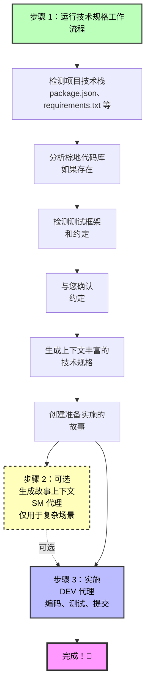

# BMad 快速规格流程

**适用于：** 错误修复、小功能、快速原型制作和快速增强

**实施时间：** 分钟级，而非小时级

---

## 什么是快速规格流程？

快速规格流程是快速流程轨道项目的**精简替代方案**，替代完整的 BMad 方法。您不需要经过产品简报 → PRD → 架构的流程，而是**直接进入上下文感知的技术规格说明**并开始编码。

### 何时使用快速规格流程

✅ **在以下情况使用快速流程轨道：**

- 单个错误修复或小增强
- 范围明确的小功能（通常 1-15 个故事）
- 快速原型制作或实验
- 添加到现有棕地代码库
- 您确切知道要构建什么

❌ **在以下情况使用 BMad 方法或企业轨道：**

- 构建新产品或主要功能
- 需要利益相关者对齐
- 复杂的多团队协调
- 需要广泛的规划和架构

💡 **不确定？** 运行 `workflow-init` 根据您的项目需求获得建议！

---

## 快速规格流程概览



---

## 单个原子变更

**最适用于：** 错误修复、单文件变更、独立改进

### 您将获得

1. **tech-spec.md** - 全面的技术规格说明，包括：
   - 问题描述和解决方案
   - 检测到的框架版本和依赖
   - 棕地代码模式（如适用）
   - 要遵循的现有测试模式
   - 要修改的特定文件路径
   - 完整的实施指导

2. **story-[slug].md** - 准备开发的单个用户故事

### 快速规格流程命令

```bash
# 开始快速规格流程（无需 workflow-init！）
# 加载 PM 代理并运行 tech-spec

# 完成后，直接实施：
# 加载 DEV 代理并运行 dev-story
```

### 为什么快速

- ✅ 无需产品简报
- ✅ 无需 PRD
- ✅ 无需架构文档
- ✅ 自动检测您的技术栈
- ✅ 自动分析棕地代码
- ✅ 自动验证质量
- ✅ 故事上下文可选（技术规格已全面！）

### 示例单个变更场景

- "修复登录验证错误"
- "在用户注册表单中添加邮箱字段"
- "更新 API 端点以返回额外字段"
- "改进支付处理中的错误处理"

---

## 连贯的小功能

**最适用于：** 具有 2-3 个相关用户故事的小功能

### 您将获得

1. **tech-spec.md** - 与单个变更项目相同的全面规格说明
2. **epics.md** - 带有故事分解的史诗组织
3. **story-[epic-slug]-1.md** - 第一个故事
4. **story-[epic-slug]-2.md** - 第二个故事
5. **story-[epic-slug]-3.md** - 第三个故事（如需要）

### 快速规格流程命令

```bash
# 开始快速规格流程
# 加载 PM 代理并运行 tech-spec

# 可选：将故事组织为冲刺
# 加载 SM 代理并运行 sprint-planning

# 逐个故事实施：
# 加载 DEV 代理并为每个故事运行 dev-story
```

### 故事排序

故事被**自动验证**以确保正确的顺序：

- ✅ 无前向依赖（故事 2 不能依赖故事 3）
- ✅ 清晰的依赖文档
- ✅ 基础设施 → 功能 → 打磨顺序
- ✅ 后端 → 前端流程

### 示例小功能场景

- "添加 OAuth 社交登录（Google、GitHub、Twitter）"
- "构建带有头像上传的用户个人资料页面"
- "实现带过滤器的基本搜索"
- "向应用程序添加深色模式切换"

---

## 智能上下文发现

快速规格流程自动发现并使用：

### 1. 现有文档

- 产品简报（如果存在）
- 研究文档
- `document-project` 输出（棕地代码库映射）

### 2. 项目技术栈

- **Node.js：** package.json → 框架、依赖、脚本、测试框架
- **Python：** requirements.txt、pyproject.toml → 包、工具
- **Ruby：** Gemfile → gem 和版本
- **Java：** pom.xml、build.gradle → Maven/Gradle 依赖
- **Go：** go.mod → 模块
- **Rust：** Cargo.toml → 包
- **PHP：** composer.json → 包

### 3. 棕地代码模式

- 目录结构和组织
- 现有代码模式（基于类、函数式、MVC）
- 命名约定（camelCase、snake_case、PascalCase）
- 测试框架和模式
- 代码风格（分号、引号、缩进）
- Linter/格式化程序配置
- 错误处理模式
- 日志记录约定
- 文档风格

### 4. 约定确认

**重要：** 快速规格流程检测您的约定并**请求确认**：

```
我已在您的代码库中检测到这些约定：

代码风格：
- 带有 Airbnb 配置的 ESLint
- 带有单引号、2空格缩进的 Prettier
- 无分号

测试模式：
- Jest 测试框架
- .test.js 文件命名
- expect() 断言风格

我应该遵循这些现有约定吗？（是/否）
```

**您决定：** 遵循现有模式或建立新标准！

---

## 通过 WebSearch 实现的现代最佳实践

快速规格流程在适当时使用 WebSearch 保持最新：

### 对于绿地项目

- 搜索最新框架版本
- 推荐官方起始模板
- 建议现代最佳实践

### 对于过时的依赖

- 检测您的依赖是否超过 2 年
- 搜索迁移指南
- 注明升级复杂性

### 起始模板推荐

对于绿地项目，快速规格流程推荐：

**React：**

- Vite（现代、快速）
- Next.js（全栈）

**Python：**

- cookiecutter 模板
- FastAPI 起始器

**Node.js：**

- NestJS CLI
- express-generator

**好处：**

- ✅ 内置现代最佳实践
- ✅ 正确的项目结构
- ✅ 构建工具已配置
- ✅ 测试框架已设置
- ✅ 更快地实现第一个功能

---

## UX/UI 考虑因素

对于面向用户的变更，快速规格流程捕获：

- 受影响的 UI 组件（创建 vs 修改）
- UX 流程变更（当前 vs 新）
- 响应式设计需求（移动、平板、桌面）
- 可访问性要求：
  - 键盘导航
  - 屏幕阅读器兼容性
  - ARIA 标签
  - 颜色对比度标准
- 用户反馈模式：
  - 加载状态
  - 错误消息
  - 成功确认
  - 进度指示器

---

## 自动验证和质量保证

快速规格流程**自动验证**所有内容：

### 技术规格验证（始终运行）

检查：

- ✅ 上下文收集完整性
- ✅ 明确性（无"使用 X 或 Y"陈述）
- ✅ 棕地集成质量
- ✅ 技术栈对齐
- ✅ 实施准备情况

生成分数：

```
✅ 验证通过！
- 上下文收集：全面
- 明确性：全部明确
- 棕地集成：优秀
- 技术栈对齐：完美
- 实施准备情况：✅ 准备就绪
```

### 故事验证（多故事功能）

检查：

- ✅ 故事顺序（无前向依赖！）
- ✅ 验收标准质量（具体、可测试）
- ✅ 完整性（涵盖所有技术规格任务）
- ✅ 清晰的依赖文档

**如果发现问题自动修复！**

---

## 完整用户旅程

### 场景 1：错误修复（单个变更）

**目标：** 修复登录验证错误

**步骤：**

1. **开始：** 加载 PM 代理，说"我想修复登录验证错误"
2. **PM 运行技术规格工作流程：**
   - 询问："您在解决什么问题？"
   - 您解释验证问题
   - 检测您的 Node.js 技术栈（Express 4.18.2，Jest 用于测试）
   - 分析现有 UserService 代码模式
   - 询问："我应该遵循您现有的约定吗？" → 您回答是
   - 生成带有特定文件路径和模式的 tech-spec.md
   - 创建 story-login-fix.md
3. **实施：** 加载 DEV 代理，运行 `dev-story`
   - DEV 读取技术规格（具有所有上下文！）
   - 遵循现有模式实施修复
   - 运行测试（遵循现有 Jest 模式）
   - 完成！

**总时间：** 15-30 分钟（主要是实施）

---

### 场景 2：小功能（多故事）

**目标：** 添加 OAuth 社交登录（Google、GitHub）

**步骤：**

1. **开始：** 加载 PM 代理，说"我想添加 OAuth 社交登录"
2. **PM 运行技术规格工作流程：**
   - 询问功能范围
   - 您指定：Google 和 GitHub OAuth
   - 检测您的技术栈（Next.js 13.4，NextAuth.js 已安装！）
   - 分析现有认证模式
   - 与您确认约定
   - 生成：
     - tech-spec.md（全面实施指南）
     - epics.md（OAuth 集成史诗）
     - story-oauth-1.md（后端 OAuth 设置）
     - story-oauth-2.md（前端登录按钮）
3. **可选冲刺规划：** 加载 SM 代理，运行 `sprint-planning`
4. **实施故事 1：**
   - 加载 DEV 代理，为故事 1 运行 `dev-story`
   - DEV 实施后端 OAuth
5. **实施故事 2：**
   - DEV 代理，为故事 2 运行 `dev-story`
   - DEV 实施前端
   - 完成！

**总时间：** 1-3 小时（主要是实施）

---

## 与阶段 4 工作流程的集成

快速规格流程与所有阶段 4 实施工作流程无缝协作：

### story-context（SM 代理）

- ✅ 识别 tech-spec.md 作为权威来源
- ✅ 从技术规格提取上下文（替代 PRD）
- ✅ 为复杂场景生成 XML 上下文

### create-story（SM 代理）

- ✅ 可以使用 tech-spec.md 而不是 PRD
- ✅ 使用来自技术规格工作流程的 epics.md
- ✅ 如果需要创建额外故事

### sprint-planning（SM 代理）

- ✅ 使用来自技术规格的 epics.md
- ✅ 组织多故事功能以协调实施
- ✅ 通过 sprint-status.yaml 跟踪进度

### dev-story（DEV 代理）

- ✅ 读取由技术规格生成的故事
- ✅ 使用 tech-spec.md 作为全面上下文
- ✅ 遵循检测到的约定实施

---

## 比较：快速规格 vs 完整 BMM

| 方面           | 快速流程轨道         | BMad 方法/企业轨道    |
| -------------- | -------------------- | --------------------- |
| **设置**       | 无（独立）           | 推荐 workflow-init    |
| **规划文档**   | 仅 tech-spec.md      | 产品简报 → PRD → 架构 |
| **编码时间**   | 分钟                 | 小时到天              |
| **最适用于**   | 错误修复、小功能     | 新产品、主要功能      |
| **上下文发现** | 自动                 | 手动 + 指导           |
| **故事上下文** | 可选（技术规格丰富） | 必需（从 PRD 生成）   |
| **验证**       | 自动验证所有内容     | 手动验证步骤          |
| **棕地**       | 自动分析并遵循       | 需要手动文档          |
| **约定**       | 自动检测并确认       | 在 PRD/架构中记录     |

---

## 何时从快速流程升级到 BMad 方法

从快速流程开始，但在以下情况切换到 BMad 方法：

- ❌ 项目超出初始范围
- ❌ 多个团队需要协调
- ❌ 利益相关者需要正式文档
- ❌ 产品愿景不明确
- ❌ 架构决策需要深入分析
- ❌ 存在合规/监管要求

💡 **提示：** 您可以随时运行 `workflow-init` 从快速流程转换到 BMad 方法！

---

## 快速规格流程 - 关键好处

### 🚀 **速度**

- 无产品简报
- 无 PRD
- 无架构文档
- 直接进入实施

### 🧠 **智能**

- 自动检测技术栈
- 自动分析棕地
- 自动验证质量
- WebSearch 获取最新信息

### 📐 **对现有代码的尊重**

- 检测约定
- 请求确认
- 遵循模式
- 适应 vs 变更

### ✅ **质量**

- 自动验证
- 明确的决策（无"或"陈述）
- 全面的上下文
- 清晰的验收标准

### 🎯 **专注**

- 单个原子变更
- 连贯的小功能
- 无范围蔓延
- 快速迭代

---

## 入门指南

### 先决条件

- 已安装 BMad 方法（`npx bmad-method install`）
- 带有代码的项目目录（或绿地项目为空）

### 快速开始命令

```bash
# 对于快速错误修复或小变更：
# 1. 加载 PM 代理
# 2. 说："我想 [描述您的变更]"
# 3. PM 会询问您是否想运行技术规格
# 4. 回答关于您变更的问题
# 5. 获得技术规格 + 故事
# 6. 加载 DEV 代理并实施！

# 对于带多个故事的小功能：
# 与上面相同，但获得史诗 + 2-3 个故事
# 可选使用 SM sprint-planning 组织
```

### 无需 workflow-init！

快速规格流程**完全独立**：

- 检测是单个变更还是多故事功能
- 询问绿地 vs 棕地
- 无需状态文件跟踪
- 完美适用于快速原型制作

---

## FAQ

### 问：我可以在现有项目上使用快速规格流程吗？

**答：** 可以！它非常适合棕地项目。它将分析您的现有代码，检测模式，并询问您是否想遵循它们。

### 问：如果我没有 package.json 或 requirements.txt 怎么办？

**答：** 快速规格流程将以绿地模式工作，推荐起始模板，并使用 WebSearch 获取现代最佳实践。

### 问：我需要先运行 workflow-init 吗？

**答：** 不需要！快速规格流程是独立的。但如果您想获得关于使用哪种流程的指导，workflow-init 可以帮助。

### 问：我可以用它来做前端变更吗？

**答：** 当然可以！快速规格流程捕获 UX/UI 考虑因素、组件变更和可访问性要求。

### 问：如果我的快速流程项目变大了怎么办？

**答：** 没问题！您可以通过运行 workflow-init 和 create-prd 随时转换到 BMad 方法。您的技术规格成为 PRD 的输入。

### 问：每个故事都需要 story-context 吗？

**答：** 通常不需要！对于大多数快速流程项目，技术规格已经足够全面。仅在复杂的边缘情况下使用 story-context。

### 问：我可以跳过验证吗？

**答：** 不可以，验证始终自动运行。但它很快并且能及早发现问题！

### 问：它能与我团队的代码风格一起工作吗？

**答：** 可以！它检测您的约定并请求确认。您控制是遵循现有模式还是建立新模式。

---

## 技巧和最佳实践

### 1. **在发现阶段具体化**

描述您的变更时，提供具体信息：

- ✅ "修复 UserService 中的邮箱验证以允许加号寻址"
- ❌ "修复验证错误"

### 2. **信任约定检测**

如果它正确检测到您的模式，请说"是"！这比建立新约定更快。

### 3. **对绿地项目使用 WebSearch 推荐**

起始模板节省数小时的设置时间。让快速规格流程找到最好的。

### 4. **审查自动验证**

当验证运行时，阅读分数。它们告诉您您的规格是否准备就绪可用于生产。

### 5. **故事上下文是可选的**

对于单个变更，尝试直接进入 dev-story。只有在遇到复杂性时才添加 story-context。

### 6. **保持单个变更真正原子化**

如果您的"单个变更"需要 3+ 个文件，它可能是一个多故事功能。让工作流程指导您。

### 7. **验证多故事功能的故事顺序**

当您获得多个故事时，检查依赖验证输出。正确的顺序很重要！

---

## 真实世界示例

### 示例 1：添加日志记录（单个变更）

**输入：** "向支付处理添加结构化日志记录"

**技术规格输出：**

- 检测到：package.json 中已有 winston 3.8.2
- 分析：现有服务使用 winston 与 JSON 格式
- 确认：遵循现有日志记录模式
- 生成：特定文件路径、日志级别、格式示例
- 故事：准备在 1-2 小时内实施

**结果：** 添加了一致的日志记录，遵循团队模式，无需研究。

---

### 示例 2：搜索功能（多故事）

**输入：** "向产品目录添加带过滤器的搜索"

**技术规格输出：**

- 检测到：React 18.2.0、MUI 组件库、Express 后端
- 分析：现有 ProductList 组件模式
- 确认：遵循现有 API 和组件结构
- 生成：
  - 史诗：产品搜索功能
  - 故事 1：带过滤器的后端搜索 API
  - 故事 2：前端搜索 UI 组件
- 自动验证：故事 1 → 故事 2 顺序正确

**结果：** 搜索功能在 4-6 小时内实施，具有适当的架构。

---

## 总结

快速规格流程是您从想法到实施的**快速路径**，适用于：

- 🐛 错误修复
- ✨ 小功能
- 🚀 快速原型制作
- 🔧 快速增强

**关键特性：**

- 自动检测您的技术栈
- 自动分析棕地代码
- 自动验证质量
- 尊重现有约定
- 使用 WebSearch 获取现代实践
- 生成全面的技术规格
- 创建准备实施的故事

**编码时间：** 分钟，而非小时。

**准备尝试吗？** 加载 PM 代理并说出您想构建什么！🚀

---

## 下一步

- **立即尝试：** 加载 PM 代理并描述一个小变更
- **了解更多：** 查看 [BMM 工作流程指南](./README.md#-workflow-guides) 获取全面的工作流程文档
- **需要帮助决定？** 运行 `workflow-init` 获得推荐
- **有问题？** 在 Discord 加入我们：https://discord.gg/gk8jAdXWmj

---

_快速规格流程 - 因为不是每个变更都需要产品简报。_
