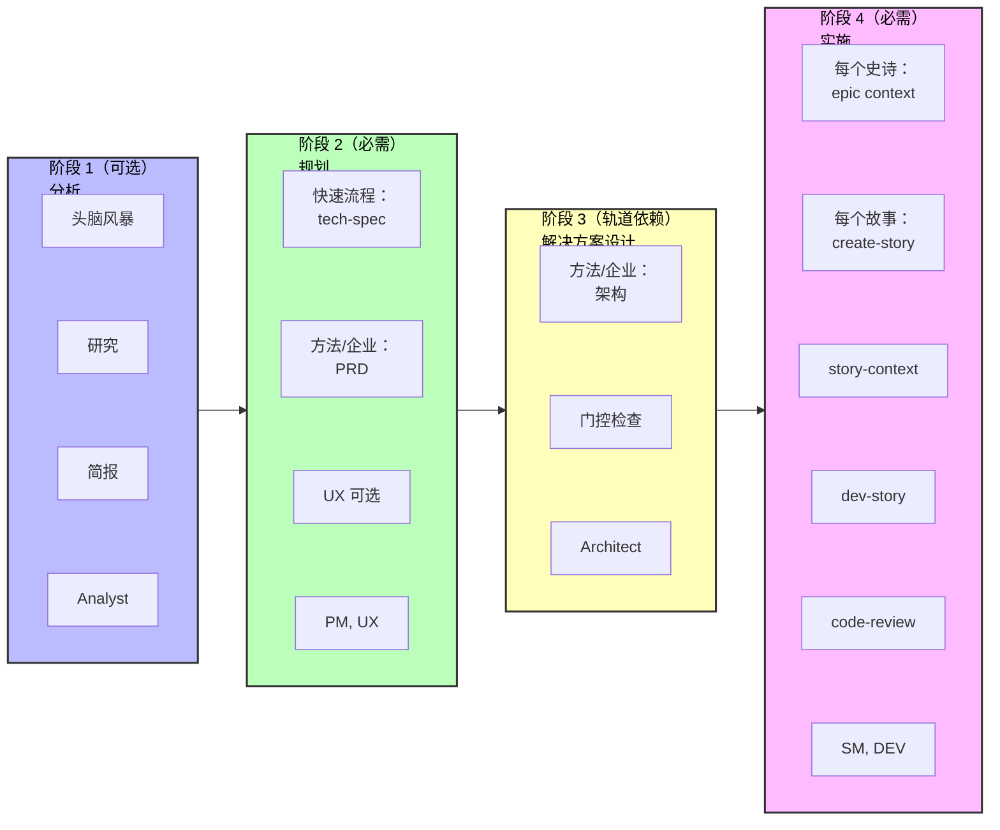

# BMad 方法 V6 快速入门指南

使用 BMad 方法 v6 开始您的新绿地项目。本指南指导您使用 AI 驱动的工作流程从头开始构建软件。

## TL;DR - 快速路径

1. **安装**: `npx bmad-method@alpha install`
2. **初始化**: 加载 Analyst 代理 → 运行 "workflow-init"
3. **规划**: 加载 PM 代理 → 运行 "prd"（或小项目运行 "tech-spec"）
4. **架构**: 加载 Architect 代理 → 运行 "create-architecture"（仅 10+ 个故事）
5. **构建**: 加载 SM 代理 → 为每个故事运行工作流程 → 加载 DEV 代理 → 实施
6. **始终使用新聊天**进行每个工作流程以避免幻觉

---

## 什么是 BMad 方法？

BMad 方法（BMM）通过具有专业化 AI 代理的引导工作流程帮助您构建软件。该过程遵循四个阶段：

1. **阶段 1：分析**（可选）- 头脑风暴、研究、产品简报
2. **阶段 2：规划**（必需）- 创建您的要求（技术规格或 PRD）
3. **阶段 3：解决方案设计**（轨道依赖）- 为 BMad 方法和企业轨道设计架构
4. **阶段 4：实施**（必需）- 逐个史诗、逐个故事地构建您的软件

## 安装

```bash
# 将 v6 Alpha 安装到您的项目
npx bmad-method@alpha install
```

交互式安装程序将指导您完成设置，并创建一个包含所有代理和工作流程的 `bmad/` 文件夹。

---

## 入门指南

### 步骤 1：初始化您的工作流程

1. **在您的 IDE 中加载 Analyst 代理** - 查看您的 IDE 特定说明，在 [docs/ide-info](https://github.com/bmad-code-org/BMAD-METHOD/tree/main/docs/ide-info) 中了解如何激活代理：
   - [Claude Code](https://github.com/bmad-code-org/BMAD-METHOD/blob/main/docs/ide-info/claude-code.md)
   - [VS Code/Cursor/Windsurf](https://github.com/bmad-code-org/BMAD-METHOD/tree/main/docs/ide-info) - 检查您的 IDE 文件夹
   - 也支持其他 IDE
2. **等待代理菜单**出现
3. **告诉代理**："Run workflow-init" 或输入 "\*workflow-init" 或选择菜单项编号

#### workflow-init 期间会发生什么？

工作流程是 V6 中的交互式过程，取代了先前版本的任务和模板。有许多类型的工作流程，您甚至可以使用 BMad Builder 模块创建自己的工作流程。对于 BMad 方法，您将与专家设计的工作流程交互，这些工作流程旨在与您协作，让您和 LLM 都发挥最佳作用。

在 workflow-init 期间，您将描述：

- 您的项目及其目标
- 是否有现有代码库或这是一个新项目
- 总体大小和复杂性（您可以稍后调整）

#### 规划轨道

基于您的描述，工作流程将建议一个轨道并让您选择：

**三个规划轨道：**

- **快速流程** - 快速实施（仅技术规格）- 错误修复、简单功能、范围明确（通常 1-15 个故事）
- **BMad 方法** - 完整规划（PRD + 架构 + UX）- 产品、平台、复杂功能（通常 10-50+ 个故事）
- **企业方法** - 扩展规划（BMad 方法 + 安全/DevOps/测试）- 企业需求、合规、多租户（通常 30+ 个故事）

**注意**：故事计数是指导，不是定义。轨道基于规划需求选择，而不是故事数学。

#### 创建了什么？

一旦您确认您的轨道，`bmm-workflow-status.yaml` 文件将在您项目的 docs 文件夹中创建（假设默认安装位置）。此文件跟踪您在所有阶段的进度。

**重要说明：**

- 每个轨道都有不同的阶段路径
- 故事计数仍可能根据工作时的整体复杂性而变化
- 对于本指南，我们假设一个 BMad 方法轨道项目
- 此工作流程将指导您完成阶段 1（可选）、阶段 2（必需）和阶段 3（BMad 方法和企业轨道必需）

### 步骤 2：完成阶段 1-3

workflow-init 完成后，您将完成规划阶段。**重要：为每个工作流程使用新聊天以避免上下文限制。**

#### 检查您的状态

如果您不确定下一步做什么：

1. 在新聊天中加载任何代理
2. 询问 "workflow-status"
3. 代理将告诉您下一个推荐或必需的工作流程

**示例响应：**

```
阶段 1（分析）完全可选。所有工作流程都是可选或推荐的：
  - brainstorm-project - 可选
  - research - 可选
  - product-brief - 推荐（但不是必需的）

下一个真正必需的步骤是：
  - 阶段 2 - 规划中的 PRD（产品需求文档）
  - 代理：pm
  - 命令：prd
```

0000000000000000pp

当代理告诉您运行工作流程时（如 `prd`）：

1. **与指定代理（例如，PM）开始新聊天** - 查看 [docs/ide-info](https://github.com/bmad-code-org/BMAD-METHOD/tree/main/docs/ide-info) 了解您 IDE 的具体说明
2. **等待菜单**出现
3. **告诉代理**使用以下任何格式运行它：
   - 输入简写：`*prd`
   - 自然说："让我们创建一个新的 PRD"
   - 选择 "create-prd" 的菜单编号

V6 中的代理在模糊菜单匹配方面非常擅长！

#### 快速参考：代理 → 文档映射

对于 v4 用户或那些喜欢跳过 workflow-status 指导的人：

- **Analyst** → 头脑风暴、产品简报
- **PM** → PRD（BMad 方法/企业轨道）或 tech-spec（快速流程轨道）
- **UX-Designer** → UX 设计文档（如果 UI 重）
- **Architect** → 架构（BMad 方法/企业轨道）

#### 阶段 2：规划 - 创建 PRD

**对于 BMad 方法和企业轨道：**

1. 在新聊天中加载 **PM 代理**
2. 告诉它运行 PRD 工作流程
3. 完成后，您将拥有：
   - **PRD.md** - 您的产品需求文档
   - 史诗分解

**对于快速流程轨道：**

- 使用 **tech-spec** 而不是 PRD（无需架构）

#### 阶段 2（可选）：UX 设计

如果您的项目有用户界面：

1. 在新聊天中加载 **UX-Designer 代理**
2. 告诉它运行 UX 设计工作流程
3. 完成后，运行验证以确保 Epics 文件保持更新

#### 阶段 3：架构

**对于 BMad 方法和企业轨道：**

1. 在新聊天中加载 **Architect 代理**
   20

#### 阶段 3：解决方案设计门控检查（强烈推荐）

架构完成后：

1. 在新聊天中加载 **Architect 代理**
2. 告诉它运行 "solutioning-gate-check"
3. 这验证所有规划文档（PRD、UX、架构、Epics）之间的内聚性
4. 这在 v4 中被称为 "PO Master Checklist"

**为什么运行这个？** 它确保您在开始构建之前所有规划资产正确对齐。

#### 上下文管理技巧

- **使用 200k+ 上下文模型**以获得最佳结果（Claude Sonnet 4.5、GPT-4 等）
- **每个工作流程新聊天** - 头脑风暴、简报、研究和 PRD 生成都都是上下文密集的
- **无需文档分片** - 与 v4 不同，您不需要拆分文档
- **Web Bundle 即将推出** - 将帮助有限计划的用户节省 LLM 令牌

### 步骤 3：开始构建（阶段 4 - 实施）

规划 和架构完成后，您将进入阶段 4。**重要：下面的每个工作流程都应该在新聊天中运行，以避免上下文限制和幻觉。**

#### 3.1 初始化冲刺规划

1. **与 SM（Scrum Master）代理开始新聊天**
2. 等待菜单出现
3. 告诉代理："Run sprint-planning"
4. 这会创建跟踪所有史诗和故事的 `sprint-status.yaml` 文件

#### 3.2 创建史诗上下文（可选但推荐）

1. **与 SM 代理开始新聊天**
2. 等待菜单
3. 告诉代理："Run epic-tech-context"
4. 这在起草故事之前为当前史诗创建技术上下文

#### 3.3 起草您的第一个故事

1. **与 SM 代理开始新聊天**
2. 等待菜单
3. 告诉代理："Run create-story"
4. 这从史诗起草故事文件

#### 3.4 添加故事上下文（可选但推荐）

1. **与 SM 代理开始新聊天**
2. 等待菜单
3. 告诉代理："Run story-context"
4. 这为故事创建实施特定的技术上下文

#### 3.5 实施故事

1. **与 DEV 代理开始新聊天**
2. 等待菜单
3. 告诉代理："Run dev-story"
4. DEV 代理将实施故事并更新冲刺状态

#### 3.6 审查代码（可选但推荐）

1. **与 DEV 代理开始新聊天**
2. 等待菜单
3. 告诉代理："Run code-review"
4. DEV 代理执行质量验证（这在 v4 中被称为 QA）

### 步骤 4：继续进行

对于每个后续故事，使用**新聊天**为每个工作流程重复循环：

1. **新聊天** → SM 代理 → "Run create-story"
2. **新聊天** → SM 代理 → "Run story-context"
3. **新聊天** → DEV 代理 → "Run dev-story"
4. **新聊天** → DEV 代理 → "Run code-review"（可选但推荐）

完成史诗中的所有故事后：

1. **与 SM 代理开始新聊天**
2. 告诉代理："Run retrospective"

**为什么新聊天？** 如果您在同一聊天中继续发出命令，上下文密集的工作流程可能导致幻觉。重新开始确保代理在每个工作流程中具有最大上下文容量。

---

## 理解代理

每个代理都是一个专业化的 AI 个性：

- **Analyst** - 初始化工作流程并跟踪进度
- **PM** - 创建需求和规格说明
- **UX-Designer** - 如果您的项目有前端 - 这个设计师将帮助生成制品，提出模拟更新，并在您指导下设计出色的外观和感觉。
- **Architect** - 设计系统架构
- **SM（Scrum Master）** - 管理冲刺并创建故事
- **DEV** - 实施代码并审查工作

## 工作流程如何工作

1. **加载代理** - 在您的 IDE 中打开代理文件以激活它
2. **等待菜单** - 代理将呈现其可用的工作流程
3. **告诉代理运行什么** - 说"Run [workflow-name]"
4. **遵循提示** - 代理指导您完成每个步骤

代理在整个过程中创建文档、提问并帮助您做出决策。

## 项目跟踪文件

BMad 创建两个文件来跟踪您的进度：

**1. bmm-workflow-status.yaml**

- 显示您在哪个阶段以及下一步是什么
- 由 workflow-init 创建
- 在您进展阶段时自动更新

**2. sprint-status.yaml**（仅阶段 4）

- 在实施期间跟踪您的所有史诗和故事
- 对于 SM 和 DEV 代理知道下一步要做什么至关重要
- 由 sprint-planning 工作流程创建
- 随着故事进展自动更新

**您不需要手动编辑这些** - 代理在您工作时更新它们。

---

## 完整流程可视化



## 常见问题

**问：我总是需要架构吗？**
答：仅对于 BMad 方法和企业轨道。快速流程项目直接从技术规格跳到实施。

**问：我可以稍后更改我的计划吗？**
答：可以！SM 代理有一个 "correct-course" 工作流程来处理范围变更。

**问：如果我想先进行头脑风暴怎么办？**
答：加载 Analyst 代理并告诉它在运行 workflow-init 之前 "Run brainstorm-project"。

**问：为什么每个工作流程都需要新聊天？**
答：如果顺序运行，上下文密集的工作流程可能导致幻觉。新聊天确保最大上下文容量。

**问：我可以跳过 workflow-init 和 workflow-status 吗？**
答：可以，一旦您学会了流程。使用步骤 2 中的快速参考直接转到您需要的工作流程。

## 获取帮助

- **工作流程期间**：代理通过问题和解释指导您
- **社区**：[Discord](https://discord.gg/gk8jAdXWmj) - #general-dev, #bugs-issues
- **完整指南**：[BMM 工作流程文档](./README.md#-workflow-guides)
- **YouTube 教程**：[BMad Code 频道](https://www.youtube.com/@BMadCode)

---

## 关键要点

✅ **始终使用新聊天** - 在新聊天中为每个工作流程加载代理以避免上下文问题
✅ **让 workflow-status 指导您** - 在不确定下一步时加载任何代理并询问状态
✅ **轨道很重要** - 快速流程使用 tech-spec，BMad 方法/企业需要 PRD 和架构
✅ **跟踪是自动的** - 状态文件自行更新，无需手动编辑
✅ **代理是灵活的** - 使用菜单编号、快捷键（\*prd）或自然语言

**准备开始构建？** 安装 BMad，加载 Analyst，运行 workflow-init，让代理指导您！
