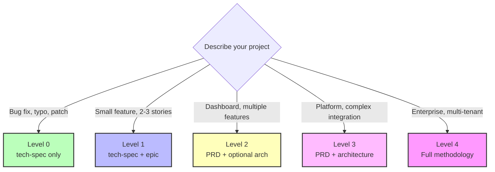
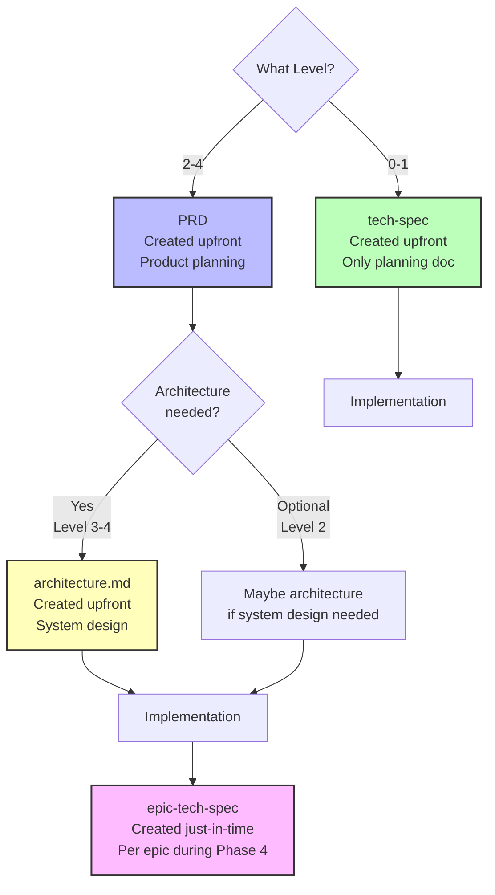
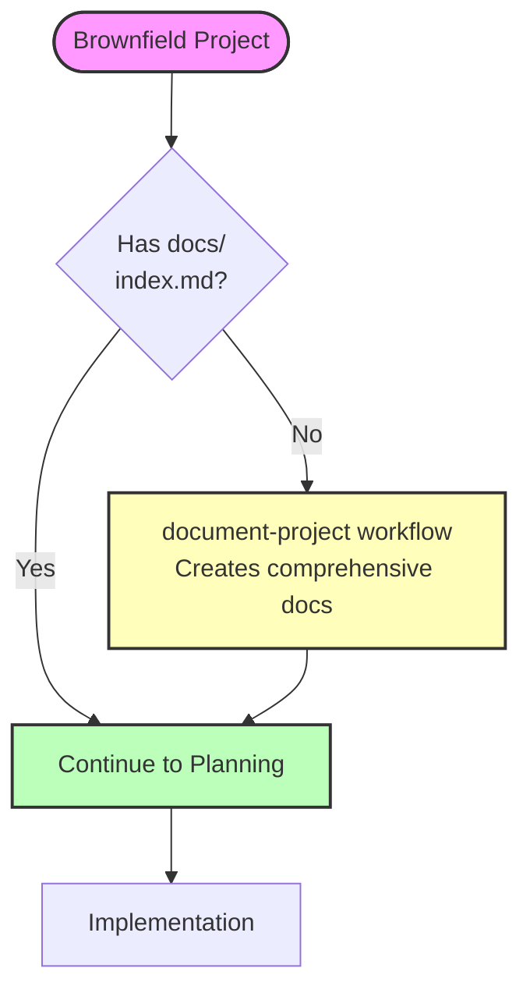

# BMad Method Scale Adaptive System

**Automatically adapts workflows to project complexity - from bug fixes to enterprise systems**

---

## Overview

The **Scale Adaptive System** is BMad Method's intelligent workflow orchestration that automatically adjusts planning depth, documentation requirements, and implementation processes based on project size and complexity.

### The Problem It Solves

Traditional methodologies apply the same process to every project:

- ❌ **Overkill:** Bug fix requires full design docs
- ❌ **Insufficient:** Enterprise system built with minimal planning
- ❌ **One-Size-Fits-None:** Same process for 1 story and 100 stories

### The Solution

BMad Method **adapts workflows to match project scale**:

- ✅ **Level 0 (1 story):** Tech-spec only, implement immediately
- ✅ **Level 2 (10 stories):** PRD + Architecture, structured approach
- ✅ **Level 4 (100+ stories):** Full enterprise planning, comprehensive docs

**Result:** Right amount of planning for every project - no more, no less.

---

## Quick Reference

### Five Levels at a Glance

| Level | Scope                | Stories | Documentation       | Timeline |
| ----- | -------------------- | ------- | ------------------- | -------- |
| **0** | Single atomic change | 1       | tech-spec only      | Hours    |
| **1** | Small feature        | 1-10    | tech-spec + epic    | Days     |
| **2** | Medium project       | 5-15    | PRD + optional arch | Weeks    |
| **3** | Complex integration  | 12-40   | PRD + architecture  | Months   |
| **4** | Enterprise scale     | 40+     | Full methodology    | Quarters |

### Level Selection Decision Tree



### Quick Keywords

- **Level 0:** fix, bug, typo, small change, patch
- **Level 1:** simple, basic, small feature, add, minor
- **Level 2:** dashboard, several features, admin panel, medium
- **Level 3:** platform, integration, complex, system, architecture
- **Level 4:** enterprise, multi-tenant, multiple products, ecosystem, scale

---

## How Level Detection Works

When you run `workflow-init`, it analyzes your project using three methods:

### 1. Keyword Analysis

Scans your description for level-specific keywords (see Quick Keywords above).

### 2. Story Count Estimation

Asks about expected scope and matches to ranges:

| Stories | Suggested Level |
| ------- | --------------- |
| 1       | Level 0         |
| 2-10    | Level 1         |
| 5-15    | Level 2         |
| 12-40   | Level 3         |
| 40+     | Level 4         |

**Note:** Overlap zones (5-10, 12-15) are intentional - choose based on need for product-level planning.

### 3. Complexity Indicators

Additional factors:

- Multiple teams involved? → Higher level
- External integrations? → Higher level
- Compliance requirements? → Higher level
- Multi-tenant needs? → Level 4
- Existing system modifications? → Consider brownfield path

### Manual Override

**You can always override the suggested level.** workflow-init asks for confirmation - if you disagree, just say so and choose the appropriate level. Trust your judgment.

**Example:**

```
workflow-init: "Based on your description: Level 3 project. Is that correct?"
You: "No, this is simpler - Level 2"
workflow-init: "Got it, creating Level 2 workflow"
```

---

## The Five Levels

### Level 0: Single Atomic Change

**Definition:** Single-story projects like bug fixes, typos, or small patches.

**Story Count:** 1 story

**Timeline:** Hours to 1 day

**Documentation Requirements:**

- **tech-spec.md** - Technical specification with implementation details
- Single story file

**Workflow Path:**

```
(Brownfield: document-project first if needed)
↓
Tech-Spec → Implement
```

**No Architecture:** Skip entirely
**No PRD:** Tech-spec serves as complete planning doc

**Use For:**

- Bug fixes
- Single file changes
- Minor configuration updates
- Small refactors
- Typo corrections

**Example:** "Fix authentication token expiration bug in auth middleware"

**Keywords:** fix, bug, typo, small change, quick update, patch

---

### Level 1: Small Feature

**Definition:** Small coherent features with 2-10 related stories.

**Story Count:** 1-10 stories (typically 2-5)

**Timeline:** 1-3 days

**Documentation Requirements:**

- **tech-spec.md** - Technical specification with epic breakdown
- **Epic organization** - Stories grouped by epic
- 2-10 story files

**Workflow Path:**

```
(Brownfield: document-project first if needed)
↓
Tech-Spec + Epic → (Optional) UX Design → Implement
```

**No Architecture:** Skip entirely
**No PRD:** Tech-spec with epic is sufficient

**Use For:**

- Single module additions
- Small UI enhancements
- Isolated feature additions
- API endpoint additions (OAuth, forgot password, search)

**Example:** "Add OAuth social login (Google, GitHub, Facebook)"

**UX Note:** Tech-spec can include UX considerations inline, or run separate UX Design workflow if UI is complex.

**Keywords:** simple, basic, small feature, add, minor

---

### Level 2: Medium Project

**Definition:** Multiple related features across 1-3 epics.

**Story Count:** 5-15 stories

**Timeline:** 1-2 weeks

**Documentation Requirements:**

- **PRD.md** - Product requirements document
- **epics.md** - Epic breakdown with stories
- **tech-spec.md** (optional) - Or use epic-tech-specs during implementation
- **architecture.md** (optional) - Only if system design needed

**Workflow Path:**

```
(Brownfield: document-project first if needed)
↓
Analysis (recommended) → PRD + Epics → (Optional) UX Design → (Optional) Architecture → Implement
                                                                                            ↓
                                                                           Epic-tech-spec per epic (recommended)
                                                                                            ↓
                                                                           Retrospective after each epic (if >1 epic)
```

**Architecture:** Optional - only if system design needed
**Epic-Tech-Specs:** Recommended during implementation

**Use For:**

- Multiple related features
- Cross-module enhancements
- Admin dashboards
- Customer portals
- Reporting systems

**Example:** "Add user dashboard with analytics, preferences, and activity history"

**Level 2 Decision:** Choose Level 2 over Level 1 when you need product-level planning, have multiple epics, or require stakeholder alignment.

**Keywords:** dashboard, several features, admin panel, medium

---

### Level 3: Complex Integration

**Definition:** Complex systems with multiple subsystems and integrations.

**Story Count:** 12-40 stories

**Timeline:** 3-6 weeks

**Documentation Requirements:**

- **PRD.md** - Comprehensive product requirements
- **epics.md** - Detailed epic breakdown
- **architecture.md** - Required comprehensive system architecture
- **UX design** (recommended for user-facing systems)

**Workflow Path:**

```
(Brownfield: document-project first if needed)
↓
Analysis + Research → PRD + Epics → (Recommended) UX Design → Architecture (required) → Gate Check → Implement
                                                                                                      ↓
                                                                                     Epic-tech-spec per epic (recommended)
                                                                                                      ↓
                                                                                     Retrospective after each epic
```

**Architecture:** Required - comprehensive system design
**Gate Check:** Required - validate cohesion before implementation
**Epic-Tech-Specs:** Highly recommended

**Use For:**

- Major feature additions
- Architectural integrations
- Multi-system changes
- E-commerce platforms
- SaaS products
- Multi-module systems

**Example:** "Adding real-time collaboration features to existing document editor"

**Critical for Level 3:**

- Architecture review before planning
- Integration strategy document
- Backward compatibility planning
- Phased rollout consideration

**Keywords:** platform, integration, complex, system, architecture

---

### Level 4: Enterprise Scale

**Definition:** Enterprise-scale projects across multiple products or major platform expansions.

**Story Count:** 40+ stories

**Timeline:** 3-6 months

**Documentation Requirements:**

- **Product brief** - Strategic planning document
- **PRD.md** - Comprehensive product requirements
- **epics.md** - Detailed epic breakdown
- **architecture.md** - Required enterprise-grade architecture
- **UX design** (recommended) - Design system and patterns

**Workflow Path:**

```
(Brownfield: document-project first - nearly mandatory)
↓
Analysis + Research → PRD + Epics → UX Design → Enterprise Architecture → Gate Check → Implement
                                                                                          ↓
                                                                         Epic-tech-spec per epic (recommended)
                                                                                          ↓
                                                                         Additional design docs for complex subsystems
                                                                                          ↓
                                                                         Retrospective after each epic
```

**Architecture:** Required - enterprise-grade system design including:

- Multi-tenancy design
- Security architecture
- Scalability planning
- Integration architecture
- Data architecture
- Deployment architecture

**Gate Checks:** Required - multiple validation gates
**Additional Design Documents:** Created during implementation as needed

**Use For:**

- Platform expansions
- Multi-team initiatives
- System-wide modernization
- Multi-tenant systems
- Product ecosystems
- Enterprise platforms

**Example:** "Adding multi-tenancy to existing single-tenant SaaS platform"

**Critical for Enterprise:**

- Documentation phase nearly mandatory
- Analysis phase (research, product brief) required
- Full architecture review before planning
- Extensive integration testing strategy
- Risk assessment and mitigation planning
- Cross-team coordination
- Feature flag implementation
- Migration strategy for existing data/users

**Keywords:** enterprise, multi-tenant, multiple products, ecosystem, scale

---

## Planning Documents by Level

### Understanding Document Types



### Tech-Spec (Level 0-1)

**Created:** Upfront in Planning Phase (Phase 2)
**Serves as:** Primary and only planning document

**Contains:**

- Problem statement and solution
- Source tree changes (specific files)
- Technical implementation details
- Detected stack and conventions (brownfield)
- UX/UI considerations (if user-facing)
- Testing strategy
- Developer resources

**When Used:** Replaces PRD + Architecture for small projects

### PRD (Level 2-4)

**Created:** Upfront in Planning Phase (Phase 2)
**Serves as:** Product-level planning document

**Contains:**

- Product vision and goals
- Feature requirements
- Epic breakdown with stories
- Success criteria
- User experience considerations
- Business context

**Complements:** Architecture document (system design)

### Architecture Document (Level 2-4)

**Created:** Upfront in Solutioning Phase (Phase 3)
**Serves as:** System-level design document

**Scale-Adaptive Complexity:**

- **Level 2:** Optional, lightweight if needed
- **Level 3:** Required, comprehensive
- **Level 4:** Required, enterprise-grade

**Contains:**

- System components and responsibilities
- Data models and schemas
- Integration patterns
- Security architecture
- Performance considerations
- Deployment architecture

**Note:** Takes the place of tech-spec for system-level planning in Level 2-4 projects.

### Epic-Tech-Spec (Level 2-4)

**Created:** Just-in-time during Implementation Phase (Phase 4)
**Serves as:** Epic-specific implementation guide

**Contains:**

- Epic-specific technical details
- Detailed implementation approach for this epic
- Code-level design decisions
- Epic-scoped testing strategy
- Integration points with other epics

**Key Difference from Tech-Spec:**

- **Tech-spec (0-1):** Created upfront, primary planning doc
- **Epic-tech-spec (2-4):** Created during implementation, supplements PRD + Architecture

**Why Just-In-Time?**

- Implementation learnings inform later epic-tech-specs
- Avoids over-planning details that may change
- Keeps specs fresh and relevant
- Retrospectives provide input for next epic-tech-spec

---

## Workflow Comparison

| Level | Analysis    | Planning         | Architecture | Epic-Tech-Specs | Stories | Retrospectives          |
| ----- | ----------- | ---------------- | ------------ | --------------- | ------- | ----------------------- |
| **0** | Optional    | Tech-spec        | None         | N/A             | 1       | N/A                     |
| **1** | Optional    | Tech-spec + Epic | None         | N/A             | 2-10    | N/A                     |
| **2** | Recommended | PRD              | Optional     | Recommended     | 5-15    | After each epic (if >1) |
| **3** | Required    | PRD              | Required     | Recommended     | 12-40   | After each epic         |
| **4** | Required    | PRD              | Required     | Recommended     | 40+     | After each epic         |

---

## Brownfield Projects

### Critical First Step

🚨 **For ALL brownfield projects (Level 0-4): Run document-project BEFORE planning workflows**

### Why document-project is Critical

- **Tech-spec workflow** (Level 0-1) uses this for auto-detection
- **PRD workflow** (Level 2-4) references existing code
- **Architecture workflow** (Level 3-4) builds on existing structure
- **Epic-tech-specs** reference existing implementations

### Brownfield Workflow Pattern



**Three Options:**

1. **No documentation:** Run document-project workflow (10-30 min)
2. **Has docs, no index.md:** Run index-docs task (2-5 min)
3. **Complete documentation:** Skip to planning

**For complete brownfield guidance:** See [Brownfield Development Guide](./brownfield-guide.md)

---

## Common Scenarios

### Scenario 1: Bug Fix (Level 0)

**Input:** "Fix email validation bug in login form"

**Detection:**

- Keywords: "fix", "bug"
- Estimated stories: 1

**Result:** Level 0 → Tech-spec only

**Workflow:**

1. (Optional) Brief analysis
2. Tech-spec with single story
3. Implement immediately

**Time:** ~2-4 hours total

---

### Scenario 2: Small Feature (Level 1)

**Input:** "Add OAuth social login (Google, GitHub, Facebook)"

**Detection:**

- Keywords: "add", "feature"
- Estimated stories: 2-3

**Result:** Level 1 → Tech-spec with epic

**Workflow:**

1. (Optional) Research OAuth providers
2. Tech-spec with epic + 3 stories
3. (Optional) UX Design if UI is complex
4. Implement story-by-story

**Time:** 1-3 days

---

### Scenario 3: Customer Portal (Level 2)

**Input:** "Build customer portal with dashboard, tickets, billing"

**Detection:**

- Keywords: "portal", "dashboard"
- Estimated stories: 10-12

**Result:** Level 2 → PRD + optional architecture

**Workflow:**

1. Product Brief (recommended)
2. PRD with epics
3. (Optional) UX Design
4. (Optional) Architecture if system design needed
5. Implement with sprint planning
6. Create epic-tech-spec for each epic as you implement
7. Run retrospective after each epic

**Time:** 1-2 weeks

---

### Scenario 4: E-commerce Platform (Level 3)

**Input:** "Build full e-commerce platform with products, cart, checkout, admin, analytics"

**Detection:**

- Keywords: "platform", "full"
- Estimated stories: 30-35

**Result:** Level 3 → PRD + Architecture required

**Workflow:**

1. Research + Product Brief
2. Comprehensive PRD
3. UX Design (recommended)
4. System Architecture (required)
5. Gate check
6. Implement with phased approach
7. Create epic-tech-spec per epic before implementing
8. Run retrospective after each epic
9. Create additional design docs as needed for complex subsystems

**Time:** 3-6 weeks

---

### Scenario 5: Adding Feature to Existing App (Brownfield Level 1)

**Input:** "Add search functionality to existing product catalog"

**Detection:**

- Keywords: "add", "existing"
- Estimated stories: 3-4
- Field type: Brownfield

**Result:** Level 1 Brownfield

**Critical First Step:**

1. **Run document-project** to analyze existing codebase

**Then Workflow:** 2. Tech-spec (uses document-project output for analysis) 3. Auto-detects existing patterns 4. Confirms conventions 5. Implement following existing patterns

**Time:** 1-3 days (including documentation)

---

## Best Practices

### 1. Document-Project First for Brownfield

Always run document-project before starting any brownfield workflow. Even if you know the code, AI agents need it.

### 2. Trust the Detection

If workflow-init suggests Level 2, there's probably complexity you haven't considered. Review before overriding.

### 3. Start Small, Upgrade Later

Uncertain between Level 1 and 2? Start with Level 1. You can always run PRD creation later if needed.

### 4. Don't Skip Gate Checks

For Level 3-4, gate checks prevent costly mistakes. Invest the time upfront.

### 5. Create Epic-Tech-Specs Just-Before-Implementation

For Level 2-4, create epic-tech-spec right before implementing each epic. Don't create all upfront.

### 6. Run Retrospectives Between Epics

Capture learnings after each epic. Feed insights into next epic-tech-spec.

### 7. Optional UX for Level 1

If your Level 1 feature has complex UI, run separate UX Design. Otherwise, include UX notes in tech-spec.

### 8. Architecture Scales

Level 2 architecture is lighter than Level 3, which is lighter than Level 4. Don't over-architect.

---

## Appendix

### A. Terminology Quick Reference

For complete definitions, see [Glossary](./glossary.md).

**Key Terms:**

- **Scale-Adaptive:** System that adjusts workflow based on project complexity
- **Tech-Spec:** Technical specification document (Level 0-1, created upfront)
- **Epic-Tech-Spec:** Epic technical specification (Level 2-4, created just-in-time)
- **PRD:** Product Requirements Document
- **Just-In-Time Design:** Creating epic-tech-specs during implementation, not upfront
- **Context Injection:** Dynamic guidance via epic-tech-context and story-context workflows
- **Greenfield:** New project from scratch
- **Brownfield:** Existing codebase

### B. Workflow Path Configuration

The v6 system uses modular path definitions stored in YAML configuration files.

**Location:** `src/modules/bmm/workflows/workflow-status/paths/`

**Files:**

- `greenfield-level-0.yaml` through `greenfield-level-4.yaml`
- `brownfield-level-0.yaml` through `brownfield-level-4.yaml`
- `game-design.yaml`
- `project-levels.yaml` (source of truth)

Each path file defines:

- Required vs optional workflows for each phase
- Agent assignments
- Expected outputs
- Phase progression rules

### C. FAQ

**Q: What's the difference between tech-spec and epic-tech-spec?**
A: Tech-spec (Level 0-1) is created upfront and serves as the primary planning doc. Epic-tech-spec (Level 2-4) is created during implementation per epic and supplements PRD + Architecture.

**Q: Why no tech-spec at Level 2+?**
A: Level 2+ needs product-level planning (PRD) and system-level design (Architecture), which tech-spec doesn't provide. Instead, use epic-tech-specs during implementation for detailed technical guidance per epic.

**Q: Do I always need Architecture at Level 2?**
A: No, it's optional. Only create Architecture if you need system-level design. Many Level 2 projects work with just PRD + epic-tech-specs.

**Q: Can I change levels mid-project?**
A: Yes! If you started at Level 1 but realize it's Level 2, run create-prd to add proper planning docs. The system is flexible.

For more questions, see [FAQ](./faq.md).

---

## Related Documentation

- **[Quick Start Guide](./quick-start.md)** - Get started with BMM
- **[Quick Spec Flow](./quick-spec-flow.md)** - Fast-track for Level 0-1
- **[Brownfield Guide](./brownfield-guide.md)** - Existing codebase workflows
- **[Glossary](./glossary.md)** - Complete terminology
- **[FAQ](./faq.md)** - Common questions
- **[Workflows Guide](../workflows/README.md)** - Complete workflow reference

---

_Scale Adaptive System - Because one size doesn't fit all._
