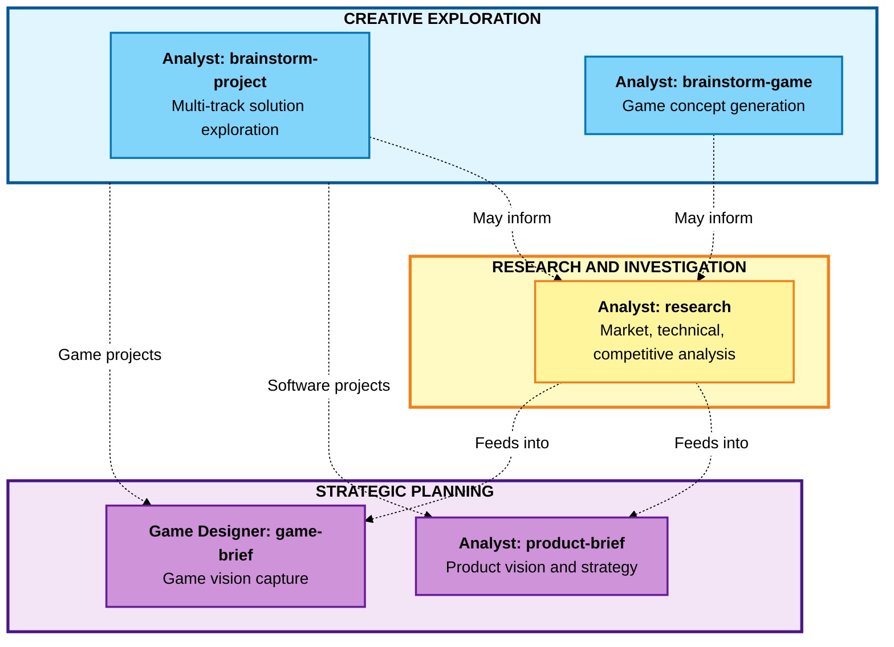

# BMM Analysis Workflows (Phase 1)

## Overview

Phase 1 (Analysis) workflows are **optional** exploration and discovery tools that help you understand your project space before committing to detailed planning. These workflows facilitate creative thinking, market validation, and strategic alignment.

**When to use Analysis workflows:**

- Starting a new project from scratch
- Exploring a problem space or opportunity
- Validating market fit before significant investment
- Gathering strategic context for planning phases

**When to skip Analysis workflows:**

- Continuing an existing project with clear requirements
- Working on well-defined features with known solutions
- Working under strict constraints where discovery is complete

---

## Phase 1 Workflow Map

---

## Quick Reference

| Workflow           | Agent         | Required    | Purpose                                                     |
| ------------------ | ------------- | ----------- | ----------------------------------------------------------- |
| brainstorm-project | Analyst       | No          | Explore solution approaches and architectures               |
| brainstorm-game    | Analyst       | No          | Generate game concepts using creative techniques            |
| product-brief      | Analyst       | Recommended | Define product vision and strategy                          |
| game-brief         | Game Designer | Recommended | Capture game vision before GDD                              |
| research           | Analyst       | No          | Multi-type research system (market, technical, competitive) |

---

## brainstorm-project

### Purpose

Generate multiple solution approaches for software projects through parallel ideation tracks that align technical and business thinking from inception.

**Agent:** Analyst
**Phase:** 1 (Analysis)
**Required:** No

### When to Use

- You have a business objective but unclear technical approach
- Multiple solution paths exist and you need to evaluate trade-offs
- Hidden assumptions need discovery before planning
- Innovation beyond obvious solutions is valuable

### Prerequisites

- Business objectives and constraints
- Technical environment context
- Stakeholder needs identified
- Success criteria defined (at least preliminary)

### Process Overview

**1. Context Capture**

- Business objectives and constraints
- Technical environment
- Stakeholder needs
- Success criteria

**2. Parallel Ideation**

- **Architecture Track**: Technical approaches with trade-offs
- **UX Track**: Interface paradigms and user journeys
- **Integration Track**: System connection patterns
- **Value Track**: Feature prioritization and delivery sequences

**3. Solution Synthesis**

- Evaluate feasibility and impact
- Align with strategic objectives
- Surface hidden assumptions
- Generate recommendations with rationale

### Inputs

| Input             | Type     | Purpose                                       |
| ----------------- | -------- | --------------------------------------------- |
| Project Context   | Document | Business objectives, environment, constraints |
| Problem Statement | Optional | Core challenge or opportunity to address      |

### Outputs

| Output                   | Content                                     |
| ------------------------ | ------------------------------------------- |
| Architecture Proposals   | Multiple approaches with trade-off analysis |
| Value Framework          | Prioritized features aligned to objectives  |
| Risk Analysis            | Dependencies, challenges, opportunities     |
| Strategic Recommendation | Synthesized direction with rationale        |

### Example Scenario

**Starting Point:**
"We need a customer dashboard for our SaaS product"

**After brainstorm-project:**

- **Architecture Option A**: Monolith with server-side rendering (faster to market, easier ops)
- **Architecture Option B**: Microservices + SPA (better scalability, more complex)
- **Architecture Option C**: Hybrid approach (SSR shell + client-side islands)
- **Recommendation**: Option A for MVP, with clear path to Option C as we scale
- **Risk**: Option A may require rewrite if we hit 10K+ concurrent users

### Related Workflows

- **research** - Deep investigation of market/technical options
- **product-brief** - Strategic planning document
- **prd** (Phase 2) - Requirements document from chosen approach

---

## brainstorm-game

### Purpose

Generate and refine game concepts through systematic creative exploration using five distinct brainstorming techniques, grounded in practical constraints.

**Agent:** Analyst
**Phase:** 1 (Analysis)
**Required:** No

### When to Use

- Generating original game concepts
- Exploring variations on a theme
- Breaking creative blocks
- Validating game ideas against constraints

### Prerequisites

- Platform specifications (mobile, PC, console, web)
- Genre preferences or inspirations
- Technical constraints understood
- Target audience defined
- Core design pillars identified (at least preliminary)

### Process Overview

**Five Brainstorming Methods** (applied in isolation, then synthesized):

| Method                  | Focus                    | Output Characteristics             |
| ----------------------- | ------------------------ | ---------------------------------- |
| SCAMPER                 | Systematic modification  | Structured transformation analysis |
| Mind Mapping            | Hierarchical exploration | Visual concept relationships       |
| Lotus Blossom           | Radial expansion         | Layered thematic development       |
| Six Thinking Hats       | Multi-perspective        | Balanced evaluation framework      |
| Random Word Association | Lateral thinking         | Unexpected conceptual combinations |

Each method generates distinct artifacts that are then evaluated against design pillars, technical feasibility, and market positioning.

### Inputs

- **Game Context Document**: Platform specs, genre, technical constraints, target audience, monetization approach, design pillars
- **Initial Concept Seed** (optional): High-level game idea or theme

### Outputs

- **Method-Specific Artifacts**: Five separate brainstorming documents
- **Consolidated Concept Document**: Synthesized game concepts with feasibility assessments and unique value propositions
- **Design Pillar Alignment Matrix**: Evaluation of concepts against stated objectives

### Example Scenario

**Starting Point:**
"A roguelike with psychological themes"

**After brainstorm-game:**

- **SCAMPER Result**: "What if standard roguelike death → becomes emotional regression?"
- **Mind Map Result**: Emotion types (anger, fear, joy) as character classes
- **Lotus Blossom Result**: Inner demons as enemies, therapy sessions as rest points
- **Six Thinking Hats Result**: White (data) - mental health market growing; Red (emotion) - theme may alienate hardcore players
- **Random Word Association Result**: "Mirror" + "Roguelike" = reflection mechanics that change gameplay

**Synthesized Concept:**
"Mirror of Mind: A roguelike card battler where you play as emotions battling inner demons. Deck composition affects narrative, emotional theme drives mechanics, 3 characters representing anger/fear/joy, target audience: core gamers interested in mental health themes."

### Related Workflows

- **game-brief** - Capture validated concept in structured brief
- **gdd** (Phase 2) - Full game design document

---

## product-brief

### Purpose

Interactive product brief creation that guides users through defining their product vision with multiple input sources and conversational collaboration.

**Agent:** Analyst
**Phase:** 1 (Analysis)
**Required:** Recommended (skip only if PRD already exists)

### When to Use

- Starting a new product or major feature initiative
- Aligning stakeholders before detailed planning
- Transitioning from exploration to strategy
- Creating executive-level product documentation

### Prerequisites

- Business context understood
- Problem or opportunity identified
- Stakeholders accessible for input
- Strategic objectives defined

### Modes of Operation

**Interactive Mode** (Recommended):

- Step-by-step collaborative development
- Probing questions to refine thinking
- Deep exploration of problem/solution fit
- High-quality output with thorough exploration

**YOLO Mode**:

- AI generates complete draft from initial context
- User reviews and refines sections iteratively
- Faster for rapid draft generation
- Best for time-constrained situations or when you have clear vision

### Process Overview

**Phase 1: Initialization and Context (Steps 0-2)**

- Project setup and context capture
- Input document gathering
- Mode selection
- Context extraction

**Phase 2: Interactive Development (Steps 3-12) - Interactive Mode**

- Problem definition and pain points
- Solution articulation and value proposition
- User segmentation
- Success metrics and KPIs
- MVP scoping (ruthlessly defined)
- Financial planning and ROI
- Technical context
- Risk assessment and assumptions

**Phase 3: Rapid Generation (Steps 3-4) - YOLO Mode**

- Complete draft generation from context
- Iterative refinement of sections
- Quality validation

**Phase 4: Finalization (Steps 13-15)**

- Executive summary creation
- Supporting materials compilation
- Final review and handoff preparation

### Inputs

- Optional: Market research, competitive analysis, brainstorming results
- User input through conversational process
- Business context and objectives

### Outputs

**Primary Output:** `product-brief-{project_name}-{date}.md`

**Output Structure:**

1. Executive Summary
2. Problem Statement (with evidence)
3. Proposed Solution (core approach and differentiators)
4. Target Users (primary and secondary segments)
5. Goals and Success Metrics
6. MVP Scope (must-have features)
7. Post-MVP Vision
8. Financial Impact (investment and ROI)
9. Strategic Alignment
10. Technical Considerations
11. Constraints and Assumptions
12. Risks and Open Questions
13. Supporting Materials

### Example Scenario

**Starting Point:**
"We see customers struggling with project tracking"

**After product-brief (Interactive Mode):**

- **Problem**: Teams using 3+ tools for project management, causing 40% efficiency loss
- **Solution**: Unified workspace combining tasks, docs, and communication
- **Target Users**: 10-50 person product teams, SaaS-first companies
- **MVP Scope**: Task management + Real-time collaboration + Integrations (GitHub, Slack)
- **Success Metrics**: 30% reduction in tool-switching time, 20% faster project completion
- **Financial Impact**: $2M investment, $10M ARR target year 2

### Related Workflows

- **brainstorm-project** - Generate solution approaches first
- **research** - Gather market/competitive intelligence
- **prd** (Phase 2) - Detailed requirements from product brief

---

## game-brief

### Purpose

Lightweight, interactive brainstorming and planning session that captures game vision before diving into detailed Game Design Documents.

**Agent:** Game Designer
**Phase:** 1 (Analysis)
**Required:** Recommended for game projects

### When to Use

- Starting a new game project from scratch
- Exploring a game idea before committing
- Pitching a concept to team/stakeholders
- Validating market fit and feasibility
- Preparing input for GDD workflow

**Skip if:**

- You already have a complete GDD
- Continuing an existing project
- Prototyping without planning needs

### Comparison: Game Brief vs GDD

| Aspect       | Game Brief                  | GDD                       |
| ------------ | --------------------------- | ------------------------- |
| Purpose      | Validate concept            | Design for implementation |
| Detail Level | High-level vision           | Detailed specifications   |
| Audience     | Self, team, stakeholders    | Development team          |
| Scope        | Concept validation          | Implementation roadmap    |
| Format       | Conversational, exploratory | Structured, comprehensive |
| Output       | Concise vision document     | Comprehensive design doc  |

### Comparison: Game Brief vs Product Brief

| Aspect        | Game Brief                   | Product Brief                     |
| ------------- | ---------------------------- | --------------------------------- |
| Focus         | Player experience, fun, feel | User problems, features, value    |
| Metrics       | Engagement, retention, fun   | Revenue, conversion, satisfaction |
| Core Elements | Gameplay pillars, mechanics  | Problem/solution, user segments   |
| References    | Other games                  | Competitors, market               |
| Vision        | Emotional experience         | Business outcomes                 |

### Workflow Structure

**Interactive Mode** (Recommended):

1. Game Vision (concept, pitch, vision statement)
2. Target Market (audience, competition, positioning)
3. Game Fundamentals (pillars, mechanics, experience goals)
4. Scope and Constraints (platforms, timeline, budget, team)
5. Reference Framework (inspiration, competitors, differentiators)
6. Content Framework (world, narrative, volume)
7. Art and Audio Direction
8. Risk Assessment (risks, challenges, mitigation)
9. Success Criteria (MVP, metrics, launch goals)
10. Next Steps

**YOLO Mode**: AI generates complete draft, then you refine iteratively

### Inputs

Optional:

- Market research
- Brainstorming results
- Competitive analysis
- Design notes
- Reference game lists

### Outputs

**Primary Output:** `game-brief-{game_name}-{date}.md`

**Sections:**

- Executive summary
- Complete game vision
- Target market analysis
- Core gameplay definition
- Scope and constraints
- Reference framework
- Art/audio direction
- Risk assessment
- Success criteria
- Next steps

### Example Scenario

**Starting Point:**
"I want to make a roguelike card game with a twist"

**After Game Brief:**

- **Core Concept**: Roguelike card battler where you play as emotions battling inner demons
- **Target Audience**: Core gamers who love Slay the Spire, interested in mental health themes
- **Differentiator**: Emotional narrative system where deck composition affects story
- **MVP Scope**: 3 characters, 80 cards, 30 enemy types, 3 bosses, 6-hour first run
- **Platform**: PC (Steam) first, mobile later
- **Timeline**: 12 months with 2-person team
- **Key Risk**: Emotional theme might alienate hardcore roguelike fans
- **Mitigation**: Prototype early, test with target audience, offer "mechanical-only" mode

**Next Steps:**

1. Build card combat prototype (2 weeks)
2. Test emotional resonance with players
3. Proceed to GDD workflow if prototype validates

### Related Workflows

- **brainstorm-game** - Generate initial concepts
- **gdd** (Phase 2) - Full game design document
- **narrative** (Phase 2) - For story-heavy games

---

## research

### Purpose

Comprehensive, adaptive multi-type research system that consolidates various research methodologies into a single powerful tool.

**Agent:** Analyst
**Phase:** 1 (Analysis)
**Required:** No

### Research Types

**6 Research Types Available:**

| Type            | Purpose                                                | Use When                            |
| --------------- | ------------------------------------------------------ | ----------------------------------- |
| **market**      | Market intelligence, TAM/SAM/SOM, competitive analysis | Need market viability validation    |
| **deep_prompt** | Generate optimized research prompts for AI platforms   | Need AI to research deeper topics   |
| **technical**   | Technology evaluation, architecture decisions          | Choosing frameworks/platforms       |
| **competitive** | Deep competitor analysis                               | Understanding competitive landscape |
| **user**        | Customer insights, personas, JTBD                      | Need user understanding             |
| **domain**      | Industry deep dives, trends                            | Understanding domain/industry       |

### Market Research (Type: market)

**Key Features:**

- Real-time web research
- TAM/SAM/SOM calculations with multiple methodologies
- Competitive landscape analysis
- Customer persona development
- Porter's Five Forces and strategic frameworks
- Go-to-market strategy recommendations

**Inputs:**

- Product or business description
- Target customer hypotheses (optional)
- Known competitors list (optional)

**Outputs:**

- Market size analysis (TAM/SAM/SOM)
- Competitive positioning
- Customer segments and personas
- Market trends and opportunities
- Strategic recommendations
- Financial projections (optional)

### Deep Research Prompt (Type: deep_prompt)

**Key Features:**

- Optimized for AI research platforms (ChatGPT Deep Research, Gemini, Grok, Claude Projects)
- Prompt engineering best practices
- Platform-specific optimization
- Context packaging for optimal AI understanding
- Research question refinement

**Inputs:**

- Research question or topic
- Background context documents (optional)
- Target AI platform preference (optional)

**Outputs:**

- Platform-optimized research prompt
- Multi-stage research workflow
- Context documents packaged
- Execution guidance

### Technical Research (Type: technical)

**Key Features:**

- Technology evaluation and comparison matrices
- Architecture pattern research
- Framework/library assessment
- Technical feasibility studies
- Cost-benefit analysis
- Architecture Decision Records (ADR)

**Inputs:**

- Technical requirements
- Current architecture (if brownfield)
- Technical constraints

**Outputs:**

- Technology comparison matrix
- Trade-off analysis
- Cost-benefit assessment
- ADR with recommendation
- Implementation guidance

### Configuration Options

Can be customized through workflow.yaml:

- **research_depth**: `quick`, `standard`, or `comprehensive`
- **enable_web_research**: Enable real-time data gathering
- **enable_competitor_analysis**: Competitive intelligence
- **enable_financial_modeling**: Financial projections

### Frameworks Available

**Market Research:**

- TAM/SAM/SOM Analysis
- Porter's Five Forces
- Jobs-to-be-Done (JTBD)
- Technology Adoption Lifecycle
- SWOT Analysis
- Value Chain Analysis

**Technical Research:**

- Trade-off Analysis Matrix
- Architecture Decision Records (ADR)
- Technology Radar
- Comparison Matrix
- Cost-Benefit Analysis
- Technical Risk Assessment

### Example Scenario

**Type: market**

**Input:**
"SaaS project management tool for remote teams"

**Output:**

- **TAM**: $50B (global project management software)
- **SAM**: $5B (remote-first teams 10-50 people)
- **SOM**: $50M (achievable in year 3)
- **Top Competitors**: Asana, Monday.com, ClickUp
- **Positioning**: "Real-time collaboration focused, vs async-first competitors"
- **Customer Personas**: Product Managers (primary), Engineering Leads (secondary)
- **Key Trends**: Remote work permanence, tool consolidation, AI features
- **Go-to-Market**: PLG motion, free tier, viral invite mechanics

### Related Workflows

- **product-brief** - Use research to inform brief
- **prd** (Phase 2) - Research feeds requirements
- **architecture** (Phase 3) - Technical research informs design

---

## Best Practices for Phase 1

### 1. Don't Over-Invest in Analysis

Analysis workflows are optional for a reason. If you already know what you're building and why, skip to Phase 2 (Planning).

### 2. Iterate Between Workflows

It's common to:

1. Run **brainstorm-project** to explore
2. Use **research** to validate
3. Create **product-brief** to synthesize

### 3. Document Assumptions

Analysis phase is about surfacing and validating assumptions. Document them explicitly so planning can challenge them.

### 4. Keep It Strategic

Analysis workflows focus on "what" and "why", not "how". Leave implementation details for Planning and Solutioning phases.

### 5. Involve Stakeholders

Analysis workflows are collaborative. Use them to align stakeholders before committing to detailed planning.

---

## Decision Guide: Which Analysis Workflow?

### Starting a Software Project

1. **brainstorm-project** (if unclear solution) → **research** (market/technical) → **product-brief**

### Starting a Game Project

1. **brainstorm-game** (if generating concepts) → **research** (market/competitive) → **game-brief**

### Validating an Idea

1. **research** (market type) → **product-brief** or **game-brief**

### Technical Decision

1. **research** (technical type) → Use ADR in **architecture** (Phase 3)

### Understanding Market

1. **research** (market or competitive type) → **product-brief**

### Generating Deep Research

1. **research** (deep_prompt type) → External AI research platform → Return with findings

---

## Integration with Phase 2 (Planning)

Analysis workflows feed directly into Planning:

| Analysis Output             | Planning Input             |
| --------------------------- | -------------------------- |
| product-brief.md            | **prd** workflow           |
| game-brief.md               | **gdd** workflow           |
| market-research.md          | **prd** context            |
| technical-research.md       | **architecture** (Phase 3) |
| competitive-intelligence.md | **prd** positioning        |

The Planning phase (Phase 2) will load these documents automatically if they exist in the output folder.

---

## Summary

Phase 1 Analysis workflows are your strategic thinking tools. Use them to:

- **Explore** problem spaces and solutions
- **Validate** ideas before heavy investment
- **Align** stakeholders on vision
- **Research** markets, competitors, and technologies
- **Document** strategic thinking for future reference

Remember: **These workflows are optional.** If you know what you're building and why, skip to Phase 2 (Planning) to define requirements and create your PRD/GDD.
