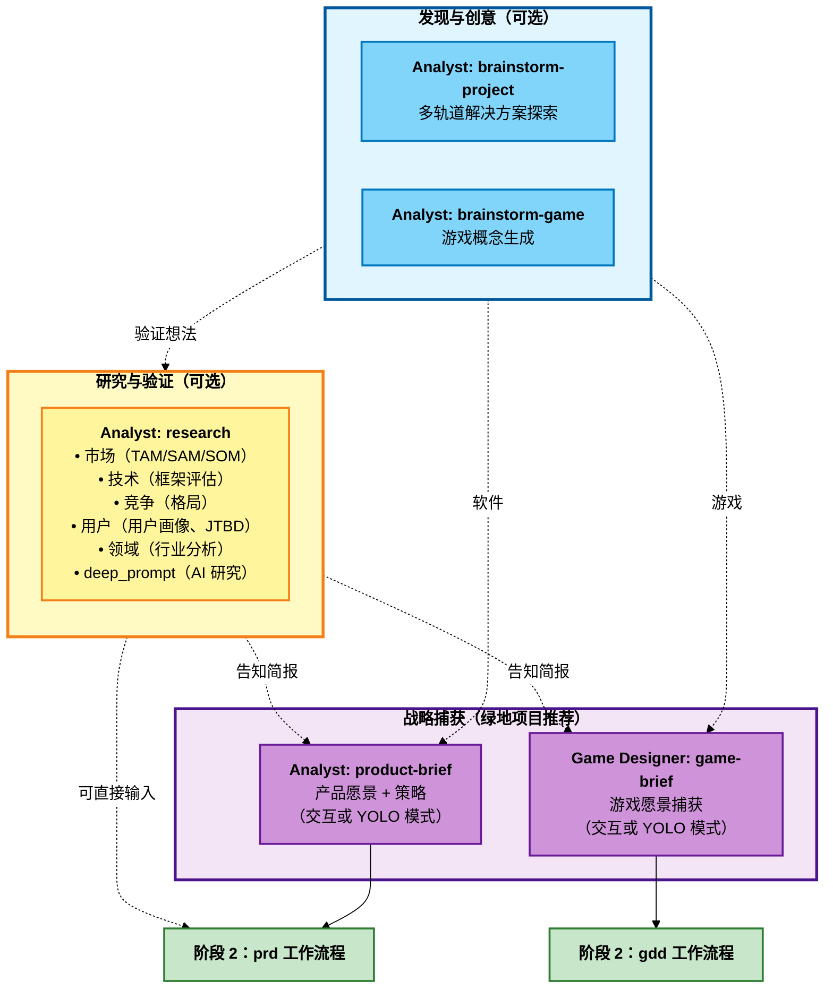

# BMM 分析工作流程（阶段 1）

**阅读时间：** ~7 分钟

## 概述

阶段 1（分析）工作流程是**可选的**探索和发现工具，帮助在规划开始前验证想法、理解市场并生成战略上下文。

**关键原则：** 分析工作流程帮助您在承诺实施前进行战略思考。如果您的要求已经明确，请跳过它们。

**何时使用：** 开始新项目、探索机会、验证市场匹配、生成想法、理解问题空间。

**何时跳过：** 继续具有明确要求的现有项目、具有已知解决方案的明确定义功能、发现已完成的严格约束。

---

## 阶段 1 分析工作流程图



---

## 快速参考

| 工作流程               | 代理          | 必需性 | 目的                                   | 输出                    |
| ---------------------- | ------------- | ------ | -------------------------------------- | ----------------------- |
| **brainstorm-project** | Analyst       | 否     | 探索解决方案方法和架构                 | 解决方案选项 + 基本原理 |
| **brainstorm-game**    | Analyst       | 否     | 使用创意技术生成游戏概念               | 游戏概念 + 评估         |
| **research**           | Analyst       | 否     | 多类型研究（市场/技术/竞争/用户/领域） | 研究报告                |
| **product-brief**      | Analyst       | 推荐   | 定义产品愿景和策略（交互式）           | 产品简报文档            |
| **game-brief**         | Game Designer | 推荐   | 在 GDD 之前捕获游戏愿景（交互式）      | 游戏简报文档            |

---

## 工作流程描述

### brainstorm-project

**目的：** 通过并行创意轨道（架构、UX、集成、价值）生成多种解决方案方法。

**代理：** Analyst

**何时使用：**

- 具有业务目标的不明确技术方法
- 多种解决方案路径需要评估
- 隐藏假设需要发现
- 超越明显解决方案的创新

**关键输出：**

- 带有权衡分析的架构提案
- 价值框架（优先功能）
- 风险分析（依赖、挑战）
- 带有基本原理的战略建议

**示例：** "我们需要客户仪表板" → 选项：单体 SSR（更快）、微服务 SPA（可扩展）、混合（平衡）及建议。

---

### brainstorm-game

**目的：** 通过使用五种头脑风暴技术的系统创意探索来生成游戏概念。

**代理：** Analyst

**何时使用：**

- 生成原创游戏概念
- 探索主题变化
- 打破创意障碍
- 根据约束验证游戏想法

**使用的技术：**

- SCAMPER（系统修改）
- 思维导图（分层探索）
- 莲花绽放（径向扩展）
- 六顶思考帽（多视角）
- 随机词汇联想（横向思维）

**关键输出：**

- 方法特定制品（5 个独立文档）
- 带可行性的综合概念文档
- 设计支柱对齐矩阵

**示例：** "心理主题 Roguelike" → 情感作为角色、心魔作为敌人、治疗会话作为休息点、卡牌组成影响叙事。

---

### research

**目的：** 综合市场、技术、竞争、用户和领域分析的全面多类型研究系统。

**代理：** Analyst

**研究类型：**

| 类型            | 目的                                        | 何时使用                 |
| --------------- | ------------------------------------------- | ------------------------ |
| **market**      | TAM/SAM/SOM、竞争分析                       | 需要市场可行性验证       |
| **technical**   | 技术评估、ADR                               | 选择框架/平台            |
| **competitive** | 深度竞争对手分析                            | 理解竞争格局             |
| **user**        | 客户洞察、用户画像、JTBD                    | 需要用户理解             |
| **domain**      | 行业深度挖掘、趋势                          | 理解领域/行业            |
| **deep_prompt** | 生成 AI 研究提示（ChatGPT、Claude、Gemini） | 需要更深入的 AI 辅助研究 |

**关键特性：**

- 实时网络研究
- 多个分析框架（波特五力、SWOT、技术采用生命周期）
- deep_prompt 类型的平台特定优化
- 可配置研究深度（快速/标准/全面）

**示例（市场）：** "SaaS 项目管理工具" → TAM 500亿美元、SAM 50亿美元、SOM 5000万美元、顶级竞争对手（Asana、Monday）、定位建议。

---

### product-brief

**目的：** 交互式产品简报创建，指导战略产品愿景定义。

**代理：** Analyst

**何时使用：**

- 开始新产品/主要功能计划
- 在详细规划前统一利益相关者
- 从探索转向战略
- 需要执行级产品文档

**模式：**

- **交互模式**（推荐）：带有探索性问题的逐步协作开发
- **YOLO 模式**：AI 从上下文生成完整草稿，然后迭代改进

**关键输出：**

- 执行摘要
- 带证据的问题陈述
- 建议的解决方案和差异化
- 目标用户（分段的）
- MVP 范围（无情定义）
- 财务影响和 ROI
- 战略对齐
- 风险和未解决问题

**集成：** 直接输入到 PRD 工作流程（阶段 2）。

---

### game-brief

**目的：** 轻量级交互式头脑风暴会议，在游戏设计文档之前捕获游戏愿景。

**代理：** Game Designer

**何时使用：**

- 开始新游戏项目
- 在承诺前探索游戏想法
- 向团队/利益相关者推介概念
- 验证市场匹配和可行性

**游戏简报 vs GDD：**

| 方面     | 游戏简报     | GDD          |
| -------- | ------------ | ------------ |
| 目的     | 验证概念     | 为实施而设计 |
| 详细级别 | 高层愿景     | 详细规格     |
| 格式     | 对话式       | 结构化       |
| 输出     | 简洁愿景文档 | 全面设计     |

**关键输出：**

- 游戏愿景（概念、推介）
- 目标市场和定位
- 核心游戏玩法支柱
- 范围和约束
- 参考框架
- 风险评估
- 成功标准

**集成：** 输入到 GDD 工作流程（阶段 2）。

---

## 决策指南

### 开始软件项目

```
brainstorm-project（如果不明确）→ research（市场/技术）→ product-brief → 阶段 2（prd）
```

### 开始游戏项目

```
brainstorm-game（如果生成概念）→ research（市场/竞争）→ game-brief → 阶段 2（gdd）
```

### 验证想法

```
research（市场类型）→ product-brief 或 game-brief → 阶段 2
```

### 仅技术决策

```
research（技术类型）→ 在阶段 3（架构）中使用发现
```

### 理解市场

```
research（市场/竞争类型）→ product-brief → 阶段 2
```

---

## 与阶段 2（规划）的集成

分析输出直接输入到规划：

| 分析输出                    | 规划输入                   |
| --------------------------- | -------------------------- |
| product-brief.md            | **prd** 工作流程           |
| game-brief.md               | **gdd** 工作流程           |
| market-research.md          | **prd** 上下文             |
| technical-research.md       | **architecture**（阶段 3） |
| competitive-intelligence.md | **prd** 定位               |

如果这些文档存在于输出文件夹中，规划工作流程会自动加载它们。

---

## 最佳实践

### 1. 不要过度投资分析

分析是可选的。如果要求明确，跳到阶段 2（规划）。

### 2. 在工作流程之间迭代

常见模式：brainstorm → research（验证）→ brief（综合）

### 3. 记录假设

分析浮现和验证假设。明确记录它们供规划挑战。

### 4. 保持战略性

专注于"什么"和"为什么"，而不是"如何"。将实施留给规划和解决方案设计。

### 5. 涉及利益相关者

使用分析工作流程在承诺详细规划前统一利益相关者。

---

## 常见模式

### 绿地软件（全面分析）

```
1. brainstorm-project - 探索方法
2. research（市场）- 验证可行性
3. product-brief - 捕获战略愿景
4. → 阶段 2：prd
```

### 绿地游戏（全面分析）

```
1. brainstorm-game - 生成概念
2. research（竞争）- 理解格局
3. game-brief - 捕获愿景
4. → 阶段 2：gdd
```

### 跳过分析（明确要求）

```
→ 阶段 2：直接 prd 或 tech-spec
```

### 仅技术研究

```
1. research（技术）- 评估技术
2. → 阶段 3：architecture（在 ADR 中使用发现）
```

---

## 相关文档

- [阶段 2：规划工作流程](./workflows-planning.md) - 下一阶段
- [阶段 3：解决方案设计工作流程](./workflows-solutioning.md)
- [阶段 4：实施工作流程](./workflows-implementation.md)
- [规模自适应系统](./scale-adaptive-system.md) - 理解项目复杂性
- [代理指南](./agents-guide.md) - 完整代理参考

---

## 故障排除

**问：我需要运行所有分析工作流程吗？**
答：不需要！分析完全可选。只使用帮助您思考问题的工作流程。

**问：我应该从哪个工作流程开始？**
答：如果不确定，从 `research`（市场类型）开始验证可行性，然后转到 `product-brief` 或 `game-brief`。

**问：我可以直接跳到规划吗？**
答：可以！如果您知道要构建什么以及为什么，完全跳过阶段 1 并从阶段 2（prd/gdd/tech-spec）开始。

**问：分析应该花费多长时间？**
答：通常几小时到 1-2 天。如果时间更长，您可能过度分析了。转到规划。

**问：如果我在分析期间发现问题怎么办？**
答：这就是重点！分析帮助您在大量规划投资前快速失败和转向。

**问：棕地项目应该做分析吗？**
答：通常不需要。从 `document-project`（阶段 0）开始，然后跳到规划（阶段 2）。

---

_阶段 1 分析 - 承诺前的可选战略思考。_
