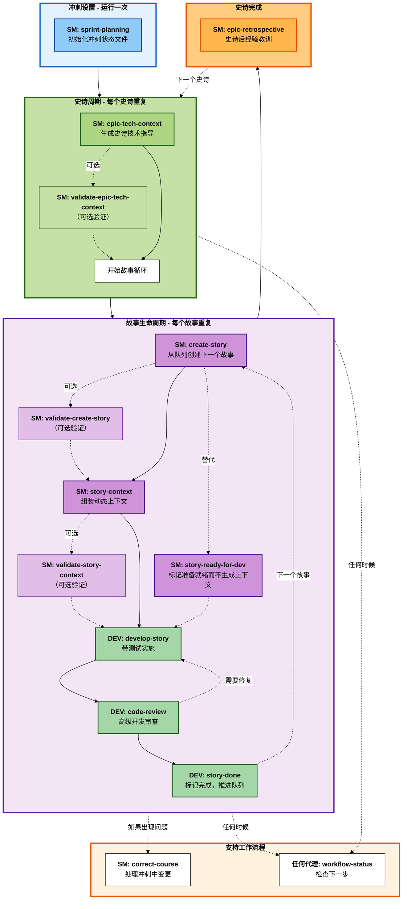

# BMM 实施工作流程（阶段 4）

**阅读时间：** ~8 分钟

## 概述

阶段 4（实施）工作流程管理迭代冲刺开发生命周期，使用**以故事为中心的工作流程**，其中每个故事通过从创建到完成的定义生命周期。

**关键原则：** 一次一个故事，在开始下一个之前完成整个生命周期。

---

## 阶段 4 工作流程生命周期



---

## 快速参考

| 工作流程                       | 代理 | 何时                     | 目的                           |
| ------------------------------ | ---- | ------------------------ | ------------------------------ |
| **sprint-planning**            | SM   | 阶段 4 开始时一次        | 初始化冲刺跟踪文件             |
| **epic-tech-context**          | SM   | 每个史诗                 | 生成史诗特定技术指导           |
| **validate-epic-tech-context** | SM   | epic-tech-context 后可选 | 根据检查表验证技术规格         |
| **create-story**               | SM   | 每个故事                 | 从史诗待办事项创建下一个故事   |
| **validate-create-story**      | SM   | create-story 后可选      | 故事草稿的独立验证             |
| **story-context**              | SM   | 每个故事可选             | 组装动态故事上下文 XML         |
| **validate-story-context**     | SM   | story-context 后可选     | 根据检查表验证故事上下文       |
| **story-ready-for-dev**        | SM   | 每个故事可选             | 标记故事准备就绪而不生成上下文 |
| **develop-story**              | DEV  | 每个故事                 | 带测试实施故事                 |
| **code-review**                | DEV  | 每个故事                 | 高级开发质量审查               |
| **story-done**                 | DEV  | 每个故事                 | 标记完成并推进队列             |
| **epic-retrospective**         | SM   | 史诗完成后               | 回顾经验教训并提取见解         |
| **correct-course**             | SM   | 当出现问题时             | 处理重要的冲刺中变更           |
| **workflow-status**            | 任何 | 任何时候                 | 检查"我现在应该做什么？"       |

---

## 代理角色

### SM（Scrum 主管）- 主要实施编排者

**工作流程：** sprint-planning、epic-tech-context、validate-epic-tech-context、create-story、validate-create-story、story-context、validate-story-context、story-ready-for-dev、epic-retrospective、correct-course

**职责：**

- 初始化和维护冲刺跟踪
- 生成技术上下文（史诗和故事级别）
- 编排故事生命周期及可选验证
- 标记故事准备开发
- 处理方向修正
- 促进回顾

### DEV（开发人员）- 实施和质量

**工作流程：** develop-story、code-review、story-done

**职责：**

- 带测试实施故事
- 执行高级开发人员代码审查
- 标记故事完成并推进队列
- 确保质量和标准遵循

---

## 故事生命周期状态

故事在冲刺状态文件中通过这些状态移动：

1. **TODO** - 故事已识别但未开始
2. **IN PROGRESS** - 故事正在实施中（create-story → story-context → dev-story）
3. **READY FOR REVIEW** - 实施完成，等待代码审查
4. **DONE** - 已接受并完成

---

## 典型冲刺流程

### 冲刺 0（规划阶段）

- 完成阶段 1-3（分析、规划、解决方案设计）
- PRD/GDD + 架构 + 史诗准备就绪

### 冲刺 1+（实施阶段）

**阶段 4 开始：**

1. SM 运行 `sprint-planning`（一次）

**每个史诗：**

1. SM 运行 `epic-tech-context`
2. SM 可选运行 `validate-epic-tech-context`

**每个故事（重复直到史诗完成）：**

1. SM 运行 `create-story`
2. SM 可选运行 `validate-create-story`
3. SM 运行 `story-context` 或 `story-ready-for-dev`（选择一个）
4. SM 可选运行 `validate-story-context`（如果使用了 story-context）
5. DEV 运行 `develop-story`
6. DEV 运行 `code-review`
7. 如果代码审查通过：DEV 运行 `story-done`
8. 如果代码审查发现问题：DEV 在 `develop-story` 中修复，然后回到代码审查

**史诗完成后：**

- SM 运行 `epic-retrospective`
- 移动到下一个史诗（再次从 `epic-tech-context` 开始）

**需要时：**

- 任何时候运行 `workflow-status` 检查进度
- 如果需要重要变更运行 `correct-course`

---

## 关键原则

### 一次一个故事

在开始下一个之前完成每个故事的完整生命周期。这可以防止上下文切换并确保质量。

### 史诗级技术上下文

使用 `epic-tech-context` 为每个史诗（不是每个故事）生成详细技术指导。这提供即时架构而无需前期过度规划。

### 故事上下文（可选）

使用 `story-context` 为每个故事组装专注的上下文 XML，从 PRD、架构、史诗上下文和代码库文档中提取。或者，使用 `story-ready-for-dev` 在不生成上下文 XML 的情况下标记故事准备就绪。

### 质量门控

每个故事在被标记完成之前都通过 `code-review`。没有例外。

### 持续跟踪

`sprint-status.yaml` 文件是所有实施进度的单一事实来源。

---

## 常见模式

### 级别 0-1（快速流程）

```
tech-spec (PM)
  → sprint-planning (SM)
  → 故事循环 (SM/DEV)
```

### 级别 2-4（BMad 方法 / 企业）

```
PRD + 架构 (PM/Architect)
  → solutioning-gate-check (Architect)
  → sprint-planning (SM, 一次)
  → [每个史诗]:
      epic-tech-context (SM)
      → 故事循环 (SM/DEV)
      → epic-retrospective (SM)
  → [下一个史诗]
```

---

## 相关文档

- [阶段 2：规划工作流程](./workflows-planning.md)
- [阶段 3：解决方案设计工作流程](./workflows-solutioning.md)
- [快速规格流程](./quick-spec-flow.md) - 级别 0-1 快速轨道
- [规模自适应系统](./scale-adaptive-system.md) - 理解项目级别

---

## 故障排除

**问：我接下来应该运行哪个工作流程？**
答：运行 `workflow-status` - 它读取冲刺状态文件并准确告诉您该做什么。

**问：故事在实施中需要重要变更？**
答：运行 `correct-course` 分析影响并适当路由。

**问：我是否为每个故事运行 epic-tech-context？**
答：不！每个史诗运行一次，不是每个故事。对每个故事使用 `story-context` 或 `story-ready-for-dev`。

**问：我必须为每个故事使用 story-context 吗？**
答：不，它是可选的。您可以使用 `story-ready-for-dev` 在不生成上下文 XML 的情况下标记故事准备就绪。

**问：我可以并行处理多个故事吗？**
答：不推荐。在开始下一个之前完成一个故事的完整生命周期。防止上下文切换并确保质量。

**问：如果代码审查发现问题怎么办？**
答：DEV 运行 `develop-story` 进行修复，重新运行测试，然后再次运行 `code-review` 直到通过。

**问：我什么时候运行验证？**
答：验证是可选的质量门控。当您想在继续之前对史诗技术规格、故事草稿或故事上下文进行独立审查时使用它们。

---

_阶段 4 实施 - 一次一个故事，正确完成。_
