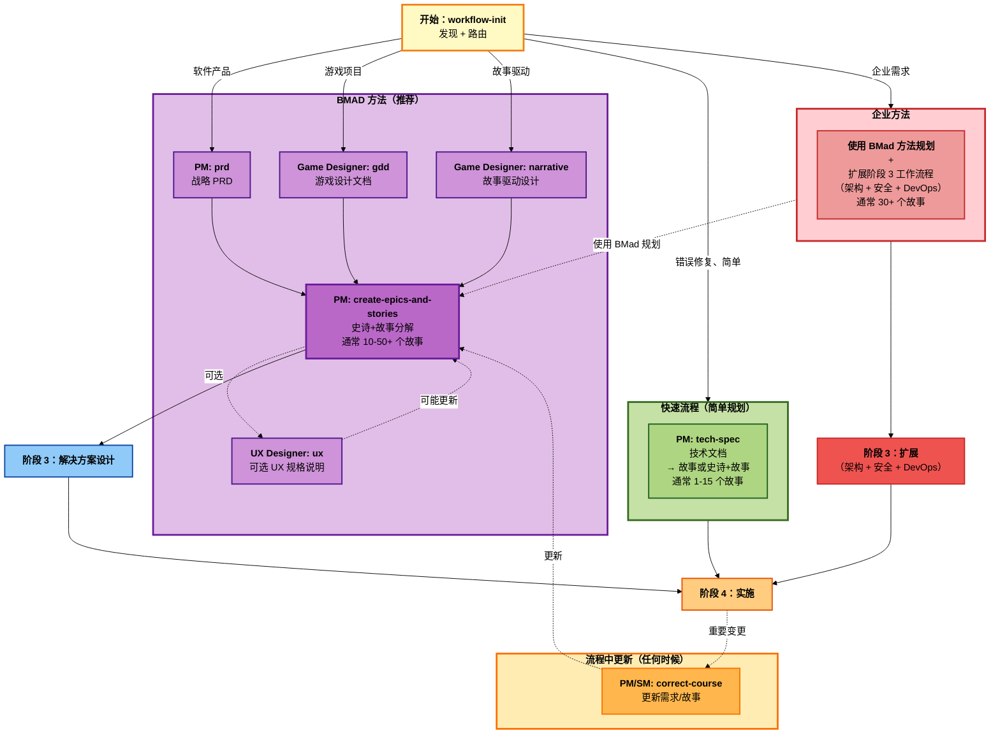

# BMM 规划工作流程（阶段 2）

**阅读时间：** ~10 分钟

## 概述

阶段 2（规划）工作流程对所有项目都是**必需的**。它们使用**规模自适应系统**将战略愿景转化为可操作的需求，该系统根据项目复杂性自动选择正确的规划深度。

**关键原则：** 一个统一的入口点（`workflow-init`）智能地路由到适当的规划方法论 - 从快速技术规格到全面的 PRD。

**何时使用：** 所有项目都需要规划。系统根据复杂性自动调整深度。

---

## 阶段 2 规划工作流程图



---

## 快速参考

| 工作流程                     | 代理          | 轨道      | 目的                       | 典型故事数 |
| ---------------------------- | ------------- | --------- | -------------------------- | ---------- |
| **workflow-init**            | PM/Analyst    | 所有      | 入口点：发现 + 路由        | N/A        |
| **tech-spec**                | PM            | 快速流程  | 技术文档 → 故事或史诗+故事 | 1-15       |
| **prd**                      | PM            | BMad 方法 | 战略 PRD                   | 10-50+     |
| **gdd**                      | Game Designer | BMad 方法 | 游戏设计文档               | 10-50+     |
| **narrative**                | Game Designer | BMad 方法 | 故事驱动的游戏/体验设计    | 10-50+     |
| **create-epics-and-stories** | PM            | BMad 方法 | 将 PRD/GDD 分解为史诗+故事 | N/A        |
| **ux**                       | UX Designer   | BMad 方法 | 可选 UX 规格说明           | N/A        |
| **correct-course**           | PM/SM         | 所有      | 流程中需求变更             | N/A        |

**注意：** 故事计数是基于典型使用的指导，不是严格定义。

---

## 规模自适应规划系统

BMM 使用三个不同的规划轨道来适应项目复杂性：

### 轨道 1：快速流程

**最适用于：** 错误修复、简单功能、范围明确、增强功能

**规划：** 仅技术规格 → 实施

**时间：** 几小时到 1 天

**故事数：** 通常 1-15（指导）

**文档：** tech-spec.md + 故事文件

**示例：** "修复认证错误"、"添加 OAuth 社交登录"

---

### 轨道 2：BMad 方法（推荐）

**最适用于：** 产品、平台、复杂功能、多个史诗

**规划：** PRD + 架构 → 实施

**时间：** 1-3 天

**故事数：** 通常 10-50+（指导）

**文档：** PRD.md（或 GDD.md）+ architecture.md + 史诗文件 + 故事文件

**绿地：** 产品简报（可选）→ PRD → UX（可选）→ 架构 → 实施

**棕地：** document-project → PRD → 架构（推荐）→ 实施

**示例：** "客户仪表板"、"电子商务平台"、"向现有应用添加搜索"

**为什么棕地需要架构？** 将大量代码库上下文提炼为您特定项目的专注解决方案设计。

---

### 轨道 3：企业方法

**最适用于：** 企业需求、多租户、合规、安全敏感

**规划（阶段 2）：** 使用 BMad 方法规划（PRD + 史诗+故事）

**解决方案设计（阶段 3）：** 扩展工作流程（架构 + 安全 + DevOps + SecOps 作为可选添加）

**时间：** 总共 3-7 天（1-3 天规划 + 2-4 天扩展解决方案设计）

**故事数：** 通常 30+（但由企业需求定义）

**文档 阶段 2：** PRD.md + 史诗 + 史诗文件 + 故事文件

**文档 阶段 3：** architecture.md + security-architecture.md（可选）+ devops-strategy.md（可选）+ secops-strategy.md（可选）

**示例：** "多租户 SaaS"、"HIPAA 合规门户"、"添加 SOC2 审计日志"

---

## 轨道选择如何工作

`workflow-init` 指导您完成教育性选择：

1. **描述分析** - 分析项目描述的复杂性
2. **教育性呈现** - 显示所有三个轨道及其权衡
3. **建议** - 基于关键词和上下文建议轨道
4. **用户选择** - 您选择适合的轨道

系统指导但从不强制。您可以覆盖建议。

---

## 工作流程描述

### workflow-init（入口点）

**目的：** 所有规划的统一入口点。发现项目需求并智能路由到适当的轨道。

**代理：** PM（根据需要编排其他代理）

**始终使用：** 这是您的规划起点。除非跳过发现，否则不要直接调用 prd/gdd/tech-spec。

**流程：**

1. 发现（理解上下文、评估复杂性、识别关注点）
2. 路由决策（确定轨道、解释基本原理、确认）
3. 执行目标工作流程（调用规划工作流程，传递上下文）
4. 移交（记录决策、推荐下一阶段）

---

### tech-spec（快速流程）

**目的：** 简单变更的轻量级技术规格说明（快速流程轨道）。生成技术文档和故事或史诗+故事结构。

**代理：** PM

**何时使用：**

- 错误修复
- 单个 API 端点添加
- 配置变更
- 小型 UI 组件添加
- 孤立的验证规则

**关键输出：**

- **tech-spec.md** - 包含以下内容的技术文档：
  - 问题描述和解决方案
  - 源代码树变更
  - 实施细节
  - 测试策略
  - 验收标准
- **故事文件** - 单个故事或史诗+故事结构（通常 1-15 个故事）

**跳转到阶段：** 4（实施）- 无需阶段 3 架构

**示例：** "修复用户没有个人资料图像时的空指针" → 单文件变更、空检查、单元测试、无数据库迁移。

---

### prd（产品需求文档）

**目的：** 软件产品的战略 PRD 及史诗分解（BMad 方法轨道）。

**代理：** PM（有架构师和分析师支持）

**何时使用：**

- 中到大型功能集
- 多屏幕用户体验
- 复杂业务逻辑
- 多系统集成
- 需要分阶段交付

**规模自适应结构：**

- **轻量：** 单个史诗、5-10 个故事、简化分析（10-15 页）
- **标准：** 2-4 个史诗、15-30 个故事、全面分析（20-30 页）
- **全面：** 5+ 个史诗、30-50+ 个故事、多阶段、广泛利益相关者分析（30-50+ 页）

**关键输出：**

- PRD.md（完整需求）
- epics.md（史诗分解）
- 史诗文件（epic-1-_.md、epic-2-_.md 等）

**集成：** 输入到架构（阶段 3）

**示例：** 电子商务结账 → 3 个史诗（访客结账、支付处理、订单管理）、21 个故事、4-6 周交付。

---

### gdd（游戏设计文档）

**目的：** 游戏项目的完整游戏设计文档（BMad 方法轨道）。

**代理：** Game Designer

**何时使用：**

- 设计任何游戏（任何类型）
- 需要全面的设计文档
- 团队需要共享愿景
- 出版商/利益相关者沟通

**BMM GDD vs 传统：**

- 规模自适应细节（不是瀑布式）
- 敏捷史诗结构
- 直接移交给实施
- 与测试工作流程集成

**关键输出：**

- GDD.md（完整游戏设计）
- 史诗分解（核心循环、内容、进度、打磨）

**集成：** 输入到架构（阶段 3）

**示例：** Roguelike 卡牌游戏 → 核心概念（杀戮尖塔结合哈迪斯）、3 个角色、120 张卡牌、50 个敌人、26 个故事的史诗分解。

---

### narrative（叙事设计）

**目的：** 叙事为中心的游戏/体验的故事驱动设计工作流程（BMad 方法轨道）。

**代理：** Game Designer（叙事设计者角色）+ 创意问题解决者（CIS）

**何时使用：**

- 故事是体验的核心
- 带有玩家选择的分支叙事
- 角色驱动游戏
- 视觉小说、冒险游戏、RPG

**与 GDD 结合：**

1. 先运行 `narrative`（故事结构）
2. 然后运行 `gdd`（将故事与游戏玩法整合）

**关键输出：**

- narrative-design.md（完整叙事规格说明）
- 故事结构（幕、节拍、分支）
- 角色（档案、弧线、关系）
- 对话系统设计
- 实施指南

**集成：** 与 GDD 结合，然后输入到架构（阶段 3）

**示例：** 选择驱动 RPG → 3 幕、12 章、5 个选择点、3 个结局、60K 单词、40 个叙事场景。

---

### ux（UX 优先设计）

**目的：** 用户体验是主要差异化项目的 UX 规格说明（BMad 方法轨道）。

**代理：** UX Designer

**何时使用：**

- UX 是主要竞争优势
- 需要设计思维复的杂用户工作流程
- 创新交互模式
- 设计系统创建
- 可访问性关键体验

**协作方法：**

1. 视觉探索（生成多个选项）
2. 信息决策（用用户需求评估）
3. 协作设计（迭代改进）
4. 活文档（随项目演进）

**关键输出：**

- ux-spec.md（完整 UX 规格说明）
- 用户旅程
- 线框图和模型
- 交互规格说明
- 设计系统（组件、模式、令牌）
- 史诗分解（UX 故事）

**集成：** 输入 PRD 或更新史诗，然后架构（阶段 3）

**示例：** 仪表板重新设计 → 带拆分窗格切换的卡片布局、5 个卡片组件、12 个颜色令牌、响应式网格、3 个史诗（布局、可视化、可访问性）。

---

### create-epics-and-stories

**目的：** 将 PRD/GDD 需求分解为组织在史诗中的小故事（BMad 方法轨道）。

**代理：** PM

**何时使用：**

- PRD/GDD 完成后（通常自动运行）
- 也可以稍后独立运行以重新生成史诗/故事
- 在主 PRD 工作流程之外规划故事分解时

**关键输出：**

- epics.md（所有史诗及故事分解）
- 史诗文件（epic-1-\*.md 等）

**注意：** PRD 工作流程通常自动创建史诗。如果稍后需要，此工作流程可以独立运行。

---

### correct-course

**目的：** 处理实施期间的重要需求变更（所有轨道）。

**代理：** PM、Architect 或 SM

**何时使用：**

- 项目中途优先级变更
- 新需求出现
- 需要范围调整
- 技术障碍需要重新规划

**流程：**

1. 分析变更影响
2. 提出解决方案（继续、转向、暂停）
3. 更新受影响文档（PRD、史诗、故事）
4. 重新路由以实施

**集成：** 更新规划制品，可能触发架构审查

---

## 决策指南

### 使用哪个规划工作流程？

**使用 `workflow-init`（推荐）：** 让系统发现需求并适当路由。

**直接选择（高级）：**

- **错误修复或单个变更** → `tech-spec`（快速流程）
- **软件产品** → `prd`（BMad 方法）
- **游戏（游戏玩法优先）** → `gdd`（BMad 方法）
- **游戏（故事优先）** → `narrative` + `gdd`（BMad 方法）
- **UX 创新项目** → `ux` + `prd`（BMad 方法）
- **合规企业** → 在 `workflow-init` 中选择轨道 → 企业方法

---

## 与阶段 3（解决方案设计）的集成

规划输出输入到解决方案设计：

| 规划输出            | 解决方案设计输入             | 轨道决策           |
| ------------------- | ---------------------------- | ------------------ |
| tech-spec.md        | 跳过阶段 3 → 直接阶段 4      | 快速流程（无架构） |
| PRD.md              | **architecture**（级别 3-4） | BMad 方法（推荐）  |
| GDD.md              | **architecture**（游戏技术） | BMad 方法（推荐）  |
| narrative-design.md | **architecture**（叙事系统） | BMad 方法          |
| ux-spec.md          | **architecture**（前端设计） | BMad 方法          |
| 企业文档            | **architecture** + 安全/运维 | 企业方法（必需）   |

**关键决策点：**

- **快速流程：** 完全跳过阶段 3 → 阶段 4（实施）
- **BMad 方法：** 可选阶段 3（简单）、必需阶段 3（复杂）
- **企业：** 必需阶段 3（架构 + 扩展规划）

参见：[workflows-solutioning.md](./workflows-solutioning.md)

---

## 最佳实践

### 1. 始终从 workflow-init 开始

让入口点指导您。它可以防止对简单功能过度规划或对复杂计划规划不足。

### 2. 信任建议

如果 `workflow-init` 建议 BMad 方法，很可能有您没有考虑到的复杂性。在覆盖之前仔细审查。

### 3. 迭代需求

规划文档是活文档。在解决方案设计和实施期间学习时完善 PRD/GDD。

### 4. 早期涉及利益相关者

在解决方案设计之前与利益相关者审查 PRD/GDD。及早发现不对齐。

### 5. 专注于"什么"而不是"如何"

规划定义**构建什么**和**为什么**。将**如何**（技术设计）留给阶段 3（解决方案设计）。

### 6. 棕地项目先 document-project

在规划棕地项目之前始终运行 `document-project`。AI 代理需要现有代码库上下文。

---

## 常见模式

### 绿地软件（BMad 方法）

```
1.（可选）分析：product-brief、research
2. workflow-init → 路由到 prd
3. PM：prd 工作流程
4.（可选）UX Designer：ux 工作流程
5. PM：create-epics-and-stories（可能自动）
6. → 阶段 3：architecture
```

### 棕地软件（BMad 方法）

```
1. Technical Writer 或 Analyst：document-project
2. workflow-init → 路由到 prd
3. PM：prd 工作流程
4. PM：create-epics-and-stories
5. → 阶段 3：architecture（推荐用于专注解决方案设计）
```

### 错误修复（快速流程）

```
1. workflow-init → 路由到 tech-spec
2. Architect：tech-spec 工作流程
3. → 阶段 4：实施（跳过阶段 3）
```

### 游戏项目（BMad 方法）

```
1.（可选）分析：game-brief、research
2. workflow-init → 路由到 gdd
3. Game Designer：gdd 工作流程（或 narrative + gdd 如果故事优先）
4. Game Designer 创建史诗分解
5. → 阶段 3：architecture（游戏系统）
```

### 企业项目（企业方法）

```
1.（推荐）分析：research（合规、安全）
2. workflow-init → 路由到企业方法
3. PM：prd 工作流程
4.（可选）UX Designer：ux 工作流程
5. PM：create-epics-and-stories
6. → 阶段 3：architecture + 安全 + devops + 测试策略
```

---

## 常见反模式

### ❌ 跳过规划

"我们直接开始编码并搞清楚。"
**结果：** 范围蔓延、返工、遗漏需求

### ❌ 对简单变更过度规划

"让我为这个按钮颜色变更写一个 20 页的 PRD。"
**结果：** 浪费时间、分析瘫痪

### ❌ 没有发现的规划

"我已经知道想要什么，跳过问题。"
**结果：** 解决错误问题、错失机会

### ❌ 将 PRD 视为不可变

"PRD 已锁定，不允许变更。"
**结果：** 忽略新信息、僵化规划

### ✅ 正确方法

- 使用规模自适应规划（对复杂性使用正确深度）
- 让利益相关者参与审查
- 随着学习迭代
- 保持规划文档活跃和更新
- 对重要变更使用 `correct-course`

---

## 相关文档

- [阶段 1：分析工作流程](./workflows-analysis.md) - 可选发现阶段
- [阶段 3：解决方案设计工作流程](./workflows-solutioning.md) - 下一阶段
- [阶段 4：实施工作流程](./workflows-implementation.md)
- [规模自适应系统](./scale-adaptive-system.md) - 理解三个轨道
- [快速规格流程](./quick-spec-flow.md) - 快速流程轨道详情
- [代理指南](./agents-guide.md) - 完整代理参考

---

## 故障排除

**问：我应该首先运行哪个工作流程？**
答：运行 `workflow-init`。它分析您的项目并路由到正确的规划工作流程。

**问：我总是需要 PRD 吗？**
答：不需要。简单变更使用 `tech-spec`（快速流程）。只有 BMad 方法和企业轨道创建 PRD。

**问：我可以跳过阶段 3（解决方案设计）吗？**
答：快速流程可以。BMad 方法（简单项目）可选。BMad 方法（复杂项目）和企业必需。

**问：我怎么知道选择哪个轨道？**
答：使用 `workflow-init` - 它根据您的描述建议。故事计数是指导，不是定义。

**问：如果需求在项目中途变更怎么办？**
答：运行 `correct-course` 工作流程。它分析影响并更新规划制品。

**问：棕地项目需要架构吗？**
答：推荐！架构将大量代码库提炼为您特定项目的专注解决方案设计。

**问：我什么时候运行 create-epics-and-stories？**
答：通常在 PRD/GDD 期间自动。也可以稍后独立运行以重新生成史诗。

**问：我应该在 PRD 之前使用 product-brief 吗？**
答：可选但推荐用于绿地。帮助战略思考。`workflow-init` 基于上下文提供。

---

_阶段 2 规划 - 为每个项目提供规模自适应需求。_
