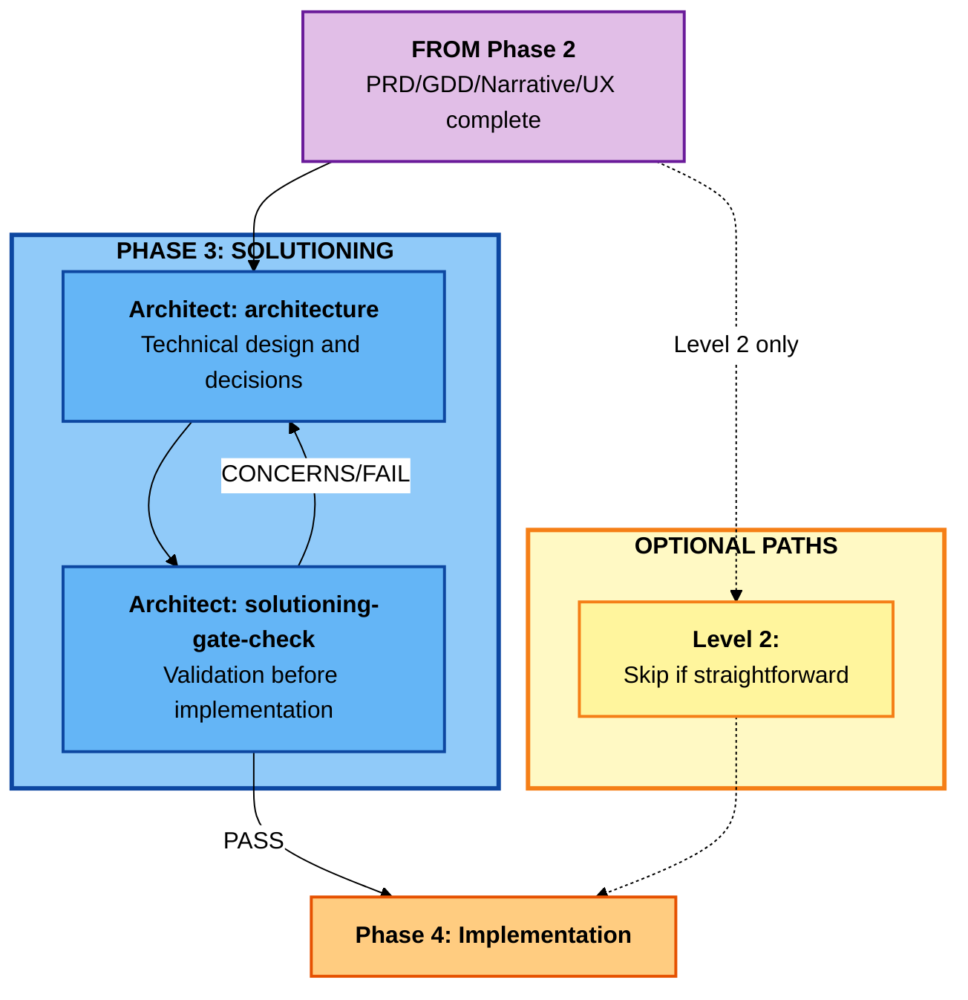

# BMM Solutioning Workflows (Phase 3)

## Overview

Phase 3 (Solutioning) workflows translate **what** to build (from Planning) into **how** to build it (technical design). This phase is **required for Levels 3-4** and **optional for Level 2** projects.

**Key principle:** Prevent agent conflicts by making architectural decisions explicit and documented before implementation begins.

---

## Phase 3 Solutioning Flow



---

## Quick Reference

| Workflow                   | Project Levels | Purpose                                     |
| -------------------------- | -------------- | ------------------------------------------- |
| **architecture**           | 2-4            | Technical architecture and design decisions |
| **solutioning-gate-check** | 3-4            | Validate planning/solutioning completeness  |

**When to Skip Solutioning:**

- **Level 0-1**: Simple changes don't need architecture → Skip to Phase 4 (Implementation)
- **Level 2**: Optional - use if technically complex, skip if straightforward

**When Solutioning is Required:**

- **Level 3-4**: Multi-epic, multi-agent projects → Architecture prevents conflicts

---

## Understanding the Solutioning Phase

### Why Solutioning Matters

**Problem Without Solutioning:**

1. DEV agent implements Epic 1 using REST API
2. DEV agent implements Epic 2 using GraphQL
3. **Conflict**: Inconsistent API design, integration nightmare

**Solution With Solutioning:**

1. **architecture** workflow decides: "Use GraphQL for all APIs"
2. All DEV agents follow architecture decisions
3. **Result**: Consistent implementation, no conflicts

### Solutioning vs Planning

| Aspect   | Planning (Phase 2) | Solutioning (Phase 3)    |
| -------- | ------------------ | ------------------------ |
| Question | What and Why?      | How?                     |
| Output   | Requirements       | Technical Design         |
| Agent    | PM                 | Architect                |
| Audience | Stakeholders       | Developers               |
| Document | PRD/GDD            | Architecture + Tech Spec |
| Level    | Business logic     | Implementation detail    |

### Scale-Adaptive Solutioning

**Level 0-1 (Skip Solutioning):**

- Planning: Quick Spec (tech-spec workflow)
- Solutioning: **None**
- Implementation: dev-story directly

**Level 2 (Optional Solutioning):**

- Planning: Lightweight PRD
- Solutioning: **Optional** architecture
- Implementation: dev-story with or without architecture

**Level 3-4 (Required Solutioning):**

- Planning: Standard/Comprehensive PRD
- Solutioning: **Required** architecture + epic-tech-context
- Gate Check: **Required** solutioning-gate-check
- Implementation: dev-story guided by architecture

---

## architecture

### Purpose

Collaborative architectural decision facilitation that produces a decision-focused architecture document optimized for preventing agent conflicts. Replaces template-driven architecture with intelligent, adaptive conversation.

**Agent:** Architect
**Phase:** 3 (Solutioning)
**Project Levels:** 2-4
**Required:** Level 3-4, Optional Level 2

### When to Use

- Multi-epic projects (Level 3-4)
- Cross-cutting technical concerns
- Multiple agents will implement different parts
- Integration complexity exists
- Technology choices need alignment

**When to Skip:**

- Level 0-1 (simple changes)
- Level 2 with straightforward tech stack
- Single epic with clear technical approach

### Adaptive Conversation Approach

**This is NOT a template filler.** The architecture workflow:

1. **Discovers** your technical needs through conversation
2. **Proposes** architectural options with trade-offs
3. **Documents** decisions that prevent agent conflicts
4. **Focuses** on decision points, not exhaustive documentation

### Process Overview

**Phase 1: Context Discovery (Steps 1-3)**

- Load PRD/GDD for requirements
- Understand project level and complexity
- Identify technical constraints
- Determine existing architecture (if brownfield)

**Phase 2: Architecture Definition (Steps 4-10)**

- System architecture (monolith, microservices, etc.)
- Data architecture (database, state management)
- API design (REST, GraphQL, gRPC)
- Frontend architecture (if applicable)
- Integration patterns
- Security architecture
- Deployment architecture

**Phase 3: Decision Documentation (Steps 11-13)**

- Architecture Decision Records (ADRs)
- Trade-off analysis
- Technology selections with rationale
- Non-negotiable standards

**Phase 4: Implementation Guidance (Step 14)**

- Epic-specific technical notes
- Directory structure
- Coding standards
- Testing strategy

### Inputs

Required:

- **PRD.md** or **GDD.md** (from Phase 2)
- **epics.md** (epic breakdown)

Optional:

- Existing architecture documentation (brownfield)
- Technical constraints document
- Infrastructure requirements
- Security requirements

### Outputs

**Primary Output:** `architecture-{project-name}-{date}.md`

**Document Structure:**

**1. Architecture Overview**

- System context
- Key principles
- Architectural style

**2. System Architecture**

- High-level system diagram
- Component interactions
- Communication patterns

**3. Data Architecture**

- Database design approach
- State management
- Caching strategy
- Data flow

**4. API Architecture**

- API style (REST/GraphQL/gRPC)
- Authentication/authorization
- Versioning strategy
- Error handling patterns

**5. Frontend Architecture** (if applicable)

- Framework selection
- State management
- Component architecture
- Routing approach

**6. Integration Architecture**

- Third-party integrations
- Message queuing
- Event-driven patterns
- API gateways

**7. Security Architecture**

- Authentication/authorization
- Data protection
- Security boundaries
- Compliance requirements

**8. Deployment Architecture**

- Deployment model
- CI/CD pipeline
- Environment strategy
- Monitoring and observability

**9. Architecture Decision Records (ADRs)**

- Key decisions with context
- Options considered
- Trade-off analysis
- Rationale for choices

**10. Epic-Specific Guidance**

- Technical notes per epic
- Implementation priorities
- Dependency sequencing

**11. Standards and Conventions**

- Directory structure
- Naming conventions
- Code organization
- Testing requirements

### Architecture Decision Records (ADRs)

**Purpose:** Document **why** decisions were made, not just what was decided.

**ADR Template:**

```markdown
## ADR-001: Use GraphQL for All APIs

**Status:** Accepted
**Date:** 2025-11-02
**Context:** PRD requires flexible querying across multiple epics

**Decision:** Use GraphQL for all client-server communication

**Options Considered:**

1. REST API - Familiar, well-understood, but requires multiple endpoints
2. GraphQL - Flexible querying, single endpoint, learning curve
3. gRPC - High performance, but poor browser support

**Rationale:**

- PRD requires flexible data fetching (Epic 1, Epic 3)
- Mobile app needs bandwidth optimization (Epic 2)
- Team has GraphQL experience from previous project
- Allows frontend flexibility without backend changes

**Consequences:**

- Positive: Flexible querying, reduced API versioning
- Negative: Caching complexity, N+1 query risk
- Mitigation: Use DataLoader for batching

**Implications for Epics:**

- Epic 1: User Management → GraphQL mutations
- Epic 2: Mobile App → Optimized queries
- Epic 3: Admin Dashboard → Complex nested queries
```

### Example: Level 3 Architecture for E-Commerce Platform

**System Architecture:**

- Monolith (early stage, < 50K users)
- PostgreSQL database
- Redis for caching and sessions
- Next.js for frontend
- Deployed on Vercel + Railway

**Key ADRs:**

1. **ADR-001**: Use Next.js (vs React + Express)
   - Rationale: SEO critical, SSR needed, unified codebase
2. **ADR-002**: Use GraphQL (vs REST)
   - Rationale: Flexible querying for dashboard, mobile optimization
3. **ADR-003**: Use Stripe (vs PayPal + Stripe)
   - Rationale: Simpler integration, lower fees, better UX

**Epic Guidance:**

- **Epic 1 (Auth)**: NextAuth.js with PostgreSQL adapter
- **Epic 2 (Products)**: GraphQL with DataLoader for categories
- **Epic 3 (Cart)**: Redis for session-based cart (no DB writes)
- **Epic 4 (Checkout)**: Stripe webhooks for payment confirmation

**Standards:**

```
Directory Structure:
/pages          - Next.js routes
/components     - Reusable UI components
/lib            - Business logic
  /graphql      - GraphQL schema and resolvers
  /db           - Prisma models and migrations
  /services     - Third-party integrations
/tests          - Test files mirror /lib
```

### Related Workflows

- **prd/gdd** (Phase 2) - Requirements input
- **solutioning-gate-check** (Phase 3) - Validate completeness
- **tech-spec** (Phase 3) - Epic-level specifications (optional)
- **sprint-planning** (Phase 4) - Implementation tracking

---

## solutioning-gate-check

### Purpose

Systematically validate that all planning and solutioning phases are complete and properly aligned before transitioning to Phase 4 implementation. Ensures PRD, architecture, and stories are cohesive with no gaps or contradictions.

**Agent:** SM (Scrum Master)
**Phase:** 3 (Solutioning)
**Project Levels:** 3-4
**Required:** Level 3-4 only

### When to Use

**Always run before starting Phase 4** for Level 3-4 projects.

**Trigger Points:**

- After architecture workflow completes
- Before sprint-planning workflow
- When stakeholders request readiness check
- Before kicking off implementation

**Skip if:**

- Level 0-2 (no solutioning phase)
- Exploratory prototype (no formal planning)

### Purpose of Gate Check

**Prevents Common Issues:**

- ❌ Architecture doesn't address all epics
- ❌ Stories conflict with architecture decisions
- ❌ Requirements ambiguous or contradictory
- ❌ Missing critical dependencies
- ❌ Unclear success criteria

**Ensures:**

- ✅ PRD → Architecture → Stories alignment
- ✅ All epics have clear technical approach
- ✅ No contradictions or gaps
- ✅ Team ready to implement
- ✅ Stakeholders aligned

### Process Overview

**Phase 1: Document Loading (Step 1)**

- Load PRD/GDD
- Load architecture document
- Load epic files
- Load story files (if created)

**Phase 2: Completeness Check (Steps 2-4)**

- **PRD Completeness**: All required sections present
- **Architecture Completeness**: All technical areas addressed
- **Epic Completeness**: All epics from PRD have stories

**Phase 3: Alignment Check (Steps 5-7)**

- **PRD ↔ Architecture**: Architecture addresses all requirements
- **Architecture ↔ Epics**: Epics align with architecture decisions
- **Cross-Epic**: No contradictions between epics

**Phase 4: Quality Check (Steps 8-10)**

- **Acceptance Criteria**: All stories have clear AC
- **Dependencies**: Dependencies identified and sequenced
- **Risks**: High-risk items have mitigation plans

**Phase 5: Reporting (Step 11)**

- Generate gate check report
- List gaps and blockers
- Provide recommendations
- Issue PASS/CONCERNS/FAIL decision

### Gate Check Criteria

**PRD/GDD Completeness:**

- [ ] Problem statement clear and evidence-based
- [ ] Success metrics defined
- [ ] User personas identified
- [ ] Feature requirements complete
- [ ] All epics defined with objectives
- [ ] Non-functional requirements (NFRs) specified
- [ ] Risks and assumptions documented

**Architecture Completeness:**

- [ ] System architecture defined
- [ ] Data architecture specified
- [ ] API architecture decided
- [ ] Key ADRs documented
- [ ] Security architecture addressed
- [ ] Epic-specific guidance provided
- [ ] Standards and conventions defined

**Epic/Story Completeness:**

- [ ] All PRD features mapped to stories
- [ ] Stories have acceptance criteria
- [ ] Stories prioritized (P0/P1/P2/P3)
- [ ] Dependencies identified
- [ ] Story sequencing logical

**Alignment Checks:**

- [ ] Architecture addresses all PRD requirements
- [ ] Stories align with architecture decisions
- [ ] No contradictions between epics
- [ ] NFRs have technical approach
- [ ] Integration points clear

**Quality Checks:**

- [ ] Acceptance criteria testable
- [ ] Stories appropriately sized (<5 days)
- [ ] High-risk items have mitigation
- [ ] Success metrics measurable

### Gate Decision Logic

**PASS** ✅

- All critical criteria met (PRD, Architecture, Epic completeness)
- Minor gaps acceptable with documented plan
- **Action**: Proceed to Phase 4 (Implementation)

**CONCERNS** ⚠️

- Some criteria not met but not blockers
- Gaps identified with clear resolution path
- Risks documented with mitigation
- **Action**: Proceed with caution, address gaps in parallel

**FAIL** ❌

- Critical gaps or contradictions
- Architecture missing key decisions
- Stories conflict with PRD/architecture
- **Action**: BLOCK Phase 4, resolve issues first

### Inputs

Required:

- PRD.md or GDD.md
- architecture.md
- epics.md
- Epic files (epic-1-_.md, epic-2-_.md, etc.)

Optional:

- Story files (if already created)
- Tech spec documents

### Outputs

**Primary Output:** `solutioning-gate-check-{date}.md`

**Document Structure:**

1. Executive Summary (PASS/CONCERNS/FAIL)
2. Completeness Assessment
   - PRD/GDD Score
   - Architecture Score
   - Epic/Story Score
3. Alignment Assessment
   - PRD ↔ Architecture alignment
   - Architecture ↔ Epic alignment
   - Cross-epic consistency
4. Quality Assessment
   - Story quality
   - Dependency clarity
   - Risk mitigation
5. Gaps and Recommendations
   - Critical gaps (blockers)
   - Minor gaps (address in parallel)
   - Recommendations for remediation
6. Gate Decision (PASS/CONCERNS/FAIL)
7. Next Steps

### Example: Gate Check for E-Commerce Platform

**Result:** CONCERNS ⚠️

**Completeness:**

- ✅ PRD complete (18/18 criteria)
- ⚠️ Architecture missing security section (15/18 criteria)
- ✅ Epics complete (24/24 criteria)

**Alignment:**

- ✅ PRD ↔ Architecture aligned
- ⚠️ Epic 4 (Checkout) has payment gateway undefined in architecture
- ✅ No cross-epic contradictions

**Quality:**

- ✅ Stories have acceptance criteria
- ⚠️ Epic 2, Story 3 is too large (10 day estimate)
- ✅ Dependencies identified

**Gaps Identified:**

1. **Critical**: Architecture missing security architecture section
   - **Impact**: Epic 1 (Auth) and Epic 4 (Checkout) lack security guidance
   - **Recommendation**: Complete security architecture

2. **High**: Payment gateway not selected
   - **Impact**: Epic 4 (Checkout) cannot proceed
   - **Recommendation**: Add ADR for payment gateway selection

3. **Medium**: Epic 2, Story 3 too large
   - **Impact**: Risk of story scope creep
   - **Recommendation**: Split into 2 stories

**Gate Decision:** CONCERNS ⚠️

- **Rationale**: Critical and high gaps block Epic 1 and Epic 4
- **Action**: Resolve gaps #1 and #2 before starting implementation

**Next Steps:**

1. Complete security architecture section
2. Document payment gateway ADR
3. Split Epic 2, Story 3
4. Re-run solutioning-gate-check
5. If PASS → Proceed to sprint-planning

### Related Workflows

- **architecture** (Phase 3) - Must complete before gate check
- **prd/gdd** (Phase 2) - Input to gate check
- **sprint-planning** (Phase 4) - Runs after PASS decision

---

## Integration with Phase 2 (Planning) and Phase 4 (Implementation)

### Planning → Solutioning Flow

**Level 0-1:**

```
Planning (tech-spec Quick Spec)
  → Skip Solutioning
  → Implementation (dev-story)
```

**Level 2:**

```
Planning (prd Lightweight)
  → Optional: architecture (if complex)
  → Implementation (sprint-planning → dev-story)
```

**Level 3-4:**

```
Planning (prd Standard/Comprehensive)
  → architecture (Required)
  → solutioning-gate-check (Required)
  → Implementation (sprint-planning → dev-story)
```

### Solutioning → Implementation Handoff

**Documents Produced:**

1. `architecture.md` → Guides all dev-story workflows
2. `ADRs` (in architecture) → Referenced by agents during implementation
3. `solutioning-gate-check.md` → Confirms readiness

**How Implementation Uses Solutioning:**

- **sprint-planning**: Loads architecture for epic sequencing
- **dev-story**: References architecture decisions and ADRs
- **code-review**: Validates code follows architectural standards

---

## Best Practices for Phase 3

### 1. Make Decisions Explicit

Don't leave technology choices implicit. Document decisions with rationale so future agents understand context.

### 2. Focus on Agent Conflicts

Architecture's primary job is preventing conflicting implementations by different agents. Focus on cross-cutting concerns.

### 3. Use ADRs for Key Decisions

Every significant technology choice should have an ADR explaining the "why", not just the "what".

### 4. Keep It Practical

Don't over-architect Level 2 projects. Simple projects need simple architecture.

### 5. Run Gate Check Before Implementation

Catching alignment issues in solutioning is 10× faster than discovering them mid-implementation.

### 6. Iterate Architecture

Architecture documents are living. Update them as you learn during implementation.

---

## Common Anti-Patterns

### ❌ Skipping Architecture for Level 3-4

"Architecture slows us down, let's just start coding."
→ **Result**: Agent conflicts, inconsistent design, rework

### ❌ Over-Architecting Level 2

"Let me design this simple feature like a distributed system."
→ **Result**: Wasted time, over-engineering

### ❌ Template-Driven Architecture

"Fill out every section of this architecture template."
→ **Result**: Documentation theater, no real decisions made

### ❌ Skipping Gate Check

"PRD and architecture look good enough, let's start."
→ **Result**: Gaps discovered mid-sprint, wasted implementation time

### ✅ Correct Approach

- Use architecture for Level 3-4 (required)
- Keep Level 2 architecture simple (if used)
- Focus on decisions, not documentation volume
- Always run gate check before implementation

---

## Decision Guide: When to Use Solutioning Workflows

### Level 0-1 Projects

- **Planning**: tech-spec (Quick Spec)
- **Solutioning**: **Skip entirely**
- **Implementation**: dev-story directly

### Level 2 Projects (Simple)

- **Planning**: prd (Lightweight)
- **Solutioning**: **Skip** if straightforward tech
- **Implementation**: sprint-planning → dev-story

### Level 2 Projects (Technically Complex)

- **Planning**: prd (Lightweight)
- **Solutioning**: architecture (simplified)
- **Gate Check**: Optional
- **Implementation**: sprint-planning → dev-story

### Level 3-4 Projects

- **Planning**: prd/gdd (Standard/Comprehensive)
- **Solutioning**: architecture (comprehensive) → **Required**
- **Gate Check**: solutioning-gate-check → **Required**
- **Implementation**: sprint-planning → epic-tech-context → dev-story

---

## Summary

Phase 3 Solutioning workflows bridge planning and implementation:

| Workflow                   | Purpose                               | When Required                            |
| -------------------------- | ------------------------------------- | ---------------------------------------- |
| **architecture**           | Make technical decisions explicit     | Level 3-4 (required), Level 2 (optional) |
| **solutioning-gate-check** | Validate readiness for implementation | Level 3-4 only                           |

**Key Takeaway:** Solutioning prevents agent conflicts in multi-epic projects by documenting architectural decisions before implementation begins.

**Next Phase:** Implementation (Phase 4) - Sprint-based story development

See: [workflows-implementation.md](./workflows-implementation.md)
