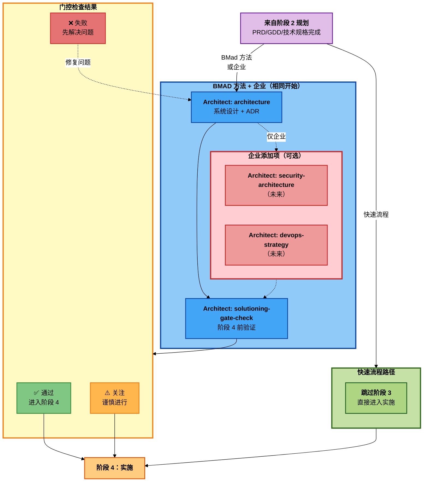

# BMM 解决方案设计工作流程（阶段 3）

**阅读时间：** ~8 分钟

## 概述

阶段 3（解决方案设计）工作流程将**构建什么**（来自规划）转化为**如何构建**（技术设计）。此阶段通过在实施开始前记录架构决策来防止多史诗项目中的代理冲突。

**关键原则：** 使技术决策明确并文档化，以便所有代理一致地实施。防止一个代理选择 REST 而另一个代理选择 GraphQL。

**必需用于：** BMad 方法（复杂项目）、企业方法

**可选用于：** BMad 方法（简单项目）、快速流程（完全跳过）

---

## 阶段 3 解决方案设计工作流程图



---

## 快速参考

| 工作流程                   | 代理      | 轨道            | 目的                        |
| -------------------------- | --------- | --------------- | --------------------------- |
| **architecture**           | Architect | BMad 方法, 企业 | 技术架构和设计决策          |
| **solutioning-gate-check** | Architect | BMad 复杂, 企业 | 验证规划/解决方案设计完整性 |

**何时跳过解决方案设计：**

- **快速流程：** 简单变更不需要架构 → 跳到阶段 4

**何时需要解决方案设计：**

- **BMad 方法：** 多史诗项目需要架构以防止冲突
- **企业：** 与 BMad 方法相同，加上可选的扩展工作流程（测试架构、安全架构、devops 策略）在架构之后但在门控检查之前添加

---

## 为什么解决方案设计很重要

### 没有解决方案设计的问题

```
代理 1 使用 REST API 实施史诗 1
代理 2 使用 GraphQL 实施史诗 2
结果：不一致的 API 设计、集成噩梦
```

### 有解决方案设计的解决方案

```
architecture 工作流程决定："对所有 API 使用 GraphQL"
所有代理遵循架构决策
结果：一致的实施、无冲突
```

### 解决方案设计 vs 规划

| 方面 | 规划（阶段 2） | 解决方案设计（阶段 3） |
| ---- | -------------- | ---------------------- |
| 问题 | 什么和为什么？ | 如何？                 |
| 输出 | 需求           | 技术设计               |
| 代理 | PM             | Architect              |
| 受众 | 利益相关者     | 开发人员               |
| 文档 | PRD/GDD        | 架构 + 技术规格        |
| 级别 | 业务逻辑       | 实施细节               |

---

## 工作流程描述

### architecture

**目的：** 使技术决策明确以防止代理冲突。产生以决策为中心的架构文档，为 AI 一致性优化。

**代理：** Architect

**何时使用：**

- 多史诗项目（BMad 复杂、企业）
- 横切技术关注点
- 多个代理实施不同部分
- 存在集成复杂性
- 技术选择需要对齐

**何时跳过：**

- 快速流程（简单变更）
- 具有直接技术栈的 BMad 方法简单项目
- 具有明确技术方法的单个史诗

**自适应对话方法：**

这不是模板填充器。架构工作流程：

1. **通过对话发现**技术需求
2. **提出**带权衡取舍的架构选项
3. **记录**防止代理冲突的决策
4. **专注于**决策点，而不是详尽的文档

**关键输出：**

**architecture.md** 包含：

1. **架构概述** - 系统上下文、原则、风格
2. **系统架构** - 高层图、组件交互、通信模式
3. **数据架构** - 数据库设计、状态管理、缓存、数据流
4. **API 架构** - API 风格（REST/GraphQL/gRPC）、认证、版本控制、错误处理
5. **前端架构**（如适用）- 框架、状态管理、组件架构、路由
6. **集成架构** - 第三方集成、消息队列、事件驱动模式
7. **安全架构** - 认证/授权、数据保护、安全边界
8. **部署架构** - 部署模型、CI/CD、环境策略、监控
9. **架构决策记录（ADR）** - 带上下文、选项、权衡、基本原理的关键决策
10. **史诗特定指导** - 每个史诗的技术说明、实施优先级、依赖
11. **标准和约定** - 目录结构、命名约定、代码组织、测试

**ADR 格式（简要）：**

```markdown
## ADR-001：对所有 API 使用 GraphQL

**状态：** 已接受 | **日期：** 2025-11-02

**上下文：** PRD 需要在多个史诗中进行灵活查询

**决策：** 对所有客户端-服务器通信使用 GraphQL

**考虑的选项：**

1. REST - 熟悉但需要多个端点
2. GraphQL - 灵活查询，学习曲线
3. gRPC - 高性能，浏览器支持差

**基本原理：**

- PRD 需要灵活的数据获取（史诗 1、3）
- 移动应用需要带宽优化（史诗 2）
- 团队有 GraphQL 经验

**后果：**

- 正面：灵活查询、减少版本控制
- 负面：缓存复杂性、N+1 查询风险
- 缓解：使用 DataLoader 进行批处理

**对史诗的影响：**

- 史诗 1：用户管理 → GraphQL 变更
- 史诗 2：移动应用 → 优化查询
```

**示例：** 电子商务平台 → 单体 + PostgreSQL + Redis + Next.js + GraphQL，带 ADR 解释每个选择和史诗特定指导。

**集成：** 输入到阶段 4（实施）。所有开发代理在实施期间参考架构。

---

### solutioning-gate-check

**目的：** 在阶段 4 实施之前系统地验证规划和解决方案设计已完成且对齐。确保 PRD、架构和故事是内聚的，没有差距。

**代理：** Architect

**何时使用：**

- **始终**在 BMad 复杂和企业项目的阶段 4 之前
- 架构工作流程完成后
- sprint-planning 工作流程之前
- 当利益相关者请求准备就绪检查时

**何时跳过：**

- 快速流程（无解决方案设计）
- BMad 简单（无需门控检查）

**门控检查的目的：**

**防止：**

- ❌ 架构没有解决所有史诗
- ❌ 故事与架构决策冲突
- ❌ 需求模糊或矛盾
- ❌ 缺少关键依赖

**确保：**

- ✅ PRD → 架构 → 故事对齐
- ✅ 所有史诗都有明确的技术方法
- ✅ 无矛盾或差距
- ✅ 团队准备好实施

**检查标准：**

**PRD/GDD 完整性：**

- 问题陈述清晰且基于证据
- 成功指标已定义
- 用户画像已识别
- 功能需求完整
- 所有史诗都有目标定义
- 非功能性需求（NFR）已指定
- 风险和假设已记录

**架构完整性：**

- 系统架构已定义
- 数据架构已指定
- API 架构已决定
- 关键 ADR 已记录
- 安全架构已处理
- 史诗特定指导已提供
- 标准和约定已定义

**史诗/故事完整性：**

- 所有 PRD 功能都映射到故事
- 故事有验收标准
- 故事已优先级排序（P0/P1/P2/P3）
- 依赖已识别
- 故事排序合乎逻辑

**对齐检查：**

- 架构解决了所有 PRD 需求
- 故事与架构决策对齐
- 史诗间无矛盾
- NFR 有技术方法
- 集成点清晰

**门控决策逻辑：**

**✅ 通过**

- 所有关键标准都满足
- 可接受有记录计划的次要差距
- **操作：** 进入阶段 4

**⚠️ 关注**

- 一些标准不满足但不是阻碍
- 已识别有明确解决路径的差距
- **操作：** 谨慎进行，并行解决差距

**❌ 失败**

- 关键差距或矛盾
- 架构缺少关键决策
- 故事与 PRD/架构冲突
- **操作：** 阻塞阶段 4，先解决问题

**关键输出：**

**solutioning-gate-check.md** 包含：

1. 执行摘要（通过/关注/失败）
2. 完整性评估（PRD、架构、史诗的分数）
3. 对齐评估（PRD↔架构、架构↔史诗、跨史诗一致性）
4. 质量评估（故事质量、依赖、风险）
5. 差距和建议（关键/次要差距、补救）
6. 带基本原理的门控决策
7. 下一步

**示例：** 电子商务平台 → 关注 ⚠️ 由于缺少安全架构和未定义的支付网关。建议：在继续之前完成安全部分并添加支付网关 ADR。

---

## 与规划和实施的集成

### 规划 → 解决方案设计流程

**快速流程：**

```
规划（PM 的 tech-spec）
  → 跳过解决方案设计
  → 阶段 4（实施）
```

**BMad 方法：**

```
规划（PM 的 prd）
  → architecture（Architect）
  → solutioning-gate-check（Architect）
  → 阶段 4（实施）
```

**企业：**

```
规划（PM 的 prd - 与 BMad 方法相同）
  → architecture（Architect）
  → 可选：security-architecture（Architect，未来）
  → 可选：devops-strategy（Architect，未来）
  → solutioning-gate-check（Architect）
  → 阶段 4（实施）
```

**关于 TEA（测试架构师）的说明：** TEA 在所有阶段都有 8 个工作流程，完全可操作。TEA 在阶段 3 审查期间验证架构可测试性，但没有专门的解决方案设计工作流程。TEA 的主要设置发生在阶段 2（`*framework`、`*ci`、`*test-design`）和阶段 4 的测试执行（`*atdd`、`*automate`、`*test-review`、`*trace`、`*nfr-assess`）。

**注意：** 企业使用与 BMad 方法相同的规划和架构。唯一的区别是在架构之后但在门控检查之前添加的可选扩展工作流程。

### 解决方案设计 → 实施交接

**生成的文档：**

1. **architecture.md** → 在实施期间指导所有开发代理
2. **ADR**（在架构中）→ 代理为技术决策引用
3. **solutioning-gate-check.md** → 确认阶段 4 准备就绪

**实施如何使用解决方案设计：**

- **sprint-planning** - 加载架构以进行史诗排序
- **dev-story** - 引用架构决策和 ADR
- **code-review** - 验证代码遵循架构标准

---

## 最佳实践

### 1. 使决策明确

不要让技术选择隐含。在 ADR 中记录带基本原理的决策，以便代理理解上下文。

### 2. 专注于代理冲突

架构的主要工作是防止冲突的实施。专注于横切关注点。

### 3. 对关键决策使用 ADR

每个重要的技术选择都应该有一个 ADR 解释"为什么"，而不仅仅是"什么"。

### 4. 保持实用

不要过度架构简单项目。BMad 简单项目需要简单的架构。

### 5. 在实施前运行门控检查

在解决方案设计中捕获对齐问题比在实施中途发现它们快 10 倍。

### 6. 迭代架构

架构文档是活文档。在实施期间学习时更新它们。

---

## 决策指南

### 快速流程

- **规划：** tech-spec（PM）
- **解决方案设计：** 完全跳过
- **实施：** sprint-planning → dev-story

### BMad 方法

- **规划：** prd（PM）
- **解决方案设计：** architecture（Architect）→ solutioning-gate-check（Architect）
- **实施：** sprint-planning → epic-tech-context → dev-story

### 企业

- **规划：** prd（PM）- 与 BMad 方法相同
- **解决方案设计：** architecture（Architect）→ 可选扩展工作流程（security-architecture、devops-strategy）→ solutioning-gate-check（Architect）
- **实施：** sprint-planning → epic-tech-context → dev-story

**关键区别：** 企业在架构之后但在门控检查之前添加可选扩展工作流程。其他一切都与 BMad 方法相同。

**注意：** TEA（测试架构师）在所有阶段操作并验证架构可测试性，但不是阶段 3 特定的工作流程。参见 [测试架构指南](./test-architecture.md) 了解 TEA 的完整生命周期集成。

---

## 常见反模式

### ❌ 对复杂项目跳过架构

"架构拖慢我们，让我们直接开始编码。"
**结果：** 代理冲突、不一致的设计、大量返工

### ❌ 对简单项目过度工程

"让我像分布式系统一样设计这个简单功能。"
**结果：** 浪费时间、过度工程、分析瘫痪

### ❌ 模板驱动架构

"填写这个架构模板的每个部分。"
**结果：** 文档表演，没有做出真正的决策

### ❌ 跳过门控检查

"PRD 和架构看起来足够好，让我们开始。"
**结果：** 在冲刺中途发现差距，浪费实施时间

### ✅ 正确方法

- 对 BMad 方法和企业使用架构（都需要）
- 专注于决策，而不是文档数量
- 企业：在架构后添加可选扩展工作流程（测试/安全/devops）
- 始终在实施前运行门控检查

---

## 相关文档

- [阶段 2：规划工作流程](./workflows-planning.md) - 上一阶段
- [阶段 4：实施工作流程](./workflows-implementation.md) - 下一阶段
- [规模自适应系统](./scale-adaptive-system.md) - 理解轨道
- [代理指南](./agents-guide.md) - 完整代理参考

---

## 故障排除

**问：我总是需要架构吗？**
答：不需要。快速流程跳过它。BMad 方法和企业都需要它。

**问：我怎么知道是否需要架构？**
答：如果您在规划（workflow-init）中选择了 BMad 方法或企业轨道，您需要架构以防止代理冲突。

**问：架构和 tech-spec 有什么区别？**
答：Tech-spec 是针对简单变更的实施导向。架构是针对复杂多史诗项目的系统设计。

**问：我可以跳过门控检查吗？**
答：仅对快速流程。BMad 方法和企业都需要在阶段 4 前进行门控检查。

**问：如果门控检查失败怎么办？**
答：解决已识别的差距（缺少架构部分、冲突需求）并重新运行门控检查。

**问：架构应该花费多长时间？**
答：BMad 方法：架构 1-2 天。企业：总共 2-3 天（1-2 天架构 + 0.5-1 天可选扩展工作流程）。如果时间更长，您可能过度文档化。

**问：ADR 需要完美吗？**
答：不需要。ADR 用基本原理捕获关键决策。它们应该简洁（每个 ADR 最多 1 页）。

**问：我可以在实施期间更新架构吗？**
答：可以！架构是活文档。随着学习更新它。对重要变更使用 `correct-course` 工作流程。

---

_阶段 3 解决方案设计 - 实施前的技术决策。_
