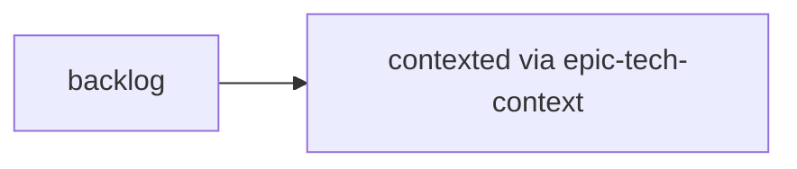
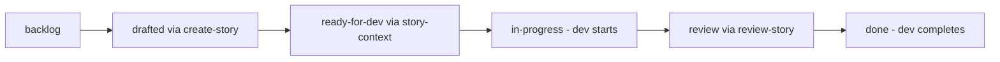

# Phase 4: Implementation

## Overview

Phase 4 is where planning transitions into actual development. This phase manages the iterative implementation of stories defined in the epic files, tracking their progress through a well-defined status workflow.

## Status Definitions

### Epic Status

Epics progress through a simple two-state flow:

| Status        | Description                                                                                                                                     | Next Status |
| ------------- | ----------------------------------------------------------------------------------------------------------------------------------------------- | ----------- |
| **backlog**   | Epic exists in epic file but technical context has not been created                                                                             | contexted   |
| **contexted** | Epic technical context has been created via `epic-tech-context` workflow. This is a prerequisite before any stories in the epic can be drafted. | -           |

**File Indicators:**

- `backlog`: No `epic-{n}-context.md` file exists
- `contexted`: `{output_folder}/epic-{n}-context.md` file exists

### Story Status

Stories progress through a six-state flow representing their journey from idea to implementation:

| Status            | Description                                                                        | Set By        | Next Status   |
| ----------------- | ---------------------------------------------------------------------------------- | ------------- | ------------- |
| **backlog**       | Story only exists in the epic file, no work has begun                              | Initial state | drafted       |
| **drafted**       | Story file has been created via `create-story` workflow                            | SM Agent      | ready-for-dev |
| **ready-for-dev** | Story has been drafted, approved, and context created via `story-context` workflow | SM Agent      | in-progress   |
| **in-progress**   | Developer is actively implementing the story                                       | Dev Agent     | review        |
| **review**        | Implementation complete, under SM review via `review-story` workflow               | Dev Agent     | done          |
| **done**          | Story has been reviewed and completed                                              | Dev Agent     | -             |

**File Indicators:**

- `backlog`: No story file exists
- `drafted`: `{story_dir}/{story-key}.md` file exists (e.g., `1-1-user-auth.md`)
- `ready-for-dev`: Both story file and context exist (e.g., `1-1-user-auth-context.md`)
- `in-progress`, `review`, `done`: Manual status updates in sprint-status.yaml

### Retrospective Status

Optional retrospectives can be completed after an epic:

| Status        | Description                                        |
| ------------- | -------------------------------------------------- |
| **optional**  | Retrospective can be completed but is not required |
| **completed** | Retrospective has been completed                   |

## Status Transitions

### Epic Flow



### Story Flow



## Sprint Status Management

The `sprint-status.yaml` file is the single source of truth for tracking all work items. It contains:

- All epics with their current status
- All stories with their current status
- Retrospective placeholders for each epic
- Clear documentation of status definitions

### Example Sprint Status File

```yaml
development_status:
  epic-1: contexted
  1-1-project-foundation: done
  1-2-app-shell: done
  1-3-user-authentication: in-progress
  1-4-plant-data-model: ready-for-dev
  1-5-add-plant-manual: drafted
  1-6-photo-identification: backlog
  1-7-plant-naming: backlog
  epic-1-retrospective: optional

  epic-2: backlog
  2-1-personality-system: backlog
  2-2-chat-interface: backlog
  2-3-llm-integration: backlog
  epic-2-retrospective: optional
```

## Workflows in Phase 4

### Core Workflows

| Workflow              | Purpose                                            | Updates Status                      |
| --------------------- | -------------------------------------------------- | ----------------------------------- |
| **sprint-planning**   | Generate/update sprint-status.yaml from epic files | Auto-detects file-based statuses    |
| **epic-tech-context** | Create technical context for an epic               | epic: backlog → contexted           |
| **create-story**      | Draft a story from epics/PRD                       | story: backlog → drafted            |
| **story-context**     | Add implementation context to story                | story: drafted → ready-for-dev      |
| **dev-story**         | Developer implements the story                     | story: ready-for-dev → in-progress  |
| **review-story**      | SM reviews implementation                          | story: in-progress → review         |
| **retrospective**     | Conduct epic retrospective                         | retrospective: optional → completed |
| **correct-course**    | Course correction when needed                      | Various status updates              |

### Sprint Planning Workflow

The `sprint-planning` workflow is the foundation of Phase 4. It:

1. **Parses all epic files** (`epic*.md` or `epics.md`)
2. **Extracts all epics and stories** maintaining their order
3. **Auto-detects current status** based on existing files:
   - Checks for epic context files
   - Checks for story files
   - Checks for story context files
4. **Generates sprint-status.yaml** with current reality
5. **Preserves manual status updates** (won't downgrade statuses)

Run this workflow:

- Initially after Phase 3 completion
- After creating epic contexts
- Periodically to sync file-based status
- To verify current project state

### Workflow Guidelines

1. **Epic Context First**: Epics should be contexted before drafting their stories
2. **Flexible Parallelism**: Multiple stories can be in-progress based on team capacity
3. **Sequential Default**: Stories within an epic are typically worked in order
4. **Learning Transfer**: SM drafts next story after previous is done, incorporating learnings
5. **Review Flow**: Dev moves to review, SM reviews, Dev moves to done

## Agent Responsibilities

### SM (Scrum Master) Agent

- Run `sprint-planning` to generate initial status
- Create epic contexts (`epic-tech-context`)
- Draft stories (`create-story`)
- Create story contexts (`story-context`)
- Review completed work (`review-story`)
- Update status in sprint-status.yaml

### Developer Agent

- Check sprint-status.yaml for `ready-for-dev` stories
- Update status to `in-progress` when starting
- Implement stories (`dev-story`)
- Move to `review` when complete
- Address review feedback
- Update to `done` after approval

### Test Architect

- Monitor stories entering `review` status
- Track epic progress
- Identify when retrospectives needed
- Validate implementation quality

## Best Practices

1. **Always run sprint-planning first** to establish current state
2. **Update status immediately** as work progresses
3. **Check sprint-status.yaml** before starting any work
4. **Preserve learning** by drafting stories sequentially when possible
5. **Document decisions** in story and context files

## Naming Conventions

### Story File Naming

- Format: `{epic}-{story}-{kebab-title}.md`
- Example: `1-1-user-authentication.md`
- Avoids YAML float parsing issues (1.1 vs 1.10)
- Makes files self-descriptive

### Git Branch Naming

- Format: `feat/{epic}-{story}-{kebab-title}`
- Example: `feat/1-1-user-authentication`
- Consistent with story file naming
- Clean for branch management

## File Structure

```
{output_folder}/
├── sprint-status.yaml                      # Sprint status tracking
├── epic*.md or epics.md                    # Epic definitions
├── epic-1-context.md                       # Epic technical contexts
├── epic-2-context.md
└── stories/
    ├── 1-1-user-authentication.md          # Story drafts
    ├── 1-1-user-authentication-context.md  # Story contexts
    ├── 1-2-account-management.md
    ├── 1-2-account-management-context.md
    └── ...
```

## Next Steps

After Phase 4 implementation, projects typically move to:

- Deployment and release
- User acceptance testing
- Production monitoring
- Maintenance and updates

The sprint-status.yaml file provides a complete audit trail of the development process and can be used for project reporting and retrospectives.
