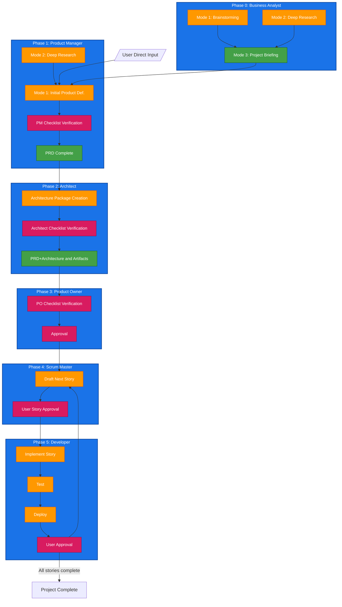

```mermaid
flowchart TD
    %% Phase 0: BA
    subgraph BA["Phase 0: Business Analyst"]
        BA_B["Mode 1: Brainstorming"]
        BA_R["Mode 2: Deep Research"]
        BA_P["Mode 3: Project Briefing"]

        BA_B --> BA_P
        BA_R --> BA_P
    end

    %% Phase 1: PM
    subgraph PM["Phase 1: Product Manager"]
        PM_D["Mode 2: Deep Research"]
        PM_M["Mode 1: Initial Product Def."]
        PM_C["PM Checklist Verification"]
        PM_PRD["PRD Complete"]

        PM_D --> PM_M
        PM_M --> PM_C
        PM_C --> PM_PRD
    end

    %% Phase 2: Architect
    subgraph ARCH["Phase 2: Architect"]
        ARCH_P["Architecture Package Creation"]
        ARCH_C["Architect Checklist Verification"]
        ARCH_D["PRD+Architecture and Artifacts"]

        ARCH_P --> ARCH_C
        ARCH_C --> ARCH_D
    end

    %% Phase 3: PO
    subgraph PO["Phase 3: Product Owner"]
        PO_C["PO Checklist Verification"]
        PO_A["Approval"]
    end

    %% Phase 4: SM
    subgraph SM["Phase 4: Scrum Master"]
        SM_S["Draft Next Story"]
        SM_A["User Story Approval"]
    end

    %% Phase 5: Developer
    subgraph DEV["Phase 5: Developer"]
        DEV_I["Implement Story"]
        DEV_T["Test"]
        DEV_D["Deploy"]
        DEV_A["User Approval"]

        DEV_I --> DEV_T
        DEV_T --> DEV_D
        DEV_D --> DEV_A
    end

    %% Connections between phases
    BA_P --> PM_M
    User_Input[/"User Direct Input"/] --> PM_M
    PM_PRD --> ARCH_P
    ARCH_D --> PO_C
    PO_C --> PO_A
    PO_A --> SM_S
    SM_S --> SM_A
    SM_A --> DEV_I
    DEV_A --> SM_S

    %% Completion condition
    DEV_A -- "All stories complete" --> DONE["Project Complete"]

    %% Styling
    classDef phase fill:#1a73e8,stroke:#0d47a1,stroke-width:2px,color:white,font-size:14px
    classDef artifact fill:#43a047,stroke:#1b5e20,stroke-width:1px,color:white,font-size:14px
    classDef process fill:#ff9800,stroke:#e65100,stroke-width:1px,color:white,font-size:14px
    classDef approval fill:#d81b60,stroke:#880e4f,stroke-width:1px,color:white,font-size:14px

    class BA,PM,ARCH,PO,SM,DEV phase
    class BA_P,PM_PRD,ARCH_D artifact
    class BA_B,BA_R,PM_D,PM_M,ARCH_P,SM_S,DEV_I,DEV_T,DEV_D process
    class PM_C,ARCH_C,PO_C,PO_A,SM_A,DEV_A approval
```
