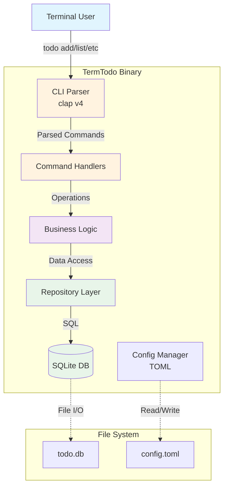
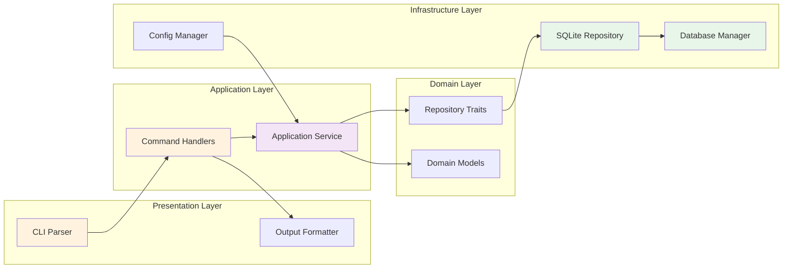
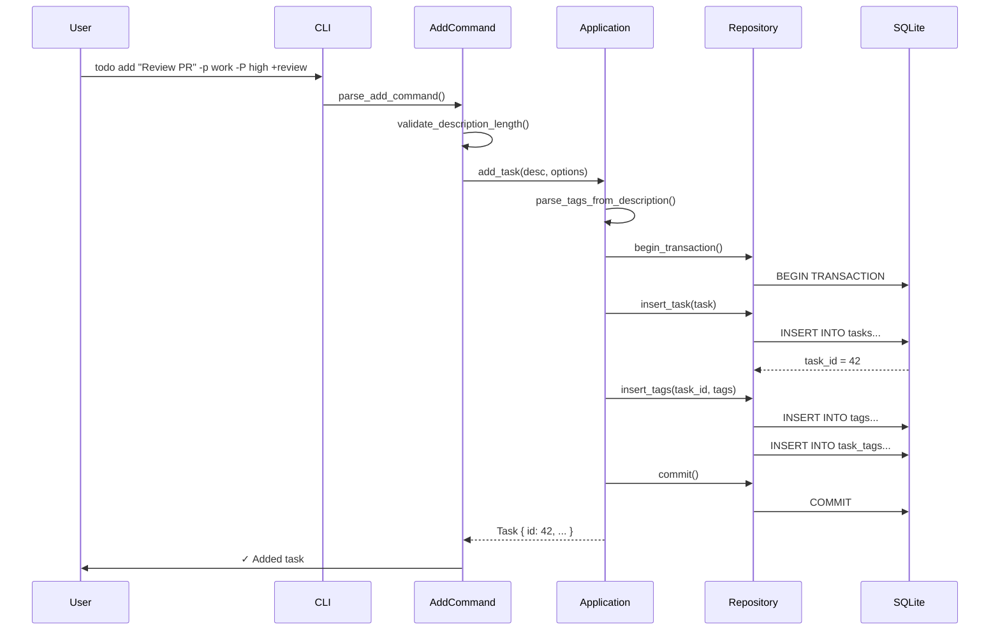
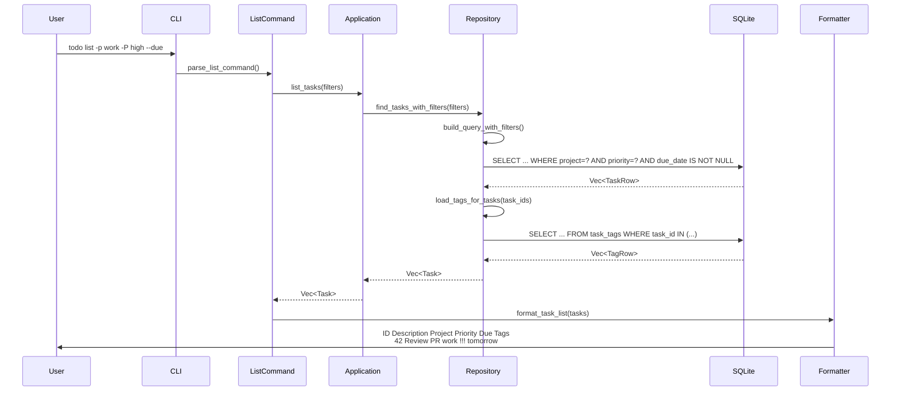
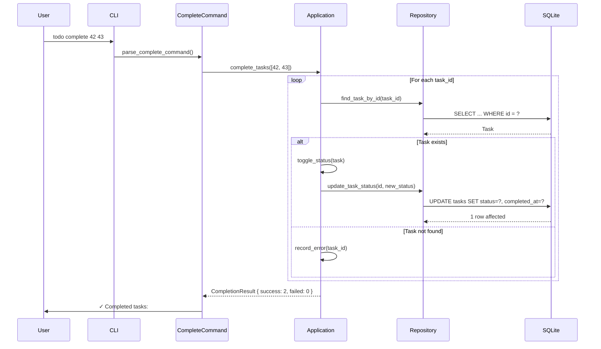

# TermTodo Architecture Document

## Introduction

This document outlines the overall project architecture for TermTodo, including backend systems, shared services, and non-UI specific concerns. Its primary goal is to serve as the guiding architectural blueprint for AI-driven development, ensuring consistency and adherence to chosen patterns and technologies.

**Relationship to Frontend Architecture:**
If the project includes a significant user interface, a separate Frontend Architecture Document will detail the frontend-specific design and MUST be used in conjunction with this document. Core technology stack choices documented herein (see "Tech Stack") are definitive for the entire project, including any frontend components.

### Starter Template or Existing Project

N/A - This is a greenfield Rust CLI project with no starter template.

### Change Log

| Date       | Version | Description                                | Author              |
| ---------- | ------- | ------------------------------------------ | ------------------- |
| 2025-07-07 | 1.0     | Initial architecture based on TermTodo PRD | Winston (Architect) |

## High Level Architecture

### Technical Summary

TermTodo is a monolithic, single-binary CLI application built with Rust, utilizing embedded SQLite for ACID-compliant local storage. The architecture employs clean architecture principles with clear separation between CLI parsing, business logic, and data persistence layers. Performance-critical design choices including synchronous execution, prepared statement caching, and minimal dependencies ensure sub-100ms command execution. The system implements repository and command patterns to maintain testability while delivering a zero-configuration tool that integrates seamlessly into developer workflows.

### High Level Overview

**Architectural Style:** Monolithic Single Binary

- All functionality compiled into one executable for instant startup
- No network dependencies or service discovery overhead
- Embedded SQLite database with local file storage

**Repository Structure:** Monorepo

- Single repository containing all code, tests, and documentation
- Simplified dependency management and atomic commits
- Unified CI/CD pipeline for all components

**Service Architecture:** Monolith

- Single process handling all operations
- Synchronous execution model (no async runtime needed)
- Direct database access without network layers

**Primary Data Flow:**

1. User invokes `todo` command with arguments
2. CLI parser validates and routes to appropriate command handler
3. Command handler orchestrates business logic operations
4. Repository layer manages SQLite transactions
5. Formatted output returned to terminal

**Key Architectural Decisions:**

- **Synchronous Model**: Eliminates async runtime overhead for faster cold starts
- **Embedded Database**: Zero configuration, portable data storage
- **Static Linking**: Single binary distribution with no runtime dependencies
- **Clean Architecture**: Testable layers despite monolithic structure

### High Level Project Diagram



### Architectural and Design Patterns

- **Clean Architecture:** Separation of concerns with CLI, Application, Domain, and Infrastructure layers - _Rationale:_ Enables 80%+ test coverage requirement by isolating business logic from I/O operations

- **Repository Pattern:** Abstract SQLite operations behind trait-based interfaces - _Rationale:_ Allows in-memory repositories for unit tests and potential future database migrations

- **Command Pattern:** Each CLI subcommand as a discrete handler with execute method - _Rationale:_ Simplifies testing and follows clap's natural structure for maintainable command routing

- **Builder Pattern:** Fluent interfaces for constructing complex queries and task filters - _Rationale:_ Provides readable API for combining multiple filter criteria while maintaining performance

- **Result/Option Monads:** Explicit error handling using Rust's type system - _Rationale:_ Prevents runtime panics and enables graceful error messages as required by NFR13

## Tech Stack

This is the DEFINITIVE technology selection for TermTodo. All implementation must use these exact versions and technologies.

### Cloud Infrastructure

- **Provider:** Local-only (No cloud requirements)
- **Key Services:** N/A
- **Deployment Regions:** N/A

### Technology Stack Table

| Category               | Technology     | Version | Purpose                       | Rationale                                                                 |
| ---------------------- | -------------- | ------- | ----------------------------- | ------------------------------------------------------------------------- |
| **Language**           | Rust           | 1.78.0  | Primary development language  | Zero-cost abstractions, memory safety, single binary output               |
| **Database**           | SQLite         | 3.45.0  | Embedded database             | ACID compliance, zero configuration, excellent performance                |
| **CLI Framework**      | clap           | 4.5.4   | Command-line argument parsing | Automatic help generation, shell completion, strong typing                |
| **ORM/Query Builder**  | sqlx           | 0.7.4   | Database operations           | Compile-time checked queries, async support (if needed later), migrations |
| **Date Parsing**       | chrono         | 0.4.38  | Date/time handling            | Comprehensive timezone support, widely adopted                            |
| **Human Date Parsing** | chrono-english | 0.1.7   | Natural language dates        | Parses "tomorrow", "next friday" as required                              |
| **Serialization**      | serde          | 1.0.197 | JSON/CSV export               | De facto standard, excellent performance                                  |
| **Configuration**      | toml           | 0.8.12  | Config file parsing           | Human-readable, simple for users                                          |
| **Terminal Colors**    | termcolor      | 1.4.1   | Colored output                | Respects NO_COLOR, cross-platform                                         |
| **Error Handling**     | anyhow         | 1.0.82  | Application errors            | Simplified error handling with context                                    |
| **Error Types**        | thiserror      | 1.0.58  | Custom error types            | Derive macro for error enums                                              |
| **Testing**            | built-in       | std     | Unit/integration tests        | Rust's excellent built-in test framework                                  |
| **Benchmarking**       | criterion      | 0.5.1   | Performance testing           | Statistical benchmarking for CI regression detection                      |
| **Logging**            | env_logger     | 0.11.3  | Debug logging                 | Simple, runtime-configurable via RUST_LOG                                 |

## Data Models

### Task

**Purpose:** Core entity representing a single todo item with all associated metadata

**Key Attributes:**

- `id`: i64 - Unique identifier (SQLite ROWID)
- `description`: String - Task description (up to 1000 chars)
- `status`: TaskStatus - Enum (Incomplete/Complete)
- `project`: Option<String> - Optional project grouping
- `priority`: Priority - Enum (High/Medium/Low), defaults to Medium
- `due_date`: Option<DateTime> - Optional due date with timezone
- `created_at`: DateTime - Creation timestamp
- `updated_at`: DateTime - Last modification timestamp
- `completed_at`: Option<DateTime> - Completion timestamp

**Relationships:**

- Has many Tags (many-to-many via task_tags table)
- Belongs to one Project (denormalized for performance)

### Tag

**Purpose:** Flexible categorization system for tasks

**Key Attributes:**

- `id`: i64 - Unique identifier
- `name`: String - Tag name (alphanumeric + dash/underscore)
- `created_at`: DateTime - First use timestamp

**Relationships:**

- Has many Tasks (many-to-many via task_tags table)
- Cascade delete orphaned tags

### TaskTag

**Purpose:** Junction table for many-to-many task-tag relationship

**Key Attributes:**

- `task_id`: i64 - Foreign key to tasks
- `tag_id`: i64 - Foreign key to tags

**Relationships:**

- Composite primary key (task_id, tag_id)
- ON DELETE CASCADE for both foreign keys

## Components

### CLI Parser

**Responsibility:** Parse command-line arguments, validate inputs, and route to appropriate command handlers

**Key Interfaces:**

- `parse_args()` - Main entry point parsing std::env::args()
- `generate_completions()` - Shell completion script generation
- Subcommand routing to handlers

**Dependencies:** clap v4 for parsing, command handlers for execution

**Technology Stack:** Pure Rust with clap derive macros for type-safe parsing

### Command Handlers

**Responsibility:** Orchestrate business logic for each CLI subcommand (add, list, complete, etc.)

**Key Interfaces:**

- `execute(&self, app: &Application) -> Result<()>` - Common trait for all commands
- Command-specific structs with validated parameters
- Output formatting for terminal display

**Dependencies:** Application service layer, terminal output formatters

**Technology Stack:** Rust structs implementing Command trait, termcolor for output

### Application Service

**Responsibility:** Core business logic and workflow orchestration independent of I/O concerns

**Key Interfaces:**

- `add_task(desc: &str, opts: AddOptions) -> Result<Task>`
- `list_tasks(filters: FilterOptions) -> Result<Vec<Task>>`
- `complete_tasks(ids: &[i64]) -> Result<usize>`
- `search_tasks(query: &str) -> Result<Vec<Task>>`

**Dependencies:** Repository interfaces (traits), domain models

**Technology Stack:** Pure Rust business logic with Result-based error handling

### Repository Layer

**Responsibility:** Abstract data persistence operations with SQLite implementation

**Key Interfaces:**

- `TaskRepository` trait with CRUD operations
- `TagRepository` trait for tag management
- `Transaction` support for atomic operations
- Migration runner for schema updates

**Dependencies:** sqlx for database access, domain models

**Technology Stack:** sqlx with compile-time checked queries, connection pooling

### Configuration Manager

**Responsibility:** Load, validate, and provide access to user configuration

**Key Interfaces:**

- `load_config() -> Result<Config>` - Load from XDG directory
- `save_config(&Config) -> Result<()>` - Persist changes
- `get_default_project()` - Typed config access

**Dependencies:** toml for parsing, serde for serialization

**Technology Stack:** TOML files with serde deserialization

### Database Manager

**Responsibility:** SQLite connection lifecycle, migrations, and performance optimization

**Key Interfaces:**

- `connect() -> Result<SqlitePool>` - Initialize connection pool
- `run_migrations() -> Result<()>` - Apply schema updates
- Prepared statement caching
- PRAGMA optimizations

**Dependencies:** sqlx SQLite driver, migration files

**Technology Stack:** SQLite with WAL mode, connection pool size of 1

### Component Diagram



## External APIs

This project does not require any external API integrations. All operations are performed locally with no network dependencies.

## Core Workflows

### Add Task Workflow



### List Tasks with Filters Workflow



### Complete Task with Toggle Workflow



## Database Schema

```sql
-- Enable foreign key constraints
PRAGMA foreign_keys = ON;

-- Enable Write-Ahead Logging for better concurrency
PRAGMA journal_mode = WAL;

-- Optimize for fast reads
PRAGMA synchronous = NORMAL;
PRAGMA temp_store = MEMORY;
PRAGMA mmap_size = 30000000000;

-- Tasks table: Core entity
CREATE TABLE tasks (
    id INTEGER PRIMARY KEY AUTOINCREMENT,
    description TEXT NOT NULL CHECK(length(description) <= 1000),
    status TEXT NOT NULL DEFAULT 'incomplete' CHECK(status IN ('incomplete', 'complete')),
    project TEXT,
    priority TEXT NOT NULL DEFAULT 'medium' CHECK(priority IN ('high', 'medium', 'low')),
    due_date DATETIME,
    created_at DATETIME NOT NULL DEFAULT CURRENT_TIMESTAMP,
    updated_at DATETIME NOT NULL DEFAULT CURRENT_TIMESTAMP,
    completed_at DATETIME
);

-- Indexes for common query patterns
CREATE INDEX idx_tasks_status ON tasks(status);
CREATE INDEX idx_tasks_project ON tasks(project) WHERE project IS NOT NULL;
CREATE INDEX idx_tasks_priority ON tasks(priority);
CREATE INDEX idx_tasks_due_date ON tasks(due_date) WHERE due_date IS NOT NULL;
CREATE INDEX idx_tasks_created_at ON tasks(created_at);

-- Composite index for common filter combinations
CREATE INDEX idx_tasks_filters ON tasks(status, project, priority);

-- Tags table
CREATE TABLE tags (
    id INTEGER PRIMARY KEY AUTOINCREMENT,
    name TEXT NOT NULL UNIQUE CHECK(name REGEXP '^[a-zA-Z0-9][a-zA-Z0-9_-]*$'),
    created_at DATETIME NOT NULL DEFAULT CURRENT_TIMESTAMP
);

-- Junction table for many-to-many relationship
CREATE TABLE task_tags (
    task_id INTEGER NOT NULL,
    tag_id INTEGER NOT NULL,
    PRIMARY KEY (task_id, tag_id),
    FOREIGN KEY (task_id) REFERENCES tasks(id) ON DELETE CASCADE,
    FOREIGN KEY (tag_id) REFERENCES tags(id) ON DELETE CASCADE
);

-- Index for tag lookups
CREATE INDEX idx_task_tags_tag_id ON task_tags(tag_id);

-- Full-text search virtual table
CREATE VIRTUAL TABLE tasks_fts USING fts5(
    description,
    project,
    content=tasks,
    content_rowid=id
);

-- Triggers to keep FTS index in sync
CREATE TRIGGER tasks_fts_insert AFTER INSERT ON tasks
BEGIN
    INSERT INTO tasks_fts(rowid, description, project)
    VALUES (new.id, new.description, new.project);
END;

CREATE TRIGGER tasks_fts_update AFTER UPDATE ON tasks
BEGIN
    UPDATE tasks_fts
    SET description = new.description, project = new.project
    WHERE rowid = old.id;
END;

CREATE TRIGGER tasks_fts_delete AFTER DELETE ON tasks
BEGIN
    DELETE FROM tasks_fts WHERE rowid = old.id;
END;

-- Update trigger for updated_at timestamp
CREATE TRIGGER tasks_update_timestamp AFTER UPDATE ON tasks
BEGIN
    UPDATE tasks SET updated_at = CURRENT_TIMESTAMP WHERE id = NEW.id;
END;

-- Migration tracking table
CREATE TABLE IF NOT EXISTS schema_migrations (
    version INTEGER PRIMARY KEY,
    applied_at DATETIME NOT NULL DEFAULT CURRENT_TIMESTAMP
);
```

## Source Tree

```plaintext
termtodo/
├── Cargo.toml                 # Project manifest with dependencies
├── Cargo.lock                # Locked dependency versions
├── build.rs                   # Build script for embedding resources
├── .github/
│   └── workflows/
│       ├── ci.yml            # Test, lint, build on all platforms
│       └── release.yml       # Build and publish binaries on tag
├── src/
│   ├── main.rs              # Entry point, CLI setup
│   ├── cli/
│   │   ├── mod.rs           # CLI module exports
│   │   ├── parser.rs        # Clap command definitions
│   │   ├── commands/        # Command handlers
│   │   │   ├── mod.rs
│   │   │   ├── add.rs       # Add command implementation
│   │   │   ├── list.rs      # List command with formatting
│   │   │   ├── complete.rs  # Complete/uncomplete logic
│   │   │   ├── delete.rs    # Delete command
│   │   │   ├── search.rs    # Full-text search
│   │   │   └── config.rs    # Config management commands
│   │   └── output.rs        # Terminal output formatting
│   ├── app/
│   │   ├── mod.rs           # Application layer exports
│   │   ├── service.rs       # Main application service
│   │   ├── filters.rs       # Filter builder and logic
│   │   └── errors.rs        # Application error types
│   ├── domain/
│   │   ├── mod.rs           # Domain model exports
│   │   ├── task.rs          # Task entity and value objects
│   │   ├── tag.rs           # Tag entity
│   │   └── types.rs         # Enums (Status, Priority)
│   ├── infra/
│   │   ├── mod.rs           # Infrastructure exports
│   │   ├── db/
│   │   │   ├── mod.rs       # Database module
│   │   │   ├── connection.rs # Connection pool setup
│   │   │   ├── migrations.rs # Migration runner
│   │   │   └── queries.rs   # SQL query constants
│   │   ├── repos/
│   │   │   ├── mod.rs       # Repository traits
│   │   │   ├── task_repo.rs # Task repository impl
│   │   │   └── tag_repo.rs  # Tag repository impl
│   │   └── config/
│   │       ├── mod.rs       # Config module
│   │       └── manager.rs   # Config file handling
│   └── utils/
│       ├── mod.rs           # Utility exports
│       ├── dates.rs         # Date parsing helpers
│       └── result.rs        # Result extensions
├── tests/
│   ├── integration/         # Integration tests
│   │   ├── cli_tests.rs     # End-to-end CLI tests
│   │   ├── db_tests.rs      # Database integration
│   │   └── helpers/         # Test utilities
│   └── fixtures/            # Test data files
├── benches/
│   └── performance.rs       # Criterion benchmarks
├── migrations/              # SQL migration files
│   ├── 001_initial.sql
│   └── 002_add_fts.sql
└── docs/
    ├── architecture.md      # This document
    ├── prd.md              # Product requirements
    └── README.md           # User documentation
```

## Infrastructure and Deployment

### Infrastructure as Code

- **Tool:** Not applicable (local application)
- **Location:** N/A
- **Approach:** Single binary deployment

### Deployment Strategy

- **Strategy:** Direct binary distribution
- **CI/CD Platform:** GitHub Actions
- **Pipeline Configuration:** `.github/workflows/release.yml`

### Environments

- **Development:** Local developer machine with debug builds
- **Testing:** CI environment with all platforms (Linux, macOS, Windows)
- **Production:** User's local machine with release binary

### Environment Promotion Flow

```text
Development (local) -> CI Testing -> GitHub Release -> User Installation
                         ↓
                    Failed tests
                         ↓
                    Fix & retry
```

### Rollback Strategy

- **Primary Method:** Previous version binary installation
- **Trigger Conditions:** User-reported critical bugs, data corruption
- **Recovery Time Objective:** < 5 minutes (download previous release)

## Error Handling Strategy

### General Approach

- **Error Model:** Result<T, Error> for all fallible operations
- **Exception Hierarchy:** anyhow::Error for applications, custom types for libraries
- **Error Propagation:** ? operator with context via .context()

### Logging Standards

- **Library:** env_logger 0.11.3
- **Format:** `[TIMESTAMP] [LEVEL] [MODULE] Message`
- **Levels:** ERROR, WARN, INFO, DEBUG, TRACE
- **Required Context:**
  - Correlation ID: Not needed (single-user CLI)
  - Service Context: Module path automatically included
  - User Context: Never log user data or task content

### Error Handling Patterns

#### External API Errors

- **Retry Policy:** No external APIs
- **Circuit Breaker:** Not applicable
- **Timeout Configuration:** Not applicable
- **Error Translation:** Not applicable

#### Business Logic Errors

- **Custom Exceptions:**
  - `TaskNotFound(id)`
  - `InvalidTaskDescription(reason)`
  - `DuplicateTag(name)`
  - `ConfigError(path, reason)`
- **User-Facing Errors:** Clear, actionable messages via Display trait
- **Error Codes:** Not used - descriptive messages preferred

#### Data Consistency

- **Transaction Strategy:** Explicit transactions for multi-table operations
- **Compensation Logic:** Not needed with ACID SQLite
- **Idempotency:** Complete/uncomplete operations are naturally idempotent

## Coding Standards

These standards are MANDATORY for AI agents and define project-specific conventions.

### Core Standards

- **Languages & Runtimes:** Rust 1.78.0 (edition 2021)
- **Style & Linting:** rustfmt with default config, clippy with pedantic lints
- **Test Organization:** Unit tests in `#[cfg(test)]` modules, integration tests in tests/

### Naming Conventions

| Element   | Convention      | Example               |
| --------- | --------------- | --------------------- |
| Structs   | PascalCase      | `TaskFilter`          |
| Functions | snake_case      | `parse_due_date`      |
| Constants | SCREAMING_SNAKE | `MAX_DESCRIPTION_LEN` |
| Modules   | snake_case      | `task_repo`           |

### Critical Rules

- **No unwrap() in production code:** Use expect() with clear message or proper error handling
- **All public functions must have doc comments:** Include examples for complex APIs
- **SQL queries must use parameterized statements:** Never concatenate user input
- **Benchmark new features:** Add criterion benchmarks for any performance-critical code
- **Check Task description length:** Enforce 1000 character limit at CLI parsing layer

## Test Strategy and Standards

### Testing Philosophy

- **Approach:** Test-after development with comprehensive coverage
- **Coverage Goals:** 80% overall, 90% for business logic
- **Test Pyramid:** 70% unit, 25% integration, 5% e2e

### Test Types and Organization

#### Unit Tests

- **Framework:** Rust built-in testing
- **File Convention:** Tests in same file as code under `#[cfg(test)]` module
- **Location:** Bottom of each source file
- **Mocking Library:** Manual test doubles (traits make this easy)
- **Coverage Requirement:** 90% for domain and app layers

**AI Agent Requirements:**

- Generate tests for all public methods
- Cover edge cases and error conditions
- Follow AAA pattern (Arrange, Act, Assert)
- Mock all external dependencies

#### Integration Tests

- **Scope:** Database operations, CLI parsing, file I/O
- **Location:** `tests/integration/`
- **Test Infrastructure:**
  - **Database:** In-memory SQLite for speed
  - **File System:** tempfile crate for isolated testing
  - **CLI:** assert_cmd for command execution tests

#### End-to-End Tests

- **Framework:** assert_cmd 2.0.14
- **Scope:** Full command execution with real database
- **Environment:** Isolated temp directory per test
- **Test Data:** Fixtures in tests/fixtures/

### Test Data Management

- **Strategy:** Builder pattern for test objects
- **Fixtures:** `tests/fixtures/` for import/export tests
- **Factories:** TaskBuilder, TagBuilder in test modules
- **Cleanup:** Automatic via tempfile cleanup

### Continuous Testing

- **CI Integration:** Run on every push (test, clippy, fmt)
- **Performance Tests:** Criterion benchmarks with 5% regression threshold
- **Security Tests:** cargo audit in CI pipeline

## Security

### Input Validation

- **Validation Library:** Built-in Rust type system + manual checks
- **Validation Location:** CLI parsing layer before any processing
- **Required Rules:**
  - All external inputs MUST be validated
  - Validation at API boundary before processing
  - Whitelist approach preferred over blacklist

### Authentication & Authorization

- **Auth Method:** Not applicable (local single-user application)
- **Session Management:** Not applicable
- **Required Patterns:**
  - File permissions rely on OS user permissions
  - XDG directory compliance for proper isolation

### Secrets Management

- **Development:** No secrets required
- **Production:** No secrets required
- **Code Requirements:**
  - NEVER hardcode secrets
  - Access via configuration service only
  - No secrets in logs or error messages

### API Security

Not applicable - no network APIs exposed

### Data Protection

- **Encryption at Rest:** Relies on OS disk encryption
- **Encryption in Transit:** Not applicable (local only)
- **PII Handling:** Task descriptions may contain PII - never log
- **Logging Restrictions:** Never log task content, only IDs and metadata

### Dependency Security

- **Scanning Tool:** cargo audit
- **Update Policy:** Monthly dependency updates
- **Approval Process:** Review changelog for breaking changes

### Security Testing

- **SAST Tool:** cargo clippy with security lints
- **DAST Tool:** Not applicable
- **Penetration Testing:** Not required for local CLI

## Checklist Results Report

To be completed after architecture review.

## Next Steps

### Developer Handoff

Begin implementation with the following:

- Reference this architecture document and coding standards throughout development
- Start with Epic 1, Story 1.1: Project Setup and Infrastructure
- Key technical decisions to follow:
  - Use Rust 1.78.0 with 2021 edition
  - Implement clean architecture layers as specified
  - All commands must complete in < 100ms
  - Use synchronous code (no async/await)
  - Follow the defined error handling patterns
